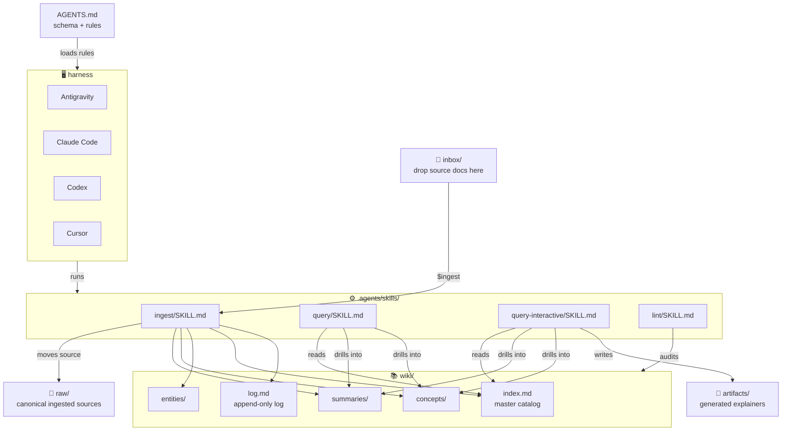

# 📚 Papers Wiki

> Karpathy-style LLM wiki adapted on my Papers Explained blog corpus and more

A compounding research knowledge base optimized for AI agents. This repository serves as a structured, queryable archive of research papers, concepts, and technical notes, adapted from the "Papers Explained" blog corpus and beyond.

---

## 🎯 Purpose

The goal of this project is to build a compounding knowledge base that can be queried in plain English. It tracks research on various topics to provide a single source of truth for complex technical domains.

---

## 🏗️ Architecture

The wiki follows a strictly layered architecture to ensure data integrity and ease of navigation for both humans and agents.

### Directory Layers
- **`inbox/`**: Drop zone for documents waiting to be ingested.
- **`raw/`**: Canonical home for ingested source documents. Once a file lands here, it should not be modified.
- **`wiki/`**: Structured content pages with cross-references and tags.
- **`artifacts/`**: Generated interactive explainers (HTML/CSS/JS) from wiki-backed queries; not ingest input and safe to regenerate.
- **`index.md`**: Master catalog with one-line summaries for rapid orientation.
- **`log.md`**: Append-only ingestion history.
- **`.agents/skills/`**: Repo-local workflow skills for `ingest`, `query`, `query-interactive`, and `lint`.

---

## 🚀 Usage

This wiki is designed to be managed by AI agents (like Antigravity, Claude Code, or Cursor) using the instructions in `AGENTS.md`.

### 📥 Ingestion
To add new research to the wiki:
1. Drop the source file (PDF, text, etc.) into the `inbox/` directory.
2. Tell the agent: `"ingest inbox/<filename>"`
3. The agent moves the file into `raw/`, then summarizes it, creates the wiki page(s), and updates the index/log.

### 🔍 Querying
To retrieve knowledge from the wiki:
- Ask the agent: `"query the wiki for [topic]"` or simply ask a technical question about the contents.
The agent will consult the `index.md`, find relevant pages, and provide an answer with citations.

### 🖼️ Interactive / visual query
For a diagram-heavy or interactive explainer **saved in the repo** (not just chat prose):
- Ask for an interactive or visual explanation from the wiki, or say to save under `artifacts/`.
- The agent follows `.agents/skills/query-interactive/SKILL.md`, reads the same wiki sources as a normal query, and writes `artifacts/<YYYY-MM-DD>-<topic-slug>/index.html` (plus optional CSS/JS).
- Open `index.html` locally in a browser; figures resolve via paths like `../wiki/assets/...`.

### 🧹 Linting
To maintain wiki health:
- Tell the agent: `"lint the wiki"`
The agent will scan for broken links, ensure the index is up-to-date, and check for logical contradictions across pages.
