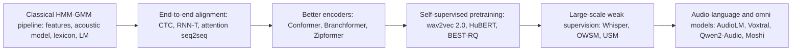

# Automatic Speech Recognition: A Learning Roadmap

A ground-up reading path for automatic speech recognition (ASR) — from the classical HMM-GMM pipeline, through the end-to-end neural models that learned to align audio and text implicitly, to self-supervised speech representations, Whisper-style weak supervision at web scale, and today's audio-language and full-duplex omni models. Papers linked via Hugging Face Papers; blogs included where they give the clearest intuition.

---

## The big idea

ASR maps a variable-length acoustic signal onto a variable-length text sequence, and almost every architectural idea in the field's history is a different answer to one question: **how do you learn the alignment between audio frames and output tokens without being told it in advance?** The classical pipeline solved this explicitly — a hidden Markov model's states *are* an alignment, estimated with Baum-Welch and decoded with Viterbi, bolted onto a separately trained pronunciation lexicon and language model. CTC, RNN-T, and attention-based encoder-decoders instead let a single network learn the alignment implicitly from paired audio/text alone, collapsing the whole pipeline into one trained function. Self-supervised pretraining then decouples *representation learning* from the labeled-alignment problem entirely, so only a small amount of transcribed audio is needed to fine-tune. Whisper-style weak supervision goes the other direction — skip careful architecture and clean labels altogether, and simply train on hundreds of thousands of hours of noisy web transcripts. And the most recent line folds ASR into general audio-language models, where transcription is just one skill a speech-and-text foundation model can do.

---

## Stage 0 — Orientation blogs (skim first, ~1-2 hrs)

- [Distill — Sequence Modeling with CTC](https://distill.pub/2017/ctc/) (Awni Hannun, 2017) — the clearest visual and interactive explanation of the CTC loss and decoding, still the best first stop before reading the original paper. ★
- [Hugging Face Audio Course](https://huggingface.co/learn/audio-course) — a free, hands-on course covering audio features, CTC/seq2seq ASR fine-tuning, and modern pipelines with runnable code.
- [Hugging Face — Fine-Tune Wav2Vec2 for English ASR with Transformers](https://huggingface.co/blog/fine-tune-wav2vec2-english) — the fastest way to see Stage 4's self-supervised pretraining turn into a working CTC fine-tuning recipe.
- [Jonathan Bgn — Illustrated Wav2Vec 2.0](https://jonathanbgn.com/2021/09/30/illustrated-wav2vec-2.html) — diagram-driven walkthrough of the masking, quantization, and contrastive-loss mechanics inside wav2vec 2.0. ★
- [Jurafsky & Martin — Speech and Language Processing, 3rd ed. (draft)](https://web.stanford.edu/~jurafsky/slp3/) — the ASR/HMM chapter is the standard textbook treatment of Part I's classical pipeline, with worked examples of Viterbi decoding and Baum-Welch re-estimation.
- [OpenAI — Introducing Whisper](https://openai.com/index/whisper/) — the original announcement post for Stage 5's inflection-point model, in plain language.
- Wiki hub [[Audio Models]] — this wiki's existing collection of ingested speech/audio pages; several are cited throughout this roadmap.

---

## Part I — Classical foundations: HMMs, GMMs, and the alignment problem (pre-2012)

Before any end-to-end learning, ASR was a pipeline of separately trained components: acoustic features (MFCCs or log-mel filterbanks) fed a Gaussian-mixture acoustic model, whose likelihoods were combined with a pronunciation lexicon and an n-gram language model inside a hidden Markov model, decoded with Viterbi search (often compiled into a weighted finite-state transducer). The HMM's states *are* the audio-to-phoneme alignment — chosen and estimated explicitly, not learned as a side effect of an end-to-end loss. The one classical-era innovation that survived into the deep learning era outright was replacing the Gaussian mixture emission model with a discriminatively trained neural network while keeping the HMM/decoding machinery — the "hybrid" DNN-HMM system.

### Stage 1 — HMMs, decoding, and the DNN-HMM hybrid

- **A Tutorial on Hidden Markov Models and Selected Applications in Speech Recognition** (Rabiner, 1989) — [PDF](https://web.ece.ucsb.edu/Faculty/Rabiner/ece259/Reprints/tutorial%20on%20hmm%20and%20applications.pdf) *(pre-arXiv era; not indexed on Hugging Face Papers)* — the standard reference for HMM theory in speech: reviews Markov chains, then works through the three fundamental problems (evaluating a sequence's likelihood, decoding the best state sequence via Viterbi, and re-estimating parameters via Baum-Welch), with a worked isolated-word recognizer. Everything Part II's end-to-end models replace is formalized here. ★
- **Connectionist Temporal Classification: Labelling Unsegmented Sequence Data with Recurrent Neural Networks** (Graves, Fernández, Gomez & Schmidhuber, ICML 2006) — [PDF](https://mediatum.ub.tum.de/doc/1292048/1292048.pdf) *(pre-arXiv era; not indexed on Hugging Face Papers)* — introduces the CTC loss: a way to train an RNN directly on unsegmented input/output pairs by summing over all frame-to-label alignments consistent with a target sequence, with no pre-defined alignment or post-processing needed. Beats an HMM and a hybrid HMM-RNN on TIMIT phoneme recognition. The founding trick every end-to-end system in Part II reuses, eight years before it was scaled up. ★
- **Deep Neural Networks for Acoustic Modeling in Speech Recognition: The Shared Views of Four Research Groups** (Hinton, Deng, Yu et al., IEEE Signal Processing Magazine, 2012) — [PDF](https://www.cs.toronto.edu/~hinton/absps/DNN-2012-proof.pdf) *(pre-arXiv era; not indexed on Hugging Face Papers)* — replaces the GMM emission model with a discriminatively trained DNN that outputs posteriors over thousands of tied HMM states (aligned via a baseline GMM-HMM), while keeping the HMM/lexicon/decoding pipeline intact. Reports large, consistent benchmark gains across five independent large-vocabulary tasks from four research groups (Toronto, Microsoft, Google, IBM) — the paper that made deep learning for ASR mainstream just before fully end-to-end models took over.

---

## Part II — End-to-end neural ASR: learning alignment implicitly (2012-2020)

### Stage 2 — CTC, RNN-T, and attention at scale

| Paper | Date | Why read it |
| --- | --- | --- |
| [Sequence Transduction with Recurrent Neural Networks](https://huggingface.co/papers/1211.3711) | 2012 | Graves' RNN Transducer (RNN-T): augments a CTC-style acoustic network with a separate prediction network conditioned on previously emitted outputs, removing CTC's assumption that output steps are conditionally independent given the input. Demonstrated on TIMIT phoneme recognition; becomes the standard architecture for low-latency, streaming ASR in later production systems. ★ |
| [Deep Speech: Scaling up end-to-end speech recognition](https://huggingface.co/papers/1412.5567) | 2014 | Shows a CTC-trained RNN, with no hand-engineered pipeline for noise, reverberation, or speaker variation, can reach state-of-the-art ASR — replacing an entire chain of separately-tuned components with one learned function. |
| [Deep Speech 2: End-to-End Speech Recognition in English and Mandarin](https://huggingface.co/papers/1512.02595) | 2015 | Scales the same end-to-end recipe to two structurally different languages with one architecture family, using HPC techniques for a 7x training speedup — evidence that end-to-end learning handles noisy environments, accents, and new languages without redesigning the pipeline each time. |
| [Listen, Attend and Spell](https://huggingface.co/papers/1508.01211) | 2015 | A structurally distinct answer to the same alignment problem: a pyramidal RNN encoder ("Listen") feeds an attention-based RNN decoder ("Speller") that emits characters directly, jointly learning what used to be separate acoustic, pronunciation, and language components. Sets up the CTC-vs-attention-vs-RNN-T trichotomy that persists through Stage 3's modern encoders. ★ |

### Stage 3 — Better encoders and data augmentation

| Paper | Date | Why read it |
| --- | --- | --- |
| [SpecAugment: A Simple Data Augmentation Method for Automatic Speech Recognition](https://huggingface.co/papers/1904.08779) | 2019 | Augments log-mel filterbank features directly — time warping plus frequency and time masking — and reaches state-of-the-art on LibriSpeech 960h and Switchboard 300h on top of Listen, Attend and Spell with *no* architecture change and no language model. Becomes a near-universal default in every encoder family that follows. |
| [Conformer: Convolution-augmented Transformer for Speech Recognition](https://huggingface.co/papers/2005.08100) | 2020 | Combines self-attention (global context) with convolution modules (local context) inside each encoder block, becoming the field's default encoder backbone for the next several years — the baseline Branchformer and Zipformer below both explicitly position themselves against. ★ |
| [Branchformer: Parallel MLP-Attention Architectures to Capture Local and Global Context for Speech Recognition and Understanding](https://huggingface.co/papers/2207.02971) | 2022 | Replaces Conformer's sequential conv-then-attention with parallel branches (a self-attention branch and a convolutional-gMLP branch) merged per layer, trading some of Conformer's efficiency for more interpretable, customizable local/global weighting. |
| [Zipformer: A faster and better encoder for automatic speech recognition](https://huggingface.co/papers/2310.11230) | 2023 | A U-Net-like encoder where middle stacks run at progressively lower frame rates, with a reorganized block structure that reuses attention weights across modules — faster and more memory-efficient than Conformer at comparable or better accuracy. |

---

## Part III — Self-supervised speech representations (2019-2022)

### Stage 4 — Pretrain on raw audio, fine-tune on a small labeled set

| Paper | Date | Why read it |
| --- | --- | --- |
| [wav2vec: Unsupervised Pre-training for Speech Recognition](https://huggingface.co/papers/1904.05862) | 2019 | Pretrains a simple multi-layer CNN directly on raw, unlabeled audio via a noise-contrastive binary classification task, then feeds the learned representations into an acoustic model. Cuts WER by up to 36% with only a few hours of transcribed data, and beats Deep Speech 2 on the nov92 test set using two orders of magnitude less labeled data — the paper that established self-supervised pretraining, not just bigger labeled datasets, as the way to close the low-resource gap. |
| [wav2vec 2.0: A Framework for Self-Supervised Learning of Speech Representations](https://huggingface.co/papers/2006.11477) | 2020 | Replaces wav2vec's CNN-only pretraining with masking in latent space, a Transformer context network, and a jointly learned quantization module, solving a contrastive task over quantized latent targets. A LARGE model fine-tuned on just 10 minutes of labeled data reaches 5.2/8.6 WER on LibriSpeech clean/other; with all 960h of labels it reaches 1.8/3.3 WER. Already covered in depth on this wiki: [[Papers Explained 485 - wav2vec 2.0]]. ★ |
| [HuBERT: Self-Supervised Speech Representation Learning by Masked Prediction of Hidden Units](https://huggingface.co/papers/2106.07447) | 2021 | Replaces wav2vec 2.0's contrastive objective with a BERT-style masked-prediction loss over discrete targets from offline k-means clustering of the model's own features, iteratively refined. Shows label *consistency* matters more than intrinsic quality, and matches or beats wav2vec 2.0 with up to 19%/13% relative WER reduction on dev-other/test-other at 1B parameters. ★ |
| [W2v-BERT: Combining Contrastive Learning and Masked Language Modeling for Self-Supervised Speech Pre-Training](https://huggingface.co/papers/2108.06209) | 2021 | Fuses wav2vec 2.0-style contrastive discretization with HuBERT-style masked prediction into a single end-to-end model, removing the need for a separate offline clustering stage between the two. |
| [data2vec: A General Framework for Self-supervised Learning in Speech, Vision and Language](https://huggingface.co/papers/2202.03555) | 2022 | Generalizes the whole self-supervised recipe across speech, vision, *and* text with one shared algorithm — predict a teacher's latent representations of the full, unmasked input from a masked student view via self-distillation — showing speech self-supervision isn't a modality-specific trick. |
| [Self-supervised Learning with Random-projection Quantizer for Speech Recognition](https://huggingface.co/papers/2202.01855) | 2022 | Simplifies quantization further than wav2vec 2.0/w2v-BERT: project speech through a randomly initialized, never-updated matrix and codebook, then predict the resulting frozen random labels. Works about as well as learned quantizers, and (notably for Part IV) becomes the pretraining method behind Google USM and SeamlessM4T's encoder. |

---

## Part IV — Large-scale weak supervision and multilingual ASR (2022-2023)

### Stage 5 — Whisper and its open, multilingual successors

| Paper | Date | Why read it |
| --- | --- | --- |
| [Robust Speech Recognition via Large-Scale Weak Supervision](https://huggingface.co/papers/2212.04356) | 2022 | "Whisper": trains a plain encoder-decoder Transformer directly to predict 680,000 hours of internet-scraped, multilingual, multitask transcripts — no self-supervised pretraining stage, no per-dataset fine-tuning. The resulting zero-shot model is competitive with prior fully-supervised results and approaches human accuracy and robustness. Shifted the field's default recipe from "self-supervised pretrain then fine-tune" to "brute-force weak supervision at scale," and remains the benchmark most production ASR is still measured against. ★★ |
| [Reproducing Whisper-Style Training Using an Open-Source Toolkit and Publicly Available Data](https://huggingface.co/papers/2309.13876) | 2023 | An open reproduction of Whisper's full training recipe — data collection through training — using only public data and the ESPnet toolkit, addressing that OpenAI released Whisper's weights but never its training pipeline. |
| [Google USM: Scaling Automatic Speech Recognition Beyond 100 Languages](https://huggingface.co/papers/2303.01037) | 2023 | Pretrains the encoder with Stage 4's random-projection quantization on 12 million hours of unlabeled audio spanning 300+ languages, then fine-tunes on a much smaller labeled set to cover 100+ languages for ASR and speech translation — matching or beating Whisper's performance with 1/7th the labeled data, showing the self-supervised (Part III) and weak-supervision (Part IV) lines converging on one recipe. |
| [SeamlessM4T-Massively Multilingual & Multimodal Machine Translation](https://huggingface.co/papers/2308.11596) | 2023 | Uses w2v-BERT 2.0 (self-supervised on 1M hours of speech) as its encoder, then builds a single model spanning ASR, speech-to-text, text-to-speech, speech-to-speech, and text-to-text translation for up to 100 languages — 20% BLEU over prior SOTA on FLEURS. Positions ASR as one task inside a much broader speech+text foundation model, directly foreshadowing Part V. |

---

## Part V — Audio-language and omni foundation models (2021-2025)

### Stage 6 — Neural audio codecs: the tokenizers audio-LMs need

| Paper | Date | Why read it |
| --- | --- | --- |
| [SoundStream: An End-to-End Neural Audio Codec](https://huggingface.co/papers/2107.03312) | 2021 | A fully convolutional encoder-decoder with a residual vector quantizer trained end-to-end with adversarial and reconstruction losses; one model operates across variable bitrates (3-18kbps) with real-time streaming inference, even on a smartphone CPU. Produces the discrete-token "vocabulary" that lets audio be treated as a sequence for a language model. |
| [High Fidelity Neural Audio Compression](https://huggingface.co/papers/2210.13438) | 2022 | "EnCodec": a competing neural codec with a novel loss-balancer mechanism for stable adversarial training and a lightweight Transformer entropy-coding stage that compresses the codec's own tokens by up to 40% further. Mimi, a close descendant, is the codec Moshi builds on below. |

### Stage 7 — Casting speech as a language-modeling problem

| Paper | Date | Why read it |
| --- | --- | --- |
| [AudioLM: a Language Modeling Approach to Audio Generation](https://huggingface.co/papers/2209.03143) | 2022 | Casts audio generation as pure language modeling over discrete audio tokens, using a hybrid tokenization — semantic tokens from a masked speech model for long-term structure, acoustic tokens from a neural codec for fidelity. Trained on raw audio with no transcripts, it generates plausible speech continuations that preserve speaker identity and prosody, establishing "speech is just another token sequence" as a paradigm. ★ |
| [AudioPaLM: A Large Language Model That Can Speak and Listen](https://huggingface.co/papers/2306.12925) | 2023 | Fuses a text LLM (PaLM-2) with AudioLM into one multimodal architecture that processes and generates both text and speech tokens, initializing from the text-only LLM's weights to transfer its linguistic knowledge into ASR and speech-to-speech translation. Can transfer a voice across languages from a short spoken prompt. |
| [SALMONN: Towards Generic Hearing Abilities for Large Language Models](https://huggingface.co/papers/2310.13289) | 2023 | Attaches speech *and* general audio-event/music encoders to a text LLM via a lightweight adapter, aiming for one model with generic "hearing" across speech, sound events, and music rather than speech alone — bridges to this wiki's [[Papers Explained 487 - CLAP]] audio-language coverage. |
| [Qwen2-Audio Technical Report](https://huggingface.co/papers/2407.10759) | 2024 | Simplifies multitask audio instruction-tuning by replacing complex hierarchical task tags with natural-language prompts, boosting instruction-following on real-world audio-analysis and voice-chat use cases at production LLM scale. |
| [Moshi: a speech-text foundation model for real-time dialogue](https://huggingface.co/papers/2410.00037) | 2024 | A full-duplex speech-text model that generates its own speech and the user's speech as two parallel token streams from a text-LLM backbone — no explicit turn-taking, VAD, ASR, or TTS pipeline. Its "Inner Monologue" trick, predicting time-aligned text tokens as a prefix to audio tokens, both improves speech quality and yields streaming ASR/TTS as an emergent side effect, at a practical latency of ~200ms. ★ |
| [Voxtral](https://huggingface.co/papers/2507.13264) | 2025 | Mistral's Voxtral Mini/Small multimodal audio-chat models understand spoken audio and text together (transcription, Q&A, summarization, function calling) with a 32K context window handling up to 40-minute audio files, while preserving strong text-only capability. Already fully covered on this wiki: [[Papers Explained 434 - Voxtral]] and [[Voxtral]]. |

For the current production frontier beyond these research systems, see this wiki's [[Introducing Cohere Transcribe]] (a Conformer-based ASR product, a direct descendant of Stage 3), [[Full-Duplex Voice]] and [[GPT-Live]] (continuous-listening voice models built on Part V's ideas), [[Gemini 3.1 Flash Live]], and [[Papers Explained 185 - GPT-4o]] (an omni model spanning audio, image, and text).

---

## Suggested paths

**Fast track** (~7 stops to get the full arc):

1. Stage 0 primer — [Distill's CTC explainer](https://distill.pub/2017/ctc/).
2. [Sequence Transduction with Recurrent Neural Networks](https://huggingface.co/papers/1211.3711) or [Deep Speech 2](https://huggingface.co/papers/1512.02595) — end-to-end alignment replacing the HMM.
3. [Conformer](https://huggingface.co/papers/2005.08100) — the modern encoder backbone.
4. [wav2vec 2.0](https://huggingface.co/papers/2006.11477) — self-supervised pretraining closes the low-resource gap.
5. [Robust Speech Recognition via Large-Scale Weak Supervision (Whisper)](https://huggingface.co/papers/2212.04356) — brute-force weak supervision at scale.
6. [AudioLM](https://huggingface.co/papers/2209.03143) or [Moshi](https://huggingface.co/papers/2410.00037) — speech as a language-modeling problem.
7. [Voxtral](https://huggingface.co/papers/2507.13264) — where production audio-chat models stand today.

**Full ground-up**: Stage 0, then Part I (Stage 1), Part II (Stages 2-3), Part III (Stage 4), Part IV (Stage 5), Part V (Stages 6-7), in order.

---

## Related

- [[Audio Models]] — this wiki's topic hub for speech, audio, and audio-language models; this roadmap fills it in with a ground-up reading path from HMMs to omni models.
- [[Papers Explained 484 - wav2vec]], [[Papers Explained 485 - wav2vec 2.0]] — existing paper-explained pages on Stage 4's founding self-supervised method, with full architecture and results detail this roadmap only summarizes.
- [[Papers Explained 483 - PANNs]], [[Papers Explained 487 - CLAP]] — adjacent audio-representation-learning pages (general audio tagging and language-audio contrastive learning) rather than ASR proper; SALMONN in Stage 7 bridges to CLAP's audio-language framing.
- [[Papers Explained 434 - Voxtral]], [[Voxtral]] — paper and product pages for Stage 7's most recent open audio-chat model.
- [[Introducing Cohere Transcribe]] — a production Conformer-based ASR system, a direct descendant of Stage 3's encoder line.
- [[Full-Duplex Voice]], [[GPT-Live]], [[Gemini 3.1 Flash Live]], [[Papers Explained 185 - GPT-4o]] — real-time conversational and omni voice systems built on top of the ideas in Parts IV-V.
- [Reasoning in LLMs: A Literature Review](reasoning-2026-07-21.md) — Moshi's "Inner Monologue" (predicting text tokens before audio tokens) is a small-scale, audio-native instance of the same intermediate-reasoning-before-final-output pattern surveyed there.
