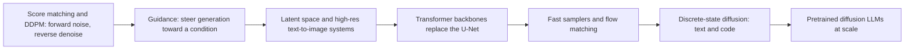

# Diffusion Models: A Learning Roadmap

A ground-up reading path for diffusion generative models — from score matching and denoising through latent/transformer image systems and flow-based fast samplers, then across to discrete-state diffusion for text and code. Papers linked via Hugging Face Papers; blogs included where they give the clearest intuition.

---

## The big idea

Every diffusion model learns to **invert a fixed corruption process**: run a forward process that gradually destroys structure in the data (adding Gaussian noise, or masking tokens), then train a network to reverse it one small step at a time. Sampling starts from pure noise/masks and repeatedly applies the learned reverse step until structure reappears. This "iterative refinement" framing — instead of predicting the next token once, left to right — is the one idea that connects image, video, and (eventually) language diffusion.

---

## Stage 0 — Orientation blogs (skim first, ~1-2 hrs)

- [Lilian Weng — What are Diffusion Models?](https://lilianweng.github.io/posts/2021-07-11-diffusion-models/) — the single best survey-style overview of DDPM math, accelerated sampling, and guidance; already summarized in this wiki as [[What are Diffusion Models?]]. ★
- [Yang Song — Generative Modeling by Estimating Gradients of the Data Distribution](https://yang-song.net/blog/2021/score/) — the author's own walkthrough of score-based generative modeling, the lineage DDPM later unifies with. ★
- [Hugging Face — The Annotated Diffusion Model](https://huggingface.co/blog/annotated-diffusion) — step-by-step PyTorch implementation of DDPM from scratch; the fastest way to see the math turn into code.
- [AI Summer — How Diffusion Models Work: The Math from Scratch](https://theaisummer.com/diffusion-models/) — from-scratch DDPM derivation with code; wiki summary at [[How Diffusion Models Work: The Math from Scratch]].
- [Sander Dieleman — Perspectives on diffusion](https://sander.ai/2023/07/20/perspectives.html) and [Guidance: a cheat code for diffusion models](https://sander.ai/2022/05/26/guidance.html) — the clearest intuition for *why* guidance works and how to think about diffusion as several equivalent formalisms (denoising, score matching, flows).
- [Sander Dieleman — Diffusion language models](https://sander.ai/2023/01/09/diffusion-language.html) — the best orienting essay on *why* language modeling has stayed autoregressive while every other modality went diffusion, and what it would take to change that; sets up Part II below.

---

## Part I — Image / continuous diffusion (ground up)

### Stage 1 — Foundations: score matching, denoising, and the forward/reverse process

| Paper | Date | Why read it |
| --- | --- | --- |
| [Generative Modeling by Estimating Gradients of the Data Distribution](https://huggingface.co/papers/1907.05600) | 2019 | Introduces score-based generative models: learn ∇log p(x) via denoising score matching at multiple noise scales, then sample with annealed Langevin dynamics — the score-matching lineage DDPM later unifies with. ★ |
| [Denoising Diffusion Probabilistic Models](https://huggingface.co/papers/2006.11239) | 2020 | The paper that made diffusion practical: a fixed Gaussian forward-noising process plus a simplified ε-prediction loss matches GAN-quality samples; wiki: [[Denoising Diffusion Probabilistic Models]]. ★ |
| [Improved Denoising Diffusion Probabilistic Models](https://huggingface.co/papers/2102.09672) | 2021 | Learned variance schedules and a hybrid loss close much of DDPM's log-likelihood gap and improve sample quality at fewer steps. |
| [Score-Based Generative Modeling through Stochastic Differential Equations](https://huggingface.co/papers/2011.13456) | 2020 | Unifies discrete DDPM-style diffusion and score matching into one continuous-time SDE, with a corresponding deterministic probability-flow ODE — the theoretical backbone nearly everything downstream (flow matching, consistency models) builds on. ★ |
| [Denoising Diffusion Implicit Models](https://huggingface.co/papers/2010.02502) | 2020 | A non-Markovian reverse process yields a deterministic sampler that cuts inference from ~1000 steps to as few as 20-50 with minimal quality loss; wiki: [[Denoising Diffusion Implicit Models]]. ★ |

### Stage 2 — Guidance and conditioning

| Paper | Date | Why read it |
| --- | --- | --- |
| [Diffusion Models Beat GANs on Image Synthesis](https://huggingface.co/papers/2105.05233) | 2021 | Introduces classifier guidance: nudge each denoising step with the gradient of a separately trained noisy-image classifier, finally beating GANs on FID. |
| [Classifier-Free Diffusion Guidance](https://huggingface.co/papers/2207.12598) | 2022 | Removes the separate classifier by jointly training conditional/unconditional models and extrapolating between their predictions — the guidance mechanism used by nearly every modern text-to-image model; wiki: [[Classifier-Free Guidance]]. ★ |
| [GLIDE: Towards Photorealistic Image Generation and Editing with Text-Guided Diffusion Models](https://huggingface.co/papers/2112.10741) | 2021 | First large-scale demonstration that CLIP/text guidance plus a diffusion model gives photorealistic, editable text-to-image generation; wiki: [[Papers Explained - GLIDE]]. |

### Stage 3 — High-resolution text-to-image systems

| Paper | Date | Why read it |
| --- | --- | --- |
| [High-Resolution Image Synthesis with Latent Diffusion Models](https://huggingface.co/papers/2112.10752) | 2021 | Runs diffusion inside a pretrained autoencoder's compressed latent space instead of pixel space, cutting training/inference cost by an order of magnitude — the Stable Diffusion paper; wiki: [[Latent Diffusion Models]]. ★ |
| [Hierarchical Text-Conditional Image Generation with CLIP Latents](https://huggingface.co/papers/2204.06125) | 2022 | DALL-E 2 (unCLIP): diffuses in CLIP image-embedding space, then decodes, decoupling semantic conditioning from pixel generation. |
| [Photorealistic Text-to-Image Diffusion Models with Deep Language Understanding](https://huggingface.co/papers/2205.11487) | 2022 | Imagen shows a large frozen text encoder (T5-XXL) matters more than a larger diffusion U-Net, plus cascaded super-resolution for high-res output. |

### Stage 4 — Transformer backbones replace the U-Net

| Paper | Date | Why read it |
| --- | --- | --- |
| [All are Worth Words: A ViT Backbone for Diffusion Models](https://huggingface.co/papers/2209.12152) | 2022 | U-ViT: treats time, condition, and noisy patches uniformly as tokens through a plain ViT, showing skip connections — not convolution — are what actually matter; wiki: [[Papers Explained 342 - U-ViT]]. |
| [Scalable Diffusion Models with Transformers](https://huggingface.co/papers/2212.09748) | 2022 | DiT: replaces the U-Net with a Vision Transformer modulated by AdaLN-Zero conditioning, and shows diffusion FID improves smoothly with more transformer FLOPs — the backbone behind Stable Diffusion 3, Sora, and most current generators; wiki: [[Diffusion Transformer]]. ★ |
| [SiT: Exploring Flow and Diffusion-based Generative Models with Scalable Interpolant Transformers](https://huggingface.co/papers/2401.08740) | 2024 | Swaps DiT's diffusion objective for a flow-based interpolant on the same transformer backbone, isolating how much of the improvement comes from the objective vs. the architecture. |

### Stage 5 — Fast samplers and the flow-matching reformulation

| Paper | Date | Why read it |
| --- | --- | --- |
| [Elucidating the Design Space of Diffusion-Based Generative Models](https://huggingface.co/papers/2206.00364) | 2022 | EDM: disentangles noise schedule, network preconditioning, and sampler choice into separable design axes; its second-order Heun sampler became a standard high-quality/low-step baseline. |
| [Progressive Distillation for Fast Sampling of Diffusion Models](https://huggingface.co/papers/2202.00512) | 2022 | Iteratively distills a many-step teacher into a student needing half as many steps each round — the template for later single/few-step distillation methods. |
| [Consistency Models](https://huggingface.co/papers/2303.01469) | 2023 | Learns a function mapping any point on the ODE trajectory directly to its origin, enabling single-step (or few-step) generation without an iterative denoising loop; wiki: [[Consistency Models]]. ★ |
| [Flow Matching for Generative Modeling](https://huggingface.co/papers/2210.02747) | 2022 | Reframes diffusion as regressing a vector field along simple (e.g., straight-line) probability paths between noise and data — a simulation-free, more general objective that subsumes diffusion as a special case. ★ |
| [Flow Straight and Fast: Learning to Generate and Transfer Data with Rectified Flow](https://huggingface.co/papers/2209.03003) | 2022 | Independently arrives at straight-line, flow-matching-style transport, plus a "reflow" procedure that iteratively straightens paths for few-step sampling. |
| [Scaling Rectified Flow Transformers for High-Resolution Image Synthesis](https://huggingface.co/papers/2403.03206) | 2024 | Stable Diffusion 3: combines rectified flow with a two-stream (text+image) DiT-style transformer (MM-DiT) — the production-scale synthesis of Stages 4 and 5. |

---

## Part II — Discrete / language diffusion (builds on Part I)

Text is discrete and categorical, not continuous Gaussian noise, so bringing diffusion to language took two different routes: (a) embed tokens into continuous space and reuse Part I's machinery directly, or (b) redefine the forward/reverse process natively over discrete states (masking, category transitions). Both converge in today's pretrained diffusion LLMs.

### Stage 6 — Discrete-state foundations

| Paper | Date | Why read it |
| --- | --- | --- |
| [Argmax Flows and Multinomial Diffusion: Learning Categorical Distributions](https://huggingface.co/papers/2102.05379) | 2021 | First to define a diffusion forward process directly over discrete/categorical variables (multinomial diffusion) rather than continuous Gaussians. |
| [Structured Denoising Diffusion Models in Discrete State-Spaces](https://huggingface.co/papers/2107.03006) | 2021 | D3PM generalizes discrete diffusion to arbitrary transition matrices, including an absorbing "[MASK]" state — the direct ancestor of every masked text-diffusion LLM below. ★ |

### Stage 7 — Diffusion in embedding space

| Paper | Date | Why read it |
| --- | --- | --- |
| [Diffusion-LM Improves Controllable Text Generation](https://huggingface.co/papers/2205.14217) | 2022 | Embeds tokens into a continuous space, runs standard Gaussian diffusion there, then rounds back to tokens — reuses Part I's machinery wholesale and enables gradient-based controllable generation (e.g., syntax trees) that autoregressive decoding can't easily do. ★ |
| [Likelihood-Based Diffusion Language Models](https://huggingface.co/papers/2305.18619) | 2023 | Plaid pushes embedding-space diffusion toward log-likelihood competitive with autoregressive LMs, exposing how far the continuous-embedding approach can scale before hitting a wall. |

### Stage 8 — Masked and score-entropy discrete diffusion

| Paper | Date | Why read it |
| --- | --- | --- |
| [Discrete Diffusion Modeling by Estimating the Ratios of the Data Distribution](https://huggingface.co/papers/2310.16834) | 2023 | SEDD extends score matching to discrete state-spaces via a "concrete score" (ratios of probabilities between states), closing much of the perplexity gap to GPT-2 while sampling faster. ★ |
| [Simple and Effective Masked Diffusion Language Models](https://huggingface.co/papers/2406.07524) | 2024 | MDLM shows a carefully derived, simplified masked-diffusion ELBO (SUBS parameterization) matches or beats more complex discrete-diffusion objectives, and connects cleanly back to BERT-style masking. |
| [Simplified and Generalized Masked Diffusion for Discrete Data](https://huggingface.co/papers/2406.04329) | 2024 | MD4 is an independent, complementary simplification/generalization of masked discrete diffusion, arriving at similar conclusions from a different derivation. |

### Stage 9 — Scaling diffusion LLMs

| Paper | Date | Why read it |
| --- | --- | --- |
| [Large Language Diffusion Models](https://huggingface.co/papers/2502.09992) | 2025 | LLaDA is the first masked-diffusion LLM trained from scratch at real LLM scale (8B), matching LLaMA3-8B on many benchmarks and showing bidirectional, any-order generation is viable at scale. ★ |
| [Scaling Diffusion Language Models via Adaptation from Autoregressive Models](https://huggingface.co/papers/2410.17891) | 2024 | Shows it's far cheaper to convert an existing pretrained autoregressive LLM into a diffusion LLM via continued training than to train one from scratch — the practical path most later diffusion LLMs actually take. |
| [Block Diffusion: Interpolating Between Autoregressive and Diffusion Language Models](https://huggingface.co/papers/2503.09573) | 2025 | Interpolates between the two paradigms — diffuse within a block, generate blocks autoregressively — enabling KV-caching and arbitrary-length generation that pure diffusion LLMs struggle with; conceptually the same trick as [[Block Autoregressive Diffusion]] in DiffusionGemma. |
| [Mercury: Ultra-Fast Language Models Based on Diffusion](https://huggingface.co/papers/2506.17298) | 2025 | A commercial-scale diffusion LLM (Inception Labs) optimized purely for throughput, reporting 1000+ tokens/sec on H100s — the efficiency payoff this whole line is chasing. |

For the current production frontier, see the wiki's [[DiffusionGemma]] (Google's open-weight Gemma-4-based diffusion LLM using [[Uniform State Diffusion]] and [[Block Autoregressive Diffusion]]) and [[Beyond Standard LLMs]] (Sebastian Raschka's survey placing these models in context alongside linear-attention hybrids).

### Stage 10 — Diffusion for code

| Paper | Date | Why read it |
| --- | --- | --- |
| [CodeFusion: A Pre-trained Diffusion Model for Code Generation](https://huggingface.co/papers/2310.17680) | 2023 | Applies embedding-space text diffusion (Stage 7's approach) specifically to code generation, addressing autoregressive code models' inability to revisit and fix earlier tokens; wiki: [[Papers Explained 70 - CodeFusion]]. |

---

## Suggested paths

**Fast track** (~6 papers to get the full continuous → discrete arc):

1. Stage 0 primer — [Lilian Weng's blog](https://lilianweng.github.io/posts/2021-07-11-diffusion-models/).
2. [Denoising Diffusion Probabilistic Models](https://huggingface.co/papers/2006.11239) — the core mechanism.
3. [Classifier-Free Diffusion Guidance](https://huggingface.co/papers/2207.12598) — how conditioning works.
4. [High-Resolution Image Synthesis with Latent Diffusion Models](https://huggingface.co/papers/2112.10752) — how it scales to real images.
5. [Scalable Diffusion Models with Transformers](https://huggingface.co/papers/2212.09748) — the modern backbone.
6. [Large Language Diffusion Models](https://huggingface.co/papers/2502.09992) — the same idea applied to language at scale.

**Full ground-up**: follow Stage 0, then Part I (Stages 1-5), then Part II (Stages 6-10) in order.

---

## Related

- [Text-to-Speech: A Learning Roadmap](tts-2026-07-21.md) — applies this roadmap's diffusion (Stage 1) and flow-matching/DiT (Stages 4-5) machinery directly to speech: Grad-TTS and DiffWave are diffusion acoustic/vocoder models, and F5-TTS reuses the DiT backbone from Stage 4.
- [Reasoning in LLMs: A Literature Review](reasoning-2026-07-21.md) — test-time compute and latent reasoning, a complementary axis to the sampling-step compute discussed in Stage 5.
- [Looped Transformers: A Learning Roadmap](looped-transformers-2026-07-21.md) — recurrent, weight-tied compute; structurally related to how diffusion reuses one network across many denoising steps.
- [[What are Diffusion Models?]] — Lilian Weng's survey; wiki summary anchoring most of Stages 1-3.
- [[How Diffusion Models Work: The Math from Scratch]] — AI Summer's from-scratch DDPM derivation.
- [[Denoising Diffusion Probabilistic Models]], [[Denoising Diffusion Implicit Models]], [[Denoising Score Matching]], [[Classifier-Free Guidance]], [[Latent Diffusion Models]], [[Diffusion Transformer]], [[Consistency Models]] — wiki concept pages covering Stages 1-5.
- [[Diffusion Models for Video Generation]] — Lilian Weng's follow-up extending this roadmap's Part I ideas to video.
- [[Papers Explained - GLIDE]], [[Papers Explained - Probabilistic Diffusion Models]], [[Papers Explained 342 - U-ViT]], [[Papers Explained 70 - CodeFusion]] — paper-explained pages touching Stages 2, 1, 4, and 10 respectively.
- [[Text Diffusion LLMs]], [[Uniform State Diffusion]], [[Block Autoregressive Diffusion]], [[DiffusionGemma]], [[Beyond Standard LLMs]] — wiki coverage of the current diffusion-LLM production landscape (Stage 9).
