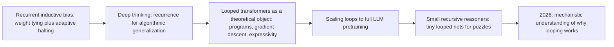

# Looped Transformers: A Learning Roadmap

A ground-up reading path for looped (recurrent-depth) transformers — from the original recurrent inductive bias of the Universal Transformer, through the "deep thinking" recurrent-network literature on algorithmic generalization, to today's billion-parameter recurrent-depth LLMs, tiny recursive puzzle-solvers, and the 2026 mechanistic-interpretability work explaining why any of this helps. Papers linked via Hugging Face Papers; blogs included where they give the clearest intuition.

---

## The big idea

A standard transformer stacks L distinct layers, each with its own weights, and runs the input through them exactly once. A **looped transformer** instead takes a single shared block of weights and applies it repeatedly — "weight tying across depth." This buys iterative computation without buying parameters: an 8-layer block looped 5 times costs as much compute as a 40-layer model but only stores 8 layers' worth of weights. Crucially, because the same function is reapplied rather than a fixed sequence of different ones, the number of iterations no longer has to be fixed at training time — a model can loop more on hard inputs and less on easy ones, turning depth into a test-time dial rather than an architectural constant.

---

## Stage 0 — Orientation blogs (skim first, ~1 hr)

- [Google Research — Moving Beyond Translation with the Universal Transformer](https://research.google/blog/moving-beyond-translation-with-the-universal-transformer/) — the original 2018 announcement post, still the clearest plain-English explanation of weight tying plus adaptive per-position halting. ★
- [Rajkiran Panuganti — Why Looping Is the New Scaling](https://rajkiranpanuganti.com/blog/why-looping-is-the-new-scaling/) — a 2026 dispatch tying together three papers (elastic visual looping, a mechanistic fixed-point study, and an entropy-probing analysis) into one narrative about why reused compute can beat added parameters. ★
- [Inquiring Lines / Gravity7 — Why does looping computation outperform adding more transformer layers?](https://inquiringlines.com/inquiring-lines/why-does-looping-computation-outperform-adding-more-transformer-layers/) — the FLOPs-vs-weight-movement argument for why reused layers are cheaper than new ones on memory-bound hardware.
- [[Beyond Standard LLMs]] — Sebastian Raschka's survey; its Small Recursive Transformers section already covers HRM and TRM (Part IV below) and frames them as "pocket calculator" tools rather than general LLMs.
- [tomg-group-umd/huginn-0125 on Hugging Face](https://huggingface.co/tomg-group-umd/huginn-0125) — the actual open-weight model card for the recurrent-depth LLM at the center of Part III; the fastest way to see a looped transformer run.

---

## Part I — Foundations: giving transformers a recurrent inductive bias (2016–2024)

### Stage 1 — Weight tying and adaptive halting

| Paper | Date | Why read it |
| --- | --- | --- |
| [Adaptive Computation Time for Recurrent Neural Networks](https://huggingface.co/papers/1603.08983) | 2016 | Graves' ACT: lets an RNN learn how many computational steps to spend per input via a differentiable halting probability — the halting mechanism the Universal Transformer adapts to per-token depth below. |
| [Universal Transformers](https://huggingface.co/papers/1807.03819) | 2018 | Replaces the Transformer's stack of distinct layers with one shared block applied recurrently in depth, adds ACT-style dynamic per-position halting, and shows the result is Turing-complete under certain assumptions — the paper that named this whole line of work; wiki: [[Papers Explained 01 - Transformer]] covers the architecture it builds on. ★ |
| [ALBERT: A Lite BERT for Self-Supervised Learning of Language Representations](https://huggingface.co/papers/1909.11942) | 2019 | Ties all transformer-layer parameters together at real pretraining scale (not just a small algorithmic-task model) to cut BERT-large's parameter count 18x with comparable accuracy — the "fixed-depth-count, no adaptive halting" sibling of the Universal Transformer; wiki: [[Papers Explained 07 - ALBERT]]. |
| [Deep Equilibrium Models](https://huggingface.co/papers/1909.01377) | 2019 | Observes that the hidden layers of many deep sequence models converge toward a fixed point, then trains a single layer to directly solve for that fixed point via root-finding instead of unrolling it — a structurally different, non-iterative way to get the same "infinite weight-tied depth" behavior that looped transformers approximate by unrolling. |
| [PonderNet: Learning to Ponder](https://huggingface.co/papers/2107.05407) | 2021 | Replaces ACT's somewhat ad hoc halting rule with a cleaner, unbiased stochastic halting policy trained via a KL term against a target compute budget — a refinement of Stage 1's halting mechanism that recurs later in adaptive-depth work. |

### Stage 2 — Improving the shared block

| Paper | Date | Why read it |
| --- | --- | --- |
| [Adaptive Computation with Elastic Input Sequence](https://huggingface.co/papers/2301.13195) | 2023 | Generalizes adaptive computation beyond "how many steps" to also adapt *which and how many tokens* the model attends to per step, another axis of test-time-adjustable compute alongside loop count. |
| [Sparse Universal Transformer](https://huggingface.co/papers/2310.07096) | 2023 | Adds a mixture-of-experts transition function to the Universal Transformer, showing the "one shared block" doesn't have to be a single dense function — it can itself be sparse and specialized per step. |
| [MoEUT: Mixture-of-Experts Universal Transformers](https://huggingface.co/papers/2405.16039) | 2024 | Pushes Stage 2's sparsification further to close the long-standing compute/parameter tradeoff that kept vanilla Universal Transformers from matching standard Transformers at scale — the strongest evidence yet that a properly sparsified shared block can be competitive. ★ |

---

## Part II — Recurrence as a substrate for algorithmic reasoning (2021–2024)

### Stage 3 — "Deep thinking": recurrent networks that generalize from easy to hard

Before "looped transformer" was a term of art, a parallel line of work asked whether *recurrent* networks (not yet transformers) could learn an algorithm on small/easy instances and extrapolate it to much larger/harder ones simply by running more iterations at test time. This training recipe — inject the original input at every step, and randomize how many steps are used during training — is exactly what later looped-transformer LLMs (Part III) borrow.

- **Can You Learn an Algorithm? Generalizing from Easy to Hard Problems with Recurrent Networks** (Schwarzschild et al., 2021) — arXiv [2106.04537](https://arxiv.org/abs/2106.04537) *(not yet indexed on Hugging Face Papers; linked directly to arXiv)* — trains recurrent convolutional networks on small mazes/chess-puzzles and shows they extrapolate to much larger ones simply by iterating longer at test time, the founding result of the "deep thinking" line.
- **End-to-End Algorithm Synthesis with Recurrent Networks: Extrapolation without Overthinking** (Bansal et al., 2022) — arXiv [2202.05826](https://arxiv.org/abs/2202.05826) *(not yet indexed on Hugging Face Papers; linked directly to arXiv)* — introduces "input injection" (re-feeding the original input at every recurrent step) and randomized/progressive training of the number of iterations, both of which reappear verbatim in the design of the Huginn recurrent-depth LLM (Stage 5).

### Stage 4 — Looped transformers as a theoretical object

| Paper | Date | Why read it |
| --- | --- | --- |
| [Looped Transformers as Programmable Computers](https://huggingface.co/papers/2301.13196) | 2023 | Shows a transformer with fixed, hand-designed weights placed in a loop can act as a general-purpose computer — the input sequence is a "punchcard" of instructions and memory that the looped block executes step by step. A constructive existence proof that looping adds real computational power, not just efficiency. ★ |
| [Looped Transformers are Better at Learning Learning Algorithms](https://huggingface.co/papers/2311.12424) | 2023 | Shows that adding an explicit loop structure helps transformers learn to *implement* in-context learning algorithms (like linear regression solvers) that a same-sized non-looped transformer struggles to represent, since the target algorithm is itself iterative. |
| [Simulation of Graph Algorithms with Looped Transformers](https://huggingface.co/papers/2402.01107) | 2024 | Extends the "looped transformer as a general-purpose executor" idea from Stage 4's programmable-computer result to classic graph algorithms, formalizing which algorithmic primitives a loop can simulate. |
| [On the Expressive Power of Looped Transformers: Theoretical Analysis and Enhancement via Timestep Encoding](https://huggingface.co/papers/2410.01405) | 2024 | Directly analyzes the function-approximation capacity of looped transformers (an underexplored question relative to their parameter- and reasoning-efficiency benefits) and proposes timestep encoding — telling the block which loop iteration it's on — as a fix for a specific expressivity gap. |
| [Bypassing the Exponential Dependency: Looped Transformers Efficiently Learn In-context by Multi-step Gradient Descent](https://huggingface.co/papers/2410.11268) | 2024 | Connects loop count directly to optimization steps: shows a looped transformer can implement *T* steps of gradient descent for in-context learning with far better sample/parameter efficiency than earlier constructions needed, following the "transformers learn in-context by gradient descent" framing of [Transformers learn in-context by gradient descent](https://huggingface.co/papers/2212.07677) (2022). |
| [Looped Transformers for Length Generalization](https://huggingface.co/papers/2409.15647) | 2024 | Applies Stage 3's "deep thinking" recipe (input injection, randomized unrolling) explicitly to transformers rather than recurrent CNNs, and shows the resulting looped models generalize to sequence lengths well beyond training — the most direct bridge between Stage 3 and Stage 4. |

---

## Part III — Scaling loops to full language models (2024–2026)

### Stage 5 — Recurrent-depth pretraining at scale

| Paper | Date | Why read it |
| --- | --- | --- |
| [Relaxed Recursive Transformers: Effective Parameter Sharing with Layer-wise LoRA](https://huggingface.co/papers/2410.20672) | 2024 | Shows plain cross-layer weight tying (à la ALBERT) is too rigid for modern LLMs, and fixes this with "relaxed" recursion: full weight tying across loop iterations plus a small, iteration-specific LoRA adapter — a practical recipe for converting an *already-pretrained* dense transformer into a looped one instead of training from scratch. ★ |
| [Scaling up Test-Time Compute with Latent Reasoning: A Recurrent Depth Approach](https://huggingface.co/papers/2502.05171) | 2025 | "Huginn": trains a 3.5B-parameter, 800B-token recurrent-depth LLM from scratch — a prelude embeds tokens, a shared core block loops for a variable number of iterations to refine a latent state, and a coda decodes. Performance improves substantially with more test-time loops on reasoning-heavy tasks (math, code), all without any chain-of-thought training data; also yields adaptive per-token compute, KV-cache sharing, and self-speculative decoding "for free." The flagship result that makes Parts I–II's theory practical at LLM scale. ★★ |
| [Reasoning with Latent Thoughts: On the Power of Looped Transformers](https://huggingface.co/papers/2502.17416) | 2025 | Shows a *k*-layer transformer looped *L* times nearly matches a non-looped *kL*-layer model on synthetic reasoning tasks (addition, induction, math), proves this theoretically for iterative-algorithm-style problems, and — most strikingly — proves a looped model can *simulate T steps of chain-of-thought with T loops*, making the "loops as latent reasoning steps" analogy to CoT rigorous rather than just intuitive. ★ |

### Stage 6 — Efficiency and test-time tricks for recurrent-depth models

| Paper | Date | Why read it |
| --- | --- | --- |
| [Efficient Parallel Samplers for Recurrent-Depth Models and Their Connection to Diffusion Language Models](https://huggingface.co/papers/2510.14961) | 2025 | Notes that recurrent-depth/looped models and diffusion language models are both "iterative refinement" architectures under the hood, and ports parallel-sampling tricks from diffusion LMs to speed up recurrent-depth inference — a direct structural bridge to [Diffusion Models: A Learning Roadmap](diffusion-models-2026-07-21.md)'s Part II. |
| [Parallel Loop Transformer for Efficient Test-Time Computation Scaling](https://huggingface.co/papers/2510.24824) | 2025 | Addresses looped models' main latency cost — loops are inherently sequential — by restructuring computation so multiple loop iterations can be evaluated with greater parallelism at inference time. |
| [Training-Free Looped Transformers](https://huggingface.co/papers/2605.23872) | 2026 | Retrofits looping onto a *frozen*, already-pretrained checkpoint at inference time only — no fine-tuning, continued training, or architecture change — by treating a pre-norm transformer block as one Euler step of an ODE and looping it as smaller, damped sub-steps; improves several dense and MoE model families on reasoning benchmarks purely at test time. |

---

## Part IV — The small recursive-reasoner branch (puzzle-focused, a distinct lineage)

A structurally related but separate line of work builds *tiny* looped networks (millions, not billions, of parameters) purely for grid/puzzle-style reasoning (ARC-AGI, Sudoku, mazes) rather than general text. See also the wiki's [[Small Recursive Transformers]] concept page, which this stage expands on.

| Paper | Date | Why read it |
| --- | --- | --- |
| [Hierarchical Reasoning Model](https://huggingface.co/papers/2506.21734) | 2025 | Introduces a small, two-module transformer that recurses at two different frequencies (a "slow" high-level module and a "fast" low-level module) to reach strong performance on ARC-AGI and Sudoku with only ~27M parameters — the paper that kicked off the small-recursive-reasoner line; wiki: [[Small Recursive Transformers]]. ★ |
| [Less is More: Recursive Reasoning with Tiny Networks](https://huggingface.co/papers/2510.04871) | 2025 | "TRM": simplifies HRM to a single 2-layer transformer (7M parameters) alternating a latent-update step and an answer-update step for up to 16 refinement steps, with full gradient flow through the recursion — and beats HRM on the same benchmarks, with the surprising ablation that *fewer* layers generalize better. ★ |
| [Mixture-of-Recursions: Learning Dynamic Recursive Depths for Adaptive Token-Level Computation](https://huggingface.co/papers/2507.10524) | 2025 | Makes recursion depth itself adaptive *per token* rather than fixed for the whole sequence, targeting the parameter- and compute-sharing efficiency angle rather than pure puzzle accuracy — the piece that connects this branch back to Part I's parameter-sharing motivation. |
| [Universal Reasoning Model](https://huggingface.co/papers/2512.14693) | 2025 | Explicitly reunifies the two lineages: frames itself as a Universal Transformer (Stage 1) analysis applied to HRM-style reasoning tasks, systematically isolating which of UT's ingredients (weight tying, adaptive depth, structured recurrence) actually drive the small-recursive-reasoner gains. A natural capstone connecting Parts I and IV. ★ |

---

## Part V — Mechanistic understanding: why does looping actually work? (2026)

| Paper | Date | Why read it |
| --- | --- | --- |
| [From Growing to Looping: A Unified View of Iterative Computation in LLMs](https://huggingface.co/papers/2602.16490) | 2026 | Compares looping (reusing a block across depth) with "depth growing" (training shallow-to-deep by duplicating middle layers) and finds both produce the same depth-wise computational signatures — evidence that both techniques succeed for the same underlying reason, and that they're composable at inference time. |
| [ELT: Elastic Looped Transformers for Visual Generation](https://huggingface.co/papers/2604.09168) | 2026 | Shows the "loop count as a tunable compute dial" idea generalizes past language: trains with intra-loop self-distillation so a single visual generative model can exit after any number of loops, trading quality for speed at inference, and matches a much larger non-looped DiT with 4x fewer parameters. |
| [Loop, Think, & Generalize: Implicit Reasoning in Recurrent-Depth Transformers](https://huggingface.co/papers/2604.07822) | 2026 | Studies *implicit* reasoning — combining stored facts or rules within a single forward pass, something standard transformers are known to struggle with — and shows recurrent-depth looping specifically helps close this gap, connecting looped architectures to the [[Reasoning Models|reasoning]] literature's implicit/latent-reasoning thread. |
| [A Mechanistic Analysis of Looped Reasoning Language Models](https://huggingface.co/papers/2604.11791) | 2026 | The first mechanistic study of what actually happens inside a looped LM: hidden states provably converge toward a fixed point across loop iterations, attention patterns stabilize as the model "finishes thinking," and — most strikingly — a looped block of 3–5 layers learns to reproduce the *same sequence of computational stages* that a much deeper non-looped feedforward model spreads across separate layers. Directly explains why Parts III and IV's empirical gains show up at all. ★ |

---

## Suggested paths

**Fast track** (~7 stops to get the full arc):

1. Stage 0 primer — [Google's Universal Transformer blog](https://research.google/blog/moving-beyond-translation-with-the-universal-transformer/).
2. [Universal Transformers](https://huggingface.co/papers/1807.03819) — the recurrent inductive bias that starts everything.
3. [Looped Transformers as Programmable Computers](https://huggingface.co/papers/2301.13196) — the theoretical case that looping adds real computational power.
4. [Scaling up Test-Time Compute with Latent Reasoning: A Recurrent Depth Approach](https://huggingface.co/papers/2502.05171) — the same idea at billion-parameter LLM scale (Huginn).
5. [Reasoning with Latent Thoughts: On the Power of Looped Transformers](https://huggingface.co/papers/2502.17416) — makes the loops-as-CoT-steps analogy rigorous.
6. [Hierarchical Reasoning Model](https://huggingface.co/papers/2506.21734) or [Less is More: Recursive Reasoning with Tiny Networks](https://huggingface.co/papers/2510.04871) — the small, puzzle-focused sibling branch.
7. [A Mechanistic Analysis of Looped Reasoning Language Models](https://huggingface.co/papers/2604.11791) — why any of the above actually works.

**Full ground-up**: follow Stage 0, then Part I (Stages 1–2), Part II (Stages 3–4), Part III (Stages 5–6), Part IV, then Part V in order.

---

## Related

- [Diffusion Models: A Learning Roadmap](diffusion-models-2026-07-21.md) — a structurally parallel roadmap: diffusion also reuses one network across many refinement steps, and Stage 6 above cites a paper making that connection explicit.
- [Reasoning in LLMs: A Literature Review](reasoning-2026-07-21.md) — Section 5's latent/implicit-reasoning survey material (Coconut, pause tokens) covers the same "reason without verbalizing every step" bet from a chain-of-thought-training angle rather than an architectural-recurrence angle.
- [[Small Recursive Transformers]] — wiki concept page on HRM/TRM/Mixture-of-Recursions, expanded on in Part IV above.
- [[Beyond Standard LLMs]] — Sebastian Raschka's survey; source of the Small Recursive Transformers framing used in Stage 0 and Part IV.
- [[Parameter Sharing]] — general concept page on weight tying; the Universal Transformer and ALBERT (Stage 1) are its transformer-specific instances.
- [[Papers Explained 07 - ALBERT]] — detailed paper-explained page on ALBERT's cross-layer parameter sharing, cited in Stage 1.
- [[Papers Explained 01 - Transformer]] — the base architecture every paper above modifies by adding recurrence in depth.
- [[Reasoning Models]] — topic hub for the broader reasoning-model landscape that Parts III–V's recurrent-depth reasoning results contribute to.
