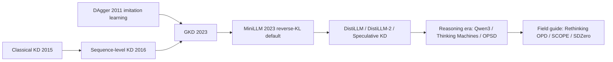

# On-Policy Distillation: A Learning Roadmap

A ground-up reading path for on-policy distillation (OPD) — from classical knowledge distillation and imitation learning, through the 2023 papers that brought "on-policy" into the distillation literature, to the 2025–2026 reasoning-era recipes (Qwen3, Thinking Machines Lab) and the field-guide papers now cataloging what actually works. Papers are linked via Hugging Face Papers where indexed; blogs are included where they give the clearest intuition or a runnable recipe.

---

## 1. The core idea

Every distillation method trains a smaller or cheaper student to imitate a stronger teacher, but methods differ sharply in *whose tokens the student actually trains on*. **Off-policy** distillation trains on a fixed, teacher-written corpus: the teacher generates (or a dataset already contains) completions, and the student runs ordinary next-token supervised fine-tuning on them. This is cheap and stable, but it creates a **train-inference distribution mismatch** (also called exposure bias): the student is only ever supervised on teacher-quality prefixes, so at deployment time — once it starts making its own small errors — it walks into states it has never been trained to recover from, and errors compound.

**On-policy distillation** fixes this by changing where the training data comes from rather than what is being matched: the student samples its own rollouts from its current policy, and the teacher then grades those self-generated tokens directly (usually via per-token log-probabilities), rather than the student imitating pre-written teacher transcripts. The [Thinking Machines Lab post](https://thinkingmachines.ai/blog/on-policy-distillation/) frames this as combining "the error-correcting relevance of RL with the reward density of SFT" — the student trains on the exact states it visits (like RL), but instead of a single sparse outcome reward at the end of a trajectory, it gets a dense, per-token teacher-derived signal at every position (like SFT).

A second recurring axis is **which divergence** is minimized between student and teacher token distributions. Forward KL (the classical SFT objective) is *mode-covering*: it spreads probability mass to cover every mode the teacher assigns weight to, which is safe but can produce bland, hedged outputs when the student lacks the capacity to represent the teacher exactly. Reverse KL is *mode-seeking*: it pushes the student to commit fully to the modes it can actually represent, discarding teacher behavior the student can't reach rather than blurring toward it. This forward-vs-reverse-KL choice, and the fact that on-policy sampling lets you use reverse KL cheaply (no teacher rollout required, just teacher log-probs on student tokens), is the single idea threading through nearly every paper below.

---

## 2. Foundations before on-policy distillation

Three older lines of work are worth reading first, since the "founding" OPD papers explicitly build on and contrast with them:

- [Distilling the Knowledge in a Neural Network](https://huggingface.co/papers/1503.02531) (2015, Hinton, Vinyals & Dean) is the origin of "knowledge distillation" itself: train a student to match a temperature-softened teacher softmax rather than only the hard label, transferring the teacher's relative confidence across wrong answers ("dark knowledge") as well as its top prediction.
- [Sequence-Level Knowledge Distillation](https://huggingface.co/papers/1606.07947) (2016, Kim & Rush) extends KD to autoregressive sequence models, but does so off-policy: it distills toward the teacher's *mode* (approximated via beam search) rather than matching per-token distributions on live student rollouts. This is the classical baseline every "on-policy" paper below defines itself against.
- [A Reduction of Imitation Learning and Structured Prediction to No-Regret Online Learning](https://arxiv.org/abs/1011.0686) (2011, Ross, Gordon & Bagnell — DAgger) is the direct conceptual ancestor cited by both GKD and the Thinking Machines post: an iterative imitation-learning algorithm that runs the *current* learner's policy to collect the states it visits, queries an expert for the correct action at exactly those states, and retrains on the aggregated dataset. Swap "states a robot policy visits" for "tokens a language model generates" and "expert action" for "teacher log-probability," and you have on-policy distillation. (Not indexed on Hugging Face Papers; linked directly to arXiv.)
- [Let's Verify Step by Step](https://huggingface.co/papers/2305.20050) (2023, OpenAI) is not a distillation paper, but it establishes the sibling idea of *dense, per-step* supervision (there, from a process reward model rather than a teacher's log-probabilities) as superior to a single sparse outcome signal — the same "density" argument OPD makes about teacher feedback versus RL rewards.

---

## 3. The founding papers: GKD and MiniLLM

Two concurrent 2023 papers brought on-policy training into the LLM distillation literature and remain, per the community [Awesome-LLM-On-Policy-Distillation](https://github.com/nick7nlp/Awesome-LLM-On-Policy-Distillation) list, the "if you only read 3 papers" starting pair (the third being the field-guide paper in Section 6):

- [On-Policy Distillation of Language Models: Learning from Self-Generated Mistakes](https://huggingface.co/papers/2306.13649) (Jun 2023, Agarwal et al., ICLR 2024 — **GKD**) introduces Generalized Knowledge Distillation: instead of training only on a fixed dataset, the student samples from a *mixture* policy $\pi_{mix} = \lambda\, p_\theta + (1-\lambda)\, p_{data}$, and the teacher supplies feedback via a unified loss that can be instantiated as forward KL, reverse KL, or JSD at each position. The $\lambda$ knob is a single control for how on-policy training is versus purely off-policy SFT, and GKD shows it also integrates cleanly with RLHF fine-tuning. Experiments cover T5 models on summarization, translation, and arithmetic reasoning, plus task-agnostic instruction tuning.
- [MiniLLM: Knowledge Distillation of Large Language Models](https://huggingface.co/papers/2306.08543) (Jun 2023, Gu et al.) commits fully to on-policy sampling with **reverse KL** as the objective, arguing this is specifically better suited to generative LLMs than the forward-KL default inherited from classification-style KD: reverse KL's mode-seeking behavior prevents the student from wasting capacity trying to cover teacher modes it can't represent. Because reverse KL between the student and teacher over student-generated sequences has no simple closed form, MiniLLM derives a policy-gradient-style optimization to train it. This paper is why reverse KL became the default OPD objective across nearly all later work.

---

## 4. Objective and pipeline refinements

Once the mixture-policy and divergence-choice framework existed, follow-on work targeted specific failure modes in the objective itself and in how trajectories are constructed:

- [DistiLLM: Towards Streamlined Distillation for Large Language Models](https://huggingface.co/papers/2402.03898) (Feb 2024, Ko et al.) identifies that both the divergence choice and the on/off-policy mixing ratio have specific practical failure modes, and proposes a **skew KL** divergence (a skewed interpolation between forward and reverse KL) plus an adaptive schedule for mixing off-policy and on-policy student-generated data — becoming something of a template for production OPD pipelines.
- [DistiLLM-2: A Contrastive Approach Boosts the Distillation of LLMs](https://huggingface.co/papers/2503.07067) (Mar 2025) reframes the objective contrastively, pairing teacher-preferred and student-dispreferred outputs rather than only matching a single divergence pointwise.
- [Speculative Knowledge Distillation: Bridging the Teacher-Student Gap Through Interleaved Sampling](https://huggingface.co/papers/2410.11325) (Oct 2024) borrows the interleaved teacher/student proposal-and-verify structure from speculative decoding to construct training trajectories more efficiently, an influential pattern for cheaply generating near-on-policy data without a full independent student rollout per step.

---

## 5. The reasoning era: Qwen3, Thinking Machines Lab, and self-distillation

By 2025 the "reasoning model" boom (Section 3.2 of [Reasoning in LLMs: A Literature Review](reasoning-2026-07-21.md)) made RL post-training both essential and expensive, which is what pulled OPD from a niche technique into a mainstream post-training tool: it promises much of RL's on-policy correction at a fraction of the compute.

- [Qwen3 Technical Report](https://huggingface.co/papers/2505.09388) (May 2025) is the industrial result that catalyzed the current wave: the Qwen team reports reaching a *higher* AIME'24 score (74.4) via on-policy distillation from a larger sibling model than via RL alone, at roughly one-tenth the RL compute cost.
- The [Thinking Machines Lab — On-Policy Distillation](https://thinkingmachines.ai/blog/on-policy-distillation/) post (2025) is the clearest modern hands-on recipe, and explicitly sets out to replicate Qwen3's result using their Tinker training API. Concretely: sample student rollouts exactly as in RL, query the teacher's log-probabilities on those same tokens with a single forward pass (no teacher rollout needed), set the per-token advantage to the negative reverse KL, and train with a standard RL importance-sampling loss. Their math-reasoning experiment (Qwen3-8B-Base student, Qwen3-32B teacher) reaches 70% on AIME'24 in about 150 steps, versus an extrapolated ~2M prompts of off-policy SFT to hit a comparable score — a measured 9–30x reduction in compute depending on whether the teacher's own inference cost is amortized or charged in full. A second experiment applies the same recipe to a continuously-learning internal assistant, using on-policy "background data" (the model's own resampled chat outputs) as a forward-KL regularizer against catastrophic forgetting during domain fine-tuning — notably found to work better than LoRA, which forgets less but also learns less.
- [Self-Distilled Reasoner: On-Policy Self-Distillation for Large Language Models](https://huggingface.co/papers/2601.18734) (Jan 2026 — **OPSD**) removes the external teacher entirely: the "teacher" is the *same* model conditioned on privileged context (e.g., the ground-truth answer), and the ordinary (unprivileged) student policy is trained on-policy against that privileged self. This automatically solves the tokenizer/vocabulary mismatch that plagues cross-family teacher distillation, at the cost of new instability: privileged-answer conditioning can produce very concentrated, biased gradients (see Section 6).
- [AlignDistil: Token-Level Language Model Alignment as Adaptive Policy Distillation](https://huggingface.co/papers/2503.02832) (Mar 2025) is a useful bridge paper, reframing RLHF-style token-level alignment itself as a form of adaptive on-policy distillation — reward signals become divergence weights — connecting the OPD and RLHF/DPO literatures into one lens.

**A practitioner-framing companion worth reading alongside these**: this wiki's own [[On SFT RL and On-Policy Distillation]] page summarizes Will Brown's essay placing SFT, RL, OPD, and self-distillation on a single "how dense, how biased, how concentrated is the gradient" taxonomy, and [[On-Policy Distillation]] and [[On-Policy Self-Distillation]] cover concrete industrial deployments (Nemotron Cascade 2's multi-domain OPD, Cursor Composer 2.5's targeted textual feedback) from a systems rather than a benchmark-paper angle.

---

## 6. Field guide: when OPD works, and when it breaks

As the method matured, the newest wave of papers stopped asking "does on-policy training help" and started cataloging exactly when it doesn't:

- [Rethinking On-Policy Distillation of Large Language Models: Phenomenology, Mechanism, and Recipe](https://huggingface.co/papers/2604.13016) (2026) is the field guide the Awesome list names as the third "must-read" paper: it identifies two necessary conditions for OPD to actually succeed and builds a taxonomy of concrete failure modes (e.g., the "flawed prefix trap," where teacher feedback on a student's already-wrong tokens misleads rather than corrects) — the paper to read once you've internalized GKD and MiniLLM and want to know what can go wrong in practice.
- [SCOPE: Signal-Calibrated On-Policy Distillation Enhancement with Dual-Path Adaptive Weighting](https://huggingface.co/papers/2604.10688) (2026) surfaces a specific, easy-to-miss failure: naive OPD can cause **diversity collapse**, degrading Pass@k even while single-sample accuracy looks fine, and proposes dual-path adaptive weighting to fix it.
- [Self-Distillation Zero: Self-Revision Turns Binary Rewards into Dense Supervision](https://huggingface.co/papers/2604.12002) (2026 — **SDZero**) pushes the teacher-free frontier opened by OPSD further: it turns a sparse binary correctness reward into dense, self-revision-based supervision without any external teacher at all.

---

## 7. Survey and curated maps

Once you have the arc above, two resources are the fastest way to go from "I understand OPD" to "I can navigate the ~100+ paper literature that now exists":

- [A Survey of On-Policy Distillation for Large Language Models](https://huggingface.co/papers/2604.00626) is the field's systematic survey (now on its fourth revision as of mid-2026), organizing the literature along three axes — objective design (fixed vs. adaptive divergence, RL-augmented), signal source (white-box logits, black-box scores, teacher-free/privileged-context), and training-stabilization strategy — with a method-selection guide (teacher access, task type, compute budget, stability needs) and a "Hall of Fame" of the most conceptually influential papers by era.
- [nick7nlp/Awesome-LLM-On-Policy-Distillation](https://github.com/nick7nlp/Awesome-LLM-On-Policy-Distillation) is a community-maintained companion tracker to that survey, with background-specific reading orders (theory-first ML researcher, methods-first practitioner, newcomer, self-distillation focus, divergence/objective theory) and a running log of new papers as they appear — the right place to branch out into any of the ~15 papers-per-month currently being published on this topic.

---

## 8. Blogs and hands-on walkthroughs

- [Thinking Machines Lab — On-Policy Distillation](https://thinkingmachines.ai/blog/on-policy-distillation/) (covered in Section 5) doubles as the best hands-on recipe: it includes the actual training loop pseudocode (sample → query teacher log-probs → set advantage to negative reverse KL → RL-style update) and is reproducible via their Tinker cookbook.
- [sesen.ai — On-Policy Distillation: When Self-Generated Data Wins](https://sesen.ai/blog/on-policy-distillation) builds on-policy GKD and off-policy SeqKD from scratch in PyTorch side by side, making the forward-vs-reverse-KL, mode-covering-vs-mode-seeking distinction concrete in code. Its most useful contribution is a negative-control "bracket experiment" showing on-policy distillation's advantage over sequence-level KD only materializes once the student is large enough and the task long enough for a train-inference gap to actually open up — a good antidote to over-generalizing the Thinking Machines / Qwen3 results to every setting.
- [HackMD — On-Policy Distillation notes](https://hackmd.io/@l_WDq7lkQq29Pz-KD1JPNA/r1oNsX9Jfl) is an individual practitioner's running notes distilling the wins and pitfalls of MiniLLM, GKD, and DistiLLM after tracking roughly 40 OPD papers published in 2026 alone — a fast, opinionated second opinion alongside the more exhaustive formal survey in Section 7.

---

## Suggested reading order

For a fast, high-signal on-ramp:

1. Read Section 1 above (or the [Thinking Machines Lab post](https://thinkingmachines.ai/blog/on-policy-distillation/)'s intro) for the core off-policy-vs-on-policy framing.
2. [GKD](https://huggingface.co/papers/2306.13649) and [MiniLLM](https://huggingface.co/papers/2306.08543) — the two founding papers; skip straight here if you already know classical KD and DAgger.
3. [Thinking Machines Lab — On-Policy Distillation](https://thinkingmachines.ai/blog/on-policy-distillation/) — the clearest concrete recipe and the numbers that made this technique mainstream in 2025–2026.
4. [Qwen3 Technical Report](https://huggingface.co/papers/2505.09388) — the industrial result the Thinking Machines post replicates.
5. [Rethinking On-Policy Distillation](https://huggingface.co/papers/2604.13016) — read this before you try to implement OPD yourself; it's the shortest path to knowing what can go wrong.
6. Branch by interest: [DistiLLM](https://huggingface.co/papers/2402.03898) (objective engineering), [OPSD](https://huggingface.co/papers/2601.18734) / [SDZero](https://huggingface.co/papers/2604.12002) (teacher-free self-distillation), or [SCOPE](https://huggingface.co/papers/2604.10688) (diversity-collapse debugging).
7. For everything else, the [survey](https://huggingface.co/papers/2604.00626) and [Awesome list](https://github.com/nick7nlp/Awesome-LLM-On-Policy-Distillation) in Section 7 are the map.
8. For a systems/product-engineering angle on the same ideas, this wiki's [[On SFT RL and On-Policy Distillation]] and [[On-Policy Distillation]] pages are a good complementary read.

---

## Sources

Papers are linked via the Hugging Face Papers API (`https://huggingface.co/api/papers/{id}`) where indexed; one paper (DAgger) predates HF Papers indexing and is linked directly to arXiv.

### Foundations
- [Distilling the Knowledge in a Neural Network](https://huggingface.co/papers/1503.02531) (2015)
- [Sequence-Level Knowledge Distillation](https://huggingface.co/papers/1606.07947) (2016)
- [DAgger — A Reduction of Imitation Learning and Structured Prediction to No-Regret Online Learning](https://arxiv.org/abs/1011.0686) (2011)
- [Let's Verify Step by Step](https://huggingface.co/papers/2305.20050) (2023)

### Founding papers
- [GKD — On-Policy Distillation of Language Models: Learning from Self-Generated Mistakes](https://huggingface.co/papers/2306.13649) (Jun 2023)
- [MiniLLM — Knowledge Distillation of Large Language Models](https://huggingface.co/papers/2306.08543) (Jun 2023)

### Objective and pipeline refinements
- [DistiLLM](https://huggingface.co/papers/2402.03898) (Feb 2024)
- [DistiLLM-2](https://huggingface.co/papers/2503.07067) (Mar 2025)
- [Speculative Knowledge Distillation](https://huggingface.co/papers/2410.11325) (Oct 2024)

### The reasoning era
- [Qwen3 Technical Report](https://huggingface.co/papers/2505.09388) (May 2025)
- [Self-Distilled Reasoner (OPSD)](https://huggingface.co/papers/2601.18734) (Jan 2026)
- [AlignDistil](https://huggingface.co/papers/2503.02832) (Mar 2025)

### Field guide
- [Rethinking On-Policy Distillation of LLMs](https://huggingface.co/papers/2604.13016) (2026)
- [SCOPE](https://huggingface.co/papers/2604.10688) (2026)
- [Self-Distillation Zero (SDZero)](https://huggingface.co/papers/2604.12002) (2026)

### Survey and curated maps
- [A Survey of On-Policy Distillation for Large Language Models](https://huggingface.co/papers/2604.00626) (2026)
- [Awesome-LLM-On-Policy-Distillation (GitHub)](https://github.com/nick7nlp/Awesome-LLM-On-Policy-Distillation)

### Blogs
- [Thinking Machines Lab — On-Policy Distillation](https://thinkingmachines.ai/blog/on-policy-distillation/)
- [sesen.ai — On-Policy Distillation: When Self-Generated Data Wins](https://sesen.ai/blog/on-policy-distillation)
- [HackMD — On-Policy Distillation notes](https://hackmd.io/@l_WDq7lkQq29Pz-KD1JPNA/r1oNsX9Jfl)

---

## Related

- [Reasoning in LLMs: A Literature Review](reasoning-2026-07-21.md) — Section 3.5 covers distilling reasoning traces into small models via off-policy SFT; this roadmap covers the on-policy alternative to that same problem, and both share RLVR/RL-cost motivations (Section 3.2 there).
- [[On SFT RL and On-Policy Distillation]] — a practitioner-framing companion already in this wiki (Will Brown's essay), placing SFT/RL/OPD/OPSD on a single gradient density/bias/concentration taxonomy rather than a paper-by-paper history.
- [[On-Policy Distillation]] — this wiki's standing concept page, anchored in industrial deployments (Nemotron Cascade 2, Cursor Composer 2.5) rather than the academic paper trajectory covered above; a good "how is this actually used in production" complement.
- [[On-Policy Self-Distillation]] — covers OPSD's "no external teacher" variant (Section 5 above) with its Composer 2.5 deployment example.
- [[Distillation Regimes Compared]] — disambiguates classical representation-level KD, completion-distillation SFT, and OPD, which is useful background for Sections 1–2 above.
- [[Model Distillation]] — general concept page this roadmap's Sections 2–4 fill in with paper-level detail.
- [[KL Regularization]] — general treatment of the forward/reverse KL distinction central to Sections 1, 3, and 4.
