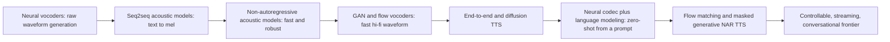

# Text-to-Speech: A Learning Roadmap

A ground-up reading path for text-to-speech (TTS) models — from the first neural vocoders and sequence-to-sequence acoustic models, through GAN/flow vocoders and fully end-to-end systems, to the paradigm shift where speech synthesis became a language-modeling problem over discrete audio codes, and on to today's flow-matching and masked-generative zero-shot systems. Papers linked via Hugging Face Papers; blogs included where they give the clearest intuition.

---

## The big idea

For decades, TTS meant **concatenative synthesis** (stitch together recorded speech fragments from one speaker) or **statistical parametric synthesis** (an HMM predicts acoustic features frame by frame, then a vocoder reconstructs a waveform) — both required heavy feature engineering and produced speech that was intelligible but not natural. Neural TTS replaced this with a single idea repeated at every stage of this roadmap: **learn the mapping directly from data**, first by splitting the problem into "text → intermediate acoustic representation" (an acoustic model) and "acoustic representation → waveform" (a vocoder), then increasingly collapsing that pipeline into one model. Two further shifts define the modern era: (1) representing audio as **discrete codec tokens** so TTS becomes a next-token-prediction task a language model can learn, exactly like text, and (2) replacing autoregressive/diffusion generation with **flow matching** and **masked generative** objectives that synthesize speech in one or a few non-autoregressive passes. Nearly every recent zero-shot TTS system ("clone this voice from a 3-second clip") is some combination of these two shifts.

---

## Stage 0 — Orientation blogs (skim first, ~1-2 hrs)

- [Hugging Face Audio Course — Unit 6: From Text to Speech](https://huggingface.co/learn/audio-course/chapter6/introduction) and its [Pre-trained models for text-to-speech](https://huggingface.co/learn/audio-course/chapter6/pre-trained_models) page — the best hands-on entry point: motivates the task, surveys SpeechT5/Bark/MMS-TTS, and links straight to runnable code. ★
- [Google DeepMind — WaveNet: A generative model for raw audio](https://deepmind.google/blog/wavenet-a-generative-model-for-raw-audio/) — the original announcement post; explains why modeling raw waveform samples one at a time was a radical departure from concatenative/parametric TTS. ★
- [Google Research — Tacotron 2: Generating Human-like Speech from Text](https://research.google/blog/tacotron-2-generating-human-like-speech-from-text/) — the clearest plain-English walkthrough of the "text → mel spectrogram → waveform" two-stage pipeline that defined neural TTS for years. ★
- [NLP Lab — State-of-the-art Zero-shot Speech Synthesis with VALL-E](https://nlplab.tech/blog/state-of-the-art-zero-shot-speech-synthesis-with-vall-e/) — a short, intuitive explanation of the paradigm shift at the center of Part III: treating TTS as language modeling over discrete codec tokens instead of continuous signal regression.
- [Voicebox demo page](https://voicebox.metademolab.com/) — worth a listen once you reach Part IV: hear what "non-autoregressive, flow-matching, in-context" TTS actually sounds like before reading the paper.

---

## Part I — The neural pipeline era: vocoders and acoustic models (2016–2020)

Early neural TTS split cleanly into two stages: an **acoustic model** that turns text into an intermediate representation (typically a mel spectrogram), and a **vocoder** that turns that representation into an audible waveform. This part follows both halves as they matured in parallel.

### Stage 1 — Autoregressive neural vocoders

| Paper | Date | Why read it |
| --- | --- | --- |
| [WaveNet: A Generative Model for Raw Audio](https://huggingface.co/papers/1609.03499) | 2016 | Models raw audio autoregressively, one sample at a time, with dilated causal convolutions — the paper that proved a neural network could beat concatenative/parametric TTS on naturalness; wiki: [[EMO]] and neighboring audio pages build on this lineage. ★ |
| **Parallel WaveNet: Fast High-Fidelity Speech Synthesis** (van den Oord et al., 2017) — arXiv [1711.10433](https://arxiv.org/abs/1711.10433) *(not yet indexed on Hugging Face Papers)* | 2017 | Distills WaveNet's slow, sample-by-sample autoregressive teacher into a fast, parallel-sampling inverse-autoregressive-flow student — the first sign that autoregressive vocoders' main problem (inference speed) was fixable without sacrificing quality. |
| [Efficient Neural Audio Synthesis](https://huggingface.co/papers/1802.08435) | 2018 | WaveRNN: replaces WaveNet's stacked dilated convolutions with a single, sparsified recurrent layer plus subscaling, showing high-fidelity autoregressive vocoding could run in real time on a phone CPU. |

### Stage 2 — Sequence-to-sequence acoustic models

| Paper | Date | Why read it |
| --- | --- | --- |
| [Tacotron: Towards End-to-End Speech Synthesis](https://huggingface.co/papers/1703.10135) | 2017 | The first attention-based seq2seq model to map characters directly to mel spectrograms, replacing the hand-engineered linguistic-feature pipelines that fed earlier vocoders. ★ |
| **Deep Voice: Real-time Neural Text-to-Speech** (Arik et al., 2017) — arXiv [1702.07825](https://arxiv.org/abs/1702.07825) *(not yet indexed on Hugging Face Papers)* | 2017 | An independent, contemporaneous "replace every classic TTS component with a neural network" pipeline (grapheme-to-phoneme, segmentation, duration/frequency prediction, vocoder) — worth reading alongside Tacotron as the road not fully taken (explicit multi-model pipeline vs. Tacotron's single attention-based seq2seq model). |
| [Natural TTS Synthesis by Conditioning WaveNet on Mel Spectrogram Predictions](https://huggingface.co/papers/1712.05884) | 2017 | Tacotron 2: pairs a cleaner Tacotron-style mel-spectrogram predictor with a WaveNet vocoder conditioned on those mels, reaching a MOS of 4.53 — within noise of professionally recorded human speech (4.58) — and becoming the reference two-stage neural TTS pipeline for years. ★ |
| [FastPitch: Parallel Text-to-speech with Pitch Prediction](https://huggingface.co/papers/2006.06873) | 2020 | Adds an explicit, controllable pitch-contour prediction path to a non-autoregressive acoustic model, bridging seq2seq acoustic modeling (this stage) and the parallel/non-AR models of Stage 3. |

### Stage 3 — Non-autoregressive acoustic models

Tacotron-style attention was prone to skipped/repeated words and could not be parallelized at inference. This stage replaces attention with an explicit, learned duration predictor.

| Paper | Date | Why read it |
| --- | --- | --- |
| [FastSpeech: Fast, Robust and Controllable Text to Speech](https://huggingface.co/papers/1905.09263) | 2019 | Replaces attention-based alignment with an explicit duration predictor and length regulator, generating all mel frames in parallel — up to 270x faster mel generation than Tacotron 2 and far more robust to word skipping/repeating. ★ |
| [FastSpeech 2: Fast and High-Quality End-to-End Text to Speech](https://huggingface.co/papers/2006.04558) | 2020 | Removes FastSpeech's teacher-distillation step and trains directly on ground-truth targets (duration, pitch, energy) extracted with forced alignment, simplifying training while improving quality. ★ |
| [Glow-TTS: A Generative Flow for Text-to-Speech via Monotonic Alignment Search](https://huggingface.co/papers/2005.11129) | 2020 | Learns text-to-mel alignment and duration jointly via a normalizing flow and a dynamic-programming monotonic alignment search, removing the need for an external duration teacher entirely — a first bridge to the flow-based generative models of Part II. ★ |

### Stage 4 — GAN and flow vocoders

In parallel, vocoders moved off slow autoregressive sampling toward feed-forward generation, first via normalizing flows, then GANs.

| Paper | Date | Why read it |
| --- | --- | --- |
| [WaveGlow: A Flow-based Generative Network for Speech Synthesis](https://huggingface.co/papers/1811.00002) | 2018 | Combines Glow-style normalizing flows with WaveNet-like dilated convolutions for single-pass, non-autoregressive waveform generation — fast, but with a large parameter count. |
| [MelGAN: Generative Adversarial Networks for Conditional Waveform Synthesis](https://huggingface.co/papers/1910.06711) | 2019 | First GAN vocoder to match autoregressive quality without a likelihood-based loss or perceptual-loss network, using a multi-scale discriminator — establishing GANs as viable, fast vocoders. |
| [Parallel WaveGAN: A fast waveform generation model based on generative adversarial networks with multi-resolution spectrogram](https://huggingface.co/papers/1910.11480) | 2019 | Combines a multi-resolution STFT auxiliary loss with adversarial training in a compact, non-autoregressive convolutional generator, closing much of the quality gap to autoregressive vocoders at a fraction of the parameters. |
| [HiFi-GAN: Generative Adversarial Networks for Efficient and High Fidelity Speech Synthesis](https://huggingface.co/papers/2010.05646) | 2020 | Adds multi-period discriminators that specifically model the periodic structure of speech waveforms, becoming the de facto standard fast, high-fidelity GAN vocoder used across the field for years afterward. ★ |
| [UnivNet: A Neural Vocoder with Multi-Resolution Spectrogram Discriminators for High-Fidelity Waveform Generation](https://huggingface.co/papers/2106.07889) | 2021 | Adds multi-resolution spectrogram discriminators on top of HiFi-GAN-style generators to specifically fix over-smoothed spectral detail, a common GAN-vocoder failure mode. |
| [BigVGAN: A Universal Neural Vocoder with Large-Scale Training](https://huggingface.co/papers/2206.04658) | 2022 | Scales the HiFi-GAN recipe up with a periodic activation function and much larger-scale training, producing a single universal vocoder that generalizes well to unseen speakers/singers/instruments out of the box. ★ |

---

## Part II — Toward end-to-end and probabilistic TTS (2020–2023)

### Stage 5 — Diffusion for speech

Diffusion's "iterative denoising" framing (see the wiki's [[Denoising Diffusion Probabilistic Models]]) reached speech almost as soon as it reached images, applied both to waveform generation and directly to mel-spectrogram acoustic modeling.

| Paper | Date | Why read it |
| --- | --- | --- |
| [WaveGrad: Estimating Gradients for Waveform Generation](https://huggingface.co/papers/2009.00713) | 2020 | Applies score-based/diffusion generative modeling directly to raw waveform vocoding, trading the GAN-vocoder's adversarial training instability for a stable denoising objective. |
| [DiffWave: A Versatile Diffusion Model for Audio Synthesis](https://huggingface.co/papers/2009.09761) | 2020 | An independent, contemporaneous diffusion vocoder that also works unconditionally (not just as a mel-conditioned vocoder), reaching quality competitive with the best adversarial and autoregressive vocoders of the time. ★ |
| **Diff-TTS: A Denoising Diffusion Model for Text-to-Speech** (Jeong et al., 2021) — arXiv [2104.01409](https://arxiv.org/abs/2104.01409) *(not yet indexed on Hugging Face Papers)* | 2021 | One of the first to apply the diffusion objective to the acoustic model itself (text → mel), rather than only to vocoding, moving diffusion up a level in the TTS pipeline. |
| [Grad-TTS: A Diffusion Probabilistic Model for Text-to-Speech](https://huggingface.co/papers/2105.06337) | 2021 | Frames mel-spectrogram generation as a diffusion process guided by a learned, data-dependent prior (not pure noise), with a tunable number of reverse steps trading speed for quality — the reference diffusion acoustic model; see also [Diffusion Models: A Learning Roadmap](diffusion-models-2026-07-21.md). ★ |

### Stage 6 — Fully end-to-end TTS

Rather than training an acoustic model and a vocoder separately and gluing them together (with the mismatch that implies), this stage trains one model, text-in to waveform-out, end to end.

| Paper | Date | Why read it |
| --- | --- | --- |
| [Conditional Variational Autoencoder with Adversarial Learning for End-to-End Text-to-Speech](https://huggingface.co/papers/2106.06103) | 2021 | VITS: combines a VAE, normalizing flows for expressive alignment, and adversarial training into a single model trained jointly end-to-end from text to waveform, with stochastic duration modeling that gives natural rhythm variation for free. ★★ |
| [YourTTS: Towards Zero-Shot Multi-Speaker TTS and Zero-Shot Voice Conversion for everyone](https://huggingface.co/papers/2112.02418) | 2021 | Extends the VITS-style end-to-end recipe to zero-shot multi-speaker and multilingual synthesis using speaker embeddings, an early and influential open zero-shot voice-cloning baseline. |
| [StyleTTS: A Style-Based Generative Model for Natural and Diverse Text-to-Speech Synthesis](https://huggingface.co/papers/2205.15439) | 2022 | Introduces an explicit, transferable "style" latent (prosody, speaker identity) predicted from reference audio and injected throughout an end-to-end synthesizer via style-adaptive layer norm. |
| [NaturalSpeech: End-to-End Text to Speech Synthesis with Human-Level Quality](https://huggingface.co/papers/2205.04421) | 2022 | Pushes the VITS-style end-to-end recipe further with a bidirectional prior/posterior and differentiable duration modeling, reporting the first statistically indistinguishable-from-human-recording MOS on a benchmark. |
| [StyleTTS 2: Towards Human-Level Text-to-Speech through Style Diffusion and Adversarial Training with Large Speech Language Models](https://huggingface.co/papers/2306.07691) | 2023 | Upgrades StyleTTS's style vector to be diffusion-sampled rather than deterministically predicted, and adds adversarial training against embeddings from large pretrained speech language models — reaching human-level naturalness on single-speaker benchmarks without a reference audio prompt at inference. ★ |

---

## Part III — The paradigm shift: neural codecs and TTS as language modeling (2021–2025)

Everything above generates a *continuous* acoustic representation (mel spectrograms or raw samples). This part instead compresses speech into **discrete tokens** via a neural codec, which means a plain autoregressive language model — the same architecture family driving text LLMs — can be trained to predict speech tokens directly. This is the single biggest architectural shift in the roadmap: TTS stops being a signal-regression problem and becomes a sequence-modeling problem.

### Stage 7 — Neural audio codecs

| Paper | Date | Why read it |
| --- | --- | --- |
| [SoundStream: An End-to-End Neural Audio Codec](https://huggingface.co/papers/2107.03312) | 2021 | Learns to compress audio into a small set of discrete tokens via residual vector quantization (RVQ) inside an end-to-end trained encoder-decoder, at bitrates far below traditional codecs while matching or beating their perceptual quality — the direct ancestor of every codec-language-model TTS system below. |
| [High Fidelity Neural Audio Compression](https://huggingface.co/papers/2210.13438) | 2022 | EnCodec: refines SoundStream's RVQ-codec recipe with a multi-scale spectrogram adversarial loss and a lightweight sequential model over the codes themselves, becoming the most widely reused off-the-shelf codec (e.g. VALL-E, MusicGen). ★ |
| [WavTokenizer: an Efficient Acoustic Discrete Codec Tokenizer for Audio Language Modeling](https://huggingface.co/papers/2408.16532) | 2024 | Pushes codec efficiency further, targeting a single, small codebook (rather than several RVQ layers) specifically to make downstream language-model sequences shorter and easier to model — a direct response to the "how many codebooks/tokens per second" bottleneck codec-LM TTS systems all inherit from Stage 7's earlier codecs. |

### Stage 8 — Audio and speech as a language-modeling target

| Paper | Date | Why read it |
| --- | --- | --- |
| [AudioLM: a Language Modeling Approach to Audio Generation](https://huggingface.co/papers/2209.03143) | 2022 | Establishes the general recipe reused throughout this Part: tokenize audio (both coarse "semantic" tokens from a self-supervised model and fine acoustic tokens from a codec), then train a hierarchy of transformer language models to autoregressively predict them, generating audio continuations with long-term consistency it wasn't explicitly trained for. ★ |
| [SpeechT5: Unified-Modal Encoder-Decoder Pre-Training for Spoken Language Processing](https://huggingface.co/papers/2110.07205) | 2021 | Unifies speech and text into a single shared encoder-decoder pretrained across both modalities, so the same backbone handles ASR, TTS, and more — the model the Hugging Face Audio Course's Stage 0 unit builds its hands-on TTS exercise around. |
| [Neural Codec Language Models are Zero-Shot Text to Speech Synthesizers](https://huggingface.co/papers/2301.02111) | 2023 | VALL-E: trains an autoregressive + non-autoregressive pair of transformers to predict EnCodec tokens conditioned on phonemes and a 3-second acoustic prompt, reframing TTS as *conditional language modeling* — a single model clones a voice in-context from a short prompt, no fine-tuning required. The paper that triggered this entire Part. ★★ |
| [Speak, Read and Prompt: High-Fidelity Text-to-Speech with Minimal Supervision](https://huggingface.co/papers/2302.03540) | 2023 | SPEAR-TTS: splits generation into "read" (text → semantic tokens) and "speak" (semantic → acoustic tokens) stages and shows the speak stage can be trained with very little paired text-speech data by leveraging a large pool of speech-only audio — an early attempt at reducing the paired-data hunger of codec-LM TTS. |
| [Speak Foreign Languages with Your Own Voice: Cross-Lingual Neural Codec Language Modeling](https://huggingface.co/papers/2303.03926) | 2023 | VALL-E X: extends VALL-E's in-context voice cloning across languages, synthesizing speech in a different language from the prompt while preserving the speaker's voice, emotion, and accent-consistency trade-offs. |
| [Better speech synthesis through scaling](https://huggingface.co/papers/2305.07243) | 2023 | Tortoise-TTS: an independently developed, large-scale autoregressive codec-LM TTS system (predating wide awareness of VALL-E's approach) that popularized applying image-generation-style scaling and autoregressive-transformer-plus-diffusion-decoder tricks to open, community-run TTS. |

### Stage 9 — Scaling and productionizing codec-language-model TTS

| Paper | Date | Why read it |
| --- | --- | --- |
| [Mega-TTS: Zero-Shot Text-to-Speech at Scale with Intrinsic Inductive Bias](https://huggingface.co/papers/2306.03509) | 2023 | Argues speech attributes should be *disentangled* (content modeled autoregressively, timbre/prosody modeled with separate, more suitable inductive biases) rather than dumped into one flat token stream — a design critique that recurs in several systems below. |
| [Mega-TTS 2: Zero-Shot Text-to-Speech with Arbitrary Length Speech Prompts](https://huggingface.co/papers/2307.07218) | 2023 | Extends Mega-TTS to condition on acoustic prompts of arbitrary length (not just a few seconds), and introduces multi-reference timbre encoding plus a duration-model transformer to improve prosody transfer. |
| [XTTS: a Massively Multilingual Zero-Shot Text-to-Speech Model](https://huggingface.co/papers/2406.04904) | 2024 | Coqui's widely deployed open multilingual zero-shot TTS system, notable for the practical engineering (16 languages, streaming-friendly decoder, permissively documented training recipe) that made codec-LM-style TTS usable in real open-source products. |
| [CLaM-TTS: Improving Neural Codec Language Model for Zero-Shot Text-to-Speech](https://huggingface.co/papers/2404.02781) | 2024 | Introduces a codec designed to compress many RVQ codebooks into fewer, higher-information tokens and a latent language model over them, directly targeting Stage 7's "too many tokens per second" bottleneck within the codec-LM framework. |
| [Seed-TTS: A Family of High-Quality Versatile Speech Generation Models](https://huggingface.co/papers/2406.02430) | 2024 | ByteDance's production-scale codec-LM TTS family, reporting human-level naturalness and speaker similarity at scale plus a diffusion-based variant and detailed self-critique of remaining failure modes — a useful "state of practice" checkpoint for the whole Part. ★ |
| [VALL-E 2: Neural Codec Language Models are Human Parity Zero-Shot Text to Speech Synthesizers](https://huggingface.co/papers/2406.05370) | 2024 | Fixes VALL-E's tendency toward unstable, repetitive, or skipped output with repetition-aware sampling and grouped code modeling, reporting the first human-parity results on LibriSpeech/VCTK for a codec-LM TTS system. |
| [Autoregressive Speech Synthesis without Vector Quantization](https://huggingface.co/papers/2407.08551) | 2024 | MELLE: keeps VALL-E's autoregressive language-model framing but predicts continuous mel-spectrogram frames directly instead of discrete codec tokens, arguing quantization itself (not autoregression) was the main fidelity bottleneck. |
| [CosyVoice: A Scalable Multilingual Zero-shot Text-to-speech Synthesizer based on Supervised Semantic Tokens](https://huggingface.co/papers/2407.05407) | 2024 | Replaces unsupervised codec tokens with tokens derived from a supervised ASR-style encoder ("supervised semantic tokens"), improving content accuracy and cross-lingual transfer for a codec-LM TTS system. |
| [CosyVoice 2: Scalable Streaming Speech Synthesis with Large Language Models](https://huggingface.co/papers/2412.10117) | 2024 | Reworks CosyVoice into a streaming-capable system with a finite-scalar-quantization tokenizer and chunk-aware causal decoding, closing the gap between codec-LM TTS quality and the low-latency demands of real conversational use. |
| [Fish-Speech: Leveraging Large Language Models for Advanced Multilingual Text-to-Speech Synthesis](https://huggingface.co/papers/2411.01156) | 2024 | An openly released, dual-autoregressive-transformer multilingual codec-LM TTS system with a lightweight dual-tokenizer design, notable for being one of the more accessible and widely self-hosted systems in this stage. |
| [IndexTTS: An Industrial-Level Controllable and Efficient Zero-Shot Text-To-Speech System](https://huggingface.co/papers/2502.05512) | 2025 | Documents the concrete engineering fixes (character/pinyin hybrid modeling for Chinese, a conformer-based codec, duration control) needed to take a VALL-E/CosyVoice-style architecture from a research demo to an industrial deployment. |
| [Llasa: Scaling Train-Time and Inference-Time Compute for Llama-based Speech Synthesis](https://huggingface.co/papers/2502.04128) | 2025 | Builds TTS directly on an off-the-shelf Llama backbone and single-codebook codec, then studies how both more training compute and more inference-time compute (sampling/verification) trade off against speech quality — bringing LLM-style scaling-law thinking explicitly into TTS. |
| [Spark-TTS: An Efficient LLM-Based Text-to-Speech Model with Single-Stream Decoupled Speech Tokens](https://huggingface.co/papers/2503.01710) | 2025 | Decouples speech into a single stream of coarse (linguistic) and fine (acoustic) tokens predicted by one LLM in sequence, simplifying the multi-codebook/multi-stage designs common elsewhere in this stage while retaining zero-shot voice cloning and voice-attribute control. |
| [CosyVoice 3: Towards In-the-wild Speech Generation via Scaling-up and Post-training](https://huggingface.co/papers/2505.17589) | 2025 | Scales CosyVoice's training data to noisy, "in-the-wild" speech and adds an RLHF-style post-training stage, treating TTS post-training as analogous to text-LLM alignment — a sign of how far the LLM-methodology transfer in this Part has gone. |

---

## Part IV — Non-autoregressive generative TTS: flow matching and masked generation (2023–2024)

Codec-language-model TTS (Part III) is autoregressive: generation is inherently sequential and slow. This part instead borrows flow matching and masked generative modeling — both already covered for images/text in [Diffusion Models: A Learning Roadmap](diffusion-models-2026-07-21.md) — to synthesize speech in one or a handful of *parallel* passes, without sacrificing the zero-shot in-context cloning that made Part III's systems compelling.

### Stage 10 — Latent diffusion and flow matching for speech

| Paper | Date | Why read it |
| --- | --- | --- |
| [NaturalSpeech 2: Latent Diffusion Models are Natural and Zero-Shot Speech and Singing Synthesizers](https://huggingface.co/papers/2304.09116) | 2023 | Replaces discrete codec tokens with a *continuous* latent vector predicted by a diffusion model (conditioned on a duration/pitch predictor), arguing quantization loses acoustic detail that continuous latents can preserve, while keeping in-context zero-shot prompting. ★ |
| [Matcha-TTS: A fast TTS architecture with conditional flow matching](https://huggingface.co/papers/2309.03199) | 2023 | Applies flow matching (rather than diffusion's stochastic reverse process) directly to a compact acoustic model, reaching high quality in far fewer sampling steps than diffusion-based acoustic models like Grad-TTS. |
| [Voicebox: Text-Guided Multilingual Universal Speech Generation at Scale](https://huggingface.co/papers/2306.15687) | 2023 | Trains a large, multilingual, non-autoregressive flow-matching model on infilling (predict masked audio spans given surrounding audio and text) — a single model that does zero-shot TTS, denoising, editing, and style transfer, 20x faster than comparable autoregressive systems. ★ |
| [NaturalSpeech 3: Zero-Shot Speech Synthesis with Factorized Codec and Diffusion Models](https://huggingface.co/papers/2403.03100) | 2024 | Factorizes speech into separate content/prosody/timbre/acoustic-detail codec subspaces, each modeled by its own diffusion process, so attributes can be controlled or transferred independently rather than entangled in one token stream. |
| [E2 TTS: Embarrassingly Easy Fully Non-Autoregressive Zero-Shot TTS](https://huggingface.co/papers/2406.18009) | 2024 | Strips Voicebox-style flow matching down to its simplest possible form (no explicit duration/phoneme alignment model at all — the network just infills masked mel frames), showing surprisingly little architectural machinery is actually necessary. |
| [F5-TTS: A Fairytaler that Fakes Fluent and Faithful Speech with Flow Matching](https://huggingface.co/papers/2410.06885) | 2024 | Builds on E2 TTS's simplicity with a Diffusion-Transformer-style backbone (see [Diffusion Models roadmap, Stage 4](diffusion-models-2026-07-21.md)) and ConvNeXt text-alignment blocks, reaching state-of-the-art speed/quality among openly released flow-matching TTS systems. ★ |

### Stage 11 — Masked generative TTS

| Paper | Date | Why read it |
| --- | --- | --- |
| [MaskGCT: Zero-Shot Text-to-Speech with Masked Generative Codec Transformer](https://huggingface.co/papers/2409.00750) | 2024 | Applies MaskGIT-style iterative masked-token prediction (predict all masked codec tokens in parallel, keep the most confident, remask the rest, repeat) to TTS — a non-autoregressive alternative to both Part III's left-to-right codec-LM decoding and Part IV's continuous flow matching, without needing explicit text-speech alignment. ★ |

---

## Part V — Controllable, streaming, and conversational frontier

The final open problems layer on top of everything above: giving fine-grained *instructable* control over how speech sounds, running synthesis with conversational latency, and merging TTS with full-duplex spoken dialogue.

| Paper | Date | Why read it |
| --- | --- | --- |
| [Natural language guidance of high-fidelity text-to-speech with synthetic annotations](https://huggingface.co/papers/2402.01912) | 2024 | Parler-TTS: trains a codec-LM TTS system to follow free-text style descriptions ("a woman speaks slowly in a calm, low-pitched voice") by synthetically generating style captions for training audio, turning voice/prosody control into a prompting problem. |
| [VoiceCraft: Zero-Shot Speech Editing and Text-to-Speech in the Wild](https://huggingface.co/papers/2403.16973) | 2024 | Extends codec-LM TTS to *speech editing* — inserting/replacing words in an existing recording while preserving the surrounding audio and speaker identity — via a causal-masking training trick, not just generating from scratch. |
| [Moshi: a speech-text foundation model for real-time dialogue](https://huggingface.co/papers/2410.00037) | 2024 | Merges TTS with full-duplex spoken dialogue: a single model jointly models a user's and its own speech stream (plus an inner text "thought" stream) so it can listen and speak simultaneously without a separate turn-taking mechanism — directly relevant to the wiki's [[Full-Duplex Voice]] and [[GPT-Live]] pages. |
| [Step-Audio: Unified Understanding and Generation in Intelligent Speech Interaction](https://huggingface.co/papers/2502.11946) | 2025 | A unified speech understanding-and-generation system aimed at production voice-assistant interaction, illustrating how far TTS has merged into general spoken-dialogue systems rather than remaining a standalone "text in, audio out" module. |
| [Long-Form Speech Generation with Spoken Language Models](https://huggingface.co/papers/2412.18603) | 2024 | Tackles a problem most benchmarks in this roadmap sidestep — generating minutes-long, coherent speech (audiobooks, podcasts) — where autoregressive codec-LM systems tend to drift or degrade, proposing training and inference fixes specific to long-form generation. |

For the current production frontier of instructable, real-time, and full-duplex speech, see the wiki's [[Speaking of Voxtral]] (Mistral's 4B flow-matching TTS model), [[Gemini 3.1 Flash TTS]] (audio tags, 70+ languages), [[GPT-Live]] and [[Full-Duplex Voice]] (continuous-listening conversational voice), and [[Grok Models]]' voice API sections.

---

## Surveys (orient, or go deeper on any Part)

- [Towards Controllable Speech Synthesis in the Era of Large Language Models: A Systematic Survey](https://huggingface.co/papers/2412.06602) (Dec 2024) — the most direct survey counterpart to this roadmap's Parts III-V, taxonomizing controllable-TTS methods specifically through the lens of the LLM/codec-LM paradigm shift. ★
- [Recent Advances in Speech Language Models: A Survey](https://huggingface.co/papers/2410.03751) (Oct 2024) — surveys the broader "speech as a language-modeling target" family (Part III) including systems that go beyond pure TTS into spoken dialogue.
- [Towards Robust Neural Vocoding for Speech Generation: A Survey](https://arxiv.org/abs/1912.02461) (Dec 2019) — an early, thorough survey of the vocoder landscape (Part I, Stage 1 and 4) from just before GAN vocoders took over; useful for the historical framing of what problems HiFi-GAN and successors were solving.

---

## Suggested paths

**Fast track** (~7 papers to get the full pipeline → codec-LM → flow-matching arc):

1. Stage 0 primer — [Hugging Face Audio Course Unit 6](https://huggingface.co/learn/audio-course/chapter6/introduction).
2. [WaveNet](https://huggingface.co/papers/1609.03499) — the founding neural vocoder.
3. [Natural TTS Synthesis by Conditioning WaveNet on Mel Spectrogram Predictions](https://huggingface.co/papers/1712.05884) (Tacotron 2) — the classic two-stage pipeline.
4. [HiFi-GAN](https://huggingface.co/papers/2010.05646) — the fast, high-fidelity vocoder that stuck around for years.
5. [Conditional VAE with Adversarial Learning for End-to-End TTS](https://huggingface.co/papers/2106.06103) (VITS) — the fully end-to-end synthesis of Stages 1-3.
6. [Neural Codec Language Models are Zero-Shot Text to Speech Synthesizers](https://huggingface.co/papers/2301.02111) (VALL-E) — the paradigm shift to codec-LM TTS.
7. [F5-TTS](https://huggingface.co/papers/2410.06885) — the modern non-autoregressive, flow-matching alternative.

**Full ground-up**: follow Stage 0, then Part I (Stages 1-4), Part II (Stages 5-6), Part III (Stages 7-9), Part IV (Stages 10-11), then Part V in order.

---

## Related

- [Diffusion Models: A Learning Roadmap](diffusion-models-2026-07-21.md) — Stage 5's diffusion acoustic/vocoder models and Part IV's flow-matching TTS are direct applications of that roadmap's Stages 1 and 5 machinery to the speech modality; F5-TTS (Stage 10 above) reuses the DiT backbone from that roadmap's Stage 4.
- [Looped Transformers: A Learning Roadmap](looped-transformers-2026-07-21.md) — the masked/iterative-refinement decoding used by MaskGCT (Stage 11) is structurally the same "reuse compute via iteration" bet this roadmap covers for language models.
- [Reasoning in LLMs: A Literature Review](reasoning-2026-07-21.md) — Llasa (Stage 9) applies this review's inference-time-compute-scaling framing directly to speech synthesis.
- [[Audio Models]] — the wiki's topic hub for speech/audio pages; mostly covers ASR and voice-assistant products today, which this roadmap complements with the classic TTS synthesis lineage.
- [[Speaking of Voxtral]], [[Gemini 3.1 Flash TTS]], [[GPT-Live]], [[Full-Duplex Voice]], [[Grok Models]] — wiki pages on the current production TTS/voice frontier discussed in Part V.
- [[EMO]] — wiki page in the WaveNet/generative-audio lineage referenced in Stage 1.
