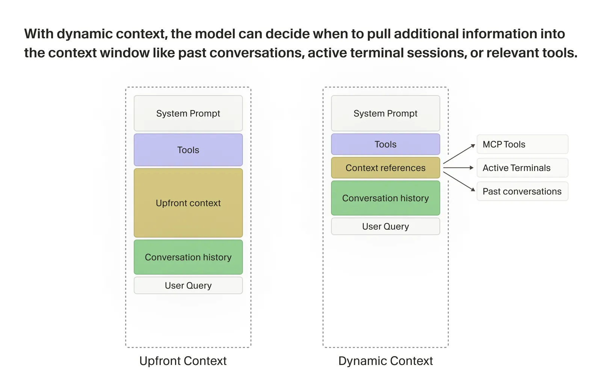
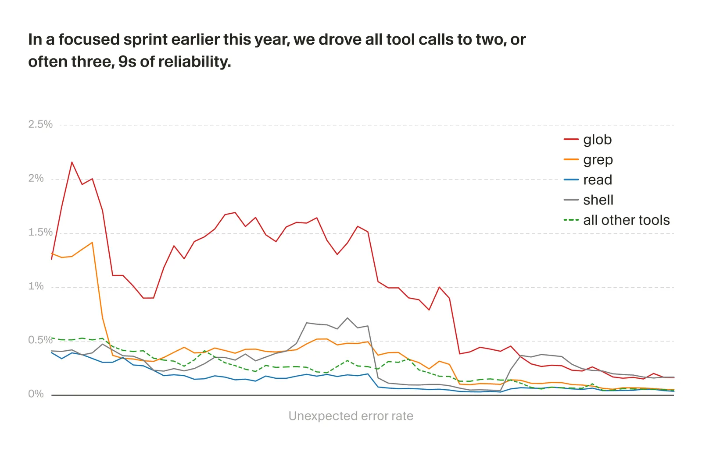
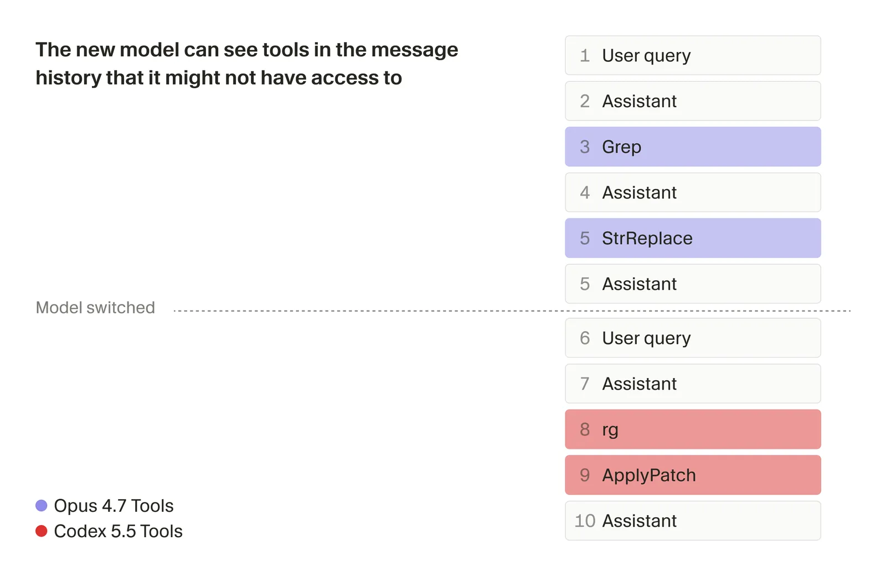

# Continually Improving Our Agent Harness

#summary #topic

Cursor's research-blog post argues that a coding agent's quality is determined by the model and the [[Agent Harness]] together, and that most harness progress is "obsessively stacking small optimizations" rather than step-change ideas. The post traces how Cursor's harness has shifted from heavy static context and guardrails toward dynamic context, describes the online and offline measurement stack used to evaluate harness changes, explains how tool-call reliability is monitored and repaired, and lays out how the harness is customized per model and per session, including for mid-chat model switching and emerging multi-agent orchestration.

Source: [Continually improving our agent harness](https://cursor.com/blog/continually-improving-agent-harness) by Stefan Heule and Jediah Katz on the Cursor research blog, published April 30, 2026. Canonical raw sources: `raw/continually-improving-agent-harness/full-article.md` (downloaded HTML) and `raw/continually-improving-agent-harness/full-article.md` (markdown export). Article figures saved to `raw/continually-improving-agent-harness/images/` with light and dark variants and mirrored to `wiki/assets/continually-improving-agent-harness/`.

## Methodology Frame

The article opens with the team's working philosophy: build the harness like a product, drive from a vision of the ideal agent experience, then run experiments backed by evals and real-usage signals. Early access to new models is described as the moment when vision, evals, and online experiments converge — the team spends weeks fitting the harness to a model's strengths and quirks until the tuned model-harness combination is "noticeably faster, smarter, and more efficient" than the same model in a generic harness. This framing is what justifies the post's central claim: harness work is not auxiliary to model work, it is what turns a model into a usable coding agent.

## Evolving The Context Window

The harness's core job is to populate and manage the context window: system prompt, tool descriptions, conversation state, and user request. Cursor's late-2024 agent leaned heavily on static context and guardrails because models were poor at choosing their own context. Examples cited include surfacing lint and type errors after every edit, rewriting file reads when the agent requested too few lines, capping tools per turn, and shipping the folder layout, semantically-matched code snippets, and compressed user-attached files at the start of every session.

Almost all of that has been removed. The current harness keeps a small static slice (operating system, git status, current and recently viewed files) and pushes the rest into [[Dynamic Context]] retrieval driven by the agent itself. The model can now decide when to pull past conversations, active terminal sessions, or relevant tools, and the team's ongoing work is to expand the surface of dynamic-context affordances rather than to script context up front. This shift connects directly to [[Long Context]] and to [[Papers Explained 445 - Context Rot]], because dynamic context is in part a response to the observation that more text in context does not always mean more capability.

## Two Ways Of Assessing Harness Changes

Cursor evaluates harness changes through layered measurement. Public benchmarks plus an internal eval suite, [[CursorBench]], give a fast offline read on quality and let the team compare versions over time. But because benchmarks only approximate real usage, the team also runs online experiments where two or more harness variants are A/B tested on production traffic.

Online experiments produce two kinds of signals. Operational metrics — latency, token efficiency, tool-call count, cache-hit rate — are directionally useful but cannot tell whether the agent did a good job. To capture quality, Cursor relies on two outcome signals:

1. **Keep Rate** — the fraction of agent-proposed code changes that survive in the user's codebase after fixed time windows. A low keep rate flags places where users had to rewrite, reroll, or correct the agent.
2. **LLM-judged user-response semantics** — a model reads the user's reply to the agent's initial output and infers satisfaction. A user moving on to the next feature is a strong positive signal. A user pasting a stack trace is a strong negative signal.

The article gives one concrete example of this pipeline shelving an idea: a more expensive context-summarization model produced negligible quality gains, so it was dropped despite seeming promising offline.

## Tracking And Repairing Degradations

As models, tools, and providers multiply, harness state space grows and bugs become harder to spot. Tools are called out as the broadest bug surface, in part because tool-call errors compound — failed calls remain in the transcript, waste tokens, and induce [[Context Rot]] where accumulated mistakes degrade subsequent decisions. Sometimes a failed tool call sends an agent off the rails entirely.

To detect this, Cursor classifies tool-call errors:

- **Unknown errors** are always treated as bugs and alert when their per-tool rate exceeds a fixed threshold.
- **Expected errors** (model mistakes, missing files, vendor outages) are bucketed into categories such as `InvalidArguments`, `UnexpectedEnvironment`, `ProviderError`, `UserAborted`, and `Timeout`. Anomaly-detection alerts fire when these significantly exceed per-tool, per-model baselines, because different models err at different rates.

Two operational pieces sit on top of this:

- A **weekly automation** runs a skill that searches logs, surfaces new or recently spiked issues, and creates or updates Linear tickets with an investigation.
- **Cloud Agents** kick off fixes for many issues in parallel and can be triggered from Linear, instantiating what the post calls an automated "software factory" for the harness.

A focused sprint earlier in 2026 drove all tool calls to two or often three nines of reliability and cut unknown tool-call errors by an order of magnitude.

## Customizing The Harness For Different Models

Harness abstractions are model-agnostic, and the actual prompts, tool formats, and behaviors are heavily customized. The post gives explicit examples:

- OpenAI models are trained on a patch-based edit format, while Anthropic models are trained on string replacement. Either model could in principle use either format, but giving a model the unfamiliar tool wastes reasoning tokens and produces more mistakes — so each model is provisioned with the tool format it saw during training.
- Customization extends to prompt voice. OpenAI models tend to be literal and precise about instruction following; Claude is more intuitive and tolerant to imprecise instructions. Different model versions get different prompt variants.

For a new model under early access, the team forks the closest existing model's harness and iterates: offline evals, internal dogfooding, and prompt and tool tweaks until the combination is shippable. Some adjustments mitigate genuine model quirks, including a behavior the team named **context anxiety**: as the context window filled, one model started refusing work and hedging that the task was too big. The harness reduced the behavior with prompt adjustments rather than by hoping the model would unlearn it.

## Facilitating Mid-Chat Model Switching

Mid-chat model switching is hard because the transcript was produced by a different model with a different prompt and tool shape than the new one. When the user switches, Cursor swaps to the appropriate harness variant, but the new model still has to act on an out-of-distribution conversation history.

Two main mitigations are described:

- **Custom takeover instructions** explicitly tell the model that it is taking over mid-chat from another model and steer it away from calling tools that appear in the history but are not in its own tool set.
- **Optional summarization at switch time** trades cache continuity for cleanliness. Caches are provider- and model-specific, so a switch is a guaranteed cache miss, and a summary lets the new model start from a compact history. The trade-off is that long, complex tasks risk losing important detail in the summary, which is why Cursor's general advice is to stay on one model for the duration of a conversation unless there is a clear reason to switch.

The article's preferred sidestep is to launch a **subagent** with a fresh context window for the new model, and notes that the harness now lets users explicitly request a subagent run with a particular model.

## The Harness And The Future Of Software Development

The post closes by predicting that AI-assisted software engineering will be multi-agent: planning, fast edits, debugging, and other subtasks routed to specialized agents and subagents. The orchestration logic — choosing which agent to dispatch, framing the task for that agent, and stitching results back into a coherent workflow — lives in the harness rather than in any single agent. This makes harness engineering more critical going forward, not less, even as individual models improve.

## Key Claims

- The harness and the model jointly determine agent quality; harness work is what turns a strong model into a usable coding agent, especially around early-access launches.
- Static context and guardrails were a 2024 necessity but are mostly retired; the modern Cursor harness leans on dynamic context the agent fetches itself, plus a thin static base.
- Operational metrics like latency, token efficiency, tool calls, and cache hits are necessary but insufficient; quality is captured by Keep Rate and by LLM-judged user-response semantics.
- Tool errors are a primary degradation surface because failures linger in context and cause [[Context Rot]]; classifying expected vs. unknown errors and alerting on per-tool, per-model baselines is core to harness reliability.
- An order-of-magnitude reduction in unknown tool-call errors was achieved in a single sprint, and most tools were driven to two or three nines of reliability.
- Per-model customization is deep: tool formats matched to training distributions, per-model and per-version prompt variants, and quirk-mitigation prompts (e.g., reducing "context anxiety").
- Mid-chat switching costs a cache miss, risks tool drift, and can lose detail through summarization; subagents with fresh context are the preferred sidestep, and Cursor now exposes user-requested model-specific subagents.
- Multi-agent orchestration is forecast as the dominant pattern, and that orchestration is fundamentally a harness problem.

## Figures

| Figure | Caption | Section |
|--------|---------|---------|
|  | With dynamic context, the model can decide when to pull additional information into the context window like past conversations, active terminal sessions, or relevant tools. | Evolving the context window |
|  | In a focused sprint earlier this year, we drove all tool calls to at least 2 or often 3 9s of reliability. | Tracking and repairing degradations |
|  | Preventing models from calling tools that aren't in its toolset. | Facilitating mid-chat model switching |

Dark-mode variants are saved next to each figure as `fig-N-dark.png`.

## Entities And Concepts Introduced

- [[Agent Harness]] — the product layer the entire article is about.
- [[CursorBench]] — Cursor's internal eval suite (also referenced from [[Papers Explained - Composer 2]]).
- [[Dynamic Context]] — context the agent retrieves on demand rather than receiving up front.
- [[Keep Rate]] — fraction of agent-generated code that survives in the user's codebase after a time window.
- [[Tool Call Reliability]] — practice of measuring per-tool, per-model error baselines and alerting on anomalies.
- [[Context Anxiety]] — Cursor-coined name for a model behavior where filling context triggers refusals and hedging.

## Questions And Gaps

- The post does not specify which models exhibited "context anxiety" or quote the exact prompt fix.
- "Two or three nines" is given as a band rather than a per-tool table, so it is unclear which tools are at 99% vs. 99.9%.
- Keep Rate intervals ("fixed intervals of time") are not enumerated, so the analysis horizon is not pinned down.
- The relationship between CursorBench and the Composer 2 numbers reported elsewhere is implied but not made explicit; the article does not state whether harness changes affect CursorBench scores reported with Composer releases.
- The mid-chat summarization mechanism is described qualitatively; no diff or quality table is shown.

## Related

- [[Agent Harness]]
- [[Agentic AI]]
- [[Code Models]]
- [[Long Context]]
- [[Evaluation and Benchmarks]]
- [[Papers Explained - Composer 2]]
- [[Papers Explained 445 - Context Rot]]
- [[Papers Explained 547 - Terminal-Bench]]
- [[Dynamic Context]]
- [[CursorBench]]
- [[Keep Rate]]
- [[Introducing Cursor Router]]
- [[Cursor Router]]
- [[Dynamic Tool Calling]]
- [[Tool Call Reliability]]
- [[Context Rot]]
- [[Context Anxiety]]
