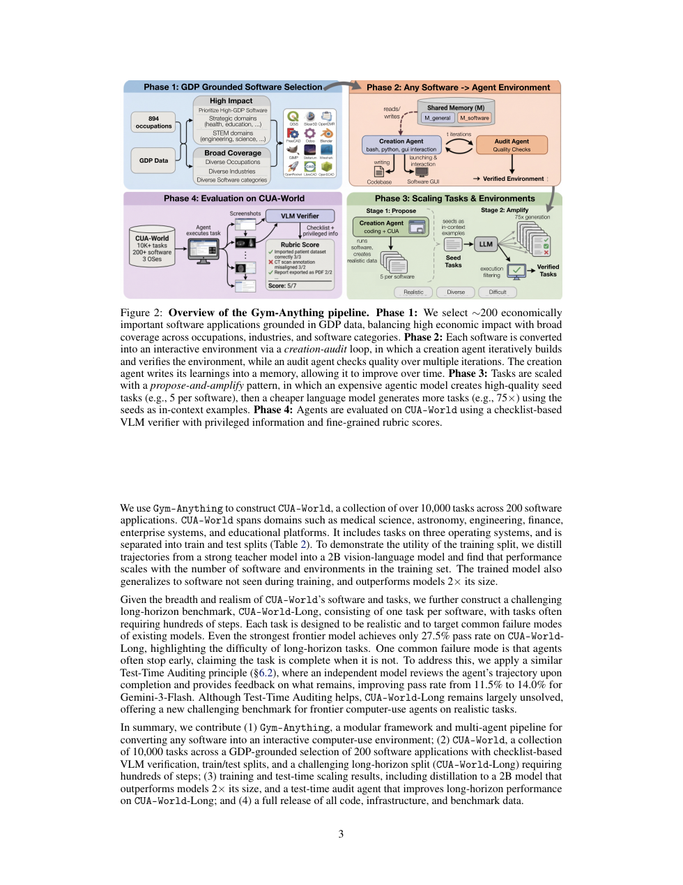
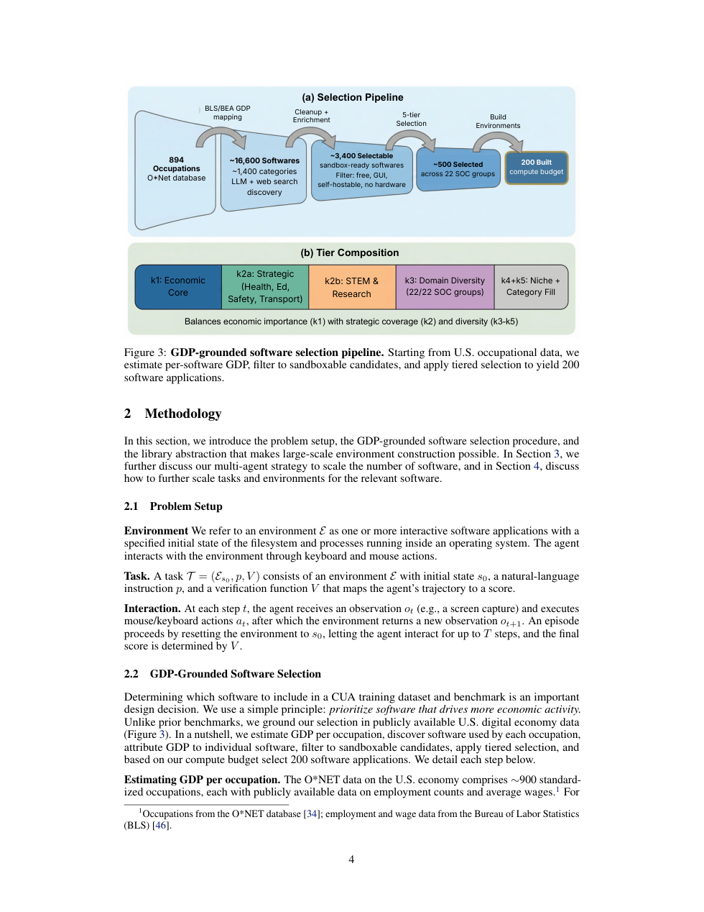
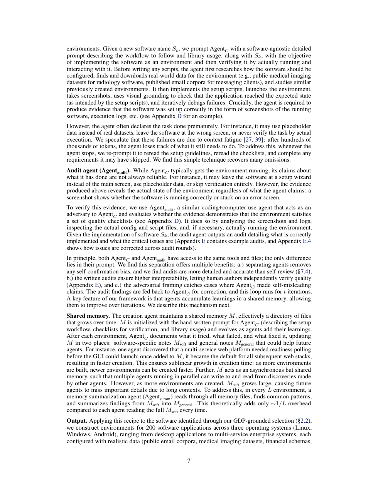
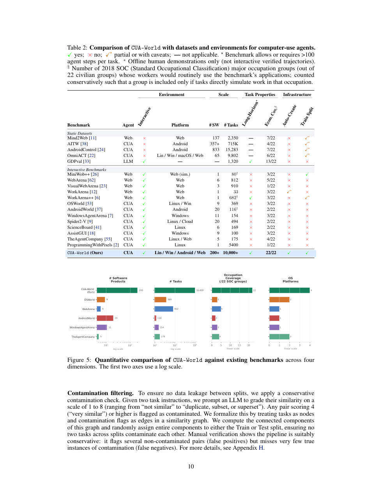

# Gym-Anything

#summary #topic

Gym-Anything is a framework for turning arbitrary software into interactive [[Computer-use Agents]] environments, paired with a multi-agent pipeline that creates, audits, and scales those environments into the benchmark-and-training collection [[CUA-World]]. The paper argues that the main bottleneck for realistic computer-use evaluation is not only agent capability but the cost of building faithful software environments with real data, long-horizon tasks, and reliable verification.

## Source

- Source file: `raw/2026-05-07_Gym-Anything-Turn-any-Software-into-an-Agent-Environment.pdf`
- Published: 2026-04-07
- Authors: Pranjal Aggarwal, Graham Neubig, Sean Welleck
- URL: [https://arxiv.org/abs/2604.06126](https://arxiv.org/abs/2604.06126)

## Summary

The paper reframes environment construction itself as an [[Agentic AI]] problem. Instead of hand-authoring each benchmark environment or capturing opaque virtual-machine snapshots, Gym-Anything defines a small environment specification consisting of install, configure, and task-setup scripts plus a configuration file. A creation agent writes and debugs those artifacts, produces evidence such as screenshots and logs, and an independent audit agent verifies whether the software actually reached the intended state. This makes software onboarding look more like an iterative coding-and-auditing workflow than a one-off benchmark curation effort.

That environment-construction loop is tied to a GDP-grounded software selection strategy. The authors map occupations to software categories using U.S. economic data, web-assisted software discovery, and filtering for sandboxable GUI applications. The result is a 200-software slice of economically meaningful applications rather than a narrow set of consumer demos, which extends the wiki's existing [[RL Environments]] material into a broader computer-use setting where the environment includes real professional software, realistic data, and long trajectories.

The output of that pipeline is [[CUA-World]], a 10K-plus task collection spanning 200 software applications across three operating systems, plus a harder [[CUA-World]] split called CUA-World-Long with one long-horizon task per software. The paper also uses a checklist-based [[Vision Language Models]] verifier with privileged information extracted from setup scripts, distills successful trajectories into a 2B vision-language model that beats models roughly twice its size, and applies a test-time audit pass that improves Gemini-3-Flash from 11.5% to 14.0% on the long benchmark. Even so, the best frontier result remains only 27.5%, which the authors use to argue that realistic computer-use remains far from solved.

## Key Claims

- Environment creation for complex software can be standardized enough that agents can automate much of the setup, debugging, and verification loop.
- A creation-agent plus audit-agent setup is more reliable than trusting a single agent's self-reported completion, because screenshots and logs expose the actual environment state.
- GDP-grounded software selection yields a benchmark that is closer to economically meaningful work than prior short-horizon computer-use suites.
- The propose-and-amplify task pipeline separates expensive seed-task creation from cheaper large-scale task generation, making breadth feasible.
- Verification quality improves when a VLM grades trajectories against checklists built from privileged information embedded in setup scripts.
- Training on successful trajectories from many software environments improves generalization to unseen software, not only memorization of a few interfaces.

## Figures

| Figure | Caption | Page |
| --- | --- | --- |
|  | Four-phase overview: GDP-grounded software selection, creation-audit environment building, task scaling, and checklist-based evaluation. | 3 |
|  | The GDP-to-software funnel that narrows 894 occupations and ~16,600 products into 200 built environments. | 4 |
|  | Creation-audit loop with shared memory (this PNG is **page 7 prose**; the loop **diagram** is Phase 2 / orange panel in Figure 2 on page 3). | 7 |
|  | Checklist-based VLM verification (this PNG is **page 10** benchmark comparison + Figure 5 bars; the **checklist rubric** diagram is Phase 4 / purple panel in Figure 2 on page 3). | 10 |

## Entities

- [[Computer-use Agents]] — the target agent class Gym-Anything is designed to train and evaluate.
- [[CUA-World]] — the benchmark and training collection produced by the framework.
- [[RL Environments]] — nearby concept page; Gym-Anything broadens it from RL task wrappers to full software-environment construction.
- [[Agentic AI]] — the paper treats environment creation, auditing, and task generation as multi-agent workflows.
- [[Vision Language Models]] — used both for trajectory verification and test-time auditing.

## Questions & Gaps

- The GDP-grounded selection strategy is persuasive, but it still depends on LLM-estimated category and software shares, which may inject opaque heuristics into what counts as "economically important."
- The paper shows strong evidence that auditing helps, but it leaves open how robust the verifier is against agents that learn to optimize for the checklist instead of the underlying workflow.
- The benchmark is intentionally filtered to sandboxable, self-hostable, GUI-based software, so it does not yet capture high-value work that depends on proprietary services, credentials, or physical hardware.

## Related

- [[Computer-use Agents]]
- [[CUA-World]]
- [[RL Environments]]
- [[RL Environments in the LLM Era]]
- [[Agentic AI]]
- [[Vision Language Models]]
- [[Large Language Models]]
