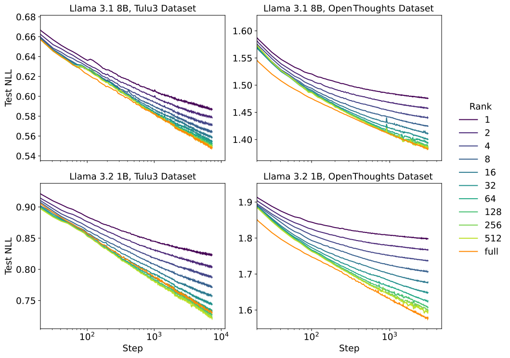
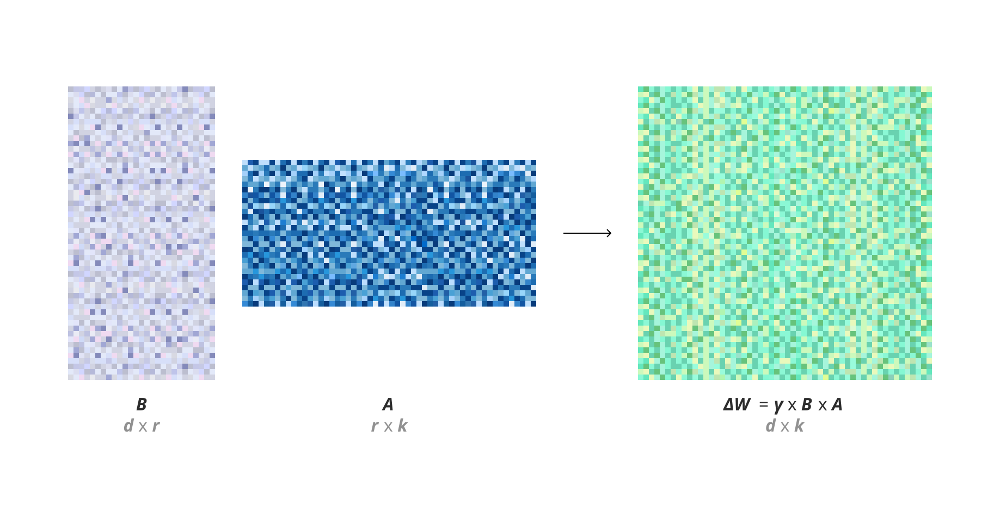
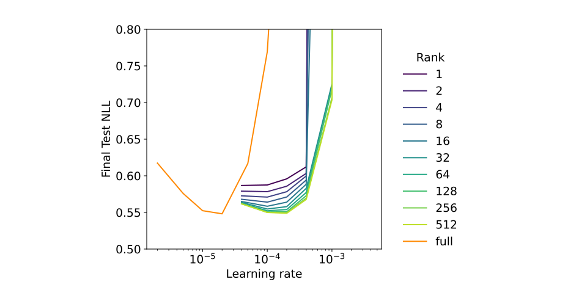
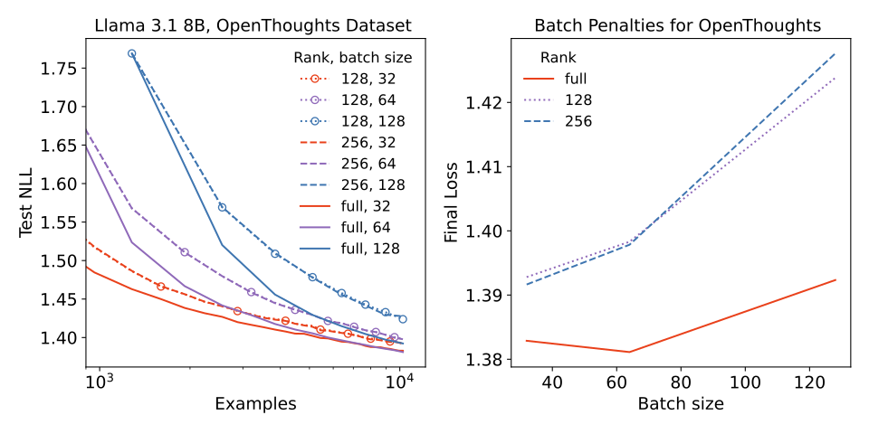
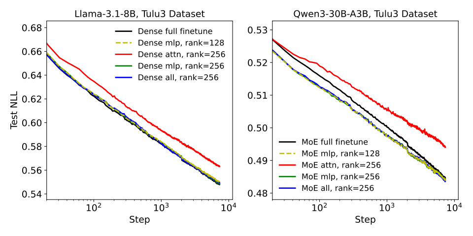
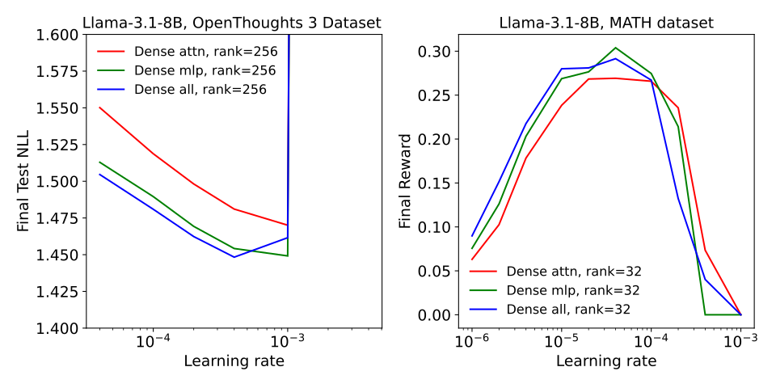
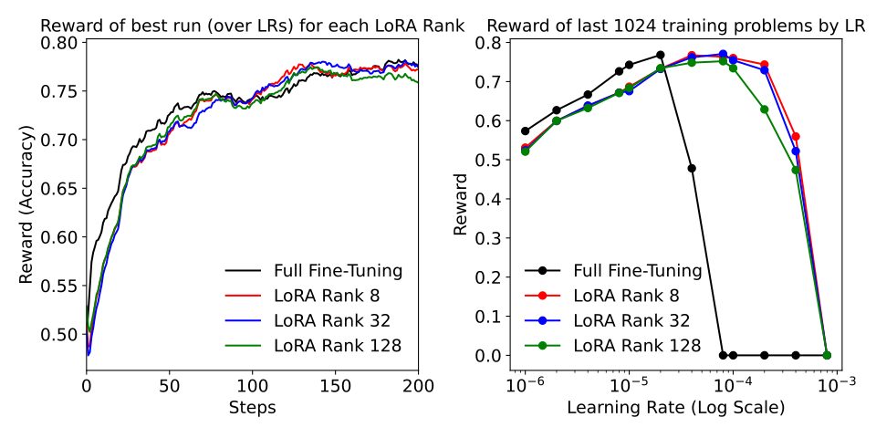

# LoRA Without Regret

**Source**: `raw/lora/full-article.md` · `raw/lora/full-article.md`  
**URL**: https://thinkingmachines.ai/blog/lora/  
**Authors**: John Schulman & Thinking Machines Lab  
**Published**: September 2025  
**Ingested**: 2026-05-12  
**Tags**: #summary

## Summary

"LoRA Without Regret" is a research blog post by John Schulman and [[Thinking Machines Lab]] that systematically characterises the conditions under which Low-Rank Adaptation (LoRA) matches the sample efficiency and ultimate performance of full fine-tuning (FullFT). The central finding is a **"low-regret regime"**: when (1) LoRA is applied to all weight matrices (especially MLP/MoE layers, not just attention), and (2) the dataset is small enough that the LoRA parameter count exceeds its information content, LoRA and FullFT produce essentially identical learning curves for both supervised fine-tuning (SFT) and reinforcement learning (RL).

The authors designed experiments to be as general as possible. Rather than evaluating on fixed benchmarks with sampling-based metrics, they measure **log loss directly** across a sweep of ranks (1–512) and learning rates, on two very different datasets: the Tulu3 instruction-following dataset and OpenThoughts3, a reasoning-focused dataset. Base models span the Llama 3 series and Qwen3 series, including a mixture-of-experts (MoE) variant. This generality lets their results transfer to most real post-training scenarios.

For supervised learning, the picture that emerges is clean: high-rank LoRAs track FullFT loss curves almost exactly, while lower-rank curves peel away from the minimum-loss trajectory at a threshold that scales with rank — the point where the adapter runs out of capacity. Crucially, this capacity threshold is not reached for most real post-training datasets.

For reinforcement learning, the paper makes an **information-theoretic argument**: policy-gradient algorithms receive only a scalar reward per episode, so each episode conveys O(1) bits of information about the true reward function. Even rank-1 LoRA on Llama-3.1-8B has ~3 million parameters — roughly 10× the total bits absorbed over a full MATH/GSM8K RL curriculum. Experiments on MATH, GSM8K, and the much-harder DeepMath-103K dataset (with Qwen3-8B-base) confirm LoRA ≈ FullFT at every tested rank, including advanced reasoning behaviours such as backtracking, self-verification, and in-context exploration emerging identically in both settings.

## Key Claims

### Capacity and dataset size
- **LoRA matches FullFT** for SFT on small-to-medium instruction-following and reasoning datasets. Underperformance only appears once the dataset's information content approaches or exceeds the number of LoRA parameters.
- The "low-regret" boundary can be estimated: neural networks store ~2 bits per parameter (Allen-Zhu & Li, 2024), and LLM datasets typically have ~1 bit (0.69 nats) per token of log-loss — so a rank-r LoRA can saturate when dataset tokens × 1 bit/token ≈ LoRA params × 2 bits/param.
- When LoRA does underperform, it doesn't hit a hard floor. Instead, the **training efficiency degrades gracefully** as the ratio of dataset information to adapter capacity increases.

### Layer coverage
- **Apply LoRA to all layers, especially MLP/MoE.** Attention-only LoRA underperforms MLP-only LoRA even when the attention-only rank is increased to match total parameter count. For example, attention-only at rank 256 underperforms MLP-only at rank 128 on Llama-3.1-8B despite having approximately equal parameters.
- MLP-only LoRA and MLP+attention LoRA perform roughly equivalently; the attention matrices add little value on top of the MLP coverage.
- The theoretical explanation links to the **empirical Neural Tangent Kernel (eNTK)**: the eNTK is approximately the same for LoRA and FullFT only when LoRA covers the layers that contribute the bulk of the parameter dot-products — which are the large MLP/MoE layers, not the attention matrices.
- For MoE models, each expert should receive its own LoRA adapter with rank scaled as `total_rank / num_active_experts` (÷8 for Qwen3 MoE), to maintain the same LoRA-to-FullFT parameter ratio as dense layers.

### Batch size sensitivity
- At **large batch sizes**, LoRA pays a larger penalty than FullFT, and this gap is independent of rank. It is a property of the product-of-matrices parametrisation (BA) rather than capacity — both methods achieve best loss at smaller batch sizes, so this rarely matters in practice.

### Reinforcement learning
- LoRA fully matches FullFT for policy-gradient RL, **even at rank 1**.
- Information-theoretic argument: the REINFORCE update is `G = S · Adv` where S is independent of the reward function R given history. By the data-processing inequality, `I(gradient ; R) ≤ H(Adv)`. If advantages are quantised into B bins, then H(Adv) ≤ log(B) — O(1) bits per episode regardless of model size or trajectory length.
- Concretely for MATH (10K problems × 32 samples × 1 bit/episode ≈ 320K bits total), rank-1 LoRA's ~3M parameters already has 10× the capacity needed.
- The authors predict DeepSeek-R1-Zero (5.3M training episodes ≈ 5.3M bits) could be replicated with LoRA, though this remains unverified.
- Advanced RL reasoning behaviours (backtracking, self-verification, in-context exploration visible through CoT length growth) emerge identically in LoRA and FullFT runs on DeepMath/AIME.

### Learning rate and hyperparameters
- **Optimal LoRA LR ≈ 10× optimal FullFT LR**, consistent across all 14 Llama and Qwen models tested, for both SFT and RL. For very short runs (<100 steps) the multiplier is ~15×, because B has not grown large enough to raise the effective LR.
- This rank-invariance of the optimal LR follows from the 1/r scaling factor in the standard parametrisation. The expected update to the adapter (1/r)·BA at the first step is a sample average of r terms with identical expectation, so it is independent of r.
- There are four nominally independent LoRA hyperparameters (α, LR_A, LR_B, init_A), but a two-parameter invariance under Adam (scale α by 1/pq, init_A by p, LR_A by p, LR_B by q) means the training dynamics are determined by only two combinations: `α · init_A · LR_B` (initial update scale) and `init_A / LR_A` (timescale for A to rotate away from its initialisation).
- **Standard HuggingFace PEFT defaults** (Gaussian init for A with std 1/√d_in, zero init for B, α=32, same LR for A and B) held up across all experiments; the authors could not improve on them.
- LoRA+ (higher LR on B than A) and Unsloth's guide (higher α for high rank) are both equivalent to increasing the `init_A / LR_A` timescale parameter — a valid but not always necessary adjustment.

### Compute efficiency
- LoRA uses slightly more than **⅔ of FullFT's FLOPs** per training pass. For a weight matrix W ∈ ℝ^(N×N): FullFT requires 3N² multiply-adds (forward + two backward passes), while LoRA requires 2N² (forward + grad w.r.t. input) + 6NR (full forward-backward on A and B) ≈ (2/3)·3N² for R ≪ N.
- In compute-matched comparisons (FLOPs rather than steps), LoRA would show a clear advantage over FullFT.

## Figures

| Figure | Caption |
|--------|---------|
|  | Cover illustration for the LoRA Without Regret article. |
|  | Loss vs. training steps for LoRA rank sweeps (1–512) and FullFT on Tulu3 and OpenThoughts3; each curve is the pointwise minimum over LR sweeps. High-rank LoRAs track FullFT; low-rank curves diverge once capacity is exhausted. |
|  | Loss vs. learning rate (U-curves) for each rank: optimal LR is approximately rank-independent, while FullFT optimal LR is ~10× lower. |
|  | Batch size vs. final loss: LoRA's gap from FullFT widens at larger batch sizes, independent of rank — a property of the BA parametrisation. |
|  | Per-layer LoRA placement ablation on Tulu3 (Llama-3.1-8B): MLP-only ≈ MLP+attention >> attention-only, even when attention-only rank is doubled to match parameters. |
|  | RL LR sweeps on MATH and GSM8K (Llama-3.1-8B base): LoRA covers a wider performant LR range and reaches the same peak reward as FullFT. |
|  | Larger-scale RL on DeepMath-103K with Qwen3-8B-base: LoRA of all ranks tracks FullFT identically in training reward across steps. |
|  | Held-out evaluation on AIME 2024 and AIME 2025 after DeepMath RL training: LoRA ≈ FullFT across all ranks on out-of-distribution hard math. |
|  | Optimal LR formula fitted across 14 Llama and Qwen models; LoRA LR scales with hidden size identically to FullFT, with a fixed ~9.8× multiplier. |

## Entities

- [[Thinking Machines Lab]] — Research lab that produced this study.
- [[LoRA]] — The primary method under investigation.
- [[QLoRA]] — QLoRA also found MLP+attention > MLP > attention for layer placement; directly referenced.
- [[Tulu 3]] — SFT instruction-following dataset used in experiments.
- [[Qwen3]] — Model family (including MoE variant) used alongside Llama 3.
- [[Papers Explained 146 - QLoRA]] — Related PEFT paper with corroborating layer-placement findings.
- [[Papers Explained 147 - LongLoRA]] — Related LoRA variant in the wiki.

## Questions & Gaps

- No satisfactory theoretical explanation yet for why the empirical LoRA-to-FullFT LR ratio is fixed at ~10× independent of model hidden size or architecture family.
- Capacity requirements for *generalizable* learning (test-loss reduction, not memorisation) are not precisely characterised; measuring this is listed as open future work.
- LoRA variants such as **PiSSA** (principal-singular-vector initialisation) are not evaluated under this methodology.
- Optimal strategies for applying LoRA to MoE layers (e.g., compatibility with tensor parallelism, expert parallelism) remain an open question.
- The 1-bit-per-episode RL capacity claim applies narrowly to policy-gradient algorithms; model-based RL or algorithms that extract richer per-episode signals would need separate analysis.
- Replication of DeepSeek-R1-Zero with LoRA is predicted but not yet demonstrated.

## Related

- [[Papers Explained 145 - LoRA]] — Original LoRA paper; recommended attention-only, which this post refutes.
- [[Papers Explained 146 - QLoRA]] — QLoRA found the same layer-placement result independently.
- [[Papers Explained 147 - LongLoRA]] — Another LoRA extension in the wiki.
- [[Model Compression and Efficiency]] — Broader PEFT and efficiency topic.
- [[Reinforcement Learning Topic]] — RL post-training is a key application analysed here.
- [[GRPO++: Tricks for Making RL Actually Work]] — Practical RL fine-tuning guide; LoRA is the adapter used in GRPO-family work.
- [[Papers Explained Review 06 - Parameter Efficient FineTuning]] — PEFT review page including LoRA.
