# On SFT RL and On-Policy Distillation

#summary #topic

Will Brown's article argues that the usual [[Supervised Fine-Tuning]] then [[Reinforcement Learning]] post-training pipeline is not just convention: SFT is cheap while the student is below the teacher, but RL becomes more attractive once fixed teacher data stops compounding; [[On-Policy Distillation]] occupies a useful middle ground when the teacher and student are from the same model family, while self-distillation methods expose new stability problems around dense, biased, concentrated gradients.

Source: [On SFT, RL, and on-policy distillation](https://x.com/willccbb/article/2050038277454143918) by Will Brown and Claude Opus 4.7, published April 30, 2026, posted May 1, 2026. Readable raw source: `raw/will-brown-on-sft-rl-on-policy-distillation/full-article.md`.

## Key Takeaways

The core distinction is whether training data improves as the model improves. Teacher [[Supervised Fine-Tuning]] trains on a fixed sampling distribution, so its ceiling is roughly the teacher or dataset distribution. [[Reinforcement Learning]] samples from the current student policy, so improvements compound into later rollouts, but the learning signal is sparse and expensive.

Rejection-sampled SFT improves vanilla SFT by filtering for correct samples, but it still does not solve the compounding problem. It shifts the curve upward without changing the fact that the sampling distribution is pinned to the teacher or student distribution used to produce candidates.

The article separates same-family and different-family teachers. Same-family teachers share tokenizer and training recipe with the student, so per-token teacher probabilities are meaningful. Different-family teachers add tokenizer mismatch and recipe mismatch, causing some training signal to teach surface style instead of transferable capability.

[[On-Policy Distillation]] uses student rollouts but grades each token with a same-family teacher through a reverse-KL signal. This gives RL-like on-policy state coverage with a dense teacher signal, and the article cites reports of roughly 9-30x less compute than RL on AIME-style benchmarks. Its ceiling is still teacher-bounded, while RL is verifier-bounded.

Self-distillation methods such as [[Self-Distilled Fine-Tuning]] and [[On-Policy Self-Distillation]] replace the external teacher with the student conditioned on privileged information. This automatically solves tokenizer and recipe match, but the privileged context can make teacher gradients too concentrated, especially when the teacher knows the answer and strongly upweights rare pivot tokens.

The gradient taxonomy is the article's main conceptual frame: RL is sparse but relatively unbiased because noisy token-level contributions cancel in large batches; SFT is dense, biased, and diffuse; OPD is dense and biased but remains relatively diffuse under same-family calibration; OPSD is dense, biased, and concentrated, requiring defenses such as KL clipping.

The open research direction is an optimal-teacher problem: find a teacher policy or hinting scheme that produces high expected reward improvement under a hard KL budget. Candidate approaches include per-task prompt optimization, distribution-level hint rewriting, online self-prompt optimization, RL-trained hint writers, and hybrids that combine teacher KL with outcome reward.

## Figures

| Figure | Caption | Source Location |
| --- | --- | --- |
| 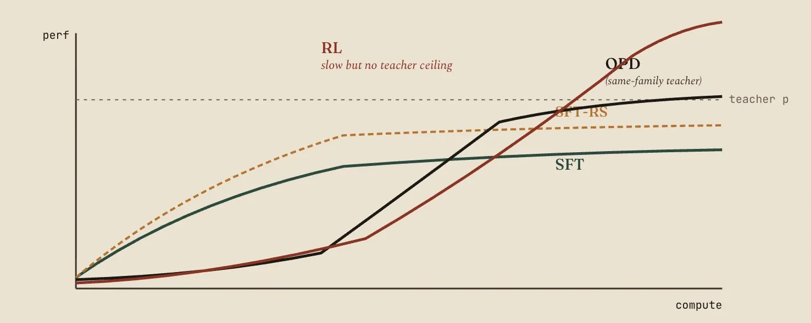 | Conceptual phase diagram showing SFT giving strong early gains, RL compounding later, and OPD occupying a fast same-family middle regime. | Article export |
| 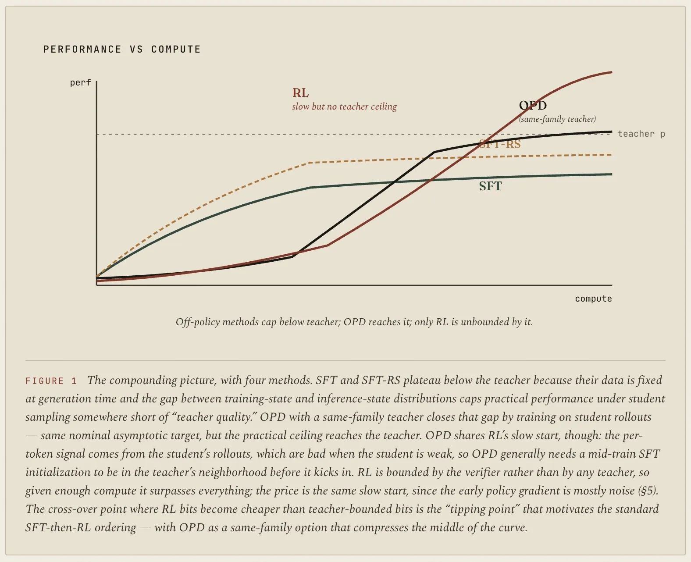 | Figure 1: SFT, SFT-RS, RL, and OPD compared by performance ceiling, compute, and whether the sampling distribution compounds. | Article export |
| 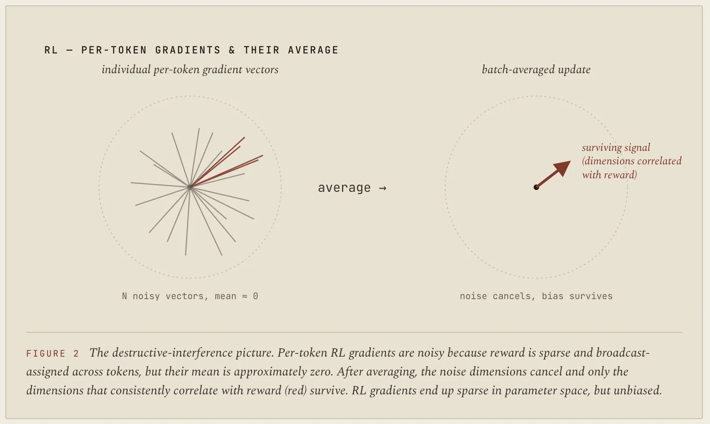 | RL gradient sketch: sparse outcome reward broadcasts noisy token-level gradients that tend to cancel except for reward-correlated directions. | Article export |
| 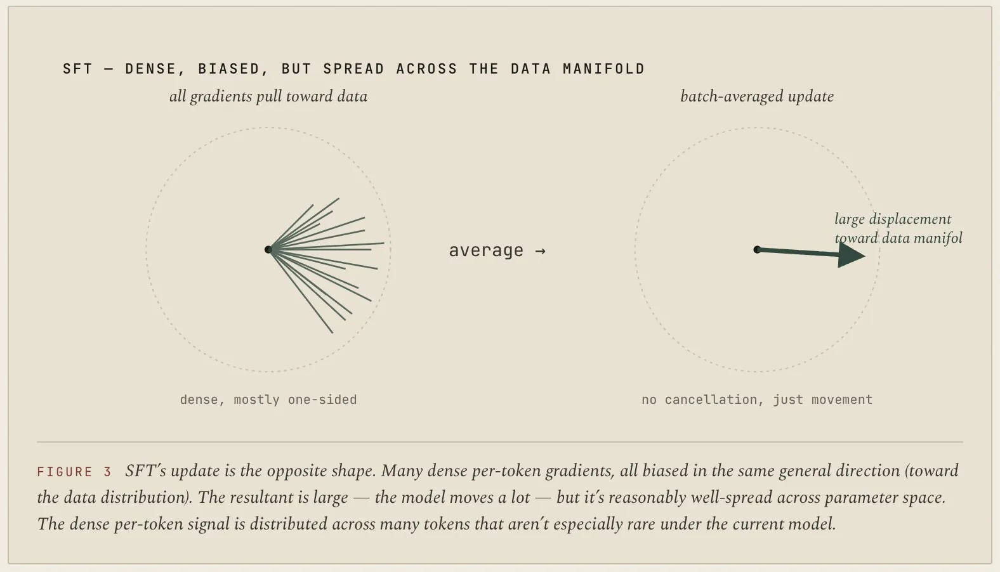 | SFT gradient sketch: dense token labels create biased pressure toward the dataset distribution, but spread that pressure across many examples. | Article export |
| 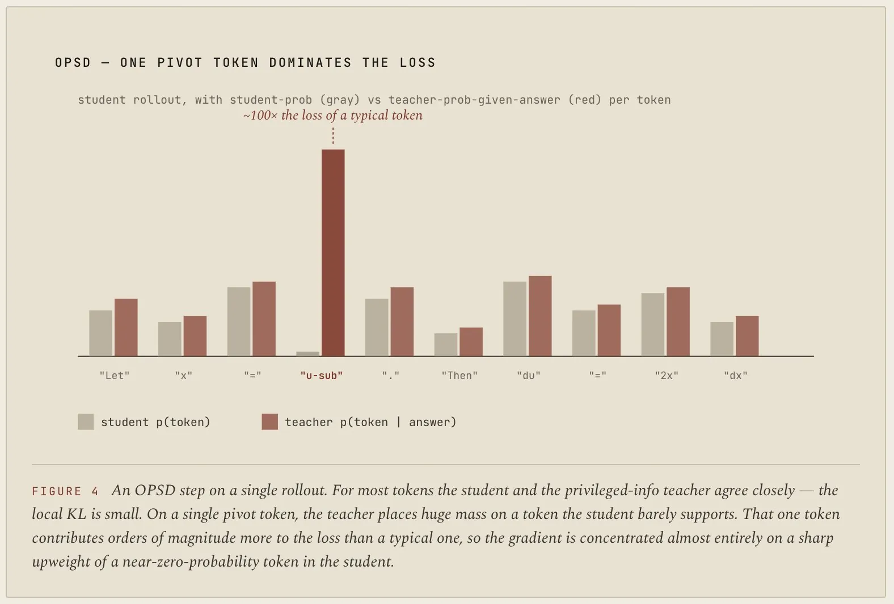 | OPSD gradient sketch: privileged-context teacher signal can concentrate on a rare pivot token that unlocks the answer. | Article export |
| 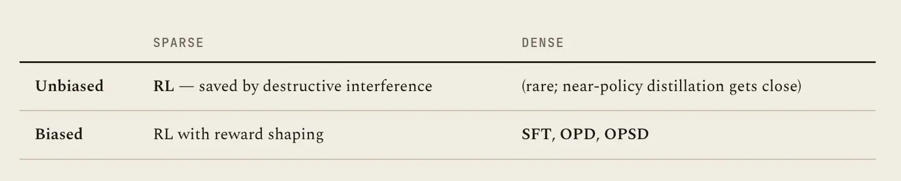 | Back-of-envelope KL table contrasting the student and teacher probabilities for a pivotal reasoning token. | Article export |
| 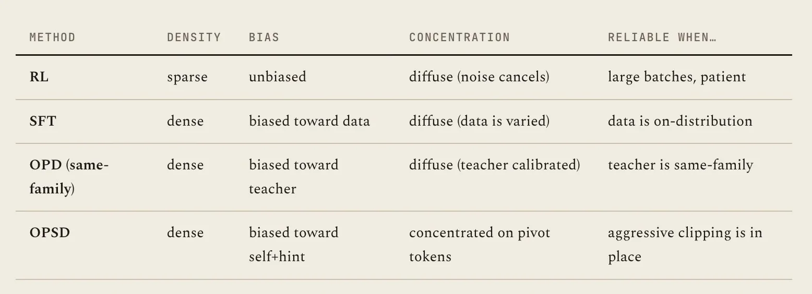 | Taxonomy table placing RL, SFT, OPD, and OPSD along sparsity, bias, concentration, and teacher-policy axes. | Article export |
| 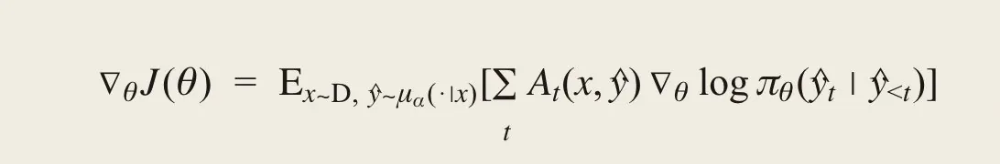 | Policy-gradient objective form used to unify SFT, RL, OPD, and OPSD. | Article export |
| 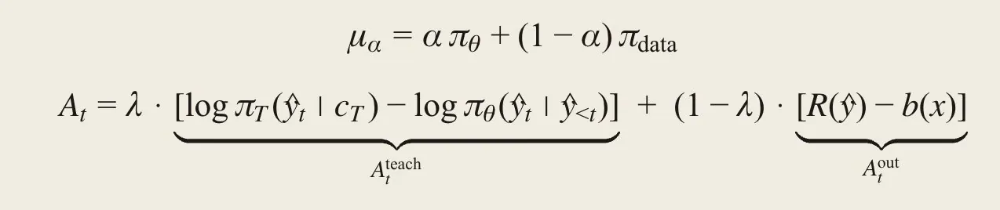 | Expanded objective with knobs for on-policy sampling and teacher-KL versus reward weighting. | Article export |
| 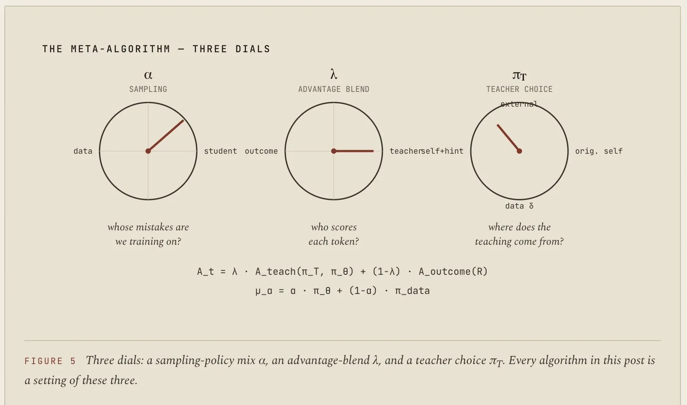 | Diagram of the meta-algorithm: sample under a partially on-policy distribution, choose a teacher policy, and update the student. | Article export |
| 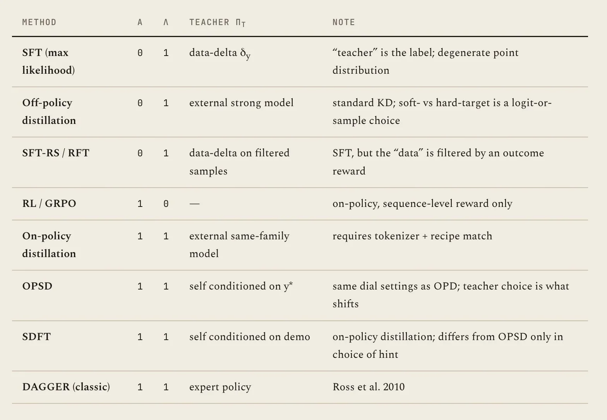 | Table mapping familiar methods to the meta-algorithm knobs and teacher choices. | Article export |
| 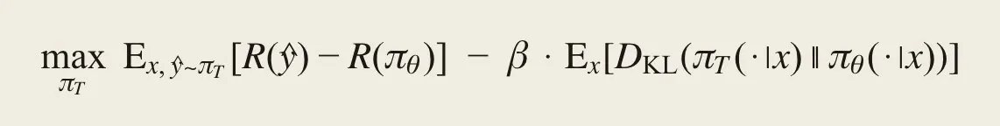 | Lagrangian objective for the optimal-teacher problem under a KL budget. | Article export |
| 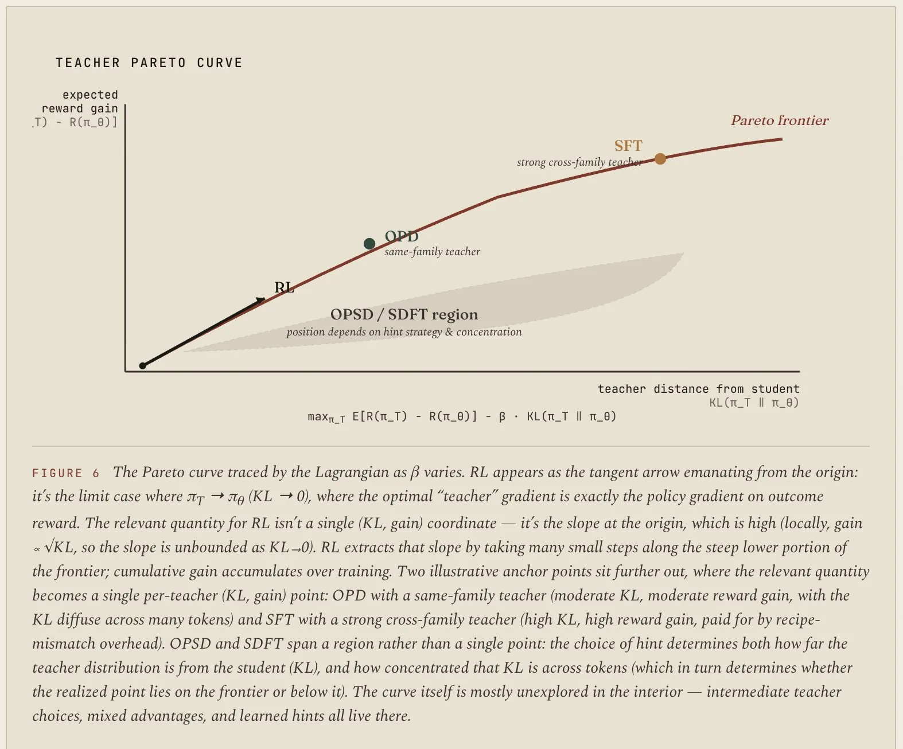 | Pareto curve sketch for reward improvement versus KL, with SFT, OPD, OPSD, and RL occupying different points. | Article export |

## Implications

This page is mainly a map of post-training regimes. It suggests that "SFT vs. RL" is too coarse; the useful axis is how much the training signal compounds, how dense it is, how biased it is, and how concentrated its KL pressure becomes. It also frames same-family distillation as a special asset: without tokenizer and recipe match, OPD's appealing token-level objective becomes much less clean.

For future notes, this article should connect to pages on [[Model Distillation]], [[KL Regularization]], [[Policy Gradient]], and [[Verifier-Bounded Learning]]. It may also be worth comparing against empirical papers on Qwen3, Thinking Machines Lab, DeepSeek V4, and DAGGER.

## Related

- [[Supervised Fine-Tuning]]
- [[Reinforcement Learning]]
- [[On-Policy Distillation]]
- [[On-Policy Self-Distillation]]
- [[Self-Distilled Fine-Tuning]]
- [[KL Regularization]]
- [[Policy Gradient]]
- [[Model Distillation]]
- [[Verifier-Bounded Learning]]
- [[Reinforcement Learning Topic]]
- [[Papers Explained - Advancing Search Augmented Language Models]]
- [[Papers Explained - Likelihood-Based Reward Designs for General LLM Reasoning]]
- [[Papers Explained - Sarvam 30B and Sarvam 105B]]
- [[Papers Explained 48 - InstructGPT]]
- [[Papers Explained 57 - LIMA]]
