# Paper Explained 268 - PaliGemma2

PaliGemma 2 is an upgrade of PaliGemma by replacing its language model component with the more recent and more capable language models from the Gemma 2 family, while utilizing the same SigLIP-So400m vision encoder.

This page ingests the source article into the wiki and connects it to [[Papers Explained Corpus]], [[Large Language Models]], [[Vision Language Models]], [[Long Context]], [[Document AI]], [[Reasoning Models]], [[Supervised Fine-Tuning]].

## Source Metadata

- Source file: `raw/2024-12-09_Paper-Explained-268--PaliGemma2-2a00d72fb428.html`
- Source title: Paper Explained 268: PaliGemma2
- Published: 2024-12-09
- Canonical: [https://medium.com/@ritvik19/paper-explained-268-paligemma2-2a00d72fb428](https://medium.com/@ritvik19/paper-explained-268-paligemma2-2a00d72fb428)

## Key Ideas

- These models are trained at three resolutions (224x224px, 448x448px and 896x896px) in multiple stages to equip them with broad knowledge for transfer via fine-tuning.
- The effect of model size and resolution on the downstream performance is analyzed in a controlled setting.
- The models are available at [HuggingFace](https://huggingface.co/collections/google/paligemma-2-release-67500e1e1dbfdd4dee27ba48).
- Recommended Reading [Papers Explained 197: Pali Gemma](https://ritvik19.medium.com/papers-explained-197-pali-gemma-6899e871998e)
- Stage 1 combines the pretrained SigLIP- So400m and Gemma 2 checkpoints (raw checkpoints, without post-training steps) and trains them jointly on a multimodal task mixture of 1 billion examples designed to enable transferability to a wide range of tasks via...

## Notes

PaliGemma 2 is an upgrade of PaliGemma by replacing its language model component with the more recent and more capable language models from the Gemma 2 family, while utilizing the same SigLIP-So400m vision encoder.

These models are trained at three resolutions (224x224px, 448x448px and 896x896px) in multiple stages to equip them with broad knowledge for transfer via fine-tuning. PaliGemma 2 slightly outperforms PaliGemma at the same resolution and model size, and obtains substantial improvements at larger model sizes.

The effect of model size and resolution on the downstream performance is analyzed in a controlled setting. New tasks are also explored, including text detection and recognition, table structure recognition, molecular structure recognition, optical music score recognition, long caption generation, spatial reasoning, and radiography report generation.

The models are available at [HuggingFace](https://huggingface.co/collections/google/paligemma-2-release-67500e1e1dbfdd4dee27ba48).

Recommended Reading [Papers Explained 197: Pali Gemma](https://ritvik19.medium.com/papers-explained-197-pali-gemma-6899e871998e)

## Model

The same modeling, training, and data setup as PaliGemma is followed. The same pretrained SigLIP-So400m vision encoder is used and its (sequence of) embeddings are mapped to the Gemma 2 input space with a linear projection. The visual embeddings are combined with a text prompt and fed to the Gemma 2 language model (prefill). Predictions are then obtained by autoregressively sampling from the language model. PaliGemma 2 is pretrain in three stages (with stage 0 corresponding to unimodal pretraining of the components).

- Stage 1 combines the pretrained SigLIP- So400m and Gemma 2 checkpoints (raw checkpoints, without post-training steps) and trains them jointly on a multimodal task mixture of 1 billion examples designed to enable transferability to a wide range of tasks via fine-tuning. The image resolution is 224x224px; no parameters are frozen during this stage.

- Stage 2 first trains for 50 million examples at resolution 448x448px and then for 10 million examples at resolution 896x896px. The task mixture has the same components but tasks benefiting from high resolution are upweighted, and the output sequence length is increased (to promote e.g. learning of OCR for long sequences of visual text).

- Stage 3 fine-tunes the checkpoints from stage 1 or 2 (depending on the resolution) to the target task. PaliGemma considered a range of academic benchmarks, including some involving multiple images and short videos.

Logits soft-capping is applied to the attention and output logits in the Gemma 2 component with the same parameters as Gemma2 in Stages 1 and 2. However, this technique is not used in Stage 3, as it led to worse results for some transfer tasks.

## Evaluation

### Investigating model size and resolution

*Figure: Relative improvements of metrics after transfer, when choosing a pre-trained checkpoint with a larger LM, or with a higher resolution.*

- Tasks focused on text, document, and chart understanding benefit more from increased resolution, likely due to the high native resolution of images in these benchmarks.

- Tasks involving multilingual data or advanced visual reasoning benefit more from increased model size.

*Figure: Transfer performance as a function of model size and resolution.*

- Increasing both image resolution and model size generally improves task performance, as expected due to increased FLOPs.

- Increasing model size from 10B to 28B often yields only moderate or no improvements. The largest model (28B) might be beneficial only when performance is paramount and compute/latency constraints are absent. The potentially lower transferability of the 28B model might be related to the underlying Gemma 2 27B model being trained from scratch, unlike the distilled 2B and 9B models.

*Figure: Comparison of PaliGemma 3B and PaliGemma 2 3B.*

- PaliGemma 2 models perform slightly better (0.65 and 0.85 average improvement for 224x224px and 448x448px respectively) than the corresponding PaliGemma models for the same resolution and model size (3B).

### Text detection and recognition

PaliGemma 2 is fine-tuned on a diverse dataset of text images from various sources (ICDAR’15, Total-Text, MLT17, MLT19, HierText, TextOCR, IntelOCR). The model’s performance is assessed using word-level precision, recall, and F1-score on the ICDAR’15 and Total-Text test sets, following the HierText competition protocol.

*Figure: Text detection and recognition performance.*

- PaliGemma 2 3B at 896x896px outperformed the state-of-the-art HTS model on both benchmarks. This demonstrates the effectiveness of fine-tuning a general-purpose VLM for OCR without relying on task-specific architectural components.

### Table structure recognition

PaliGemma 2 is finetuned on two datasets:

- PubTabNet (516k images from PubMed Central)

- FinTabNet (113k financial report tables from S&P 500 companies).

The data is preprocessed by removing corrupted examples, applying refinements resizing images while preserving aspect ratio, and padding them to a square size.

*Figure: PaliGemma 2 results for table structure recognition on FinTabNet and PubTabNet.*

- PaliGemma 2 achieves state-of-the-art performance on table structure recognition tasks, as measured by Tree Edit Distance Similarity (TEDS) and Grid Table Similarity (GriTS) metrics. Increasing the model size did not improve results, and using a lower image resolution slightly decreased performance.

### Molecular structure recognition

PaliGemma 2 is finetuned on a dataset of 1 million molecules from PubChem, rendered using Indigo and augmented with various drawing styles and perturbations.

*Figure: PaliGemma 2 performance for molecule structure recognition on ChemDraw data.*

- PaliGemma 2 outperforms the state-of-the-art model MolScribe when using a 448x448px resolution. Increasing the resolution beyond this point did not lead to a significant improvement in the exact match percentage.

### Optical music score recognition

To use PaliGemma 2 model for optical music score recognition. The GrandStaff dataset with 53.7k images is used for both training and evaluation. Both original images and synthetically augmented versions are used during training. Evaluation is performed on the original, undistorted images. The goal is to translate images of single-line piano scores into digital representations in the kern format.

*Figure: PaliGemma 2 performance for music score recognition on the GrandStaff data set.*

- Error rates decrease as image resolution increases, with the best performance at 896x896px resolution.

- Increasing the model size from 3B to 10B did not lead to further error reduction.

### Generating long, fine-grained captions

To adapt the PaliGemma 2 language model for generating long, fine-grained image captions with detailed descriptions, it is fine-tuned on the DOCCI dataset, which contains 15,000 images with detailed human-annotated English descriptions.

*Figure: PaliGemma 2 results for long captioning on the DOCCI data.*

- The fine-tuned PaliGemma 2 model produces more factually aligned sentences than many popular VLMs that are often instruction-tuned on much larger captioning datasets.

- Increasing both model size and resolution leads to improved factual alignment.

### Spatial reasoning

To evaluate the spatial reasoning capabilities of the PaliGemma 2 language model, the Visual Spatial Reasoning (VSR) benchmark is used.

*Figure: PaliGemma 2 accuracy on VSR on the zeroshot and random test splits.*

- PaliGemma 2 outperforms previous fine-tuned models on the VSR benchmark.

- Fine-tuning PaliGemma 2 provides a significant improvement over InstructBlip, a strong zero-shot model.

- Larger model sizes lead to better performance, suggesting the benefit of improved language understanding.

- Increasing image resolution beyond 224 did not result in performance improvements.

### Radiography report generation

PaliGemma 2 models are fine-tuned on the MIMIC-CXR dataset, which contains 377k images with free-text radiology reports. The same train, validation, and test splits as are used. Gemini 1.5 pro is employed to remove mentions of prior X-rays from the dataset. Performance is evaluated using the RadGraph F1-score, which considers the presence/absence of findings and their relationships to image features.

*Figure: PaliGemma 2 performance for radiography report generation on the on the MIMIC-CXR data.*

- PaliGemma 2 models achieve state-of-the-art RadGraph scores.

- Increasing both resolution and model size lead to modest performance improvements.

### CPU inference and quantization

The performance (runtime and quality) of PaliGemma 2 inference on CPUs without accelerators is evaluated. Inference is conducted using the `gemma.cpp2` framework, a lightweight C++ inference engine supporting 8-bit switched-floating-point quantization. A checkpoint of PaliGemma 2 3B (224x224px) fine-tuned on COCOcap is used. Experiments are run on four different CPU architectures with a batch size set to 1. Quality comparison is made between 32-bit floating point (f32) and 8-bit mixed quantization using `gemma.cpp`. Five fine-tuning datasets are used to assess quality differences after quantization.

*Figure: CPU-only inference speed measurements with gemma.cpp-based implementation on different architectures.*

*Figure: Quality comparison between Jax/f32 inference on TPU and quantized gemma.cpp-based inference on CPU.*

- Results indicate that 8-bit mixed quantization does not significantly impact the quality of PaliGemma 2 inference compared to 32-bit floating point.

## Paper

PaliGemma 2: A Family of Versatile VLMs for Transfer [2412.03555](https://arxiv.org/abs/2412.03555)

Recommended Reading [Gemini / Gemma Models](https://ritvik19.medium.com/list/gemini-gemma-models-4cb7dfc50d42) [Multi Modal Transformers](https://ritvik19.medium.com/list/multi-modal-transformers-67453f215ecf)

## Figures

Figures from the Medium HTML export (`raw/2024-12-09_Paper-Explained-268--PaliGemma2-2a00d72fb428.html`); local copies under `wiki/assets/paper-explained-268-paligemma2/` when download succeeded.

| Figure | Caption |
|--------|---------|
| 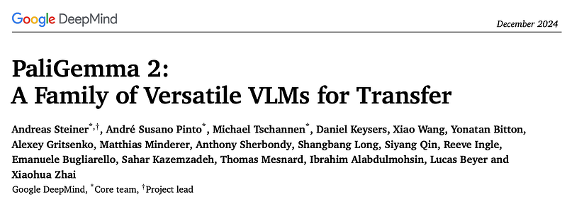 | Overview of PaliGemma 2: Gemma 2 LM backbone with the SigLIP-So400m vision encoder kept from PaliGemma. |
| 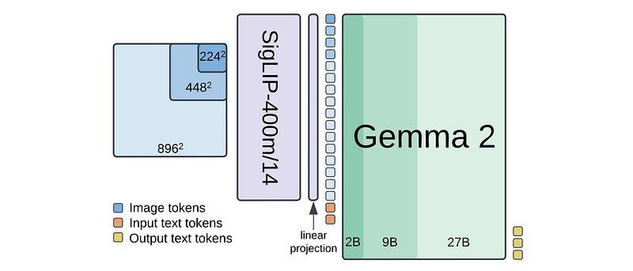 | Architecture and inference flow (SigLIP embeddings projected into Gemma 2 space; multimodal prefill then LM decoding). |
| 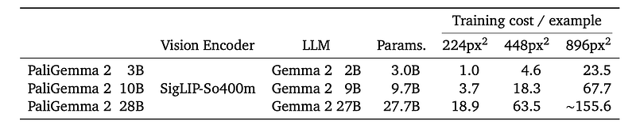 | Three-stage multimodal training (joint mixture at 224px; high-res 448/896px stage 2; task-specific stage 3 fine-tuning). |
| 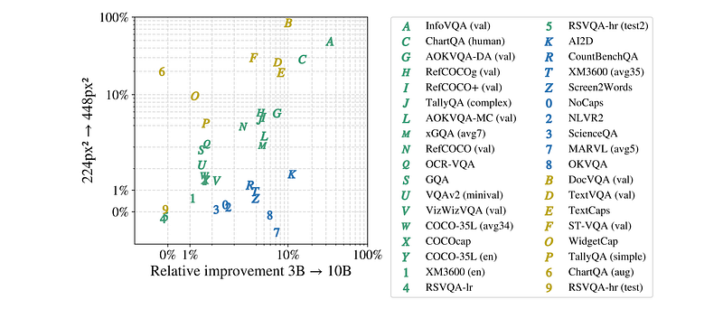 | Relative improvements after transfer when using a larger LM checkpoint vs higher-resolution pretraining. |
| 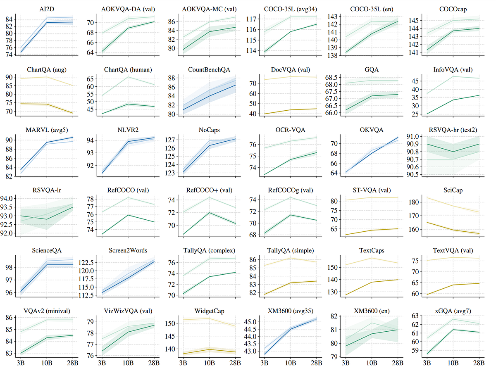 | Transfer performance vs model size and image resolution. |
| 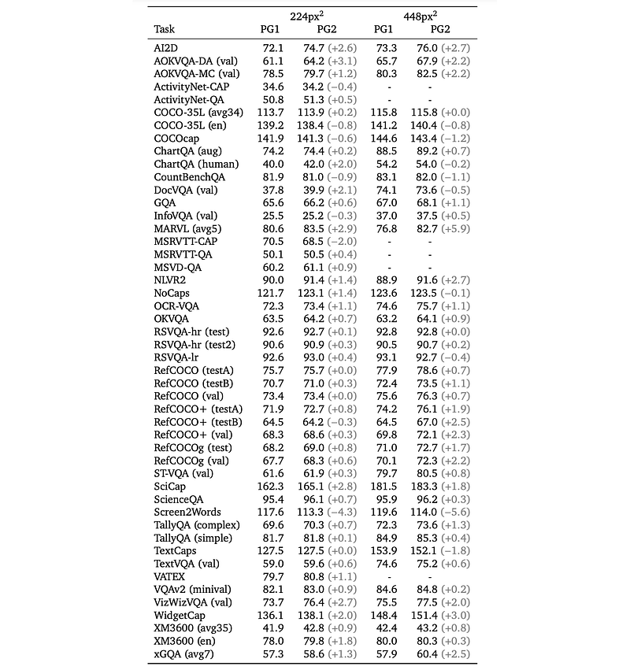 | PaliGemma vs PaliGemma 2 at 3B (same-resolution comparison). |
| 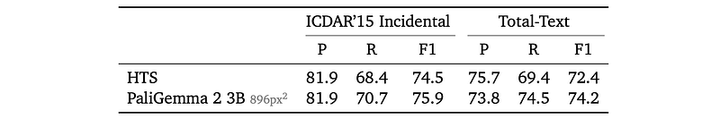 | Text detection and recognition (ICDAR’15, Total-Text). |
| 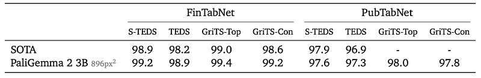 | Table structure recognition on FinTabNet and PubTabNet (TEDS / GriTS). |
|  | Molecular structure recognition on ChemDraw-style renders vs MolScribe. |
| 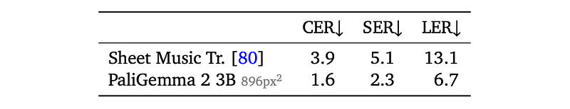 | Optical music score recognition on GrandStaff (kern transcription). |
| 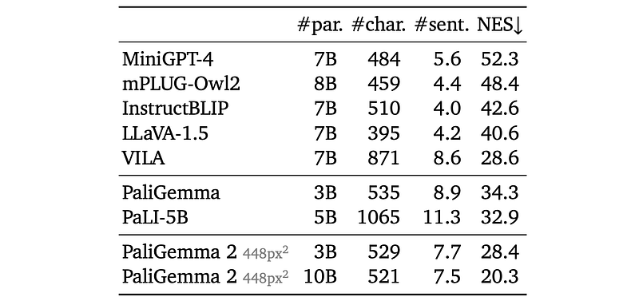 | Long fine-grained captioning on DOCCI (factual alignment). |
| 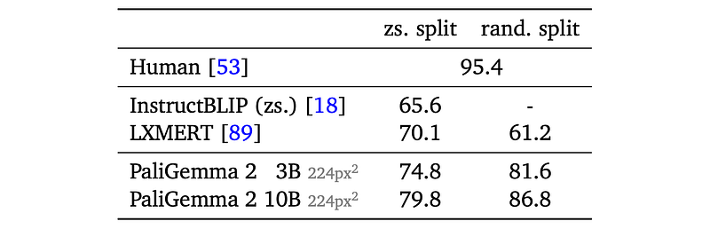 | Visual Spatial Reasoning (VSR), zeroshot vs random splits. |
| 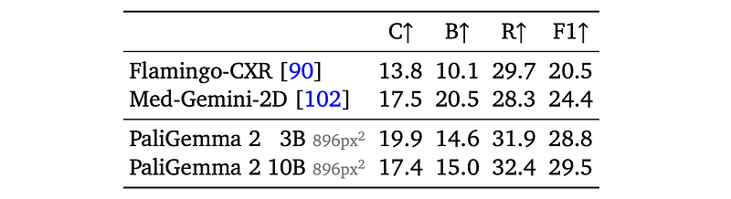 | Radiology report generation on MIMIC-CXR (RadGraph F1). |
| 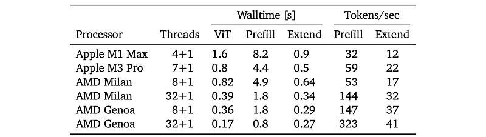 | CPU-only inference latency across architectures (`gemma.cpp`, batch size 1). |
| 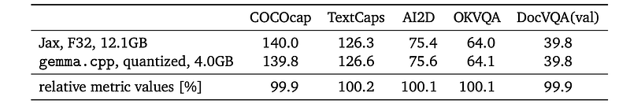 | Quality of JAX fp32 on TPU vs 8-bit mixed quantization on CPU (`gemma.cpp`). |
## HF Blog Cross-References

- [PaliGemma 2 Mix - New Instruction Vision Language Models by Google](https://huggingface.co/blog/paligemma2mix) (2025-02-19) — a follow-up release fine-tuning the PaliGemma 2 **pt** checkpoints (3B/10B/28B) on a mix of vision-language tasks (OCR, long/short captioning, detection) rather than leaving them purely as transfer-learning bases; gives a preview of downstream performance without task-specific fine-tuning.

## Related

- [[Papers Explained Corpus]]
- [[Large Language Models]]
- [[Vision Language Models]]
- [[Long Context]]
- [[Document AI]]
- [[Reasoning Models]]
- [[Supervised Fine-Tuning]]
- [[Papers Explained 267 - Jina Reranker]]
- [[Papers Explained 269 - Eagle]]

#summary #topic
