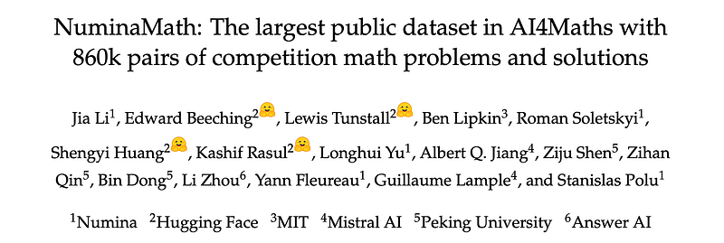
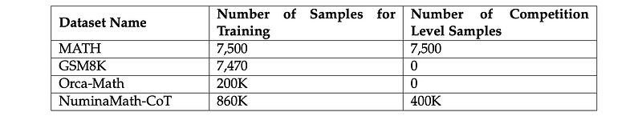
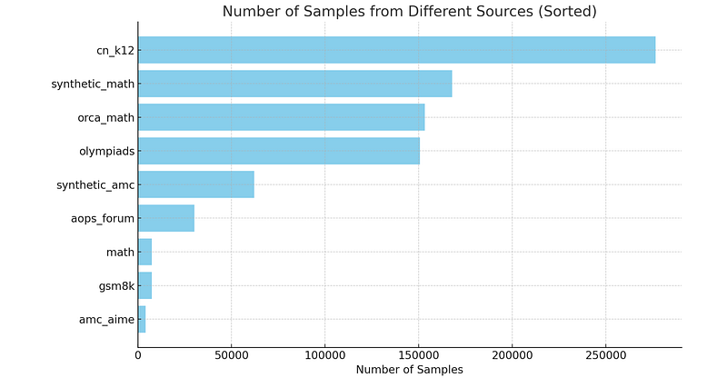
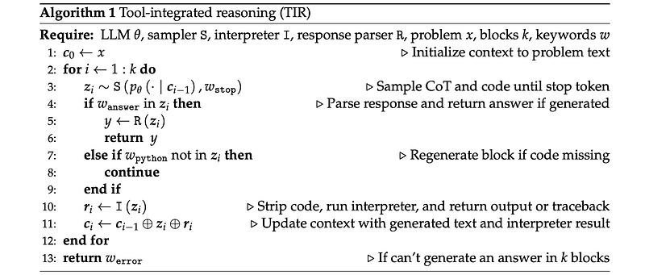
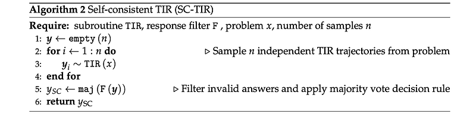
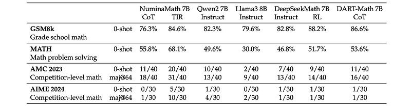
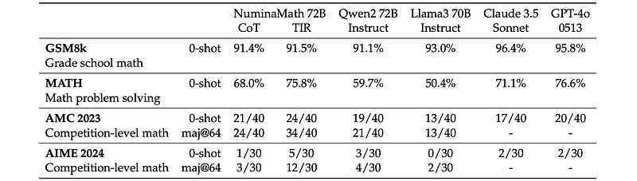
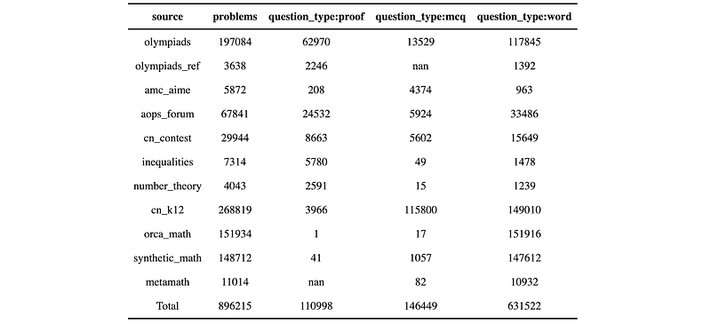

# Paper Explained 316 - NuminaMath

The NuminaMath dataset is a comprehensive collection of 860k pairs of competition math problems and solutions. Problems range from high-school-level to advanced-competition-level, all meticulously annotated with accompanying chain-of-thought traces.

This page ingests the source article into the wiki and connects it to [[Papers Explained Corpus]], [[Reasoning Models]], [[Synthetic Data]], [[Large Language Models]], [[Multilingual Models]], [[Embedding and Retrieval]].

## Source Metadata

- Source file: `raw/2025-02-24_Paper-Explained-316--NuminaMath-40501ae9baac.html`
- Source title: Paper Explained 316: NuminaMath
- Published: 2025-02-24
- Canonical: [https://medium.com/@ritvik19/paper-explained-316-numinamath-40501ae9baac](https://medium.com/@ritvik19/paper-explained-316-numinamath-40501ae9baac)

## Key Ideas

- The project is available at [GitHub](https://github.com/project-numina/aimo-progress-prize/).
- The data sources include Chinese high school math exercises, US and international mathematics olympiad problems, and problems collected from online forums.
- MATH and GSM8K: Existing reference solutions are reformatted into a Chain-of-Thought (CoT) format using GPT-4, following recommendations from DeepseekMath and ReAlign.
- Orca-Math: Regular expressions are used to extract and simplify answers from the original dataset’s solution text. Answers are then enclosed within \boxed{} for consistent formatting.
- AMC and AIME: Problems and LaTeX-formatted solutions are collected from the Art of Problem Solving (AoPS) wiki. The first solution containing a \boxed{} symbol is selected.

## Notes

The NuminaMath dataset is a comprehensive collection of 860k pairs of competition math problems and solutions. Problems range from high-school-level to advanced-competition-level, all meticulously annotated with accompanying chain-of-thought traces. This dataset is designed to enhance the mathematical reasoning capabilities of LLMs and stands as the largest math dataset ever released in the field.

The project is available at [GitHub](https://github.com/project-numina/aimo-progress-prize/).

## Data Collection and Processing

*Figure: Datasets and sample sizes.*

The data sources include Chinese high school math exercises, US and international mathematics olympiad problems, and problems collected from online forums.

- MATH and GSM8K: Existing reference solutions are reformatted into a Chain-of-Thought (CoT) format using GPT-4, following recommendations from DeepseekMath and ReAlign.

- Orca-Math: Regular expressions are used to extract and simplify answers from the original dataset’s solution text. Answers are then enclosed within \boxed{} for consistent formatting. The authors note that if a well-formatted version of Orca-Math is already present in the training data, this step might be redundant. An alternative is using GPT-4 to generate the final solution.

- AMC and AIME: Problems and LaTeX-formatted solutions are collected from the Art of Problem Solving (AoPS) wiki. The first solution containing a \boxed{} symbol is selected. Due to overlap with the MATH dataset, a decontamination process using embeddings is employed, resulting in approximately 4,300 problems retained for training. Remaining solutions are then realigned into the CoT format using GPT-4.

- AoPS Forum: Problems are crawled from the AoPS Contest Collection page. Since solutions aren’t explicitly provided, replies with \boxed{} symbols are considered, prioritizing those with the most LaTeX. The selected reply is treated as the reference solution and rewritten in CoT format by GPT-4.

- Chinese K-12 Exam: K-12 math exercises are collected from public exam papers, often sourced from public resources. OCR and regex segmentation are used to extract problem-solution pairs from PDFs. GPT-4 is then used for translation and realignment of solutions into the CoT format.

- Synthetic Data: Synthetic problems are generated using the MATH and AMC-AIME training split datasets, Xwin Math. Unlike the original method, the solution from the initial generation stage (using GPT-4 with a temperature of 0.8) is directly used to reduce costs.

- World Olympiads Data: 152K problem-solution pairs are collected from various sources:

- International contests and their shortlists (e.g., IMO, APMO, BMO).

- National and regional contests (see Figure 2 in the original text for country breakdown).

- Problem-solving forums, puzzle and olympiad books, and summer school materials.

- PDFs are the primary source format; HTML content is converted to PDF. A pipeline (described elsewhere in the original text) is then applied to process these problems.

*Figure: Number of samples per data source.*

### Decontamination

The following two-step decontamination strategy is used:

- All 10-gram exact matches are removed from all datasets, except the synthetic dataset and the MATH train set.

- To better decontaminate, Mistral embeddings are computed for each of the problems except for MATH train and the synthetic datasets. All problems with an embedding distance < 0.15 are then removed. This value is derived empirically, above which contamination is not observed in internal tests.

## NuminaMath-TIR

After creating the NuminaMath-CoT dataset, extending to TIR (tool integrated reasoning) is straightforward. The same approach as ToRA, particularly their prompt, is followed to sample TIR data from GPT-4o. The process to create this TIR dataset is as follows:

- Extract a subset of roughly 100K problems with value output from the NuminaMath-CoT dataset.

- Sample a solution using the GPT-4o assistant API for each problem with a temperature of 0.8.

- Filter the negative samples where model generated answers don’t match the reference answer. For integer output problems exact match is used. For other expressions, a match is determined using GPT-4o as a judge.

- Repeat the same process on the negative problems.

## Experiments

Models are fine-tuned using a two-stage process inspired by the MuMath-Code paper.

- Fine-tuning on a large, diverse dataset of natural language math problems and solutions, with CoT annotations to facilitate reasoning.

- Fine-tuning on a synthetic dataset of TIR, where problems are decomposed into rationales, Python programs, and outputs.

Models are trained at two scales:

- 7B, based on DeepSeekMath-Base 7B

- 72B, based on Qwen2–72B

*Figure: Hyper-parameters used in the experiments.*

### Tool-integrated reasoning (TIR)

Each run of TIR begins with a problem, x. The goal of TIR is to sample a candidate solution, y. TIR begins by initializing a context, c, with an initial prompt c0 containing only x. This context is then extended through up to k rounds of interaction.

On each iteration, i, TIR uses a sampler, S, and an LLM, θ, to sample text containing CoT and Python source code, zi, until reaching the stop keyword wstop = ```output. After sampling zi, TIR first checks if a candidate solution has been generated, which would be wrapped in the keyword wanswer = \boxed{}.

If an answer is present, TIR applies a response parser, R, to the output, which acts to sanitize the text and return only the final numerical response with any units and other formatting removed. If no valid response is present, TIR assesses whether any code has been generated by matching a regular expression with the python region keyword wpython = ```python(.*)```.

If no such region is available, zi is discarded, and TIR proceeds to the next iteration, resampling a fresh block of text. If such a region is available, the Python source code is passed to the Python interpreter, I, which parses and executes the source code. The result, ri from running I(zi) may include the output of print statements, or a truncated Traceback if an exception was raised.

The running context is then extended, proceeding to the next round of interaction, via setting ci to ci−1 ⊕ zi ⊕ ri, where ⊕ denotes concatenation. Thus, by the end of interaction, c = c0z1r1z2r2 . . . z≤k, where either a candidate answer, y, is successfully extracted from z≤k else an error keyword werror.

In the case of SC-TIR, n samples are generated from TIR, then a filter, F is applied, which removes ill-formed responses and finally self-consistency majority voting is applied.

## Evaluations

Various 7B, 8B, and 70B parameter language models are compared on benchmarks, including GSM8k (grade school math), MATH (math problem solving), AMC 2023 (competition-level math), and AIME 2024 (competition-level math).

*Figure: Comparison of various 7B and 8B parameter language models on different math benchmarks.*

- NuminaMath with TIR achieves state-of-the-art (SoTA) performance among 7B and 8B parameter models.

*Figure: Comparison of various open weight and proprietary language models on different math benchmarks.*

- Models with TIR demonstrate significant improvements in problem-solving capabilities, especially in complex reasoning tasks.

- NuminaMath with TIR also performs competitively against larger models (70B parameters) like Claude 3.5 and GPT-4o, outperforming them on some benchmarks and approaching GPT-4o’s performance on others.

## NuminaMath-1.5

NuminaMath-1.5 is the second iteration of the NuminaMath dataset, designed to provide high-quality post-training data for competition-level math problems. It contains approximately 900k problems with Chain of Thought (CoT) solutions.

The dataset is available at [HuggingFace](https://huggingface.co/datasets/AI-MO/NuminaMath-1.5).

Problem Metadata: Includes answer, problem_type, and question_type metadata for all problems to ensure verifiable output.

- answer: Final answer or special values like “proof” or “notfound”.

- problem_type: Mathematical domain (Algebra, Geometry, Number Theory, etc.).

- question_type: Problem style (multiple-choice, proof, math word problem).

New Data:

- Olympiads Reference: Manually parsed and verified problems and solutions from official websites of national Math Olympiads.

- Manually Curated Data: Competition problems in cn_contest, inequalities, and number_theory.

- Removed Data: Synthetic dataset synthetic_amc is removed due to performance issues.

## Paper

[NuminaMath: The largest public dataset in AI4Maths with 860k pairs of competition math problems and solutions](http://faculty.bicmr.pku.edu.cn/~dongbin/Publications/numina_dataset.pdf)

## Figures

Figures from the Medium HTML export (`raw/2025-02-24_Paper-Explained-316--NuminaMath-40501ae9baac.html`); local copies under `wiki/assets/paper-explained-316-numinamath/` when download succeeded.

| Figure | Caption |
|--------|---------|
|  | NuminaMath overview (~860k competition-style problems with chain-of-thought solutions). |
|  | Datasets and approximate sample sizes feeding NuminaMath. |
|  | Sample counts per major data source after dedup and filtering steps. |
|  | World Olympiad / contest sourcing footprint (national and regional contests plus forums and PDF-derived pairs). |
|  | Tool-integrated reasoning loop (expand context with CoT + Python runs until a boxed answer or failure). |
|  | SC-TIR: multiple TIR samples, filter ill-formed outputs, majority vote. |
|  | Fine-tuning hyper-parameters for the two-stage CoT then TIR experiments (7B / 72B settings). |
|  | Open 7B–8B models on GSM8K, MATH, AMC 2023, and AIME 2024 with NuminaMath (+TIR). |
|  | NuminaMath-trained models vs larger open and proprietary baselines on the same benchmark suite. |
## HF Blog Cross-References

- [How NuminaMath Won the 1st AIMO Progress Prize](https://huggingface.co/blog/winning-aimo-progress-prize) (2024-07-11) — Numina's own writeup of the winning AI Mathematical Olympiad Progress Prize solution: the two-stage CoT-then-TIR fine-tuning recipe, self-consistency tool-integrated reasoning (SC-TIR), and lessons on avoiding overfit to the public leaderboard. Same training recipe as the NuminaMath-CoT/TIR datasets described above, told from the competition side.

## Related

- [[Papers Explained Corpus]]
- [[Reasoning Models]]
- [[Synthetic Data]]
- [[Large Language Models]]
- [[Multilingual Models]]
- [[Embedding and Retrieval]]
- [[Papers Explained 315 - mmE5]]
- [[Papers Explained 317 - Competitive Programming with Large Reasoning Models]]

#summary #topic
