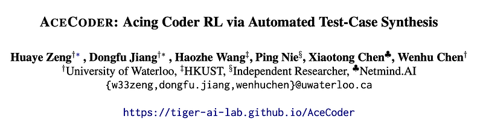
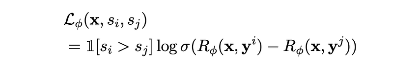
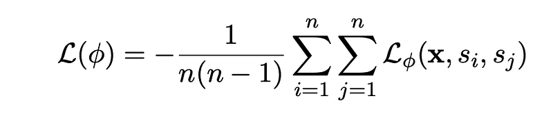
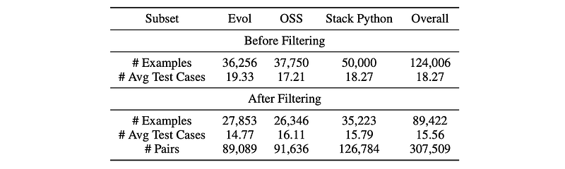
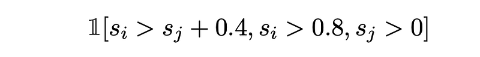
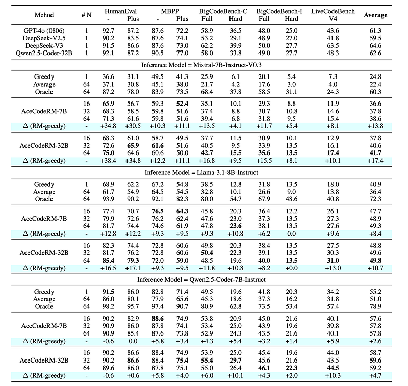
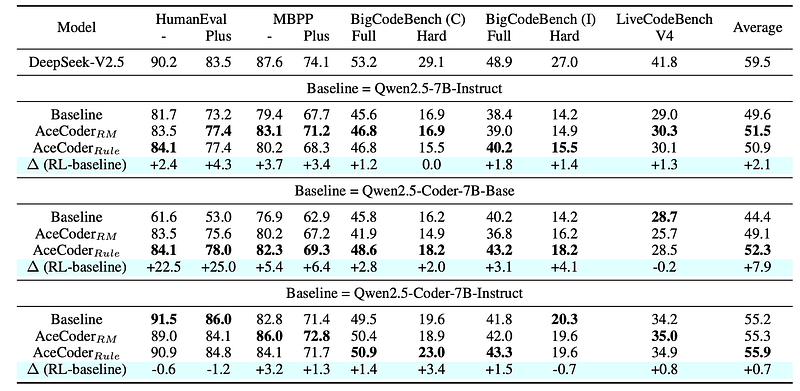
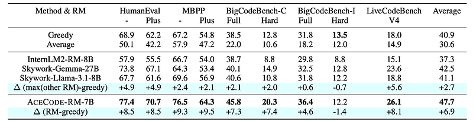

# Papers Explained - AceCoder

AceCoder leverages automated large-scale test-case synthesis to enhance code model training. A pipeline is designed that generates extensive (question, test-cases) pairs from existing code data.

This page ingests the source article into the wiki and connects it to [[Papers Explained Corpus]], [[Reinforcement Learning Topic]], [[Code Models]], [[Safety and Alignment]], [[Reasoning Models]], [[Reinforcement Learning]].

## Source Metadata

- Source file: `raw/2025-02-13_Papers-Explained---AceCoder-2611b3feef6c.html`
- Source title: Papers Explained : AceCoder
- Published: 2025-02-13
- Canonical: [https://medium.com/@ritvik19/papers-explained-acecoder-2611b3feef6c](https://medium.com/@ritvik19/papers-explained-acecoder-2611b3feef6c)

## Key Ideas

- The project is available on [GitHub](https://tiger-ai-lab.github.io/AceCoder/).
- Let x denote the coding question and y denote the program solution. Assuming θ represents the parameters of the model, then n responses (y1, …, yn) will be sampled from the model πθ given the input x. Let (s1, …, sn) be the target rewards, i.e.
- where 1[·] = 1 if the expression inside the brackets is true, otherwise, it’s 0.
- The final loss function for the reward training is:
- After a trained reward model Rφ is obtained, one way to quickly test the performance of the reward model is Best-of-N sampling, which is usually used as a test-time scaling approach.

## Notes

## Papers Explained 309: AceCoder

AceCoder leverages automated large-scale test-case synthesis to enhance code model training. A pipeline is designed that generates extensive (question, test-cases) pairs from existing code data. Using these test cases, preference pairs are constructed based on pass rates over sampled programs to train reward models with Bradley-Terry loss. Reinforcement learning is conducted with both reward models and test-case pass rewards, leading to consistent improvements.

The project is available on [GitHub](https://tiger-ai-lab.github.io/AceCoder/).

## Problem Formulation

Let x denote the coding question and y denote the program solution. Assuming θ represents the parameters of the model, then n responses (y1, …, yn) will be sampled from the model πθ given the input x. Let (s1, …, sn) be the target rewards, i.e. the test case pass rates in our scenario, then the Bradley-Terry loss for every pair of responses yi and yj with scores of si and sj when training a reward model Rφ is as follows:

where 1[·] = 1 if the expression inside the brackets is true, otherwise, it’s 0.

The final loss function for the reward training is:

After a trained reward model Rφ is obtained, one way to quickly test the performance of the reward model is Best-of-N sampling, which is usually used as a test-time scaling approach. The best response according to the predicted value of Rφ will simply be selected.

Reinforcement learning can be conducted for the original policy model πθ after a well-trained reward model Rφ is obtained.

## AceCode-89K

*Figure: Dataset statistics of AceCode-89K before and after test-case filtering.*

### Test Case Synthesis from Seed Dataset

Starting from existing coding datasets (Magicoder-Evol-Instruct, Magicoder-OSS-Instruct-75K, and StackPyFunction) with provided question x and corresponding program y, only the questions written in Python that contain either a function or a class are kept, resulting in a total of 124K entries.

Every question-solution pair (x, y) is fed into a GPT-4o-mini to propose a refined LeetCode-style question xr with highly structured instructions. Simultaneously, GPT-4o-mini is prompted to ‘imagine’ around 20 test cases (t1, …, tm) for each refined coding question xr based on its understanding of the expected behavior of the desired program.

The program solution y from the existing datasets is not used in the final curated AceCode-89K.

### Test Case Filtering

These ‘imagined’ test cases generated from the LLM contain severe hallucinations. To filter these out, a stronger coder model Qwen2.5- Coder-32B-Instruct is prompted for each xr to generate a program y′ and then these programs are run over the test cases to approximate their quality. All test cases where the generated solution program y′ could not pass are removed. Furthermore, questions with fewer than 5 tests after filtering are removed, as these questions might be overly ambiguous.

### Preference Pairs Construction

Since the pass rate si for the sampled program yi can be any number between [0, 1], a minor difference in pass rate may not represent that one program is more accurate than another. Therefore, instead of using 1[si > sj ] to select the preference pairs, the selection rules have been modified to be:

## Experiment Setup

Qwen2.5-Coder-7B-Instruct is used as the backbone of the reward model. For each question in AceCode-89K, 16 responses are sampled from it. Out of 46,618 distinct questions, around 300K preference pairs are created.

RL training is performed from three policy models: Qwen2.5–7B-Instruct and Qwen2.5-Coder-7B-Base and Qwen2.5-Coder-7B-Instruct. Two types of reward can be used: the trained reward model AceCode-RM-7B and the rule-based reward, i.e. pass rate over the test cases in AceCode- 89K. During training, the pass rate is set to be a binary reward, which is 1.0 when all test cases passed, otherwise 0.

Similar to DeepSeek-R1, experiments are also conducted with RL from the base model because SFT may cause the search space of the model to be stuck in the local minimum. Since coding is also a highly verifiable task like math, Qwen2.5-Coder-7B-Base is included in the experiments.

The model is trained on a sub-sampled hard version of AceCode-89K. The 25% of the questions with lower average pass rates and higher variance are kept. This is to ensure the question is hard and the sampled programs are diverse enough.

## Results

### Best-of-N Results

- AceCode-RM significantly improves the performance of various inference models (Mistral, Llama-3.1, Qwen2.5) compared to greedy decoding, especially on weaker models.

- The improvements are attributed to the reward model’s ability to identify high-quality completions among multiple candidates.

- The gains are more pronounced when the variance among sampled completions is high.

### RL Results

- RL training with AceCode-RM further improves performance, particularly on HumanEval and MBPP benchmarks, even with more challenging test cases.

- Improvements are observed across different initial policy models, including Qwen2.5-Instruct-7B, Qwen2.5-Coder-Instruct-7B, and Qwen2.5-Coder-7B-base.

- The RL-tuned model achieves near state-of-the-art performance on MBPP.

### Comparison with Other RMs

- AceCode-RM outperforms other top-ranked reward models (InternLM2-RM-8B, Skywork-Llama-3.1–8B, Skywork-Gemma-27B) on code generation tasks.

- These general-purpose reward models often fail to improve or even decrease performance compared to greedy sampling, highlighting their limitations in evaluating code.

- AceCode-RM consistently achieves positive gains, demonstrating its effectiveness and the importance of specialized reward models for code generation.

## Paper

ACECODER: Acing Coder RL via Automated Test-Case Synthesis [2502.01718](https://arxiv.org/abs/2502.01718)

## Figures

Figures from the Medium HTML export (`raw/2025-02-13_Papers-Explained---AceCoder-2611b3feef6c.html`); local copies under `wiki/assets/papers-explained-acecoder/` when download succeeded.

| Figure | Caption |
|--------|---------|
|  | AceCoder overview: synthesizing large-scale (question, test-case) pairs from code seeds for reward learning and RL. |
|  | Bradley-Terry pairwise preference setup over sampled programs with test-pass scores. |
|  | Reward-model training objective and Best-of-N ranking over candidate completions. |
|  | AceCode-89K dataset statistics before and after hallucination-heavy test-case filtering. |
|  | Preference-pair construction when pass-rate gaps exceed thresholds (modified rules vs naive score ordering). |
|  | Best-of-N gains with AceCode-RM across Mistral, Llama 3.1, and Qwen2.5 inference stacks. |
|  | RL with AceCode-RM or rule-based pass rewards on HumanEval / MBPP-style suites across policy checkpoints. |
|  | AceCode-RM vs general-purpose reward models (InternLM2-RM, Skywork variants) on code generation metrics. |
## Related

- [[Papers Explained Corpus]]
- [[Reinforcement Learning Topic]]
- [[Code Models]]
- [[Safety and Alignment]]
- [[Reasoning Models]]
- [[Reinforcement Learning]]
- [[Papers Explained 308 - SFT Memorizes, RL Generalizes]]
- [[Papers Explained 310 - SmolLM2]]

#summary #topic
