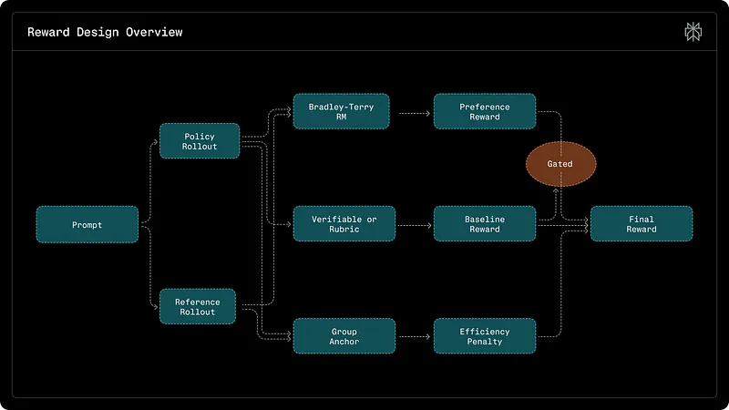
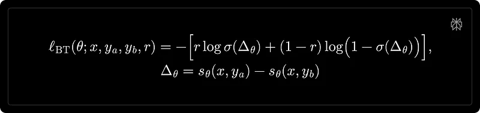
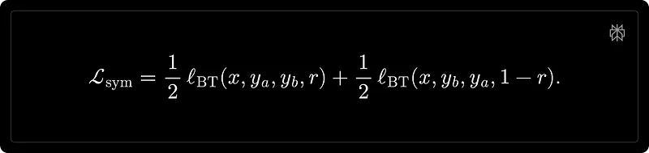
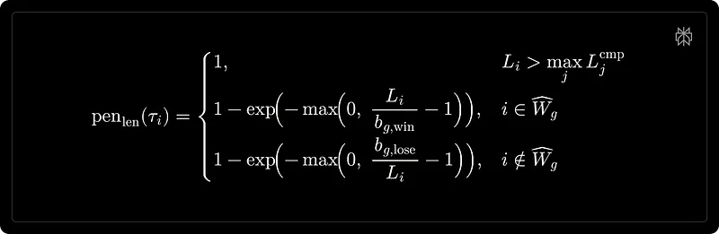
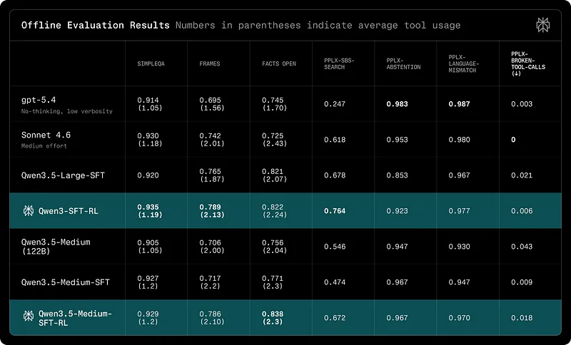
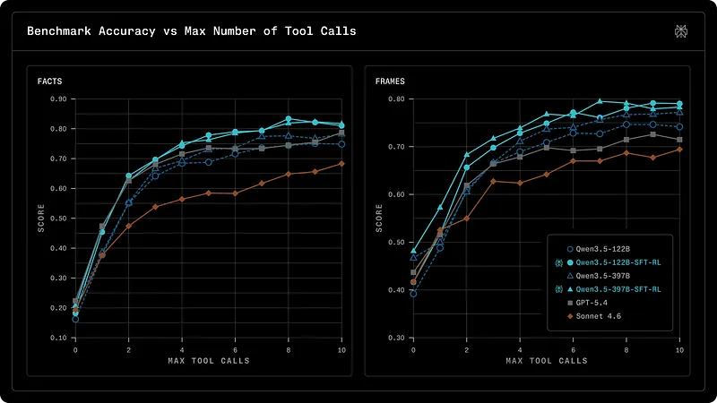

# Papers Explained - Advancing Search Augmented Language Models

This article describes Perplexity’s post-training pipeline for developing state-of-the-art web search agents based on open-source models. Training frontier web search agents requires jointly optimizing multiple objectives: factual accuracy, trajectory efficiency, and user preference alignment.

This page ingests the source article into the wiki and connects it to [[Papers Explained Corpus]], [[Agentic AI]], [[Model Compression and Efficiency]], [[Safety and Alignment]], [[Reinforcement Learning Topic]], [[Large Language Models]], [[Supervised Fine-Tuning]], [[On-Policy Distillation]], [[Reinforcement Learning]].

## Source Metadata

- Source file: `raw/draft_Papers-Explained--Advancing-Search-Augmented-Language-Models-bceb21866e26.md`
- Source title: Papers Explained: Advancing Search Augmented Language Models
- Canonical: [https://medium.com/p/bceb21866e26](https://medium.com/p/bceb21866e26)

## Key Ideas

- This article describes Perplexity’s post-training pipeline for developing state-of-the-art web search agents based on open-source models.
- A two-stage post-training recipe is adopted:
- SFT to establish deployment-critical behaviors such as guardrails (e.g., abstention), instruction following, and language consistency.
- On-policy RL to improve search capability, including answer accuracy and tool-use efficiency, while preserving the behaviors from stage one.
- Base models are from the Qwen3 family of models (Qwen3.5–122B-A10B and Qwen3.5–397B-A17B). A two-component SFT mixture dataset is constructed, targeting deployment-critical behaviors while preserving the base model’s general search capability.

## Notes

This article describes Perplexity’s post-training pipeline for developing state-of-the-art web search agents based on open-source models. Training frontier web search agents requires jointly optimizing multiple objectives: factual accuracy, trajectory efficiency, and user preference alignment.

A two-stage post-training recipe is adopted:

- SFT to establish deployment-critical behaviors such as guardrails (e.g., abstention), instruction following, and language consistency.

- On-policy RL to improve search capability, including answer accuracy and tool-use efficiency, while preserving the behaviors from stage one.

## SFT Stage

Base models are from the Qwen3 family of models (Qwen3.5–122B-A10B and Qwen3.5–397B-A17B). A two-component SFT mixture dataset is constructed, targeting deployment-critical behaviors while preserving the base model’s general search capability.

Instruction-following and style-focused examples targeting tone, language consistency, clarity, and formatting are curated. These examples need not admit a unique ground truth; rather, they are selected to reflect product writing requirements and ensure stylistic consistency across diverse query types. Queries and internal tasks across diverse interaction patterns (single-, two-, and multi-turn) are sampled and annotated with a tool-calling harness.

## RL stage

Starting from the SFT checkpoint, on-policy GRPO is applied to improve search accuracy and efficiency.

Baseline correctness is combined with preference-based and anchored efficiency shaping as rewards. Token-level Importance Sampling (IS) is applied to correct for the training–inference mismatch.

### RL Training Data

RL training data consists of two complementary components: verifiable search agent QA targeting general search capability, and rubric-based general chat explicitly reinforcing deployment guardrails to prevent regression during the RL training stage.

Verifiable search-agent data

An in-house synthetic QA dataset is constructed from internal seed queries. This approach avoids reliance on a curated knowledge graph, keeping the pipeline lightweight and easy to refresh. Each synthetic example is generated through the following steps:

- Seed selection: Documents for seed queries are retrieved and entities with multi-source fact confirmation are selected as starting points. Atomic statements about these entities are extracted.

- Multi-hop chain construction: From the seed entity’s statements, one that introduces a second entity is selected. This linking process is repeated 2–4 times, ensuring each entity is distinct and that no single statement trivially reveals the final answer.

- Name-free question synthesis: The entity chain is converted into a question by recursively replacing entity names with their connecting statements. This produces a nested question that requires multi-hop reasoning.

- Verification: Only questions with unique answers verified by multiple independent web-enabled solvers are retained.

To improve format diversity, the dataset is augmented with queries that include explicit formatting instructions (e.g., “Show a list of . . . ” or “Summarize . . . in a table”), while keeping the underlying answer unchanged.

Rubric-based general chat data

Non-verifiable queries are incorporated into RL training by converting deployment critical requirements: instruction following, formatting constraints, and safety conventions, into rubrics: atomic, objectively checkable criteria that a response must satisfy.

Given the full conversation history, an LLM is prompted to produce a reference response and a corresponding rubric set. Rubrics are derived under a fixed precedence order: requirements explicitly stated by the user take priority, followed by internal constraints, and finally necessary content requirements inferred from the reference response. Each rubric must be:

- Atomic: a single, well-defined check;

- Objective: verifiable without subjective judgment;

- Necessary: required to answer the query, not merely a stylistic preference.

To avoid overly strict or overly permissive rubric sets, a pass@4 filter is applied. For each query, four independent responses are sampled and evaluated against the full rubric set with an instruction-following judge. Queries for which no response satisfies the rubric set or all responses do are discarded, retaining only those that yield informative training signal.

Prompt mixture and variance balancing

The prompt mixture is reweighted at the dataset level, sampling 90% from verifiable QA and 10% from rubric-based data to balance the optimization signal across components.

### Reward design

A composite reward is constructed to incorporate preference-based scoring and efficiency shaping. A key challenge observed in early experiments was reward hacking: a simple linear combination of rewards allowed strong preference signals to compensate for factual or instructional failures. Gated aggregation is therefore adopted as a core design principle, formally defined as:

where rbase(Ti) denotes QA correctness or rubric satisfaction, s(Ti) is the preference score, and pen_eff(Ti) is an anchored efficiency penalty. This makes correctness a necessary condition for receiving preference credit, while still discouraging unnecessary tool use and verbosity.

Preference modeling

The aim is to align the policy model with users’ latent preferences over response quality: informativeness, clarity, and professional tone. These attributes are difficult to capture via LLM-judge prompts. A learned preference reward model is trained to score these attributes directly.

Preference learning is formulated under the Bradley–Terry framework. Given a context and two candidate responses ya, yb, the model produces scalar scores sθ and minimizes:

where r indicates whether yb is preferred.

To eliminate positional bias, each training pair is augmented with both orderings and optimized symmetrically

At inference time, a position-agnostic preference score is obtained by averaging both permutations:

Training data for preference modeling is drawn from curated open-source datasets, user side-by-side feedback, and internal annotations. To address label noise, a lightweight filtering and calibration pipeline is applied, retaining only examples with consistent cross-model agreement. The reward model shares the same backbone as the policy model, with the language modeling head replaced by a value head. While smaller reward models achieve comparable held-out accuracy, they fail to capture fine-grained preferences and can reinforce undesirable policy behaviors.

Efficiency penalty

In the absence of explicit efficiency shaping, the policy tends to overuse tools even on simple prompts. Unconditional penalties (e.g., those scaling linearly with tool-call count or output length) are a natural baseline, but they suppress necessary exploration and degrade learning. Group-relative, anchored penalties that regularize tool usage and response length relative to effective solutions within each GRPO group are therefore adopted. For a group 𝑔, the winner set is defined as Wg.

Anchored tool-call penalty: For each rollout Ti, let ci denote the number of tool calls and ei the number of tool-execution failures. The effective tool-call count is defined as ~ci = ci — ei. A group baseline (b_g) is uniformly sampled from the range between the minimum effective tool call in the group and the rounded-up mean effective tool call in the group:

Excess Δi is computed as max(0, ~ci — bg). A smooth penalty scalar pi is defined as 1 − exp (−Δi). The tool penalty is then

Anchored length penalty: Let Li and Lref_i denote the token lengths of the candidate and reference model generations, respectively. The shaping set ^Wg is defined as rollouts that are both correct and preferred. Group-specific length baselines are then computed:

The length penalty is defined as

Combined efficiency penalty: The combined efficiency penalty is a weighted sum of both components

## Results

Results are reported on a suite of benchmarks spanning search accuracy, factual reliability, instruction following, and safety. The benchmarks comprise both public benchmarks and internal Perplexity (PPLX) metrics.

- SimpleQA

- FRAMES

- Facts Open

- pplx-sbs-search: Side-by-side preference evaluation using an internal reward model. Candidates are compared against a strong baseline.

- pplx-abstention: Ability to refuse appropriately when no reliable evidence is available.

- pplx-language-mismatch: Language consistency under long-tail and multi-turn settings.

- pplx-broken-tool-calls (↓): Tool-call schema compliance and constraint following, for example, tool_choice=none .

- Qwen3.5-Large-SFT-RL achieves strong search accuracy across public benchmarks, matching or exceeding gpt-5.4 on FRAMES and Facts Open while using comparable tool budgets

To measure tool use efficiency, a budget-forced evaluation protocol is designed. Each model is given a hard cap on the number of tool calls allowed (the “budget”). This budget is swept from 0 (no tool use, pure parametric knowledge) to 10.

- Qwen3.5–397B-SFT-RL achieves the best search accuracy on both benchmarks. Even with a single tool call, it scores 57.3% on FRAMES, 5.7 points above GPT-5.4 and 4.7 points above Sonnet 4.6.

- The advantage is most pronounced at moderate budgets (b=2–7), which is the practical operating range for production deployments.

- For all models, diminishing returns are observed around budget=7, consistent across two benchmarks and all models, suggesting it is a property of the factuality-seeking tasks rather than the models.

## Paper

[Advancing Search-Augmented Language Models](https://research.perplexity.ai/articles/advancing-search-augmented-language-models)

## Figures

Figures from the Medium HTML export (`raw/draft_Papers-Explained--Advancing-Search-Augmented-Language-Models-bceb21866e26.md`); local copies under `wiki/assets/papers-explained-advancing-search-augmented-language-models/` when download succeeded.

| Figure | Caption |
|--------|---------|
|  | Post-training stack for Perplexity search agents (accuracy, trajectory efficiency, preference alignment on Qwen3.5 MoE bases). |
|  | RL stage with on-policy GRPO after SFT guardrails (search accuracy + tool efficiency objectives). |
|  | Synthetic verifiable QA construction: seeded retrieval, multi-hop chains, name-free questions, solver checks. |
|  | Rubric-based chat supervision: atomic objective checks, judge filtering, pass@4 dataset curation. |
|  | RL data mixture design (verifiable QA vs rubric chat reweighting). |
|  | Gated composite reward: factual/rubric correctness gates preference and efficiency credit. |
|  | Bradley–Terry preference optimization over paired assistant responses. |
|  | Anchored group-relative penalty on effective tool calls (discourage excess browsing). |
|  | Anchored length penalty tied to correct, preferred rollouts within each GRPO group. |
|  | Combined efficiency shaping from anchored tool and length terms. |
|  | Public eval coverage (SimpleQA, FRAMES, Facts Open) plus headline comparisons to frontier chat models. |
|  | Internal Perplexity reliability metrics (preference vs baseline, abstention, language consistency, tool-call validity). |
|  | Qwen3.5-Large SFT+RL matching or exceeding GPT-5.4-class models on search-heavy suites at comparable tool budgets. |
|  | Budget-forced search protocol: accuracy vs maximum allowed tool calls (sweep 0–10). |
|  | Best RL checkpoints vs GPT-5.4 / Sonnet on FRAMES and Facts Open across practical tool budgets. |
## Related

- [[Advancing Search-Augmented Language Models]] — canonical Perplexity Research source (`raw/advancing-search-augmented-language-models/`).
- [[Papers Explained Corpus]]
- [[Agentic AI]]
- [[Model Compression and Efficiency]]
- [[Safety and Alignment]]
- [[Reinforcement Learning Topic]]
- [[Large Language Models]]
- [[Supervised Fine-Tuning]]
- [[On-Policy Distillation]]
- [[Reinforcement Learning]]
- [[Papers Explained - Apriel-1.5-OpenReasoner]]

#summary #topic
