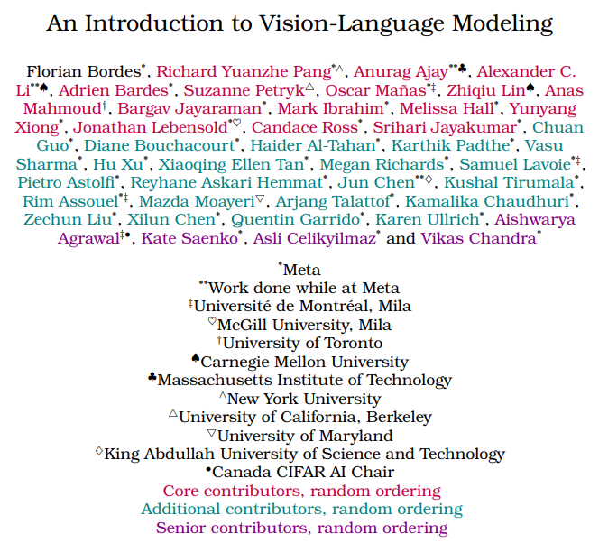
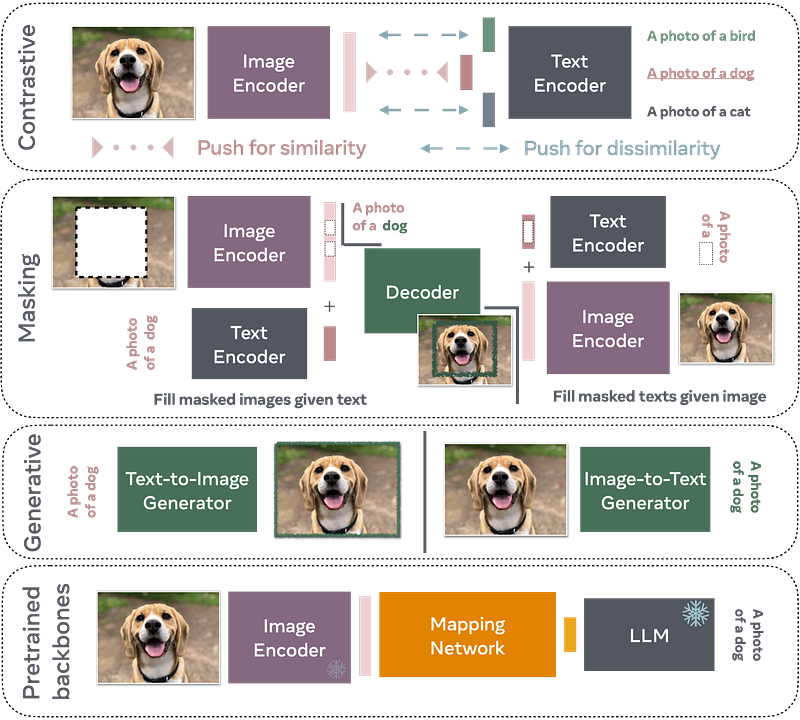
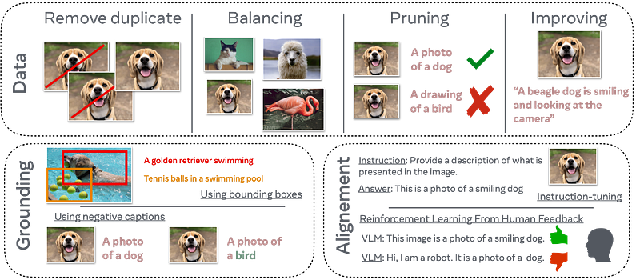
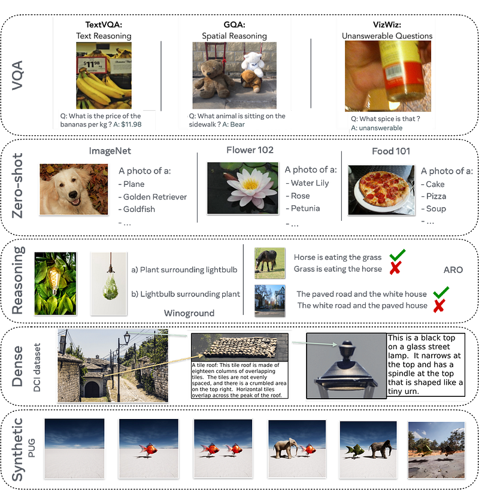

# Papers Explained - An Introduction to Vision-Language Modeling

The development of Vision-Language Models (VLMs), aims to connect vision to language and enable applications such as visual assistants and generative models that produce images from text descriptions. However, there are many challenges to improve the reliability of these models.

This page ingests the source article into the wiki and connects it to [[Papers Explained Corpus]], [[Large Language Models]], [[Vision Language Models]].

## Source Metadata

- Source file: `raw/2024-08-22_Papers-Explained--An-Introduction-to-Vision-Language-Modeling-89e7697da6e3.html`
- Source title: Papers Explained: An Introduction to Vision-Language Modeling
- Published: 2024-08-22
- Canonical: [https://medium.com/@ritvik19/papers-explained-an-introduction-to-vision-language-modeling-89e7697da6e3](https://medium.com/@ritvik19/papers-explained-an-introduction-to-vision-language-modeling-89e7697da6e3)

## Key Ideas

- The development of Vision-Language Models (VLMs), aims to connect vision to language and enable applications such as visual assistants and generative models that produce images from text descriptions.
- The most recent techniques to bridge the two domains are categorized into four training paradigms:
- Contrastive training: This approach uses pairs of positive and negative examples to train a Visual Language Model (VLM) to predict similar representations for positive pairs and different representations for negative pairs.
- Masking: This approach involves reconstructing masked image patches given unmasked text or reconstructing masked words in a caption given an unmasked image. This trains a VLM to learn a mapping between an image encoder and a pre-trained Language Model (LLM).
- Generative VLMs: These models are trained to generate images or captions and are often the most computationally expensive to train.

## Notes

## Papers Explained 191: An Introduction to Vision-Language Modeling

The development of Vision-Language Models (VLMs), aims to connect vision to language and enable applications such as visual assistants and generative models that produce images from text descriptions. However, there are many challenges to improve the reliability of these models. While language is discrete, vision evolves in a much higher dimensional space in which concepts cannot always be easily discretized.

## The Families of VLMs

*Figure: Families of VLMs.*

The most recent techniques to bridge the two domains are categorized into four training paradigms:

- Contrastive training: This approach uses pairs of positive and negative examples to train a Visual Language Model (VLM) to predict similar representations for positive pairs and different representations for negative pairs.

- Masking: This approach involves reconstructing masked image patches given unmasked text or reconstructing masked words in a caption given an unmasked image. This trains a VLM to learn a mapping between an image encoder and a pre-trained Language Model (LLM).

- Generative VLMs: These models are trained to generate images or captions and are often the most computationally expensive to train.

- Pretrained backbones based: These VLMs often leverage open-source LLMs like Llama to learn a mapping between an image encoder (which could also be pre-trained) and the LLM.

### Early work on VLMs

Researchers have extended BERT to process visual data, resulting in two models: visual-BERT and ViLBERT. These models combine text and image tokens and are trained on two objectives:

- a masked modeling task, where the model predicts the missing part of a given input

- a sentence-image prediction task, where the model predicts whether a caption accurately describes an image.

By leveraging these two objectives, the models achieve strong performance across various vision-language tasks, primarily due to the transformer model’s ability to learn associations between words and visual clues through attention mechanisms.

### Contrastive-based VLMs

Contrastive-based VLMs use contrastive learning techniques, particularly Noise Contrastive Estimation (NCE) and InfoNCE, to differentiate between real and noisy samples. These methods rely on constructing positive and negative pairs of data points and optimizing the model to distinguish between them, leveraging large mini-batches for better performance. This approach has been successfully applied in self-supervised learning to learn useful representations from unlabeled data.

- CLIP (Contrastive Language-Image Pre-training) is a method that uses the InfoNCE loss to train a model to map image and caption representations to similar vectors in a shared space. It achieves remarkable zero-shot classification transfer capabilities and surpasses supervised models on robustness benchmarks.

- SigLIP is similar to CLIP but uses the original NCE loss based on binary cross-entropy instead of InfoNCE. This change enables better 0-shot performances on smaller batch sizes than CLIP.

- Llip (Latent Language Image Pre-training) accounts for the fact that an image can be captioned in multiple ways. It proposes conditioning the image encoding on the target caption via a cross-attention module, which increases the representation’s expressivity and improves downstream zero-shot transfer classification and retrieval performance.

### VLMs with masking objectives

Masking is a commonly used technique in deep learning research. It can be viewed as a specific form of denoising autoencoder in which the noise has a spatial structure. Masking is particularly well-suited for the transformer architecture since the tokenization of an input signal makes it easier to randomly drop specific input tokens.

- BERT used Masked Language Modeling (MLM) during training to predict missing tokens in a sentence.

- MAE works on the vision side to learn representations by using Masked Image Modeling (MIM).

There have been works that combined both techniques to train VLMs.

- FLAVA (Foundational Language And Vision Alignment) comprises three core components: Image Encoder (ViT) to process images into patches for linear embedding and transformer-based representation, including a classification token ([CLSI]). The Text Encoder tokenizes textual input and embeds them into vectors for contextual processing and outputting hidden state vectors alongside a classification token ([CLST]).Both of those encoders are trained using masking approaches. Building upon these, the Multimodal Encoder fuses hidden states from both the image and text encoders, leveraging learned linear projections and cross-attention mechanisms within the transformer framework to integrate visual and textual information, highlighted by an additional multimodal classification token ([CLSM]). The model employs a comprehensive training regimen that combines multimodal and unimodal masked modeling losses along with a contrastive objective.

- FLAVA relies on pre-trained vision encoders, which can be a limitation. Addressing this, MaskVLM applies masking directly in the pixel space and text token space. MaskVLM uses the flow of information between the image and text modalities to enable text reconstruction and image reconstruction, allowing it to work across both text and image domains without relying on third-party models.

### Generative-based VLMs

The generative paradigm differs from previous training methods, which primarily operate on latent representations to create images or text abstractions that are then mapped between each other. Instead, the generative paradigm focuses on generating text and/or images.

- CoCa (Contrastive Captioner) uses a generative loss corresponding to captions generated by a multimodal text decoder that takes in image encoder outputs and representations produced by the unimodal text decoder as inputs. The new loss allows the ability to perform new multimodal understanding tasks (e.g., VQA) without the need for further adaptation using multimodal fusion modules.

- CM3Leon is a foundation model for text-to-image and image-to-text generation. It uses a special token to indicate transitions between modalities allowing the model to process interleaved text and images. The tokenized images and texts are then passed to a decoder-only transformer model which is trained using a two-stage process: first, it undergoes retrieval-augmented pretraining, where it is trained on a large dataset of multimodal documents using a CLIP-based encoder as a dense retriever. This stage increases the model’s data efficiency. The second stage involves supervised fine-tuning, where the model is trained on multi-task instructions to process and generate content across different modalities.

- Chameleon is a new series of mixed-modal foundation models that can generate and reason with mixed sequences of interleaved textual and image content. It is designed to be mixed-modal from the beginning and uses a uniform architecture trained from scratch on a blend of all modalities. The model employs fully token-based representations for both images and text and uses a combination of architectural innovations and training techniques to address optimization stability and scaling challenges.

- Some models are only trained to generate images based on text such as Stable Diffusion, Imagen, and Parti. However, even if they are trained to only generate images, they can also be leveraged to solve several vision-language understanding tasks.

### VLMs from Pretrained Backbones

To avoid the significant computational resources required to train VLMsfrom scratch, researchers have explored leveraging existing LLMs and/or visual extractors. By leveraging these models, it is possible to learn a mapping between the text and image modalities, enabling LLMs to answer visual questions with minimal compute resources.

- Frozen connects a vision encoder (NF-ResNet-50) to a frozen language model (a 7 billion-parameter transformer trained on C4) through a lightweight mapping network. The vision encoder and the linear mapping are trained from scratch, while the pre-trained language model is kept frozen to preserve its learned features.The model is trained on the Conceptual Captions dataset using a simple text generation objective. At inference time, the language model can be conditioned on interleaved text and image embeddings.

- MiniGPT-4 is a multimodal language model that accepts text and image input and produces text output. It uses a simple linear projection layer to align the image representation with the input space of the Vicuna language model.

- MiniGPT-5 extends MiniGPT-4 by allowing the output to contain text interleaved with images. It uses generative tokens that can be mapped to feature vectors and fed into a frozen Stable Diffusion 2.1 model. The model is trained on downstream tasks such as multi-modal dialogue generation and story generation.

- MiniGPT-v2 is a universal interface for various vision-language tasks such as image captioning, visual question answering, and object grounding. It introduces unique identifiers for different tasks when training, enabling the model to distinguish each task instruction effortlessly and learn efficiently.

- The Qwen-VL and Qwen-VL-Chat models consist of three components: an LLM, a visual encoder, and a mechanism that aligns the visual representation with the input space of the LLM. The LLM is initialized from Qwen-7B, a previously trained model. The visual encoder is based on ViT-bigG. The visual representation is compressed into a sequence of fixed length (256) using a one-layer cross-attention module, which is then fed into the LLM.

- BLIP-2 takes images as input and generates text output. The model uses a vision encoder to produce image embeddings, which are then mapped into the input space of an LLM. A relatively small component called a Q-Former is trained for this mapping. The Q-Former is a Transformer that takes in a fixed number of randomly-initialized “query” vectors. In the forward pass, the queries interact with image embeddings via cross-attention in the Q-Former, followed by a linear layer that projects the queries to the LLM’s input space.

## A Guide to VLM Training

*Figure: Important considerations to keep in mind when training VLMs.*

### Training data

The DataComp benchmark is a method to evaluate the quality of pretraining datasets for VLMs by fixing the model architecture and hyperparameters of CLIP and designing image-text datasets that achieve strong zero-shot and retrieval performance on 38 downstream tasks. The benchmark provides multiple pools of noisy web datasets, ranging from small to extra-large, and proposes multiple filtering strategies to eliminate low-quality pairs.

DataComp demonstrates that data pruning is a crucial step in training highly efficient and performant VLMs. The filtering strategies can be categorized into three categories: heuristics, bootstrapping methods, and methods that aim to create diverse and balanced datasets.

- Heuristics can be further categorized into unimodal and multimodal filters. Unimodal heuristics include removing captions with low text complexity, eliminating non-English alt-text, and removing images based on their resolution and aspect ratio. Multimodal heuristics involve methods that employ image classifiers to filter out image-text pairs that do not have a good alignment between the image and text.

- Bootstrapping methods include ranking image-text pairs based on their multimodal alignment using a pretrained VLM, such as CLIPScore, which computes the cosine similarity between image and text embeddings. LAION filtering uses a pretrained CLIP model to evaluate the image-text alignment of large web-scale datasets and filter out samples with the lowest CLIPScore. T-MARS detects and masks text regions in images before computing the CLIPScore, resulting in a more accurate alignment score. Sieve uses generative image captioning models to minimize false positives and negatives resulting from CLIPScore ranking.

- Methods that aim to create diverse and balanced datasets include sampling image-text pairs that are semantically similar to diverse and curated datasets like ImageNet, and using metadata to create a pretraining data distribution that captures a wide range of concepts. MetaCLIP uses 500,000 queries from Wikipedia/WordNet as metadata to create a pretraining data distribution that captures a wide range of concepts. However, collecting a perfectly balanced dataset is impractical due to the natural long-tailed distribution of web data.

Improving the training data with synthetic data

- Bootstrapping Language-Image Pre-training (BLIP) performs bootstrapping by generating synthetic samples and filtering out noisy captions.

- One common approach is to use large image-captioning models like BLIP, BLIP2, Large Language-and-Vision Assistant (LLaVA) to replace poorly aligned alt-text labels with descriptive synthetic captions, or using these as a captioning model.

- Another approach is to use generated images from text-to-image generative models like large-scale diffusion models.

Using data augmentation

- SLIP introduces an auxiliary self-supervised loss term on the vision encoder, generating two augmentations of an input image to create a positive pair contrasted with all other images in the batch. This addition provides a regularization term that improves learned representations, but only uses the SSL loss for the visual encoder, missing the important signal from text.

- To fully exploit the signal from text, CLIP-rocket suggests converting SSL losses to be cross-modal. It shows that the CLIP contrastive loss can be used with multiple augmentations of the image-text pair, outperforming non-contrastive alternatives inspired by SSL. In CLIP-rocket, the input image-text pair is augmented in an asymmetrical way, with one weak and one strong set of augmentations.

- The two resulting augmented pairs are embedded with the standard CLIP encoder and then projected to the multimodal embedding space using two different projectors. The projector for the weakly augmented pair is a linear layer, while the projector for the strongly augmented pair is a 2-layer MLP to cope with noisier embeddings. It is crucial to separate the two projectors, as the strong one learns more invariant, but potentially too invariant, representations for downstream tasks.

Interleaved data curation

Autoregressive language models like Flamingo and MM1 have shown that including interleaved text and image data during training improves few-shot performance of the model.

- Natural Interleaved Data: The OBELICS dataset is an example of this category,it is constructed by preserving the intrinsic structure and context in which text and images co-occur within web documents.

- MMC4 is a good example of this type of dataset where text only dataset is retrofitted with images collected from the internet, in this process images are paired with text based on contextual relevance enabled by calculating the CLIP based similarity scores.

Assessing multimodal data quality

High-quality, interleaved multimodal data is crucial for optimal VLM performance. To quantify data quality, methods have been developed to assess the quality of text, images, and alignment information between the two. For example, QuRating, Data Efficient LMs, and text-quality-based pruning evaluate textual data quality, while VILA and LAION-aesthetics assess image aesthetic quality. The CLIP family of approaches evaluates the coherence of textual data with respect to provided images. Despite these efforts, there is still a lack of a holistic approach to evaluating the quality of multimodal and interleaved data, which remains an active area of research to improve VLM training.

### Which model to use

- Contrastive models like CLIP: These models are good for building datasets and can be used as a starting point for more complex models. However, they are not generative models and require large datasets and resources to train.

- Masking: This approach can be less efficient than contrastive models but has the advantage of not requiring negative examples, making it possible to use smaller mini-batches.

- Generative models: These models can be computationally expensive to train but can learn an implicit joint distribution between text and images, which might be more suited for learning good representations.

- Using a pre-trained LLM on a pre-trained backbone: This approach can be a good alternative when resources are limited, but the VLM may be impacted by the potential hallucination of the LLM and any bias coming from the pre-trained models.

### Improving grounding

Grounding is a crucial challenge in the VLM and generative model literature, aiming to solve the problem of models not understanding text prompts well, which can lead to ignoring parts of the prompt or hallucinating non-existent information. To improve grounding, researchers have employed various techniques, including:

- Using bounding box annotations: Models like X-VLM leverage bounding box annotations and incorporate box regression and Intersection over Union (IoU) loss to accurately locate and align visual concepts with textual descriptions. This approach enables the model to associate text with the correct visual clues, improving grounding.

- Creating own image-text datasets: Methods like Kosmos-2 rely on public models to create their own image-text datasets by extracting nouns from text captions and using a grounded model to predict bounding boxes associated with the nouns. This approach enables the use of large-scale web-annotated datasets, but is limited by the strength of the grounding model for bounding box detection.

- Negative captioning: Negative samples within contrastive objectives have been used to mitigate collapse, enhance generalization, and discriminative feature learning. Similarly, negative samples can be used in VLMs to mitigate various problems, such as incorrect or nonsensical pairings. This approach has demonstrated that VLMs can benefit from nuanced differentiation capabilities, leading to more accurate and contextually aware models.

### Improving alignment

The success of instruction tuning in the language domain has motivated the incorporation of instruction-fine-tuning and Reinforcement Learning from Human Feedback (RLHF) in vision-language models to improve multimodal chat capabilities and align outputs with desired responses.

Instruction-tuning involves fine-tuning a vision-language model on supervised data containing instructions, inputs, and the desired response. This approach has been used in models such as LLaVa, InstructBLIP, and OpenFlamingo. RLHF, on the other hand, aims to align model outputs with human preferences by training a reward model to match human preferences and fine-tuning the primary model with the reward model.

LLaVa is a prominent vision-language model that incorporates instruction-fine-tuning and has shown improvements in multimodal chat capabilities and instruction-following benchmarks. LLaVa 1.5 is an improved version of LLaVa that uses a cross-modal fully connected multi-layer perceptron (MLP) layer and incorporates academic VQA instruction data. LLaVa-RLHF is another version of LLaVa that uses a novel RLHF algorithm to improve multimodal alignment and reduce hallucinated outputs.

LLaVa-NeXT is the latest version of LLaVa that improves over LLaVa-v1.5 by increasing the image resolution, improving the visual instruction tuning data mixture, and using a larger model variant with a 34B-parameter LLM backbone. LLaVa-NeXT achieves state-of-the-art performance compared to open-source multimodal LLMs and closes the gap with commercial models.

Multimodal in-context learning is also possible, as demonstrated by Otter, which shows that a few examples can be provided as context and the model can successfully follow instructions in test examples without extra fine-tuning. This ability is attributed to fine-tuning on the multimodal instruction tuning dataset MIMIC-IT, which contains around 2.8M multimodal instruction-response pairs with in-context examples.

### Improving text-rich image understanding

The success of Multimodal Large Language Models (MLLMs) has enabled the ability to handle zero-shot tasks in various real-world scenarios. However, these models often struggle with interpreting texts within images when presented with complex relationships between data types. To address this issue, researchers have proposed several approaches:

- Instruction tuning with fine-grained text-rich data: LLaVAR enhances the visual instruction tuning pipeline with text-rich images, such as movie posters and book covers. The model uses publicly available OCR tools to collect results on 422K text-rich images and then prompts text-only GPT-4 with recognized text and image captions to generate conversations. This approach improves the capability of the LLaVA model by up to 20% accuracy on text-based VQA datasets.

- Dealing with fine-grained text in high-resolution images: Monkey is a new approach that processes input images in uniform patches using a sliding window method, each matching the size used in the original training of the well-trained vision encoder. This allows Monkey to handle higher resolutions up to 1344×896 pixels, enabling the detailed capture of complex visual information. Monkey also employs a multi-level description generation method, enriching the context for scene-object associations.

- Decoupled Scene Text Recognition Module: Lumos proposes a multimodal assistant with text understanding capabilities that leverages a combination of on-device and cloud computation. Lumos uses a decoupled Scene text recognition (STR) module, which contains four sub-components: ROI detection, Text detection, Text recognition, and Reading-order reconstruction. The STR module can be run on-device, reducing power and latency from transferring high-resolution images to the cloud.

### Parameter-Efficient Fine-Tuning

PEFT methods for VLMs can be categorized into four main groups:

LoRA-based methods:

- LoRA is a popular method for parameter fine-tuning, which can be applied to both pure language models and VLMs.

- QLoRA integrates LoRA with a quantized backbone and enables the back-propagation of gradients through a frozen, 4-bit quantized pre-trained language model into LoRA.

- VeRA reduces the number of trainable parameters in comparison to LoRA, while maintaining equivalent performance levels.

- DoRA decomposes the pre-trained weight into two components, magnitude and direction, for fine-tuning.

Prompt-based methods:

- Context Optimization (CoOp) optimizes the context words of the prompt using learnable vectors during the training process.

- Visual Prompt Tuning (VPT)introduces a minimal amount (less than 1% of model parameters) of trainable parameters in the input space.

Adapter-based methods:

- CLIP-Adapter fine-tunes with feature adapters on either the visual or language branch.

- VL-adapter evaluates various adapter-based methodologies within a unified multi-task framework across a diverse range of image-text and video-text benchmark tasks.

- LLaMA-Adapter V2 proposes a parameter-efficient visual instruction model that enhances large language models’ multi-modal reasoning capabilities without requiring extensive parameters or multi-modal training data.

Mapping-based methods:

- A very simple approach is training a mapping between pre-trained unimodal modules (i.e., vision encoders and LLMs), while keeping them completely frozen and free of adapter layers.

- LiMBeR uses a linear layer that projects visual features to have the same LLM hidden state dimension.

- MAPL designs a mapping network which addresses the issue of increasing computational cost by aggregating the visual feature vectors into a smaller set.

## Approaches for Responsible VLM Evaluation

*Figure: Different methods to evaluate VLMs*

### Benchmarking visio-linguistic abilities

The various methods for evaluating Visio-Linguistic Abilities of VLMs include:

- Image Captioning: Evaluating the quality of captions generated by a VLM using metrics such as BLEU, ROUGE, or CLIPScore.

- Text-to-Image Consistency: Evaluating the ability of a VLM to generate an image given a caption using metrics such as CLIPScore or VQAScore.

- Visual Question Answering (VQA): Evaluating the ability of a VLM to answer natural language questions about images using metrics such as VQA Accuracy or Selective Prediction.

- Text-Centric Visual Question Answering: Evaluating the ability of a VLM to answer questions about textual content in images using metrics such as Text Recognition, Scene Text-Centric VQA, or Document-Oriented VQA.

- Zero-shot Image Classification: Evaluating the ability of a VLM to classify images without explicit training on the classification task using metrics such as accuracy or F1-score.

- Visio-Linguistic Compositional Reasoning: Evaluating the ability of a VLM to understand the relationships between objects, attributes, and orders in images using metrics such as Winoground, ARO, or SUGARCREPE.

- Dense Captioning and Crop-Caption Matching: Evaluating the ability of a VLM to provide detailed descriptions of images and match captions to specific parts of the image using metrics such as DCI or Segment Anything.

- Synthetic Data-based Visio-Linguistic Evaluations: Evaluating the ability of a VLM to recognize objects, relationships, and spatial locations in synthetic images using metrics such as PUG or Unreal Graphics.

### Benchmarking Bias and disparities in VLMs

The methods of benchmarking biases in VLMs can be categorized into two main approaches: benchmarking bias via classifications and benchmarking bias via embeddings.

Benchmarking bias via classifications

Evaluations are commonly done with real data, such as images of faces with group labels related to race, gender, and age. Notable patterns of harmful associations and disparities among race, gender, and age groups have been found in CLIP. It is important to be aware of variations in prevalence between groups in real evaluation data sources, as this may affect disparity evaluations. Synthetic data can also be used to evaluate biases, such as gender-balanced contrast sets generated using diffusion models.

Benchmarking bias via embeddings

Embedding space analyses can unveil learned relationships that are difficult to measure in evaluation tasks. Grounded-WEAT and Grounded-SEAT measure biases similar to those found in implicit associations in humans. Demographic biases have been discovered when mapping images to the encoding of demographic attributes, such as gender, skin tone, and age. Language biases might impact benchmarking, and it is crucial to address the challenge of curating multimodal benchmarks.

### Benchmarking Hallucinations

Hallucinations are a major concern for Large Language Models (LLMs) and Vision-Language Models (VLMs), as they can produce false information with high confidence. VLMs can hallucinate text or captions that are not related to the image, making it important to assess their ability to not hallucinate.Existing benchmarks for object hallucination, such as CHAIR, have limitations, including being limited to a fixed object set and not evaluating long generations. Newer efforts, such as POPE, GAVIE, CCEval, and MMHal-Bench, use model-based approaches to evaluate object hallucination and provide more comprehensive evaluation. Human evaluation is also an important aspect of benchmarking hallucinations.

### Benchmarking Memorization

Memorization of training data is a concern for VLMs, particularly for joint embedding models like CLIP. A popular approach is Using a 𝑘-nearest neighbor test to evaluate déjà vu memorization, where they query a VLM with captions and measure its ability to “remember” objects present in the training. Text randomization is an effective regularization technique to reduce memorization without severely penalizing model utility. Memorization can be quantified by measuring the gap between the object detection precision/recall scores of the target and reference models.

### Red Teaming

Red teaming in the context of foundation models refers to trying to exploit the public interface of the model to generate undesirable output. Red teaming efforts typically involve creating adversarial datasets aimed at eliciting harm, such as sensitive images with prompts that could elicit harmful output. Red teaming work has already been developed for text-to-text and text-to-image models, and leaderboards have been created to benchmark language models across a range of adversarial tasks. To mitigate certain risks, post-processing methods or model fine-tuning methods, such as Reinforcement Learning for Human Feedback, can be used after performing a red team evaluation.

## Extending VLMs to Video

While VLMs have been trained and evaluated on static visual data (images), videos bring new challenges and capabilities, such as understanding motion and dynamics, and localizing objects and actions in space and time. Specifically:

- Storing and processing video data, which can be 24 times larger than image data (e.g., 24 fps video)

- Using compressed video formats (e.g., H.264 encoding) with on-the-fly video decoders

- Initializing video encoders from image encoders

- Implementing spatial and temporal pooling/masking mechanisms in video encoders

- Using non-end-to-end VLMs, which extract video features offline and train models on those features instead of frames of pixels

### Early work on Videos based on BERT

VideoBERT is an early fusion approach that uses a single transformer network to fuse visual and textual tokens representing video caption pairs. The model is trained on a dataset of instructional cooking videos from YouTube, with aligned text obtained using automatic speech recognition (ASR). Each frame of the video corresponds to a single visual token, and the pretraining objective is based on the popular BERT language model, where some tokens are masked and reconstructed. VideoBERT demonstrates strong alignment and is able to perform well on video tasks that require generating text, such as zero-shot action classification and open-ended video captioning.

MERLOT, on the other hand, is a self-supervised approach that achieves video language alignment by temporally aligning text with video. The model is trained on a large-scale dataset of YouTube videos with less curated and more diverse content, and the corresponding text is obtained using ASR. The model uses a transformer network trained with a contrastive objective between local text tokens and frame visual tokens, a masked language modeling objective, and a temporal reordering objective. MERLOT demonstrates impressive capabilities on question answering tasks, particularly visual common sense reasoning. It is able to transfer the knowledge it has learned from videos to answer questions about what is going to happen next from an image, and it is able to answer particularly difficult questions from videos on a wide set of datasets and benchmarks. However, the main limitation of MERLOT is that it lacks the ability to generate text, which prevents it from demonstrating advanced visual reasoning capabilities.

### Enabling text generation using an early-fusion VLM

VideoOFA is an early-fusion Video-Language Model (VLM) designed for video-to-text generation. Unlike previous VLMs, VideoOFA does not separate the video encoder and text decoder, but instead uses a two-stage pre-training framework to adapt a single generative image-text VLM to video-text tasks. The framework consists of two stages:

- Initialization: VideoOFA starts with an image-text VLM that can generate text and is pre-trained on massive image-text data to learn fundamental visual-language representations.

- Intermediate pre-training: VideoOFA adapts the backbone VLM to video-text tasks and learns video-specific concepts such as temporal reasoning through an intermediate pre-training stage. This stage consists of three training objectives, all reformulated as video-to-text generation tasks:

- Video Captioning: generating a caption for a given video.

- Video-Text Matching: matching a video with a given text.

- Frame Order Modeling: modeling the order of frames in a video.

### Using a pre trained LLM

The idea is to leverage the power of existing Large Language Models (LLMs) by aligning a pre-trained visual backbone with the LLM, often using captioning objectives. This approach is demonstrated by Video-LLaMA, which aligns language with video and audio signals using a pre-trained LLM and a captioning loss. The model is fine-tuned on visual instructional data and is accessible through a chat API, allowing users to interact with the model using text prompts, videos, and images.

Another approach is MiniGPT4-Video, which extends MiniGPT-v2 for video comprehension with text input. This model adapts the scheme from MiniGPT-v2 by concatenating every four adjacent visual tokens into one single token, and also extracts text tokens from subtitles for each frame. The architecture consists of a vision encoder, a single linear projection layer, and a large language model.

To evaluate the effectiveness of MiniGPT4-Video, three types of benchmarks are used: Video-ChatGPT, Open-Ended Questions, and Multiple-Choice Questions (MCQs). MiniGPT4-Video consistently outperforms existing state-of-the-art models, including Video-LLaMA, on several benchmarks, such as MSVD, MSRVTT, TGIF, and TVQA.

### Opportunities in evaluations

While video benchmarks may share similarities with image ones, such as captioning, videos offer unique evaluation opportunities. For instance, datasets like EgoSchema require models to answer questions about long videos, understanding interactions between objects/agents, which goes beyond describing the scene. Other datasets, like ActivityNet-QA, MSVD-QA, and MSRVTT-QA, require models to retrieve relevant frames or localize actions to answer questions accurately.

However, some questions can be answered by looking at a single frame, raising the question of how much the temporal aspect of videos is necessary to solve current video benchmarks. Understanding the semantic aspect of actions in videos is crucial, but videos also provide opportunities to probe reasoning capabilities and the understanding of the world of models.

Synthetic data has been effective in probing reasoning capabilities of video-based VLMs. For example, videos are generated to either follow or violate the laws of physics, and models are asked if elements in the video follow the laws of physics. Surprisingly, models like VideoLLaMA and PandaGPT do not exceed random performance, while humans achieve over 80% accuracy. This suggests that video VLMs still lack basic reasoning capabilities that can be probed efficiently using synthetic data

### Challenges in leveraging video data

The main challenge in video-text pretraining is the scarcity of weak supervision on temporal space, which is illustrated in VideoPrism. Existing video data focuses on describing scene content rather than actions or motion, causing video models to downgrade to image models. Additionally, CLIP models trained on video can exhibit a noun bias, making it harder to model interactions and resulting in models that lack temporal understanding.

Generating paired video-caption data that includes information about scene content and temporal aspects is more complex and costly than describing an image. Possible solutions include using a video captioning model to generate more captions, but this requires an initial high-quality dataset to train the captioner. Another option is to train a video encoder on video alone, which was used in VideoPrism to limit the impact of imperfect captions.

Beyond data, another challenge is compute, as processing videos is more expensive than images and has more redundant information. To address this, more efficient training protocols are needed, such as masking, which has been effective in image-based VLMs.

## Paper

An Introduction to Vision-Language Modeling [2405.17247](https://arxiv.org/abs/2405.17247)

Recommended Reading [Multi Modal Transformers](https://ritvik19.medium.com/list/multi-modal-transformers-67453f215ecf)

## Figures

Figures from the Medium HTML export (`raw/2024-08-22_Papers-Explained--An-Introduction-to-Vision-Language-Modeling-89e7697da6e3.html`); local copies under `wiki/assets/papers-explained-an-introduction-to-vision-language-modeling/` when download succeeded.

| Figure | Caption |
|--------|---------|
|  | Vision-language modeling landscape: linking continuous vision with discrete language for assistants and generative use cases. |
|  | Families of VLMs (contrastive, masking, generative, pretrained-backbone hybrids). |
|  | Practical considerations for training VLMs (data quality, filtering, balancing, evaluation). |
|  | Evaluation protocols and benchmarks for assessing VLMs across tasks and robustness axes. |
## Related

- [[Papers Explained Corpus]]
- [[Large Language Models]]
- [[Vision Language Models]]
- [[Papers Explained 190 - BLIP-3 (xGen-MM)]]
- [[Papers Explained 192 - Phi-3.5]]

#summary #topic
