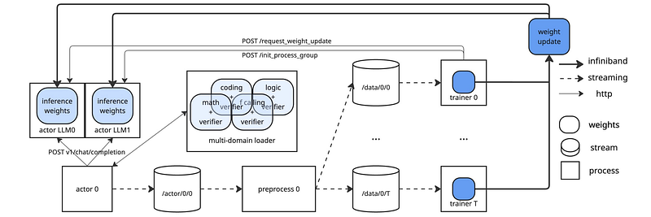
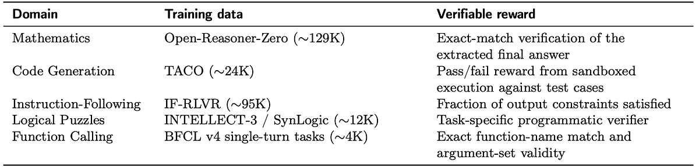
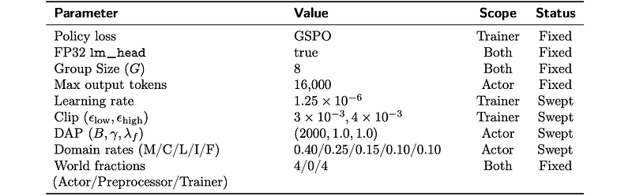
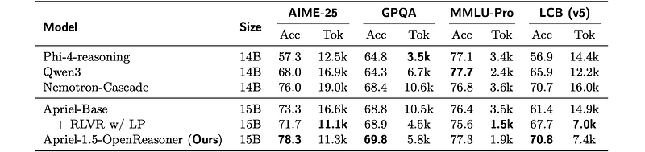
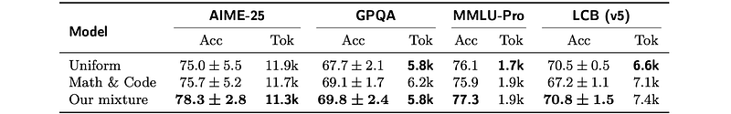

# Papers Explained - Apriel-1.5-OpenReasoner

Domains that have produced fewer completions than intended get αd > 1 and are up-weighted, while over-represented domains are down-weighted. If a domain has no completions yet, αd = 10.0 is set. The clipping bounds prevent extreme corrections when a domain is heavily over- or under-represented. The domain is then sampled with probability:

This page ingests the source article into the wiki and connects it to [[Papers Explained Corpus]], [[Reasoning Models]], [[Large Language Models]].

## Source Metadata

- Source file: `raw/draft_Papers-Explained--Apriel-1-5-OpenReasoner-5826103aac57.html`
- Source title: Papers Explained: Apriel-1.5-OpenReasoner
- Canonical: [https://medium.com/p/5826103aac57](https://medium.com/p/5826103aac57)

## Key Ideas

- Domains that have produced fewer completions than intended get αd > 1 and are up-weighted, while over-represented domains are down-weighted. If a domain has no completions yet, αd = 10.0 is set.
- At the initial stages of training, the static distribution pd = wd, i.e., the configured domain ratios, is used until at least 50 total completions have been collected. Once a domain is selected, a sample is drawn uniformly from that domain.
- Length Penalty (LP): Let L denote the maximum output length, and B be the buffer width. For a prompt x and rollout ˆyi of length li, the penalty is applied linearly within a buffer zone before the maximum length:
- Rollouts shorter than L−B incur no penalty, while those approaching L are penalized proportionally. The final reward combines the task reward R(x,ˆyi) with this penalty:
- where λ controls the penalty strength. In the standard setting, λ= 1 for all rollouts.

## Notes

Apriel-1.5-OpenReasoner is trained with a fully reproducible multi-domain RL post-training recipe on Apriel-Base, a 15B open-weight LLM, across five domains using public datasets: mathematics, code generation, instruction following, logical puzzles and function calling. It introduces an adaptive domain sampling mechanism that preserves target domain ratios despite heterogeneous rollout dynamics. Additionally, a difficulty-aware extension of the standard length penalty that, with no additional training overhead, encourages longer reasoning for difficult problems and shorter traces for easy ones is implemented.

*Figure: PipelineRL with the multi-domain extensions used in this work.*

### Adaptive Multi-Domain Sampling

Training across multiple domains requires coordinating rollout generation across environments with heterogeneous characteristics. The time required to generate a rollout and compute its reward can vary substantially across domains. Also, zero-advantage group filtering introduces an additional imbalance in the training data in that harder domains tend to yield fewer retained trajectories because successful samples are less frequent. To maintain target domain ratios throughout training, a simple adaptive sampling strategy is implemented. Let D be the set of domains, and let wd > 0 denote the configured target weight for domain d, where d∈Dwd = 1. When the actor samples a new problem for a rollout, let nd be the current number of completed rollouts from domain d and N= j∈Dnj the total up to this point. To correct for drift from the configured domain mixture, an adjustment factor is first computed:

Domains that have produced fewer completions than intended get αd > 1 and are up-weighted, while over-represented domains are down-weighted. If a domain has no completions yet, αd = 10.0 is set. The clipping bounds prevent extreme corrections when a domain is heavily over- or under-represented. The domain is then sampled with probability:

At the initial stages of training, the static distribution pd = wd, i.e., the configured domain ratios, is used until at least 50 total completions have been collected. Once a domain is selected, a sample is drawn uniformly from that domain.

### Difficulty-Aware Length Penalty

Length Penalty (LP): Let L denote the maximum output length, and B be the buffer width. For a prompt x and rollout ˆyi of length li, the penalty is applied linearly within a buffer zone before the maximum length:

Rollouts shorter than L−B incur no penalty, while those approaching L are penalized proportionally. The final reward combines the task reward R(x,ˆyi) with this penalty:

where λ controls the penalty strength. In the standard setting, λ= 1 for all rollouts.

Difficulty-Aware Length Penalty (DAP): The key idea behind DAP is to modulate λ based on problem difficulty, so that difficult problems receive a weaker penalty and are allowed to reason longer. Difficulty is estimated from the solve rate within each group: given N rollouts for a prompt x, the solve rate is computed as:

where ci = ⊮[R(x,ˆ yi) = 1] indicates whether rollout i produced a correct answer. A low solve rate indicates a harder problem.

The penalty is then set as:

For correct rollouts, the penalty is scaled by sγ where γ ≥0 is a constant: when the solve rate sis low (hard problem), λ becomes small and the penalty is relaxed, allowing the model to use more reasoning tokens. For incorrect rollouts, the penalty reduces to the standard length penalty with a fixed scaling factor λf ∈[0,1]. The upper-bound guard ensures that rollouts which are truncated at the maximum length without finishing always receive the full penalty, preventing degenerate solutions that exhaust the budget. DAP modifies only the reward ri upstream and does not alter the policy loss.

In experiments, γ = 1.0 and λf = 1.0 are used, i.e., incorrect rollouts always receive the full penalty, while the penalty on correct but overlong rollouts is scaled by the solve rate.

## Experimental Setup

### Training Domains and Verifiers

*Figure: Summary of the five training environments used for joint multi-domain RL.*

Each training domain is defined by a dataset and a verifiable reward function, which together constitute an environment.

- Mathematics: The dataset includes approximately 129K math problems ranging from high-school to competition-level difficulty. It comprises the original 57K problems from sources like AIME, MATH, NuminaMath, and Tulu3 MATH, plus an extended 72K subset from OpenR1-Math-220k. A binary reward is given based on answer correctness, verified by a rule-based system comparing the model’s answer to the ground truth.

- Code Generation: The dataset contains roughly 24K competition-style programming problems from sources like TACO, CodeChef, Codeforces, HackerRank, and GeeksforGeeks, excluding ‘HARD’ and ‘VERY_HARD’ problems. Programs are executed in a sandboxed environment against test cases, with rewards assigned based on pass/fail diagnostics.

- Instruction-Following: The IF-RLVR dataset includes approximately 95K instruction-response pairs, used for training OLMo 3. The reward is based on the proportion of constraints satisfied, ranging from 0 to 1.

- Logical Puzzles: Adapted from INTELLECT-3, the dataset includes 29 puzzle types and approximately 12K tasks involving symbolic and deductive reasoning, constraint satisfaction, and combinatorial search. Rewards are computed using task-specific verifiers from the i3-logic library.

- Function Calling: The task involves generating valid calls to external functions or APIs using the BFCLv4 dataset. Rewards are computed based on the correctness of the function name and argument values, verified using Python’s ast module.

### Training Setup

Apriel-1.5 is used as the base model, which is a 15B-parameter multimodal model initialized from Pixtral-12B via depth upscaling, then continually pre-trained and instruction-tuned with explicit reasoning traces. The vision encoder is omitted, and only the decoder is used, as multimodal reasoning is outside the scope of this work.

Training is conducted with GSPO and DAP (length penalty), adopting the clip-higher asymmetric clipping and dynamic sampling from DAPO. The final vocabulary projection is computed in FP32 on both actors and training workers for numerical stability, while the rest of the model remains in BF16.

The data mixture assigns 40% to mathematics (M), 25% to code ©, 15% to logical puzzles (L), 10% to instruction-following (I), and 10% to function calling (F). Training is performed for 250 optimization steps, determined by training for 400 steps and evaluating checkpoints on held-out validation sets every 50 steps starting at step 150; step 250 yields the best mean validation accuracy across the five domains.

*Figure: Apriel-1.5-OpenReasoner configuration for GSPO and DAP.*

## Evaluation

*Figure: Test accuracy (%) and mean output tokens for Apriel-1.5-OpenReasoner.*

Accuracy–efficiency trade-off (overall benchmarks)

- Apriel-1.5-OpenReasoner achieves higher or comparable accuracy with fewer output tokens than all comparable-scale baselines on four benchmarks (AIME-25, LiveCodeBench, GPQA, MMLU-Pro).

- On AIME-25: highest accuracy (78.3%) with 41% fewer tokens than Nemotron-Cascade.

- On LiveCodeBench: similar accuracy to Nemotron-Cascade with less than half the tokens (7.4K vs. 16.0K).

- On GPQA: highest accuracy (69.8%) with roughly half the tokens of Nemotron-Cascade.

- On MMLU-Pro: accuracy within ~1 point of other models, but only 1.9K tokens, about half of the next most efficient model (Qwen3 at 2.4K).

- Relative to Apriel-Base, output length reductions are largest on GPQA (~45%) and MMLU-Pro (~46%), and smaller on AIME-25 (~32%), aligning with task difficulty and need for longer traces.

Impact of DAP vs. standard length penalty

- Standard fixed length penalty shortens outputs across benchmarks but reduces test accuracy.

- DAP recovers or improves accuracy with modest, targeted increases in output length:

- AIME-25: +6.6% accuracy with only +2% tokens.

- LiveCodeBench: +3.1% accuracy with +6% tokens.

- GPQA and MMLU-Pro: +0.9% and +1.7% accuracy with ~28% more tokens.

*Figure: Domain Mixture Ablation — Test Accuracy (%) and mean output tokens of Apriel-1.5-OpenReasoner.*

Domain mixture ablation

- Proposed domain mixture achieves the highest accuracy on all four benchmarks while keeping output length competitive.

- Math-and-code-only mixture: competitive on AIME-25 and GPQA but notably worse on LiveCodeBench (67.2% vs. 70.8%), showing the importance of the other three domains.

- Uniform mixture underperforms the proposed mixture on accuracy across all benchmarks, suggesting equal weighting dilutes high-impact domains.

## Paper

Apriel-1.5-OpenReasoner: RL Post-Training for General-Purpose and Efficient Reasoning [2604.02007](https://arxiv.org/abs/2604.02007)

## Figures

Figures from the Medium HTML export (`raw/draft_Papers-Explained--Apriel-1-5-OpenReasoner-5826103aac57.html`); local copies under `wiki/assets/papers-explained-apriel-1-5-openreasoner/` when download succeeded.

| Figure | Caption |
|--------|---------|
|  | Apriel-1.5-OpenReasoner overview: multi-domain verifiable RL on the 15B Apriel-Base decoder (math, code, IF, puzzles, tools). |
|  | PipelineRL stack with adaptive domain sampling plus difficulty-aware length penalty extensions. |
|  | Adaptive sampling correction factors αd keeping empirical domain counts near configured weights wd. |
|  | Length penalty with buffer B near max length combined with task rewards for rollouts. |
|  | Difficulty-aware penalty scaling from group solve rates (relax λ on hard problems that remain partially unsolved). |
|  | Summary of five RL environments, datasets, and verifier styles used jointly. |
|  | GSPO training with DAP, BF16 actors, FP32 logits, mixture schedule (40% math … 10% tools). |
|  | Test accuracy vs mean output tokens versus Nemotron/Qwen baselines on AIME-25, LiveCodeBench, GPQA, MMLU-Pro. |
|  | DAP vs fixed length penalty: benchmark accuracy and token deltas highlighted in the Evaluation section. |
|  | Domain mixture ablations (proposed vs math/code-only vs uniform) across the headline benchmarks. |
|  | Detailed per-benchmark efficiency comparison panels (token budgets alongside accuracy lifts). |
|  | Validation-driven checkpoint selection (optimization steps vs held-out domain accuracy). |
## Related

- [[Papers Explained Corpus]]
- [[Reasoning Models]]
- [[Large Language Models]]
- [[Papers Explained - Advancing Search Augmented Language Models]]
- [[Papers Explained - Beyond Web]]

#summary #topic
