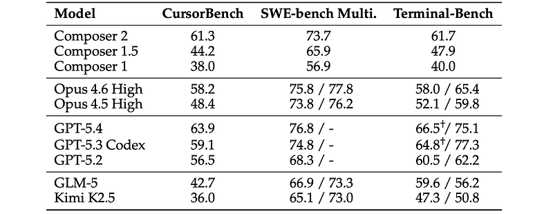
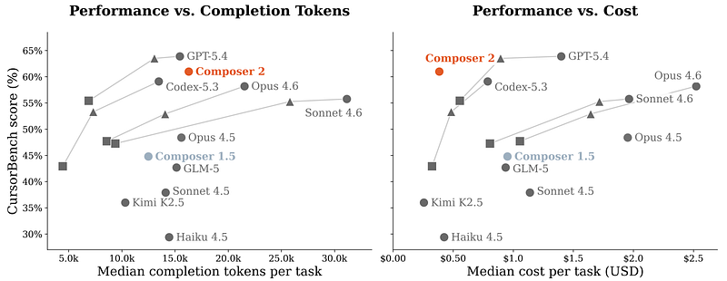

# Papers Explained - Composer 2

Several potential open-source base models were evaluated, including GLM-5, Kimi K2.5, and DeepSeek V3.2. Three base model evaluations contributed to the selection of Kimi K2.5:

This page ingests the source article into the wiki and connects it to [[Papers Explained Corpus]], [[Code Models]], [[Agentic AI]], [[Agent Harness]], [[Evaluation and Benchmarks]], [[Reasoning Models]], [[Long Context]], [[Supervised Fine-Tuning]], [[KL Regularization]].

## Source Metadata

- Source file: `raw/draft_Papers-Explained--Composer-2-9bc921210902.html`
- Source title: Papers Explained: Composer 2
- Canonical: [https://medium.com/p/9bc921210902](https://medium.com/p/9bc921210902)

## Key Ideas

- Coding knowledge: Assessed using FreshBench, an internal benchmark designed to test factual knowledge through question-answer pairs created from traces where Composer had to read library source code or perform web searches to solve coding tasks.
- State tracking: Evaluated using LoCoDiff, a benchmark that requires the model to recreate the state of a file after multiple diffs, which is crucial for long-term memory.
- Codebase perplexity: Measured to determine the coding intelligence of the base model using a private monorepo as an uncontaminated source. Files were concatenated alphabetically, and the sum of the negative log-likelihoods over a rolling window was computed.
- Kimi K2.5 is extended with a continued pretraining stage on a large code-dominated data mix, divided into three phases.
- No benefits were seen with overlong masking at small scale, and rollouts that exceed the maximum sequence length are not masked. The self-summary system also limits the occurrence of these cases in practice.

## Notes

Composer 2 is a specialized, frontier-level coding model designed for agentic software engineering, with strong long-term planning, multi-step execution, and coding intelligence for realistic, interactive development workflows. It is trained via continued pretraining plus large-scale reinforcement learning in the same Cursor harness used in deployment, using environments that closely match real-world problems, and achieves high performance on both internal (CursorBench: 61.3) and public benchmarks (Terminal-Bench: 61.7, SWE-bench Multilingual: 73.7) while being cheaper to serve than state-of-the-art general models.

## Base Model Selection

Several potential open-source base models were evaluated, including GLM-5, Kimi K2.5, and DeepSeek V3.2. Three base model evaluations contributed to the selection of Kimi K2.5:

- Coding knowledge: Assessed using FreshBench, an internal benchmark designed to test factual knowledge through question-answer pairs created from traces where Composer had to read library source code or perform web searches to solve coding tasks. Answers were validated with a web searching agent.

- State tracking: Evaluated using LoCoDiff, a benchmark that requires the model to recreate the state of a file after multiple diffs, which is crucial for long-term memory. An internal benchmark similar to LoCoDiff was used, measuring the average character-level distance instead of raw accuracy due to sensitivity to single-character errors.

- Codebase perplexity: Measured to determine the coding intelligence of the base model using a private monorepo as an uncontaminated source. Files were concatenated alphabetically, and the sum of the negative log-likelihoods over a rolling window was computed.

## Continued Pretraining

Kimi K2.5 is extended with a continued pretraining stage on a large code-dominated data mix, divided into three phases. The bulk of compute is spent at 32k token sequence length, followed by a shorter long-context extension phase to 256k sequence length, and finally a short SFT phase on targeted coding tasks. Training is performed in MXFP8.

To serve the model faster in production, additional Multi-Token Prediction (MTP) layers are trained to use with speculative decoding. The MTP layers are initialized from scratch and trained on the same data mix. To speed up convergence, the MTP layers are trained with self-distillation, teaching the model to predict the exact logit distribution of the main LM head at each position. To ensure that this process generalizes, the MTP layers are trained atop a checkpoint cut from the middle of the continued pretraining run. During the final two phases (long-context and SFT), the MTP layers are included and trained jointly with the rest of the model.

## Reinforcement Learning

*Figure: RL training tasks.*

A policy gradient algorithm with multiple samples per prompt and a fixed group size is used. RL training operates in a highly asynchronous regime with independent training and rollout generation workers. As in Dr. GRPO, it is crucial to minimize the bias in the gradients that can arise from transforming the underlying advantage. Following this work, the length standardization term from GRPO is removed as it introduces a length bias. Group advantages are not normalized by their standard deviation, as it results in the degenerate case where small behavioral differences get massively upweighted within a group where every rollout achieves equal correctness.

No benefits were seen with overlong masking at small scale, and rollouts that exceed the maximum sequence length are not masked. The self-summary system also limits the occurrence of these cases in practice. A Kullback–Leibler divergence is used for regularization.

To enable Composer 2 to work across long horizons, the [[Self-Summarization]] technique introduced in [[Introducing Composer 1.5]] is used. Each training rollout can involve multiple generations chained together by summaries, rather than a single prompt–response pair. The final reward is used for all tokens produced by the model in the chain. This upweights both the agent responses in good trajectories and also the self-summarizations that made them work. At the same time, poor summaries that lose critical information are downweighted.

While the primary goal of RL training is to improve model intelligence, the aim is also to produce a model that provides a good developer experience. This is affected by the communication style of the model as well as the time and resources it takes to answer a question. For behavior and communication, an array of auxiliary rewards is applied to ensure the model provides a good experience. These include rewards for coding style, communication, and product-specific penalties for poor tool calls, such as creating to-do list items and then leaving them unfinished. During RL training, the model is monitored for emergent behaviors and occasionally additional behavior rewards are introduced as needed. For example, it was observed that the model would start to leave long chains-of-thought in comments or collapse to using the terminal tool only. To incentivize the model to produce solutions quickly on easy requests while allowing it to think longer on hard requests, a concave down and increasing nonlinear length penalty is added to the reward:

where k and q are hyperparameters which define the curvature of the penalty, and the input x is a weighted combination of thinking tokens, tool calling tokens, tool output tokens, final message tokens, number of tool calls, and number of turns of a rollout. The nonlinearity reflects that on easy tasks, achievable with only a few tool calls, every additional bit of effort is felt more acutely than in long-horizon tasks, where the agent might iterate for hundreds of tool calls.

## CursorBench

The application of coding agents has rapidly evolved from simple edits to complex debugging, refactoring, and feature development. Cursor has observed that public evaluation benchmarks often loosely correlate with real-world utility due to four main factors: domain mismatch, prompt over-specification, data contamination and overfitting, and narrow evaluation scope. To address these limitations, Cursor introduced CursorBench, an internal evaluation suite based on real coding sessions from their engineering team. CursorBench avoids train-set contamination and evaluates models on code quality, execution efficiency, and interactive behavior. CursorBench tasks require extensive code modifications and are more underspecified compared to public benchmarks, reflecting real-world software engineering challenges. The benchmark is regularly updated to align with evolving user workflows and agent capabilities. Additionally, CursorBench is complemented by targeted evaluations assessing various aspects of coding agent quality and behavior, including handling ambiguous prompts, following instructions, avoiding unnecessary edits, code quality, and managing interruptions.

## Results

*Figure: Benchmark results across public and internal evaluation suites.*

- On CursorBench-3, Composer 2 achieves 61.3% accuracy

- 37% relative improvement over Composer 1.5 (44.2%).

- 61% improvement over Composer 1 (38.0%).

- Substantial accuracy boost over its base model Kimi K2.5 (48.4%), supporting the effectiveness of continued pretraining and reinforcement learning.

- Accuracy competitive with stronger frontier models (e.g., GPT-5.x, Opus 4.x) despite lower inference cost.

SWE-bench Multilingual:

- Composer 2: 73.7%.

- Improvement of 7.8% over Composer 1.5 (65.9%) and 16.8% over Composer 1 (56.9%).

- Similar performance to its base model Kimi K2.5 (73.9% in table, via 73.9/75.1 style entries) while being domain-specialized.

Terminal-Bench:

- Composer 2: 61.7%.

- 13.8% improvement over Composer 1.5 (47.9%) and 21.7% over Composer 1 (40.0%).

- Considerably better than its base model Kimi K2.5 (52.1% / 59.8%).

*Figure: On CursorBench, Composer 2 achieves a superior Pareto frontier in cost while remaining highly competitive in token efficiency.*

- Composer 2 uses a similar number of completion tokens as other models while achieving frontier-level accuracy, indicating high token efficiency.

- Median inference cost per CursorBench task shows Composer 2 on a Pareto frontier: cost comparable to smaller/low-effort models but accuracy comparable to much larger frontier models.

## Paper

Composer 2 Technical Report [2603.24477](https://arxiv.org/abs/2603.24477)

## Figures

Figures from the Medium HTML export (`raw/draft_Papers-Explained--Composer-2-9bc921210902.html`); local copies under `wiki/assets/papers-explained-composer-2/` when download succeeded.

| Figure | Caption |
|--------|---------|
|  | Composer 2 overview: Cursor-deployed agentic coding model with CPT + RL in the production harness. |
|  | Evidence for picking Kimi K2.5: FreshBench knowledge, LoCoDiff-style state tracking, private-repo codebase perplexity. |
|  | RL training tasks and asynchronous rollout harness (multi-sample GRPO-style updates, KL-regularized). |
|  | Benchmark tallies on CursorBench, SWE-bench Multilingual, Terminal-Bench vs Composer 1.x and Kimi K2.5. |
|  | CursorBench cost vs accuracy Pareto (token-efficient frontier vs frontier general models). |
## Predecessor

- [[Composer: Building a fast frontier model with RL]] — Cursor's Oct 2025 announcement of the first Composer agent model (MoE, Cursor Bench, MXFP8 RL infrastructure). Composer 2's reported CursorBench-3 lineage starts from Composer 1 at 38.0%.

## Official Launch

- [[Introducing Composer 2]] — Cursor's Mar 2026 product announcement with the Composer 1 / 1.5 / 2 benchmark table, continued-pretraining + RL summary, and fast-tier pricing.

## Successor

- [[Introducing Composer 2.5]] — Cursor's May 2026 post on the next Composer generation: same Kimi K2.5 base, with targeted textual feedback (localized [[On-Policy Distillation]]), 25× synthetic RL tasks, and sharded Muon + dual-mesh HSDP for continued pretraining.

## Related

- [[Composer: Building a fast frontier model with RL]]
- [[Introducing Composer 1.5]]
- [[Introducing Composer 2]]
- [[Self-Summarization]]
- [[Introducing Composer 2.5]]
- [[Papers Explained Corpus]]
- [[Code Models]]
- [[Agentic AI]]
- [[Agent Harness]]
- [[Evaluation and Benchmarks]]
- [[Reasoning Models]]
- [[Long Context]]
- [[Supervised Fine-Tuning]]
- [[KL Regularization]]
- [[Continually Improving Our Agent Harness]]
- [[Papers Explained - Beyond Web]]
- [[Papers Explained - FinePhrase]]

#summary #topic
