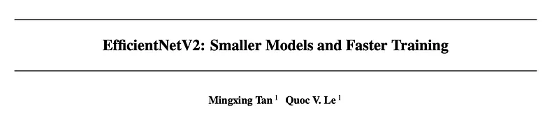
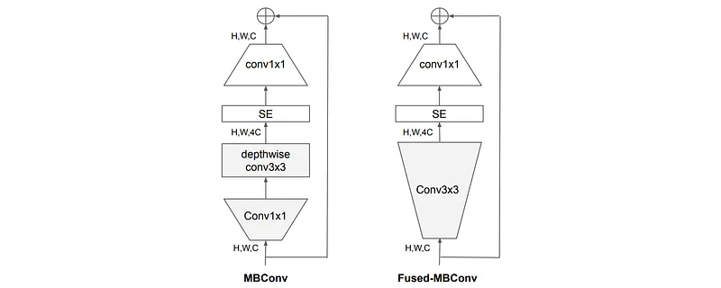
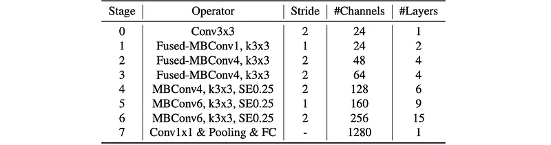
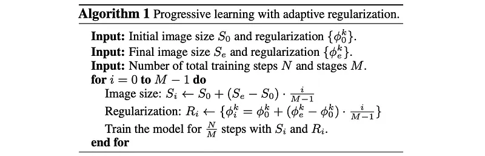
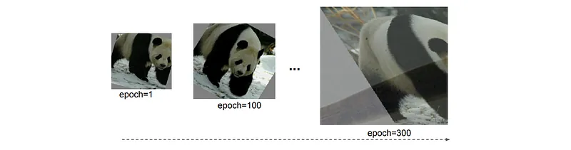
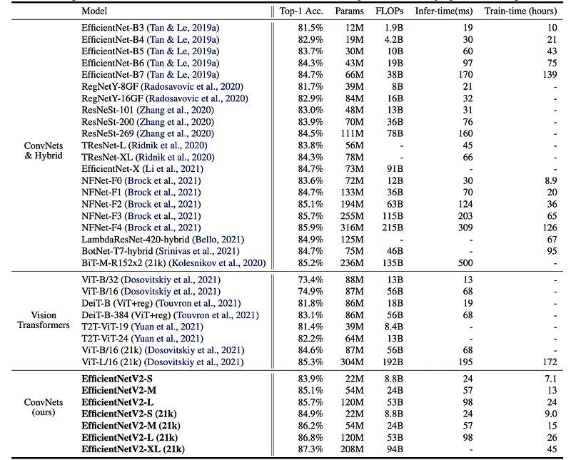
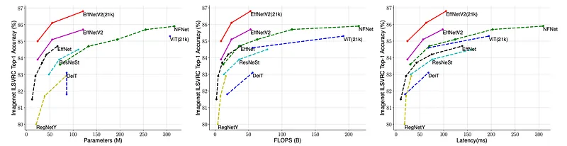
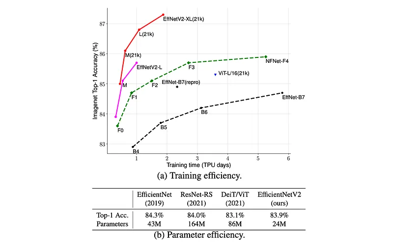
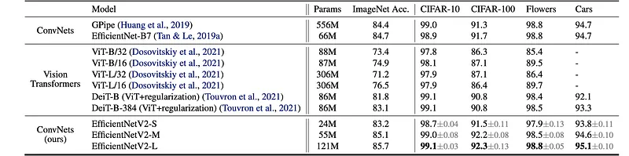

# Papers Explained - EfficientNetV2

EfficientNetV2 is a new family of convolutional networks having faster training speed and better parameter efficiency than previous models, developed using a combination of training-aware neural architecture search and scaling, to jointly optimize training speed and parameter efficiency.

This page ingests the source article into the wiki and connects it to [[Papers Explained Corpus]], [[Model Compression and Efficiency]], [[Agentic AI]], [[Computer Vision]], [[Code Models]].

## Source Metadata

- Source file: `raw/2024-10-17_Papers-Explained---EfficientNetV2-a7a1e4113b89.md`
- Source title: Papers Explained : EfficientNetV2
- Published: 2024-10-17
- Canonical: [https://medium.com/@ritvik19/papers-explained-efficientnetv2-a7a1e4113b89](https://medium.com/@ritvik19/papers-explained-efficientnetv2-a7a1e4113b89)

## Key Ideas

- EfficientNetV2 is a new family of convolutional networks having faster training speed and better parameter efficiency than previous models, developed using a combination of training-aware neural architecture search and scaling, to jointly optimize training...
- The code is available at [GitHub](https://github.com/google/automl/tree/master/efficientnetv2/).
- EfficientNet (V1) leverages NAS to search for the baseline EfficientNet-B0 that has better trade-off on accuracy and FLOPs. The baseline model is then scaled up with a compound scaling strategy to obtain a family of models B1-B7.
- Training with very large image sizes is slow: Efficient- Net’s large image size results in significant memory usage. Since the total memory on GPU/TPU is fixed, we have to train these models with smaller batch size, which drastically slows down the training.
- Equally scaling up every stage is sub-optimal: Efficient- Net equally scales up all stages using a simple compound scaling rule. However, these stages are not equally contributed to the training speed and parameter efficiency.

## Notes

## Papers Explained 233: EfficientNetV2

EfficientNetV2 is a new family of convolutional networks having faster training speed and better parameter efficiency than previous models, developed using a combination of training-aware neural architecture search and scaling, to jointly optimize training speed and parameter efficiency. The models were searched from the search space enriched with new ops such as Fused-MBConv.

The code is available at [GitHub](https://github.com/google/automl/tree/master/efficientnetv2/).

## EfficientNetV2 Architecture Design

EfficientNet (V1) leverages NAS to search for the baseline EfficientNet-B0 that has better trade-off on accuracy and FLOPs. The baseline model is then scaled up with a compound scaling strategy to obtain a family of models B1-B7. While recent works have claimed large gains on training or inference speed, they are often worse than EfficientNet in terms of parameters and FLOPs efficiency.

Training with very large image sizes is slow: Efficient- Net’s large image size results in significant memory usage. Since the total memory on GPU/TPU is fixed, we have to train these models with smaller batch size, which drastically slows down the training. A simple improvement is to apply FixRes by using a smaller image size for training than for inference.

Depthwise convolutions are slow in early layers but effective in later stages: Depthwise convolutions have fewer parameters and FLOPs than regular convolutions, but they often cannot fully utilize modern accelerators. Recently, Fused-MBConv is proposed to better utilize mobile or server accelerators. It replaces the depthwise conv3x3 and expansion conv1x1 in MBConv with a single regular conv3x3. Finding the right combination of these two building blocks, MBConv and Fused-MBConv, is non-trivial, which motivates us to leverage neural architecture search to automatically search for the best combination.

*Figure: Structure of MBConv and Fused-MBConv.*

Equally scaling up every stage is sub-optimal: Efficient- Net equally scales up all stages using a simple compound scaling rule. However, these stages are not equally contributed to the training speed and parameter efficiency. In this work a non-uniform scaling strategy is used to gradually add more layers to later stages.

### Training-Aware NAS and Scaling

The training-aware NAS framework aims to jointly optimize accuracy, parameter efficiency, and training efficiency on modern accelerators. EfficientNet is used as the backbone. The search space is a stage-based factorized space which consists of the design choices for convolutional operation types {MBConv, Fused-MBConv}, number of layers, kernel size {3x3, 5x5}, expansion ratio {1, 4, 6}. On the other hand, the search space size is reduced by: removing unnecessary search options such as pooling skip ops, since they are never used in the original Efficient- Nets; reusing the same channel sizes from the backbone as they are already searched.

Up to 1000 models are sampled and trained for about 10 epochs with reduced image size for training. The search reward combines the model accuracy A, the normalized training step time S, and the parameter size P, using a simple weighted product A · S^w · P^v, where w = -0.07 and v = -0.05 are empirically determined to balance the trade-offs.

### EfficientNetV2 Architecture

*Figure: EfficientNetV2-S architecture.*

Compared to the EfficientNet backbone, the searched EfficientNetV2 has several major distinctions:

- EfficientNetV2 extensively uses both MBConv and the newly added fused-MBConv (Gupta & Tan, 2019) in the early layers.

- EfficientNetV2 prefers a smaller expansion ratio for MBConv since smaller expansion ratios tend to have less memory access overhead.

- EfficientNetV2 prefers smaller 3x3 kernel sizes, but it adds more layers to compensate for the reduced receptive field resulting from the smaller kernel size.

- EfficientNetV2 completely removes the last stride-1 stage in the original EfficientNet, perhaps due to its large parameter size and memory access overhead.

EfficientNetV2-S is scaled up to obtain EfficientNetV2-M/L using similar compound scaling as EfficientNetV1 with a few additional optimizations:

- The maximum inference image size is restricted to 480, as very large images often lead to expensive memory and training speed overhead.

- Gradually more layers are added to later stages (e.g., stage 5 and 6) in order to increase the network capacity without adding much runtime overhead.

## Progressive Learning with adaptive Regularization

Image size plays an important role in training efficiency. In addition to FixRes, many other works dynamically change image sizes during training, but they often cause a drop in accuracy. The accuracy drop is hypothesized to come from the unbalanced regularization: when training with different image sizes, it should also adjust the regularization strength accordingly (instead of using a fixed regularization). Smaller image size leads to smaller network capacity and thus needs weaker regularization; vice versa, larger image size leads to more computations with larger capacity, and thus more vulnerable to overfitting.

For simplicity, mainly three types of regularization are studied:

- Dropout: a network-level regularization, which reduces co-adaptation by randomly dropping channels.

- RandAugment: a per-image data augmentation, with adjustable magnitude ε.

- Mixup: a cross-image data augmentation. Given two images with labels (xi , yi) and (xj, yj), it combines them with mixup ratio λ: x ĩ = λxj + (1 − λ)xi and yi ̃ = λyj + (1 − λ)yj .

## Evaluation

### ImageNet ILSVRC2012

Training is divided into four stages with about 87 epochs per stage, gradually increasing image size and regularization strength:

*Figure: Progressive training settings for EfficientNetV2.*

*Figure: EfficientNetV2 Performance Results on ImageNet.*

*Figure: Model Size, FLOPs, and Inference Latency*

*Figure: . ImageNet ILSVRC2012 top-1 Accuracy vs. Training Time and Parameters.*

- EfficientNetV2 models achieve comparable or better accuracy than EfficientNet-B7, RegNets, ResNeSts, and even ViT-L/16 (trained on a larger dataset) on ImageNet ILSVRC2012.

- EfficientNetV2-M achieves 11x faster training speed compared to EfficientNet-B7 while using the same computing resources.

- EfficientNetV2 models demonstrate better parameter efficiency compared to EfficientNets.

- EfficientNetV2 models exhibit up to 3x faster inference latency compared to EfficientNets, even with slightly better parameter/FLOPs efficiency.

ImageNet21k

Modified training settings from ImageNet ILSVRC2012:

- Reduced training epochs to 60 or 30.

- Implemented cosine learning rate decay.

- Normalized labels to sum to 1 before computing softmax loss.

Pretrained models on ImageNet21k and finetuned them on ImageNet ILSVRC2012 for 15 epochs.

- EfficientNetV2-L(21k) achieved a top-1 accuracy of 86.8% on ImageNet ILSVRC2012, outperforming ViT-L/16(21k) by 1.5%.

- EfficientNetV2-L(21k) used 2.5x fewer parameters and 3.6x fewer FLOPs than ViT-L/16(21k) while being 6x-7x faster during training and inference.

- Scaling up the dataset (ImageNet21k) is more effective than simply increasing model size for achieving high accuracy (above 85%).

### Transfer Learning Datasets

Pre-trained models from ImageNet ILSVRC2012 are used to fine tune on the following datasets.

*Figure: Transfer learning datasets.*

*Figure: Transfer Learning Performance Comparison.*

- EfficientNetV2 models outperform previous CNNs and ViTs on all four datasets.

- The performance gains are sometimes significant, reaching up to 1.5% better accuracy than ViT/DeiT models on CIFAR-100.

## Paper

EfficientNetV2: Smaller Models and Faster Training [2104.00298](https://arxiv.org/abs/2104.00298)

Recommended Reading [Convolutional Neural Networks](https://medium.com/@ritvik19/list/convolutional-neural-networks-5b875ce3b689)

## Figures

Figures from the Medium HTML export (`raw/2024-10-17_Papers-Explained---EfficientNetV2-a7a1e4113b89.md`); local copies under `wiki/assets/papers-explained-efficientnetv2/` when download succeeded.

| Figure | Caption |
|--------|---------|
|  | Training-aware NAS motivation: jointly optimize accuracy, parameters, and accelerator-friendly training time. |
|  | MBConv vs Fused-MBConv blocks used in the searched EfficientNetV2 stages. |
|  | EfficientNetV2-S stage topology discovered by NAS (MBConv / fused mixes, kernel choices). |
|  | NAS reward trade-off surface combining accuracy with normalized step time and parameter count. |
|  | Progressive training schedule: staged image sizes with paired RandAugment / Mixup / dropout strengths. |
|  | ImageNet top-1 accuracy for EfficientNetV2-S/M/L vs prior CNN and ViT baselines. |
|  | Parameter count, FLOPs, and measured inference latency across model tiers. |
|  | Top-1 accuracy vs training wall-clock and parameter count on ImageNet ILSVRC2012. |
|  | ImageNet-21K pretraining scaling: accuracy vs ViT-L while reducing params/FLOPs and train time. |
|  | Additional ImageNet train/inference speed comparisons vs EfficientNet-B7 and competing CNN/ViT families. |
|  | Transfer-learning datasets used after ImageNet pretraining (CIFAR, Flowers, Oxford Pets, etc.). |
|  | Transfer accuracy gains vs ViT/DeiT and earlier EfficientNet checkpoints on downstream vision tasks. |
## Related

- [[Papers Explained Corpus]]
- [[Model Compression and Efficiency]]
- [[Agentic AI]]
- [[Computer Vision]]
- [[Code Models]]
- [[Papers Explained 232 - MobileNetV4]]
- [[Papers Explained 234 - SoViT]]

#summary #topic
