# Papers Explained - EvolLM

EvoLM is a model suite that enables systematic and transparent analysis of large language models’ training dynamics across pre-training, continued pre-training, supervised fine-tuning, and reinforcement learning.

This page ingests the source article into the wiki and connects it to [[Papers Explained Corpus]], [[Large Language Models]], [[Reinforcement Learning Topic]], [[Synthetic Data]], [[Safety and Alignment]], [[Reasoning Models]], [[Supervised Fine-Tuning]], [[Reinforcement Learning]], [[Verifier-Bounded Learning]].

## Source Metadata

- Source file: `raw/2025-12-16_Papers-Explained--EvolLM-12167bdbf93c.md`
- Source title: Papers Explained: EvolLM
- Published: 2025-12-16
- Canonical: [https://medium.com/@ritvik19/papers-explained-evollm-12167bdbf93c](https://medium.com/@ritvik19/papers-explained-evollm-12167bdbf93c)

## Key Ideas

- The project is available [here](https://zhentingqi.github.io/internal/projects/EvoLM/).
- All models are initialized using the LLaMA-2 architecture with 1B and 4B parameters. The training pipeline consists of four sequential stages:
- Pre-training: Conducted on FineWeb-Edu. Guided by the Chinchilla scaling law that recommends a compute-optimal ratio of approximately 20 tokens per model parameter, models are pre-trained across token budgets ranging from the optimal 20x model size to 320B...
- Continued Pre-training (CPT): Performed on FineMath with token budgets from 2B to 42B. To mitigate catastrophic forgetting of general-domain knowledge, pre-training data replay strategies are incorporated.
- Supervised Fine-Tuning (SFT): Applied to a dataset of QA pairs augmented from GSM8K and MATH, collected from a mixture of MetaMathQA, OpenMathInstruct2, and NuminaMath.

## Notes

## Papers Explained 502: EvolLM

EvoLM is a model suite that enables systematic and transparent analysis of large language models’ training dynamics across pre-training, continued pre-training, supervised fine-tuning, and reinforcement learning. Over 100 LLMs with 1B and 4B parameters are trained from scratch, and both upstream (language modeling) and downstream (problem-solving) capabilities are evaluated. Considerations include both in-domain and out-of-domain generalization.

The project is available [here](https://zhentingqi.github.io/internal/projects/EvoLM/).

## Experimental Settings

### Training Setup

*Figure: Overview of EvoLM.*

All models are initialized using the LLaMA-2 architecture with 1B and 4B parameters. The training pipeline consists of four sequential stages:

- Pre-training: Conducted on FineWeb-Edu. Guided by the Chinchilla scaling law that recommends a compute-optimal ratio of approximately 20 tokens per model parameter, models are pre-trained across token budgets ranging from the optimal 20x model size to 320B tokens to investigate the effects of mild over-training (>1x Chinchilla, ≤16x Chinchilla) and excessive over-training (>16x Chinchilla) on task performance.

- Continued Pre-training (CPT): Performed on FineMath with token budgets from 2B to 42B. To mitigate catastrophic forgetting of general-domain knowledge, pre-training data replay strategies are incorporated.

- Supervised Fine-Tuning (SFT): Applied to a dataset of QA pairs augmented from GSM8K and MATH, collected from a mixture of MetaMathQA, OpenMathInstruct2, and NuminaMath. Low-quality prompts are filtered out using model correctness consistency, discarding samples with zero inter-model consensus.

- Reinforcement Learning (RL): Conducted using Proximal Policy Optimization (PPO), with a binary verifiable reward. The RL stage uses the same data sources as SFT but ensures no overlap with the SFT dataset.

A compact model signature is used to denote the configuration of each model across training stages. For example, 1B-160BT-8+42BT-100Kep1–100Kep16 represents a model with the following setup:

- 1B: A model with 1 billion parameters.

- 160BT: Pretrained on 160 billion tokens from FineWeb-Edu.

- 8+42BT: Continued pretrained with 8 billion tokens of replayed general-domain data (FineWeb- Edu) and 42 billion tokens of domain-specific data (FineMath).

- 100Kep1: Supervised fine-tuned on 100K examples for 1 epoch.

- 100Kep16: Reinforcement learning fine-tuned on 100K examples for 16 epochs.

### Evaluation Settings

The evaluation protocol consists of two types of tasks: Upstream Cloze Tasks and Downstream Generative Tasks.

- Upstream Cloze Tasks: These tasks assess models’ language modeling capabilities via next-token prediction without requiring conversational abilities. Models are evaluated on datasets such as HellaSwag, Winogrande, PIQA, OBQA, and ARC-Easy/Challenge, with average zero-shot accuracy reported.

- Downstream Generative Tasks: These tasks evaluate models’ problem-solving abilities in a generative, conversational setting. Supervised fine-tuned and RL-finetuned models are tested on:

- In-Domain Tasks (math reasoning): GSM8K-Platinum and MATH.

- Out-of-Domain Tasks: CRUXEval (code reasoning), BGQA (logical reasoning), TabMWP (table reasoning), and StrategyQA (commonsense reasoning).

Models are evaluated in a zero-shot manner by prompting them to generate full solutions to problems, with average performance reported for both in-domain and out-of-domain tasks. Detailed evaluation metrics include:

Accuracy: Measured under four prompting schemes:

- Pass@1: A single deterministic response is generated and evaluated.

- Maj@16: Sixteen responses are sampled, and the majority answer is evaluated.

- RM@16: Sixteen responses are sampled; the one with the highest ORM score is evaluated.

- Pass@16: Sixteen responses are sampled; the problem is marked solved if any response is correct.

Final answers are compared against ground-truth solutions to determine correctness. Additionally, the Correct Ratio is reported, which is the ratio of correct solutions to total solutions in response groups with at least one correct solution.

- ORM Score: An outcome reward model (Skywork-Reward-Llama-3.1–8B-v0.2) assigns scalar scores to generated solutions based on input problems and responses, serving as a proxy for solution quality.

## Scaling Studies Across Three Training Stages

### Scaling Up Pre-training Compute

*Figure: Upstream task performance vs. pretraining tokens.*

- Performance on upstream tasks improves steadily with more pre-training tokens, but with rapidly diminishing returns beyond around 80x to 160x model size.

- For the 1B model, average accuracy increases from roughly 46% at 20 BT to 52% at 80 BT, but gains shrink to less than a percentage point when moving from 80 BT to 160 BT. The 4B model benefits slightly longer but plateaus by 320 BT.

*Figure: Downstream task performance vs. number of pretraining tokenss.*

- Both SFT and SFT+RL models exhibit strong initial gains up to 80BT, but performance saturates thereafter. For instance, ID Maj@16 accuracy of the SFT model rises sharply from 8% at 20 BT to 15% at 80 BT, yet only inches up to 17% at 320 BT.

- RL yields a consistent uplift over pure SFT but shows negligible benefit from over-training beyond 80BT.

- Maj@16, RM@16, and Pass@16 accuracies on OOD tasks decrease after 160BT budget, and degradation is amplified by a drop in ORM score, indicating that overall generation quality decreases with excessive pre-training.

- Excessive general-domain pre-training does not always improve domain-specific post-training and might even cause performance degradation on some downstream tasks, with saturation happening around 80x to 160x model size.

*Figure: Comparison between 1B and 4B SFT / SFT+RL models under fixed pre-training compute/- tokens.*

- Under a fixed pre-training compute budget (1B–320BT vs. 4B–80BT), the smaller 1B model outperforms the 4B model across both SFT and SFT+RL settings.

- At lower budgets, the 1B–80BT and 4B–80BT models perform comparably, with the smaller model slightly ahead. However, once the budget rises to 160B tokens, the 4B–160BT model shows substantial gains in post-training performance.

> Excessive general-domain pre-training does not always improve domain-specific post-training and might even cause performance degradation on some downstream tasks (saturation happens around 80x to 160x model size in our study).

> Under limited pre-training budgets, smaller post-trained models can even out perform larger counterparts. Conversely, once pre-training tokens reach the saturation regime, increasing model size enables clear improvements in both in-domain performance and OOD generalization.

### Scaling Up Continued Pre-training Compute

*Figure: Upstream task performance vs. CPT tokens.*

- Increasing CPT compute degrades upstream task performance, indicating catastrophic forgetting.

- A replay strategy with 8 BT consistently maintains higher upstream accuracy than the no-replay baseline across all CPT budgets.

*Figure: GSM8K-Platinum performance (Pass@1 accuracy) of pretrained model 1B-160BT continued pretrained with various configurations and then finetuned using 100K SFT examples with 1 epoch.*

- A mix of 8 BT FineWeb replay with 42 BT FineMath tokens yields better downstream performance (21.01% Pass@1 accuracy) compared to pure FineMath CPT (50 BT) at 19.27%.

- Configurations with too little or too much replay perform worse, suggesting a modest replay budget (around 5%) optimally balances retention of general-domain knowledge with adaptation to downstream tasks.

*Figure: Downstream task performance vs. continued pre-training tokens.*

- All variants improve steadily with more domain specific tokens up to around 32 BT and then plateau by 42 BT.

- Such a trend is also observed in OOD metrics.

- Across the CPT range, RL finetuning consistently outperforms pure SFT; notably, without CPT, RL can even underperform SFT,yet the gain brought by RL tends to strengthen as CPT tokens increase.

> CPT on domain-specific data induces catastrophic forgetting of pre-trained knowledge which could harm both upstream and downstream performance, while incorporating a small replay budget (e.g. 5%) could effectively mitigate this degradation.

> Domain-specific post-training should be supported by adequate domain-specific CPT data: without it, SFT performance remains suboptimal and RL can even degrade such performance.

> As domain-specific CPT data increase, in-domain downstream performance steadily improves and the SFT models could benefit more from RL finetuning.

> With sufficient domain-specific CPT data, post-training on in-domain tasks not only improves in-domain performance but also generalizes effectively to OOD tasks.

### Scaling Up SFT Compute

*Figure: Downstream task performance vs. number of SFT epochs.*

- ID metrics increase steadily with more epochs and saturate at around 8 epochs, indicating increased memorization of in-domain problems.

- OOD performance peaks at 2–4 epochs before declining, suggesting that over-specialization hinders generalization.

- Validates the commonly chosen SFT hyperparameter of approximately 3 epochs.

- Marginal gains from downstream RL finetuning shrink on over-trained SFT models.

*Figure: Downstream task performance vs. number of SFT examples.*

- ID performance improves monotonically with more examples, confirming that additional SFT compute consistently improves in-domain task performance.

- OOD metrics fluctuate and can even decline with larger datasets.

- Incremental benefit from RL diminishes as the model learns more SFT examples.

> Excessive SFT improves ID performance with diminishing returns but does not necessarily improve and can even degrade OOD performance.

> Excessive SFT, especially overly large epochs, could limit further RL improvements.

### Scaling Up RL Compute

*Figure: Downstream task performance under different RL scales.*

- Greedy, Maj@16, and RM@16 accuracies peak at around 8–16 epochs and then saturate.

- Pass@16 accuracy degrades beyond 4 epochs, indicating RL sharpens confidence in already-correct outputs rather than expanding solvable samples.

- Maj@16 accuracy sometimes underperforms greedy accuracy in SFT models but improves after RL.

- Greedy, Maj@16, and RM@16 accuracies increase with more data up to around 150–200K examples, then gains flatten and fluctuate.

- Pass@K saturates earlier and degrades, while the correct ratio keeps increasing.

- Performance drops at 350K and 400K examples due to response length exceeding context window lengths.

*Figure: Downstream task performance.*

- ID accuracy increases with the proportion of SFT data, plateauing beyond around 70K.

- OOD metrics peak with 10K SFT (i.e., 90K RL).

> RL with excessive epochs or examples improves downstream performance on both ID and OOD tasks but with diminishing returns (saturation happens at 4–8 epochs or 50–100K examples)

> Beyond the saturation regime, RL primarily increases the probability of sampling high-quality rollouts but does not necessarily improve models’ fundamental reasoning capabilities.

## Paper

EvoLM: In Search of Lost Language Model Training Dynamics [2506.16029](https://arxiv.org/abs/2506.16029)

## Figures

Figures from the Medium HTML export (`raw/2025-12-16_Papers-Explained--EvolLM-12167bdbf93c.md`); local copies under `wiki/assets/papers-explained-evollm/` when download succeeded.

| Figure | Caption |
|--------|---------|
| 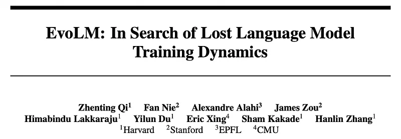 | EvoLM study framing: tracking how pretraining, CPT, SFT, and RL stages reshape LM capabilities. |
| 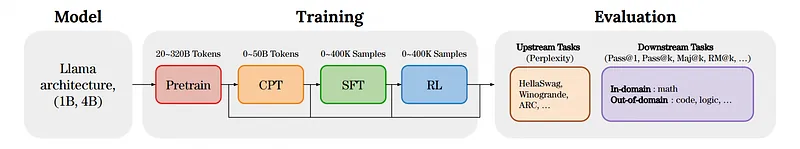 | Overview schematic of the EvoLM experimental pipeline and measurement axes. |
| 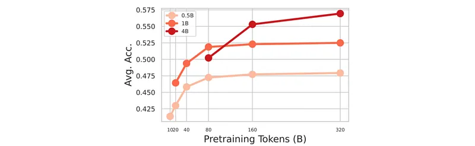 | Upstream evaluation metrics vs cumulative pretraining tokens. |
| 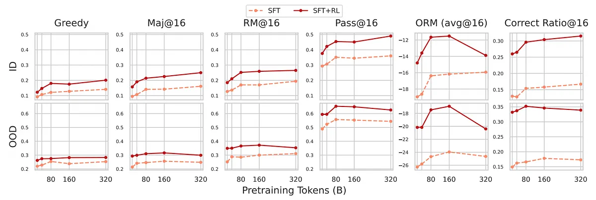 | Downstream benchmarks vs pretraining token budget for matched architectures. |
| 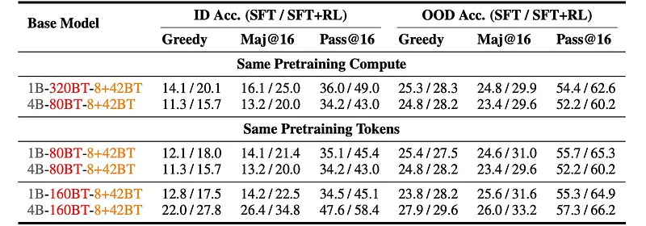 | 1B vs 4B models under identical compute when varying SFT vs SFT+RL recipes. |
| 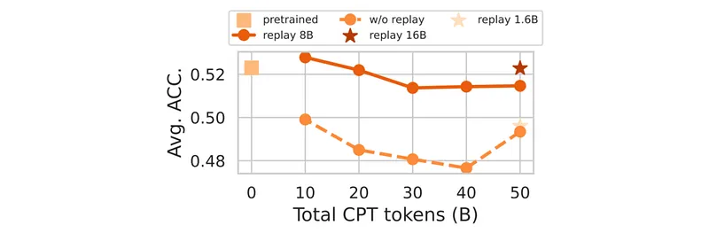 | Upstream skills vs continued-pretraining (CPT) tokens after initial PT. |
|  | GSM8K-Platinum pass@1 after CPT variants plus 100K-example SFT sweep. |
| 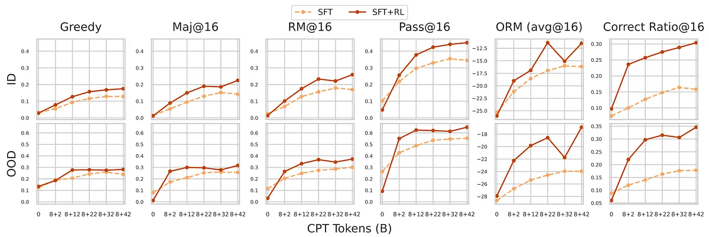 | Downstream tasks vs CPT token extensions for each checkpoint family. |
| 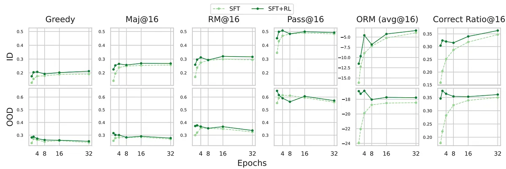 | Downstream accuracy vs number of SFT epochs (saturation and overfitting regimes). |
| 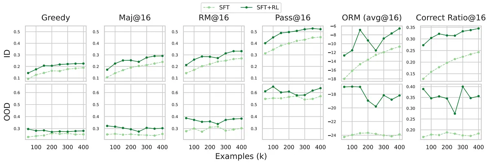 | Downstream metrics vs SFT dataset size (Pass@K, majority voting, greedy decode behaviors). |
| 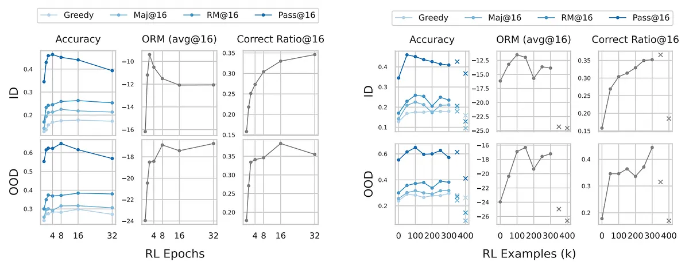 | Effect of RL scale (updates, batch, preference data) on downstream reasoning suites. |
| 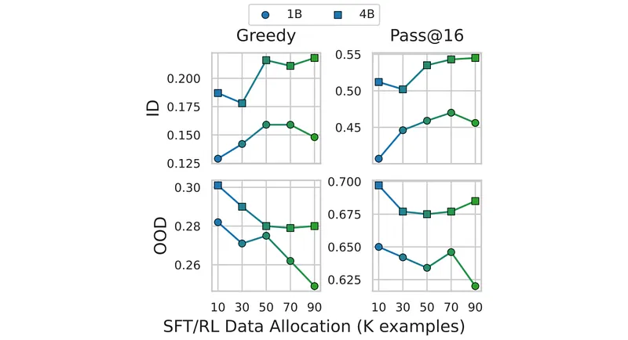 | Composite downstream performance comparing ID vs OOD stress tests after long RL runs. |
## Related

- [[Papers Explained Corpus]]
- [[Large Language Models]]
- [[Reinforcement Learning Topic]]
- [[Synthetic Data]]
- [[Safety and Alignment]]
- [[Reasoning Models]]
- [[Supervised Fine-Tuning]]
- [[Reinforcement Learning]]
- [[Verifier-Bounded Learning]]
- [[Papers Explained 501 - Reasoning Gym]]
- [[Papers Explained - GRAPE]]

#summary #topic
