# Papers Explained - FinePhrase

FinePhrase is a 486B-token synthetic pretraining dataset created after 90 systematic experiments, over 1 trillion generated tokens, and 12.7 GPU-years to find the best “recipe” for synthetic data, and it clearly outperforms all existing synthetic data baselines.

This page ingests the source article into the wiki and connects it to [[Papers Explained Corpus]], [[Synthetic Data]], [[Large Language Models]], [[Reasoning Models]], [[Evaluation and Benchmarks]].

## Source Metadata

- Source file: `raw/draft_Papers-Explained--FinePhrase-bf43cd53d6b9.md`
- Source title: Papers Explained: FinePhrase
- Canonical: [https://medium.com/p/bf43cd53d6b9](https://medium.com/p/bf43cd53d6b9)

## Key Ideas

- FinePhrase is a 486B-token synthetic pretraining dataset created after 90 systematic experiments, over 1 trillion generated tokens, and 12.7 GPU-years to find the best “recipe” for synthetic data, and it clearly outperforms all existing synthetic data...
- Rephrasing involves using language models to produce variants of existing documents that retain the original meaning but change the presentation.
- Several teams have already shown that rephrasing web content into cleaner formats can beat training on raw data: WRAP rewrites text in different styles, Nemotron-CC extracts QA pairs and knowledge lists, REWIRE does guided rewriting, BeyondWeb tries...
- Synthetic data generation is considered along three axes, each raising its own question:
- Rephrasing strategy: Which transformations actually improve downstream performance? We compare REWIRE’s guided rewriting, Nemotron’s QA pairs and knowledge extraction against novel formats (tutorials, FAQs, tables, math reformulations).

## Notes

FinePhrase is a 486B-token synthetic pretraining dataset created after 90 systematic experiments, over 1 trillion generated tokens, and 12.7 GPU-years to find the best “recipe” for synthetic data, and it clearly outperforms all existing synthetic data baselines. It is built as part of a broader effort to turn synthetic data generation from ad‑hoc “alchemy” into reproducible “chemistry,” focusing on which models, prompts, and scaling strategies work best, and is publicly available on the Hub.

## Rephrasing

Rephrasing involves using language models to produce variants of existing documents that retain the original meaning but change the presentation. This can include formats like tutorials, FAQs, knowledge lists, and Wikipedia-style articles, each targeting different capabilities such as reasoning, question-answering, and quantitative skills.

Several teams have already shown that rephrasing web content into cleaner formats can beat training on raw data: WRAP rewrites text in different styles, Nemotron-CC extracts QA pairs and knowledge lists, REWIRE does guided rewriting, BeyondWeb tries continuation and summarization, and EntiGraph uses entity-centric augmentation to synthesize diverse knowledge representations from small corpora.

Synthetic data generation is considered along three axes, each raising its own question:

- Rephrasing strategy: Which transformations actually improve downstream performance? We compare REWIRE’s guided rewriting, Nemotron’s QA pairs and knowledge extraction against novel formats (tutorials, FAQs, tables, math reformulations).

- Generator model: How do model properties affect rephrase quality? We test across model families (Gemma, Llama, Qwen, Granite, Falcon, SmolLM), model generations (Qwen 1.5 through Qwen 3), and scales (270M to 27B parameters).

- Source data quality: When does seed quality matter? We rephrase both high-quality (FineWeb-Edu-HQ, DCLM) and low-quality (FineWeb-Edu-LQ, Cosmopedia) sources to test whether rephrasing recovers value from noisy documents or just amplifies existing quality differences.

Seed Datasets:

Curated:

- DCLM: A standardized benchmark providing a 240T token corpus from Common Crawl with model-based filtering as a key curation strategy. DCLM (DataComp-LM) enables training a 7B parameter model to 64% accuracy on MMLU with 2.6T tokens.

- FineWeb-Edu-HQ / LQ: Subsets of FineWeb-Edu, a 1.3T token educational dataset filtered using Llama-3–70B-Instruct scoring samples on educational quality from 0 to 5. We use HQ (scores 4 or 5) and LQ (scores 0 or 1) to investigate the impact of seed data quality on rephrasing.

- Ultra-FineWeb: A 1T English token and 120B Chinese token dataset created by applying efficient verification-based filtering to FineWeb. Uses a lightweight fastText classifier and optimized seed data selection to improve data quality.

Synthetic:

- Nemotron-HQ-Synth: Part of Nemotron-CC, a 6.3T token dataset using classifier ensembling and synthetic data rephrasing. The High-Quality-Synthetic subset contains synthetically rephrased data using Qwen3–30B-A3B.

- Cosmopedia: A 30 million file synthetic dataset with 25 billion tokens generated by Mixtral-8x7B-Instruct, containing textbooks, blog posts, and stories across diverse topics. Created through careful prompt engineering conditioning on curated educational sources and web data clusters.

- SYNTH: A fully synthetic dataset built from 50,000 Wikipedia articles expanded into problems and resolution paths including math exercises, creative writing, and information extraction. Uses multiple specialized synthetic pipelines with fine-tuned models and grounding in encyclopedic content.

- REWIRE: A method for recycling the web with guided rewriting that enriches low-quality documents discarded by filtering pipelines. Mixing high-quality raw texts with rewritten texts leads to 1.0, 1.3, and 2.5 percentage point improvements at 1B, 3B, and 7B scales across 22 tasks.

To evaluate each configuration, a 1.7B language model with a Qwen2-style architecture in trained on 20B tokens and evaluated on 12 benchmarks:

- General Knowledge: ARC, MMLU Redux

- Reading Comprehension: SQuAD v2, DROP

- Reasoning: OpenBookQA, XCSQA

- Natural Language Understanding: WinoGrande, PIQA, HellaSwag

- Math: GSM8K

- Table Understanding: WikiTableQuestions, TriviaQA

## Experiments

*Figure: Flow of experiments from source datasets through prompt strategies to model families.*

### How Do Existing Datasets Compare?

Baselines are established and trained on eight popular datasets under identical conditions, and their evaluation performance is compared.

*Figure: Comparison of baseline datasets.*

- DCLM, Nemotron-HQ-Synth, and REWIRE come out on top by a clear margin.

- The remaining datasets, including Cosmopedia, FineWeb-Edu (both HQ and LQ), Ultra-FineWeb, and SYNTH, fall notably behind.

Nemotron-HQ-Synth and REWIRE are both mixes of several prompts. So what’s actually doing the heavy lifting inside them? Each prompt from Nemotron-HQ-Synth (diverse_qa_pairs, extract_knowledge, distill, wikipedia_style_rephrasing, knowledge_list), the REWIRE guided_rewrite prompt, and the two baseline prompts from BeyondWeb (continue, summarize) are isolated, all using Gemma-3–1B on FineWeb-Edu-HQ as the source.

*Figure: Individual prompt performance from existing synthetic datasets compared to the DCLM baseline.*

- On aggregate, only diverse_qa_pairs and REWIRE’s guided_rewrite match DCLM. The BeyondWeb continue and summarize baseline-prompts don’t reach DCLM level.

- DCLM dominates on HellaSwag and PIQA (commonsense reasoning), beating every single synthetic prompt.

- Meanwhile, almost all synthetic prompts comfortably beat DCLM on ARC (science knowledge) and SQuAD (reading comprehension).

- Rephrasing is essentially trading commonsense reasoning for factual recall.

### Can New Prompts Beat DCLM?

Since most existing prompts fail to beat DCLM, nine novel prompt formats were designed targeting different skills (article, commentary, discussion, explanation, faq, math, narrative, table, tutorial), all using Gemma-3–1B on FineWeb-Edu-HQ.

*Figure: Nine new prompts compared against the DCLM baseline.*

- Four of them (faq, math, table, tutorial) clearly outperform DCLM, while the other five sit at or below DCLM level.

- The winning prompts share a common trait: they all restructure the source content into pedagogically rich formats rather than just paraphrasing it.

- The commonsense-vs-knowledge trade-off from the previous section persists here too.

Each prompt also has a distinct benchmark signature:

- table produces the strongest ARC boost (+7.5pp over DCLM)

- math is the only prompt that meaningfully moves GSM8K (+1.5pp, all others are within ±0.5pp) and also has the largest SQuAD gain (+11.2pp)

- tutorial is the only prompt that improves DROP (+1.4pp)

### Impact of the Rephrasing Model

Does the model size matter?

All Gemma-3 sizes (270M, 1B, 4B, 12B, 27B) are compared on the math, tutorial, and REWIRE’s guided_rewrite prompts.

*Figure: Model sizes across Gemma-3 and SmolLM2.*

- For math and tutorial, the 270M model underperforms, but 1B through 27B show no significant difference.

- SmolLM2 (135M, 360M, 1.7B) tells the same story on tutorial: there is a clear performance gradient up to the 1B range.

- The one exception is guided_rewrite, where the 4B model edges ahead of the 1B, while 4B through 27B remain equivalent.

- The takeaway: beyond a baseline capability (reached around 1B for simple prompts and 4B for complex ones), bigger models don’t buy you better synthetic data.

Do we need better models for rephrasing low-quality data?

REWIRE used Llama-3.3 70B and argued that upcycling low-quality data requires large models. This was put to the test by comparing Gemma-3–1B vs Gemma-3–12B on HQ vs LQ source data across four prompts (continue, summarize, faq, tutorial).

*Figure: 1B vs 12B model on HQ vs LQ data.*

- The results are mixed: for some prompts 12B helps slightly with LQ data, but for the FAQ prompt the 1B model actually wins

Does the model family matter?

*Figure: Model families compared at ~1B scale.*

- The result is striking: SmolLM2 consistently and clearly outperforms all others across every single prompt.

- On SQuAD SmolLM2 leads by roughly +10pp over the average of the other model families, consistently across all prompts.

- It also pulls ahead on TriviaQA (+1 to +5pp). On HellaSwag, PIQA, and GSM8K, the differences between model families are tiny (1–2pp).

- SmolLM2’s aggregate dominance is largely a QA story.

Does the model generation matter?

*Figure: Qwen model generations (1.5 to 3) on the tutorial prompt.*

- The differences are small, but there is a consistent upward trend: newer versions lead to slightly higher evaluation performance.

> Summary of Impact of the Rephrasing Model

> Model size: 1B is sufficient. Larger models do not help.
> Model family: SmolLM2 dominates across all prompts.
> Model generation: Newer is slightly better.
> Practical takeaway: Use the newest, best-rephrasing 1B model you can find.

### Impact of the Dataset Choices

Is synthetic data enough?

*Figure: Synthetic-only vs mixed training.*

- Synthetic-only training falls short of both DCLM and mixed training. Mixing consistently improves over both the synthetic-only and original-data-only baselines, regardless of prompt type.

- The benchmarks that benefit most from mixing are HellaSwag (+0.5 to +1.3pp) and, for most prompts, SQuAD (+4 to +12pp for Tutorial and FAQ). GSM8K doesn’t move at all.

- The “always mix with original data” takeaway is driven primarily by commonsense recovery, not a uniform lift across all skills.

Does the mix-in dataset matter?

The tutorial prompt is applied using Gemma-3–1B on FineWeb-Edu-HQ, then mixed in one of four datasets: DCLM, Cosmopedia, FineWeb-Edu-HQ, or FineWeb-Edu-LQ.

*Figure: Effect of different mix-in datasets.*

- DCLM outperforms other mix-in datasets across the board.

- Adding synthetic data improves performance for all mix-in datasets, with the effect especially pronounced for the weaker ones.

Does the source dataset matter?

Four datasets (DCLM, Cosmopedia, FineWeb-Edu-HQ, FineWeb-Edu-LQ) are rephrased with faq and tutorial prompts, testing two regimes: (a) mix-in equals source, and (b) fixed mix-in (FineWeb-Edu-HQ).

*Figure: Effect of source dataset when mix-in equals source.*

*Figure: Effect of source dataset with FineWeb-Edu-HQ as fixed mix-in.*

- Source quality appears to matter here: FineWeb-Edu-HQ and DCLM clearly outperform FineWeb-Edu-LQ and Cosmopedia.

- But when the mix-in is fixed to FineWeb-Edu-HQ, the source effect nearly vanishes.

- It means low-quality data can be rephrased and still yield competitive results, as long as it is paired with a strong mix-in dataset. This opens up a much larger pool of source data to draw from.

Does increased diversity help?

*Figure: Different diversity strategies.*

- None of them show a significant improvement over the best individual configuration. Performance averages rather than compounds.

> Summary of impact of the Dataset Choices

> Synthetic-only: Not enough. Always mix with original data.
> Mix-in dataset: Major performance driver. DCLM and FineWeb-Edu-HQ have complementary strengths (commonsense vs knowledge). Best choice depends on source quality.
> Source dataset: Secondary. With a strong mix-in, even low-quality sources work.
> Diversity: Does not compound at 20B token scale. Performance averages rather than improves.
> Practical takeaway: Invest in a high-quality mix-in dataset. DCLM for high-quality sources, FineWeb-Edu-HQ for low-quality ones.

Do Typos in the Prompt Hurt?

*Figure: REWIRE prompt with original typos vs improved version at 1B and 12B scale.*

- Typos don’t hurt at all. For the 1B model, the typo-laden original actually performs slightly better than the improved version.

## Building FinePhrase

The findings are used to build FinePhrase, a large-scale synthetic dataset that rephrases 339 million documents from FineWeb-Edu (sample-350BT) into four structured formats, producing 1.35 billion samples and 486 billion completion tokens of synthetic pretraining data. Every configuration choice traces directly back to a finding from experiments or infrastructure benchmarks:

- Model: SmolLM2–1.7B-Instruct, which dominated all other model families across every prompt in our model family comparison

- Prompts: FAQ, Math, Table, and Tutorial, the four prompts that consistently beat DCLM in our experiments

- Source data: FineWeb-Edu sample-350BT, since our experiments showed that source quality is secondary when paired with a strong mix-in dataset

## Promtps

continue:

```text
Continue the following text in the same style as the original. Start with the continuation directly.
Text:
[TEXT]
```

summarize:

```text
Summarize the following text. Write a standalone summary without referencing the text. Directly start with the summary. Do not say anything else.
Text:
[TEXT]
Summary:
```

article:

```text
Transform the document into a magazine-style feature article. Open with an engaging lead, then blend narrative storytelling with factual explanation. Maintain an accessible yet polished tone suitable for a general but informed readership. Output only the feature article, nothing else.
Document:
[TEXT]
```

commentary:

```text
Summarize the document in a concise paragraph that captures its central arguments or findings. Then, write an expert commentary that critically reflects on its implications, limitations, or broader context. Maintain an analytical and professional tone throughout. Output only the summary and the commentary, nothing else.
Document:
[TEXT]
```

discussion:

```text
Reformulate the document as a dialogue between a teacher and a student. The teacher should guide the student toward understanding the key points while clarifying complex concepts. Keep the exchange natural, informative, and faithful to the original content. Output only the dialogue, nothing else.
Document:
[TEXT]
```

explanation:

```text
Rewrite the document to provide clear scientific or logical explanations for concepts, phenomena, or processes mentioned in the text. Make implicit reasoning explicit by explaining why things work the way they do, what principles or mechanisms are at play, and how different factors relate to each other. Focus on building understanding through causal explanations rather than just describing facts. Output only the explanatory text, nothing else.
Document:
[TEXT]
```

faq:

```text
Rewrite the document as a comprehensive FAQ (Frequently Asked Questions). Extract or infer the key questions a reader would have about this topic, then provide clear, direct answers. Order questions logically—from foundational to advanced, or by topic area. Each answer should be self-contained and understandable without reference to other answers. Ensure the FAQ works as a standalone document. Output only the FAQ, nothing else.
Document:
[TEXT]
```

math:

```text
Rewrite the document to create a mathematical word problem based on the numerical data or relationships in the text. Provide a step-by-step solution that shows the calculation process clearly. Create a problem that requires multi-step reasoning and basic arithmetic operations. It should include the question followed by a detailed solution showing each calculation step. Output only the problem and solution, nothing else.
Document:
[TEXT]
```

narrative:

```text
Rewrite the document as a clear narrative that emphasizes the temporal sequence and causal relationships between events or steps. Reorganize the content to show how actions, events, or situations naturally flow from one to the next, making cause-and-effect relationships explicit. If describing a process or activity, show the logical progression of steps and explain why each step follows from the previous one. Output only the narrative, nothing else.
Document:
[TEXT]
```

table:

```text
Rewrite the document as a structured table that organizes the key information, then generate one question-answer pair based on the table. First extract the main data points and organize them into a clear table format with appropriate headers using markdown table syntax with proper alignment. After the table, generate one insightful question that can be answered using the table data. Provide a clear, concise answer to the question based on the information in the table. Output only the table followed by the question-answer pair, nothing else.
Document:
[TEXT]
```

tutorial:

```text
Rewrite the document as a clear, step-by-step tutorial or instructional guide. Use numbered steps or bullet points where appropriate to enhance clarity. Preserve all essential information while ensuring the style feels didactic and easy to follow. Output only the tutorial, nothing else.
Document:
[TEXT]
```

distill:

```text
Your task is to read and paraphrase the provided text following these instructions:
- Aim to create a condensed but accurate and informative version of the original text, not a simplistic summary.
- Capture and preserve the crucial information, key concepts, important values, and factual details in the original text, while making it more readable and accessible.
- Retain technical terms, specialized vocabulary, and complex concepts.
- Retain examples, explanations of reasoning processes, and supporting evidence to maintain the text's depth and context.
- Only include information that is present in the original text. Do not adding new or unsubstantiated claims.
- Write in plain text.
Here is the text:
[TEXT]
Task:
After thoroughly reading the above text, paraphrase it in high-quality and clear English following the instructions.
```

diverse_qa_pairs

```text
Task: Read the text, ask questions and answer them.
Follow these instructions:
1. Ask diverse questions that require different cognitive skills or cover different aspects of the text.
1. Ask questions in various forms such as:
- Yes/No questions that require determining whether a statement is true or false.
- Open-ended questions that begin with words like what, how, when, where, why and who.
- Multi-choice questions that offers two or more options to choose from. Include the options in the question.
- Comparison questions that compare two quantities or objects and determine the relationship between them.
- Reading comprehension questions that test the ability to understand and analyze the text.
- Problem-solving questions that test the ability to solve mathematical, physical, or logical problems.
1. Focus on asking questions about factual information, important knowledge, or concrete details in the text.
1. Write questions and answers using clear and concise language.
1. Use plain text. Do not use Markdown.
1. Each question and answer pair should be on a separate line. Tag the question with "Question:" and the answer with "Answer:".
Text:
[TEXT]
Task:
After reading the above text, ask up to 8 questions and provide the correct answers following the instructions. Give your response in this format:
Here are the questions and answers based on the provided text:
- Question: [first question] Answer: [first answer]
- Question: [second question] Answer: [second answer]
....
```

extract_knowledge

```text
Your task is to rewrite knowledge from the provided text following these instructions:
- Rewrite the text as a passage or passages using easy-to-understand and high-quality English like sentences in textbooks and Wikipedia.
- Focus on content in disciplines such as humanities, social sciences, natural sciences, technology, engineering, math, law and legal, business, management, art, education, agricultural sciences, politics, and history.
- Disregard content that does not contain useful facts or knowledge.
- Retain examples, explanations of reasoning processes, and supporting evidence to maintain the text's depth and context.
- Do not add or alter details. Only restate what is already in the text.
- Write in plain text.
- Do not add titles, subtitles, note, or comment.
Text:
[TEXT]
Task:
Rewrite facts and knowledge from the above text as a passage or passages following the instructions.
```

knowledge_list:

```text
Review the text and extract the key information. Follow these instructions:
- Carefully read the above text and provide a concise and organized list of factual information, concrete details, key concepts, and important numbers and statistics extracted from the text.
- Ensure each point is clear, specific, and supported by the original text.
- Ensure the extract text is information-dense and easier to learn from.
- Do not add titles or headings.
Text:
[TEXT]
Task:
Extract the factual information, concrete details, and key concepts from the above text following the instructions.
```

wikipedia_style_rephrasing:

```text
For the following paragraph give me a diverse paraphrase of the same in high quality English language as in sentences on Wikipedia. Begin your answer on a separate line with "Here is a paraphrased version:".
Text:
[TEXT]
```

guided_rewrite_improved:

```text
Below is a draft from an AI Assistant when trying to accomplish a task or solve a problem. Analyze and understand the task and problem(s) to be solved. Then pretend to be the expert who is most skillful to accomplish this task, and use detailed thinking and internal reasoning to identify a strategy and develop a plan about how to solve this problem. Experts usually apply meta-reasoning and planning to reason about how to best accomplish the task before jumping to a solution.
Deliberate meta-reasoning also involves reflection which can help identify issues and take a step back to explore other paths. Below are some generic examples of starting questions experts could ask themselves during the meta-reasoning process. The expert will come up with the most relevant questions that can help with their thinking process, which are also very specific to the task.
Consider these questions during your internal reasoning process:
- What is the core issue or problem that needs to be addressed? What are the key assumptions underlying this problem?
- How can I break down this problem into smaller, more manageable parts? How can I simplify the problem so that it is easier to solve?
- What kinds of solutions are typically produced for this kind of problem specification? Given the problem specification and the current best solution, what other possible solutions exist? If the current best solution is totally wrong, what other ways are there to think about the problem specifically?
- What is the best way to modify this current best solution, given what you know about these kinds of problem specifications?
- Am I on the right track? Check your progress so far.
- Develop a step by step plan internally.
Finally, rewrite the original content from the author's perspective, maintaining their voice and intent while making substantial improvements. Take information and details from the original draft whenever they are useful. The rewritten content should not be shorter than the original response. The improved version should have significantly better formatting and readability, with more coherent and in-depth reasoning, enhanced clarity, stronger structure, and removal of any noise or digression. Write as if you are the original author meaningfully improving their own work - not just making minor edits.
IMPORTANT: Your output must be ONLY the actual rewritten content itself - nothing else. Do NOT include any analysis, commentary, description, summary, or explanation about the improvements made. Do NOT add any meta-commentary like "This version improves..." or similar statements. Do NOT reference "the original draft" or "the draft" in your output. Output ONLY the content as if it were the final published piece that readers would see, with absolutely no additional text before or after it.
Original Draft:
[TEXT]
```

guided_rewrite_original:

```text
Below is a draft from an AI Assistant when trying to accomplish task or solving a problem. Analyze and understand the task and problem(s) to be solved. Then pretend to be the expert who is most skillful to acomplish this task, write down the detailed thinking process and internal monologue that went into identifying a strategy and lay out a plan about how to solve this problem. Experts usually apply meta-reasoning and planning to reason about how to best accomplish the task before jumping to solution.
Deliberate meta-reasoning also involves reflection which can help identify issues and take a step back to explore other paths. Below are some generic examples of starting questions experts could ask themselves during meta-reasoning process. The expert will come up with the most relevant questions that can help with their thinking process, which are also very specific to the task.
Let's first try to understand the task and exactly what problem(s) to be solved. What is the core issue or problem that needs to be addressed? What are the key assumptions underlying this problem?
How can I break down this problem into smaller, more manageable parts? How can I simplify the problem so that it is easier to solve?
What kinds of solution typically are produced for this kind of problem specification? Given the problem specification and the current best solution, have a guess about other possible solutions. Let's imagine the current best solution is totally wrong, what other ways are there to think about the problem specific
What is the best way to modify this current best solution, given what you know about these kinds of problem specification?
Am I on the right track? Let's check our progress so far.
Let's make a step by step plan and implement it with good notion and explanation.
Finally, write an improved response after thinking about how to accomplish the task. Take information and details from the original draft whenever they are useful. Therefore, the improved response should not be shorter than the original response. The improved response should have better formatting and readability, with more coherent and in-depth reasoning, while removing any noise or digression. Note that the best experts chosen to answer each prompt may be different, so please make sure the you do not sound like the same expert for all tasks.
IMPORTANT: Start your analysis and thinking right away. DO NOT add any filler text, explanations or notes about your response. Put the thinking and planning between {'<'}thinking starts{'>'} and {'<'}thinking ends{'>'}, and the improved response between {'<'}improved response starts{'>'} and {'<'}improved response ends{'>'}.
Original Draft: [TEXT]
```

## Paper

[The Synthetic Data Playbook: Generating Trillions of the Finest Tokens](https://huggingface.co/spaces/HuggingFaceFW/finephrase)

## Figures

Figures from the Medium HTML export (`raw/draft_Papers-Explained--FinePhrase-bf43cd53d6b9.md`); local copies under `wiki/assets/papers-explained-finephrase/` when download succeeded.

| Figure | Caption |
|--------|---------|
|  | FinePhrase headline results: 486B-token synthetic corpus after 90 controlled experiments and >1T generated tokens. |
| 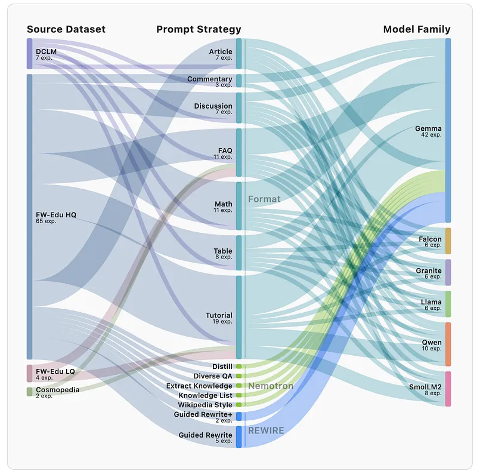 | Three study axes—rephrasing strategy, generator choice, seed quality—and how they interact. |
| 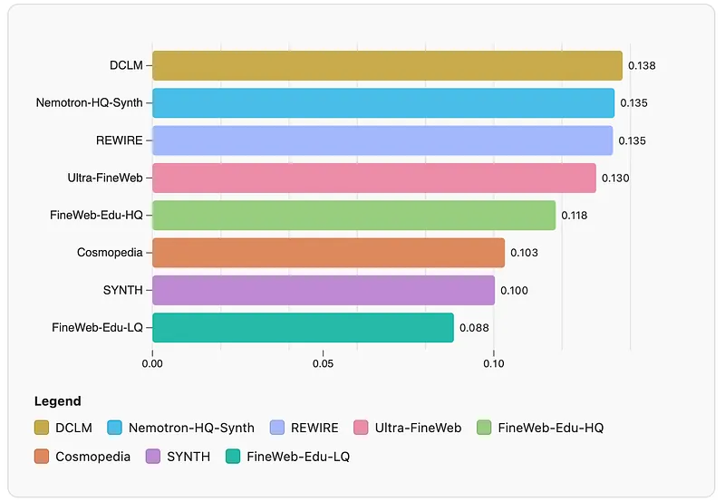 | Experimental pipeline from curated seed corpora through prompts to evaluator suites. |
| 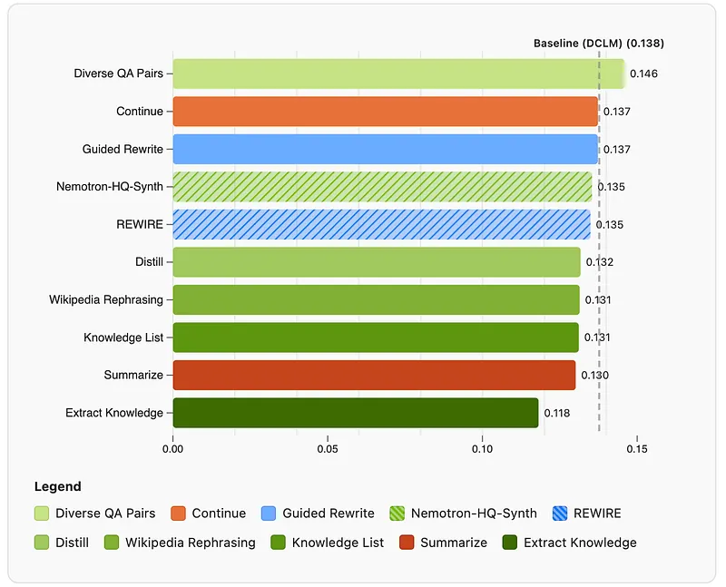 | Baseline synthetic datasets vs DCLM under identical 1.7B / 20B-token training. |
| 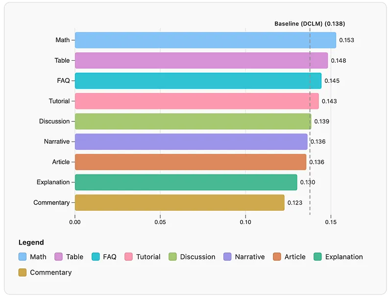 | Isolated prompts inside Nemotron-HQ-Synth, REWIRE, and BeyondWeb mixes vs DCLM per benchmark. |
| 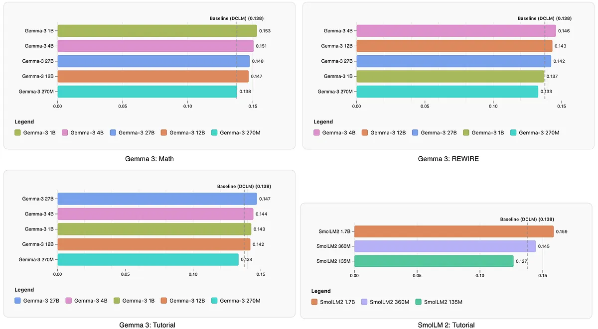 | Nine new instructional prompts (FAQ, math, table, tutorial, …) compared with DCLM. |
| 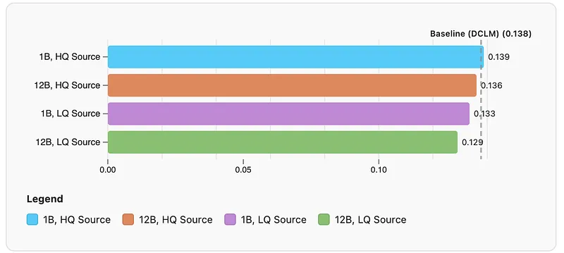 | Generator scale curves for Gemma-3 and SmolLM2 on representative prompts. |
| 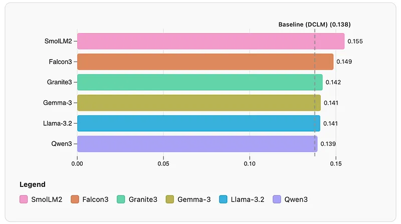 | 1B vs 12B Gemma-3 rewriters on high- vs low-quality FineWeb seeds. |
| 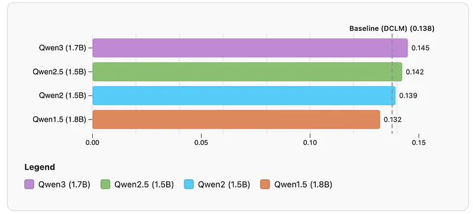 | Model-family comparison near 1B parameters (SmolLM2 vs Gemma, Llama, Qwen, Granite, Falcon). |
| 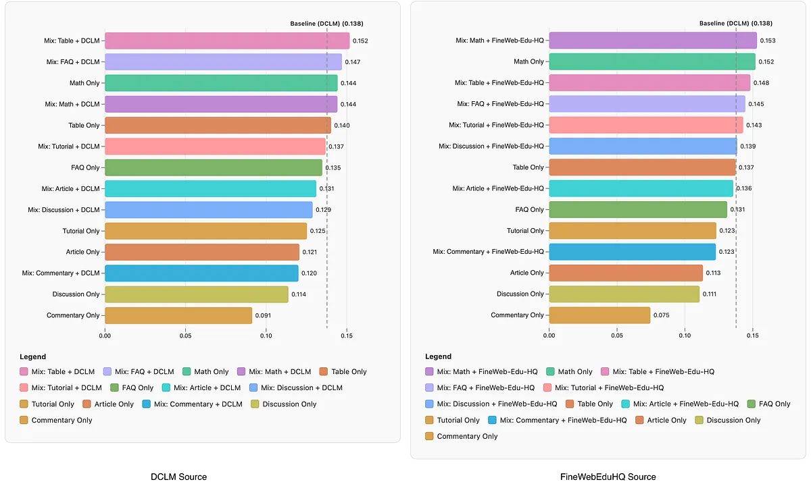 | Qwen 1.5–3 generations evaluated on the tutorial prompt. |
| 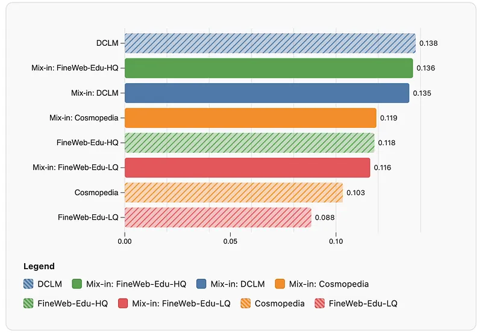 | Synthetic-only training vs mixing synthetic rewrites with original web text. |
| 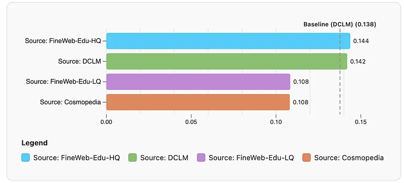 | Effect of mix-in dataset when combining tutorial rewrites with DCLM/Cosmopedia/FineWeb variants. |
| 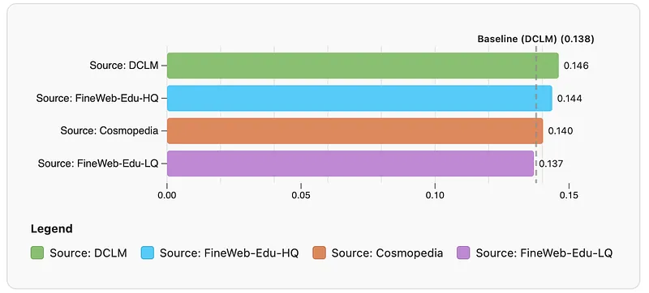 | Source corpora compared when mix-in volume mirrors each source (faq & tutorial prompts). |
| 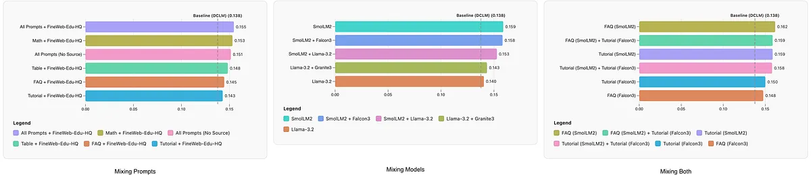 | Same sources with a fixed FineWeb-Edu-HQ mix-in (isolating rewriter vs seed quality). |
| 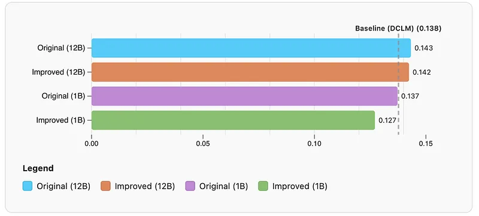 | Diversity/enrichment strategies vs the best single recipe (performance averages, no compounding). |
| 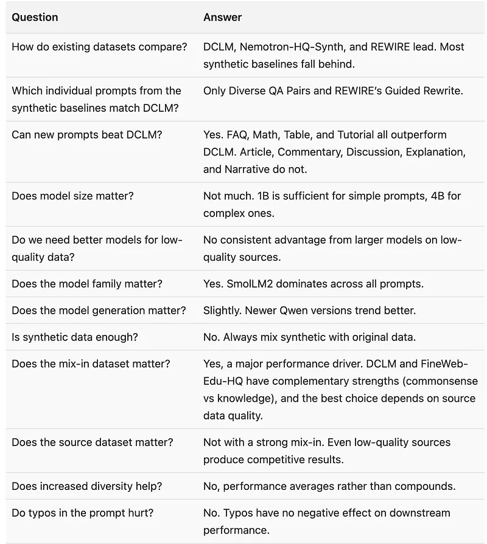 | REWIRE prompt with intentional typos vs cleaned spelling at 1B and 12B scales. |
## Related

- [[Papers Explained Corpus]]
- [[Synthetic Data]]
- [[Large Language Models]]
- [[Reasoning Models]]
- [[Evaluation and Benchmarks]]
- [[Papers Explained - Composer 2]]
- [[Papers Explained - GGUF]]

#summary #topic
