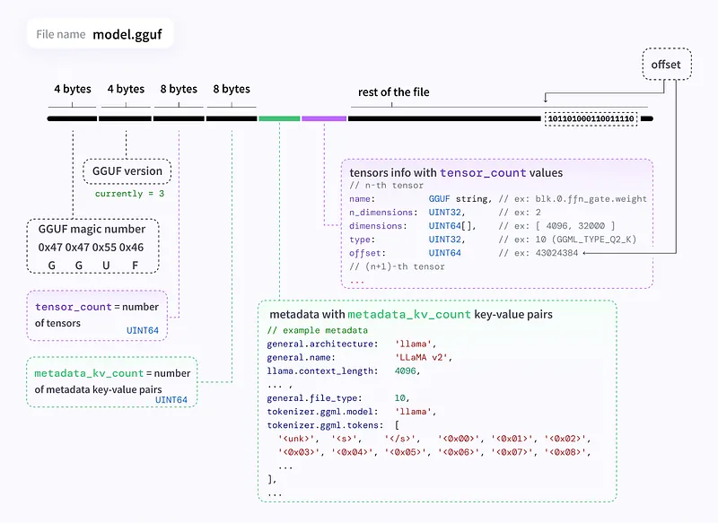

# Papers Explained - GGUF

GGUF (GGML Unified Format) is a binary file format designed for storing and loading large language models (LLMs), specifically for inference, primarily within the GGML ecosystem and its derivatives like llama.cpp. It builds upon its predecessor, GGML, addressing its limitations and offering significant improvements.

This page ingests the source article into the wiki and connects it to [[Papers Explained Corpus]], [[Large Language Models]].

## Source Metadata

- Source file: `raw/draft_Papers-Explained--GGUF-bd7ec5b06f54.md`
- Source title: Papers Explained: GGUF
- Canonical: [https://medium.com/p/bd7ec5b06f54](https://medium.com/p/bd7ec5b06f54)

## Key Ideas

- GGUF (GGML Unified Format) is a binary file format designed for storing and loading large language models (LLMs), specifically for inference, primarily within the GGML ecosystem and its derivatives like llama.cpp.
- A GGUF file is organized into distinct sections:
- Magic Number: “GGUF” for file type identification.
- Version Number: Indicates the GGUF format version.
- Tensor Count: Specifies the number of tensors in the file.

## Notes

GGUF (GGML Unified Format) is a binary file format designed for storing and loading large language models (LLMs), specifically for inference, primarily within the GGML ecosystem and its derivatives like llama.cpp. It builds upon its predecessor, GGML, addressing its limitations and offering significant improvements.

## Structure

A GGUF file is organized into distinct sections:

### Header:

- Magic Number: “GGUF” for file type identification.

- Version Number: Indicates the GGUF format version.

- Tensor Count: Specifies the number of tensors in the file.

- Metadata Key-Value Pair Count: Indicates the number of metadata entries.

### Metadata Key-Value Pairs:

Contains crucial information about the model:

- Architecture

- Tokenization Scheme

- Hyperparameters

- Quantization Details

### Tensor Information:

For each tensor in the model, this section provides:

- Name

- Number of Dimensions

- Size of each dimension

- Data Type (indicates quantization level)

- Offset to the tensor’s data within the file

### Tensor Data:

- The actual data for each tensor, stored according to its specified data type and a specified alignment (defaults to 32 bytes).

- Padding might be added to tensors for processing consistency during inference.

## Quantization Types

GGUF supports numerous quantization methods, each offering different trade-offs between model size, computational efficiency, and accuracy. Below is a comprehensive breakdown of the various quantization types and their properties.

### Q2_K Quantization

Q2_K represents one of the most aggressive quantization approaches:

- 2 bits per weight, resulting in extremely high compression

- Utilizes the K-quant approach (explained in suffix section)

- Provides approximately 16x reduction from original float32 models

### Q3_K Series (Q3_K_S, Q3_K_M, Q3_K_L)

The Q3_K family uses 3 bits per weight with varying configurations:

Q3_K_S (Small):

- Most aggressive configuration within the Q3_K family

- Uses “type-0” 3-bit quantization in super-blocks containing 16 blocks

- Each block contains 16 weights

- Scales are quantized with 6 bits

- Results in 3.4375 bits per weight effective rate

- Highest compression but lowest quality in the Q3_K series

Q3_K_M (Medium):

- Provides a balanced approach between compression and quality

- Intermediate configuration between S and L variants

- More precision than Q3_K_S but less than Q3_K_L

Q3_K_L (Large):

- Least aggressive configuration in the Q3_K family

- Preserves more of the original model’s precision

- Lowest compression but highest quality in the Q3_K series

### Q4 Series (Q4_0, Q4_K_S, Q4_K_M)

The Q4 series employs 4 bits per weight with different implementation strategies:

Q4_0:

- Utilizes “type-0” quantization: w = d * q, where d is the block scale

- Does not use K-quant techniques, following an older quantization method

- Simpler implementation but potentially less effective than K-quant approaches

Q4_K_S (Small):

- Employs K-quant with more aggressive settings

- Uses “type-1” 4-bit quantization in super-blocks containing 8 blocks

- Each block has 32 weights

- Scales and minimums are quantized with 6 bits

- Results in approximately 4.5 bits per weight effective rate

Q4_K_M (Medium):

- Uses GGML_TYPE_Q4_K for most tensors, but applies GGML_TYPE_Q6_K for half of the attention.wv and feed_forward.w2 tensors

- This hybrid approach provides better preservation of critical weights while maintaining reasonable compression

- Often considered to have the best balance between size and perplexity for PC use

### Q5 Series (Q5_0, Q5_K_S, Q5_K_M)

The Q5 series utilizes 5 bits per weight with various implementations:

Q5_0:

- Employs “type-0” quantization (w = d * q)

- Traditional non-K-quant approach at 5 bits precision

Q5_K_S (Small):

- K-quant implementation with more aggressive compression settings

- Preserves more precision than Q4_K_S but less than Q5_K_M

Q5_K_M (Medium):

- Balanced approach within the Q5_K family

- Offers good trade-offs between compression and accuracy

- Uses mixed precision similar to Q4_K_M but at higher base precision

### Q6_K Quantization

Q6_K provides higher precision while still offering significant compression:

- Bit Precision: 6 bits per weight

- Structure: Super-blocks with 16 blocks, each block having 16 weights

- Scale Quantization: Scales are quantized with 8 bits

- Effective Bit Rate: 6.5625 bits per weight

### Q8_0 Quantization

Q8_0 represents the highest precision among the commonly used quantization methods:

- 8 bits per weight

- Likely uses “type-0” quantization (w = d * q)

- Provides approximately 4x reduction from float32

### Understanding Quantization Suffixes

The various suffixes in quantization type names convey important information about implementation details:

_K Suffix

The “_K” indicator refers to llama.cpp’s K-type quantization methods:

- Represents a more sophisticated approach to bit allocation compared to legacy quantization methods

- Organizes weights into super-blocks and blocks, applying quantization at these levels

- May run faster or slower than other methods (like “IQ” i-quants) depending on hardware configuration

- Particularly effective with older hardware, Macs, and setups with low GPU layer usage or pure CPU inference

_0 and _1 Suffixes

These suffixes indicate different quantization implementation approaches:

_0 (Type-0):

- Uses the formula w = d * q, where w is the reconstructed weight, d is the block scale, and q is the quantized value

- Simpler approach with one parameter (scale) per block

- _1 (Type-1):

- Uses the formula w = d * q + m, where m is the block minimum value

- Provides an additional parameter for potentially better accuracy

- More complex but often more precise reconstruction

_S, _M, _L Suffixes

These suffixes indicate the size or configuration aggressiveness:

_S (Small):

- Most aggressive quantization within its family

- Highest compression but lowest accuracy

- For example, Q3_K_S is quantized more heavily than Q3_K_L

_M (Medium):

- Balanced approach between small and large configurations

- Moderate compression and accuracy

- Often provides the best trade-off for general use

_L (Large):

- Least aggressive quantization within its family

- Lowest compression but highest accuracy

- Prioritizes preserving model quality over file size reduction

## Imatrix Quantization

Imatrix Quantization is a technique used to improve the quality of quantized language models, especially at lower bitrates. It focuses on preserving the most critical information during quantization, minimizing performance loss.

- Importance Matrix (Imatrix): A matrix that assigns importance scores to different parts of the model (e.g., blocks of weights). These scores are derived from a calibration dataset representative of the model’s intended use. Higher scores indicate greater importance.

- Calibration Data: A small subset of the training data or a representative dataset used to calculate the importance scores. The quality and relevance of this data significantly impact the effectiveness of the Imatrix.

- Quantization: The process of mapping high-precision numerical values (e.g., 32-bit floats) to lower-precision formats (e.g., 4-bit integers) to reduce memory usage and accelerate computation. Standard quantization often uses a uniform scaling factor and zero point.

- Block-Level Quantization: Imatrix quantization often operates at a block level, applying different quantization parameters to different blocks of weights based on their importance scores.

## Figures

Figures from the Medium HTML export (`raw/draft_Papers-Explained--GGUF-bd7ec5b06f54.md`); local copies under `wiki/assets/papers-explained-gguf/` when download succeeded.

| Figure | Caption |
|--------|---------|
|  | GGUF file anatomy: header metadata, tensor metadata index, and aligned tensor blobs for GGML/llama.cpp loaders. |
|  | Supported GGUF quantization families (bit-width tradeoffs across Q2_K … Q8_0 and k-quants). |
## Related

- [[Papers Explained Corpus]]
- [[Large Language Models]]
- [[Papers Explained - FinePhrase]]
- [[Papers Explained - GLIDE]]

#summary #topic
