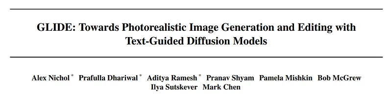
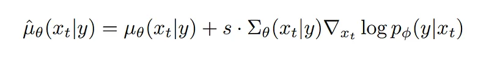
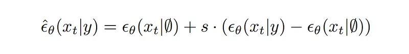
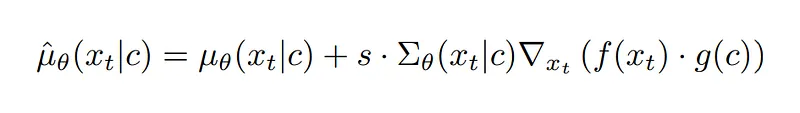
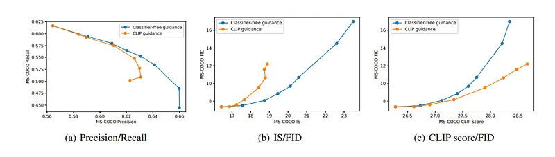
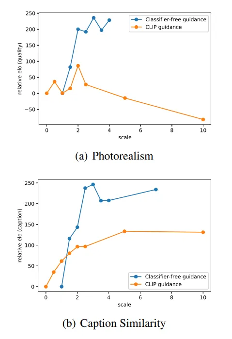
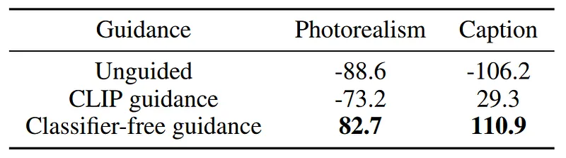
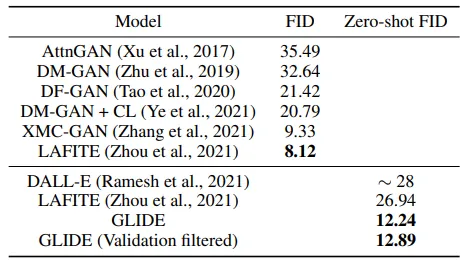
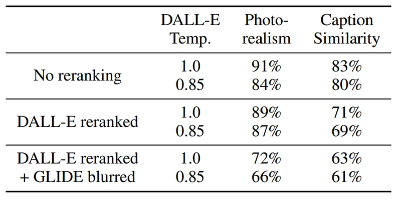

# Papers Explained - GLIDE

GLIDE explores diffusion models for the problem of text-conditional image synthesis and compares two different guidance strategies: CLIP guidance and classifier-free guidance. It is found that the latter is preferred by human evaluators for both photorealism and caption similarity, and photorealistic samples are often produced.

This page ingests the source article into the wiki and connects it to [[Papers Explained Corpus]], [[Vision Language Models]].

## Source Metadata

- Source file: `raw/draft_Papers-Explained--GLIDE-33ac1a6eee14.md`
- Source title: Papers Explained: GLIDE
- Canonical: [https://medium.com/p/33ac1a6eee14](https://medium.com/p/33ac1a6eee14)

## Key Ideas

- GLIDE explores diffusion models for the problem of text-conditional image synthesis and compares two different guidance strategies: CLIP guidance and classifier-free guidance.
- Samples from classconditional diffusion models can often be improved with classifier guidance, where a class-conditional diffusion model with mean µθ(xt|y) and variance Σθ(xt|y) is additively perturbed by the gradient of the logprobability log pφ(y|xt) of a...
- The coefficient s is called the guidance scale, and it is found that increasing s improves sample quality at the cost of diversity.
- Classifier-free guidance is a technique for guiding diffusion models that does not require a separate classifier model to be trained.
- Classifier-free guidance has two appealing properties.

## Notes

GLIDE explores diffusion models for the problem of text-conditional image synthesis and compares two different guidance strategies: CLIP guidance and classifier-free guidance. It is found that the latter is preferred by human evaluators for both photorealism and caption similarity, and photorealistic samples are often produced.

## Background

### Guided Diffusion

Samples from classconditional diffusion models (as described in [[What are Diffusion Models?]]) can often be improved with classifier guidance, where a class-conditional diffusion model with mean µθ(xt|y) and variance Σθ(xt|y) is additively perturbed by the gradient of the logprobability log pφ(y|xt) of a target class y predicted by a classifier. The resulting new perturbed mean µˆθ(xt|y) is given by:

The coefficient s is called the guidance scale, and it is found that increasing s improves sample quality at the cost of diversity.

### Classifier-free guidance

Classifier-free guidance (detailed in [[Classifier-Free Guidance]]) is a technique for guiding diffusion models that does not require a separate classifier model to be trained. For classifier-free guidance, the label y in a class-conditional diffusion model  θ(xt|y) is replaced with a null label ∅ with a fixed probability during training. During sampling, the output of the model is extrapolated further in the direction of  θ(xt|y) and away from  θ(xt|∅) as follows:

Classifier-free guidance has two appealing properties.

- It allows a single model to leverage its own knowledge during guidance, rather than relying on the knowledge of a separate classification model.

- It simplifies guidance when conditioning on information that is difficult to predict with a classifier (such as text).

### CLIP Guidance

Since CLIP provides a score of how close an image is to a caption, several works have used it to steer generative models like GANs towards a user-defined text caption. The same idea can be applied to diffusion models by a CLIP model being used in classifier guidance for the replacement of the classifier. The reverse-process mean is perturbed with the gradient of the dot product of the image and caption encodings with respect to the image:

Similar to classifier guidance, CLIP must be trained on noised images xt to obtain the correct gradient in the reverse process.

## Training

For the main experiments, a 3.5 billion parameter text-conditional diffusion model at 64 × 64 resolution, and another 1.5 billion parameter text-conditional upsampling diffusion model to increase the resolution to 256 × 256 are trained. For CLIP guidance, a noised 64 × 64 ViT-L CLIP model is also trained.

### Text-Conditional Diffusion Models

The ADM model architecture is adopted, and augmented with text conditioning information. For each noised image xt and corresponding text caption c, p(xt−1|xt, c) is predicted by our model. To condition on the text, it is first encoded into a sequence of K tokens and these tokens are fed into a Transformer model. The output of this transformer is used in two ways: first, the final token embedding is used in place of a class embedding in the ADM model; second, the last layer of token embeddings is separately projected to the dimensionality of each attention layer throughout the ADM model, and then concatenated to the attention context at each layer.

The model is trained on the same dataset as DALL-E. The same model architecture as the ImageNet 64 × 64 model is used, but the model width is scaled to 512 channels, resulting in roughly 2.3 billion parameters for the visual part of the model. For the text encoding Transformer, 24 residual blocks of width 2048 are used, resulting in roughly 1.2 billion parameters.

Additionally, a 1.5 billion-parameter upsampling diffusion model is trained to go from 64 × 64 to 256 × 256 resolution. This model is conditioned on text in the same way as the base model, but a smaller text encoder with width 1024 is used instead of 2048. Otherwise, the architecture matches the ImageNet upsampler, except that the number of base channels is increased to 384. The base model is trained for 2.5M iterations at batch size 2048.

The upsampling model is trained for 1.6 million iterations at a batch size of 512. It is found that these models train stably with 16-bit precision and traditional loss scaling. The total training compute is roughly equal to that used to train DALL-E.

### Fine-tuning for classifier-free guidance

After the initial training run, our base model was fine-tuned to support unconditional image generation. This training procedure is exactly like pre-training, except that 20% of text token sequences are replaced with an empty sequence. This way, the ability to generate text-conditional outputs is retained by the model, but images can also be generated unconditionally.

### Image Inpainting

Diffusion model inpainting can be performed by sampling from the diffusion model as usual, but replacing the known region of the image with a sample from q(xt|x0) after each sampling step. However, this has the disadvantage that the model cannot see the entire context during the sampling process (only a noised version of it), occasionally resulting in undesired edge artifacts in our early experiments.

To achieve better results, the model is explicitly fine-tuned to perform inpainting. During fine-tuning, random regions of training examples are erased, and the remaining portions are fed into the model along with a mask channel as additional conditioning information. The model architecture is modified to have four additional input channels: a second set of RGB channels and a mask channel. The corresponding input weights for these new channels are initialized to zero before fine-tuning. For the upsampling model, the full low-resolution image is always provided, but only the unmasked region of the high-resolution image is provided.

## Results

Firstly, The difference between classifier-free guidance and CLIP guidance isevaluated by examining the Pareto frontier of the quality-fidelity trade-off. Both approaches are for zero-shot MS-COCO generation at 64 × 64 resolutions.

*Figure: Comparing the diversity-fidelity trade-off of classifier-free guidance and CLIP guidance on MS-COCO 64 × 64.*

As both guidance scales are increased, a clean trade-off is observed in FID vs. IS, Precision vs. Recall, and CLIP score vs. FID. In the former two curves, it is found that classifier-free guidance is (nearly) Pareto optimal. The exact opposite trend is seen when CLIP score is plotted against FID; specifically, it appears that CLIP guidance can boost CLIP score much more than classifier-free guidance.

It is hypothesized that adversarial examples for the evaluation of the CLIP model are being found by CLIP guidance, rather than classifier-free guidance actually outperforming it when it comes to matching the prompt. To verify this hypothesis, human evaluators were employed to judge the sample quality of generated images. In this setup, two 256 × 256 images are presented to human evaluators, and they must choose which sample either 1) better matches a given caption or 2) looks more photorealistic. Additionally, it can be indicated by the human evaluator that neither image is significantly better than the other, in which case half of a win is assigned to both models.

Human evaluation protocol is used to first sweep over guidance scales for both approaches separately.

*Figure: Elo scores from human evaluations for finding the optimal guidance scales for classifier-free guidance and CLIP guidance. The classifier-free guidance and CLIP guidance comparisons were performed separately, but can be super-imposed onto the same graph by normalizing for the Elo score of unguided sampling.*

The both models are compared with the best scales from the previous stage.

*Figure: Elo scores resulting from a human evaluation of unguided diffusion sampling, classifier-free guidance, and CLIP guidance on MS-COCO validation prompts at 256 × 256 resolution. For classifier-free guidance, Scale 3.0, and for CLIP guidance scale 2.0 is used.*

It is found that humans disagree with the CLIP score, and it is observed that classifier-free guidance results in higher-quality samples that are in better agreement with the corresponding prompt.

GLIDE is complared with other text-conditional generative image models as well.

*Figure: Comparison of FID on MS-COCO 256 × 256.*

It is found that our model obtains competitive FID on MS-COCO without ever being explicitly trained on this dataset. FID is also computed against a subset of the MS-COCO validation set that has been purged of all images similar to images in our training set. The validation batch is reduced by 21% due to this. It is found that our FID increases slightly from 12.24 to 12.89 in this case, which could largely be explained by the change in FID bias when a smaller reference batch is used.

Finally, GLIDE is compared against DALL-E using human evaluation protocol.

*Figure: Human evaluation results comparing GLIDE to DALL-E. Win probabilities of GLIDE model are reported for both photorealism and caption similarity. In the final row, the dVAE used by DALL-E is applied to the outputs of GLIDE.*

Three sets of comparisons between DALL-E and GLIDE are performed. Firstly, both models are compared when no CLIP reranking is used. Secondly, CLIP reranking is only used for DALL-E. Finally, CLIP reranking is used for DALL-E, and GLIDE samples are also projected through the discrete VAE used by DALL-E. The latter allows the assessment of how DALL-E’s blurry samples affect human judgment. All evaluations are conducted using two temperatures for the DALL-E model. In all settings, our model is preferred by the human evaluators, even in the configurations that heavily favor DALL-E by allowing it to use a much larger amount of test-time compute (through CLIP reranking) while reducing GLIDE sample quality (through VAE blurring).

## Paper

GLIDE: Towards Photorealistic Image Generation and Editing with Text-Guided Diffusion Models [2112.10741](https://arxiv.org/abs/2112.10741)

## Figures

Figures from the Medium HTML export (`raw/draft_Papers-Explained--GLIDE-33ac1a6eee14.md`); local copies under `wiki/assets/papers-explained-glide/` when download succeeded.

| Figure | Caption |
|--------|---------|
|  | GLIDE overview comparing classifier-free guidance vs CLIP-based guidance for text-to-image diffusion. |
|  | Classifier guidance perturbs reverse-process means with classifier logits over noisy latents. |
|  | Classifier-free guidance blends conditional and unconditional score predictions during sampling. |
|  | CLIP guidance perturbs diffusion means using gradients of CLIP image-text similarity on noisy xt. |
|  | Text-conditional ADM backbone plus Transformer caption encoder feeding cross-attention contexts (64² base + upsampler). |
|  | MS-COCO 64² Pareto curves for diversity vs fidelity under classifier-free vs CLIP guidance scales. |
|  | Human Elo sweeps isolating optimal guidance scales for each guidance family before head-to-head judging. |
|  | Human Elo at 256² comparing unguided, classifier-free (scale 3.0), and CLIP-guided (scale 2.0) sampling. |
|  | MS-COCO FID at 256² plus GLIDE vs prior text-conditional generators; bottom row compares GLIDE to DALL-E with human win rates (photorealism & caption match). |
## Related

- [[Papers Explained Corpus]]
- [[Vision Language Models]]
- [[Papers Explained - GGUF]]
- [[Papers Explained - How2Everything]]
- [[Classifier-Free Guidance]]
- [[What are Diffusion Models?]]

#summary #topic
