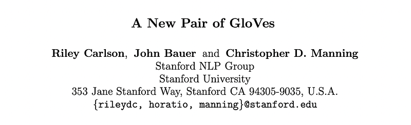
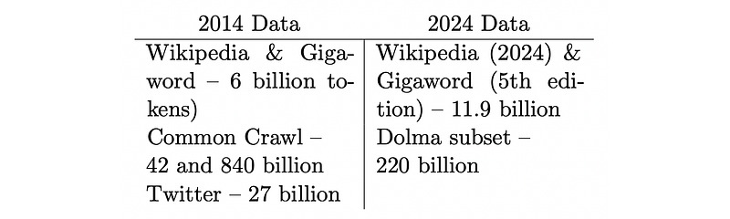
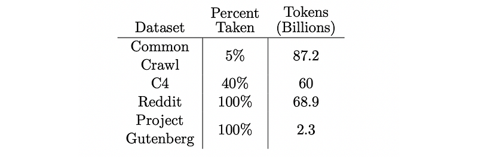
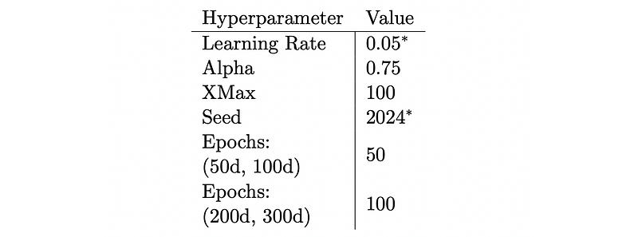
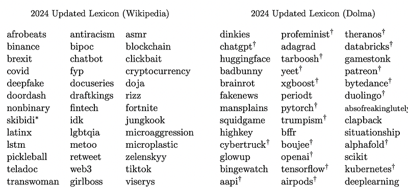
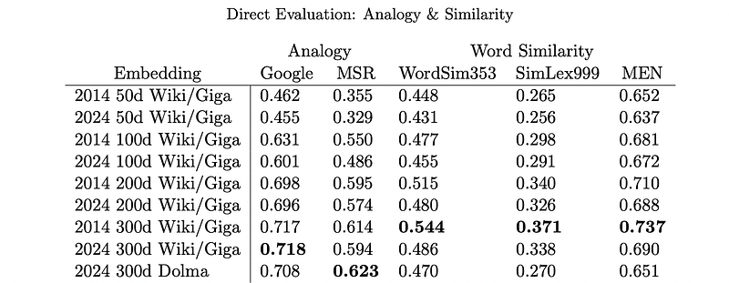
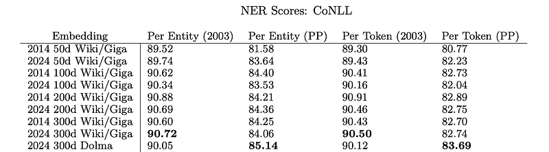
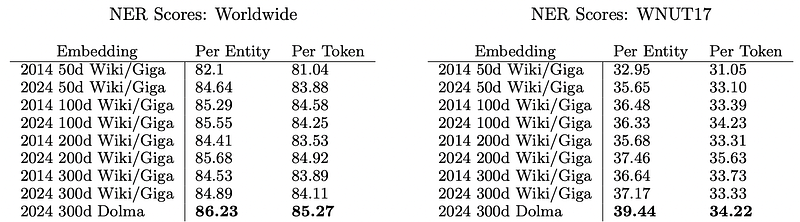

# Papers Explained - GloVe 2024

This report details the creation and evaluation of new 2024 English GloVe (Global Vectors for Word Representation) models. The original 2014 GloVe models, while useful, lacked detailed documentation regarding data versions and preprocessing.

This page ingests the source article into the wiki and connects it to [[Papers Explained Corpus]], [[Evaluation and Benchmarks]], [[Embedding and Retrieval]], [[Reasoning Models]], [[Code Models]].

## Source Metadata

- Source file: `raw/2025-08-15_Papers-Explained--GloVe-2024-8c935a8ac58a.html`
- Source title: Papers Explained: GloVe 2024
- Published: 2025-08-15
- Canonical: [https://medium.com/@ritvik19/papers-explained-glove-2024-8c935a8ac58a](https://medium.com/@ritvik19/papers-explained-glove-2024-8c935a8ac58a)

## Key Ideas

- For the 2024 embeddings, 3 corpora are used to train 2 sets of embeddings: Wikipedia, Gigaword, and Dolma.
- The Wikipedia corpus is a useful source for word definitions in a more naturally occurring environment than, say, a dictionary.
- Gigaword consists of English newswire from 4 to 7 distinct international news outlets between 1994–2010.
- Since 2014, the Wikipedia dumps have roughly doubled in the number of tokens. To rebalance this growth, two copies of Gigaword are put in the training corpus.
- Dolma v1.6, released in January of 2024, consists of 3 trillion tokens from books, programming scripts, reference materials, scholarly articles, and online content. A subset of over 1TB is taken from Dolma.

## Notes

Foundational GloVe theory (co-occurrence ratios, log-linear objective, weighted least squares) is summarized in [[Learning Word Embedding]] (Pennington et al., 2014). This 2024 report covers retrained English vectors, corpora (Wikipedia, Gigaword, Dolma), and downstream NER/analogy benchmarks.

## Papers Explained 432: GloVe 2024

This report details the creation and evaluation of new 2024 English GloVe (Global Vectors for Word Representation) models. The original 2014 GloVe models, while useful, lacked detailed documentation regarding data versions and preprocessing. The 2024 models address this by providing thorough documentation and incorporating updated data from Wikipedia, Gigaword, and a subset of Dolma.

## Data

*Figure: Comparison of the data sources used to train word embeddings in 2014 and 2024*

For the 2024 embeddings, 3 corpora are used to train 2 sets of embeddings: Wikipedia, Gigaword, and Dolma.

The Wikipedia corpus is a useful source for word definitions in a more naturally occurring environment than, say, a dictionary.

Gigaword consists of English newswire from 4 to 7 distinct international news outlets between 1994–2010.

Since 2014, the Wikipedia dumps have roughly doubled in the number of tokens. To rebalance this growth, two copies of Gigaword are put in the training corpus.

Dolma v1.6, released in January of 2024, consists of 3 trillion tokens from books, programming scripts, reference materials, scholarly articles, and online content. A subset of over 1TB is taken from Dolma.

*Figure: Dolma Training Subset*

## Method

### Corpus #1: Wikipedia and Gigaword

The Wikipedia data was cleaned by removing tags such as <doc> and </doc> tokens. The data was preprocessed using Stanford’s CoreNLP tokenizer using lowercase letters. The Wikipedia and Gigaword corpora were then merged with Gigaword being included twice. Together, this corpus is about 60GB with Gigaword accounting for about 74% of the size.

The vocabulary size was determined by setting a Minimum Frequency Threshold (MFT) for words to be included in the corpus. Through experiments with vectors trained using different MFTs, it was observed that an MFT of 20 yielded the highest average cosine similarity between the trained vectors and their Weighted Least Squares (WLS) vectors indicating that the trained embeddings closely align with the statistically optimal solution derived from the cooccurrence matrix, reflecting robust and accurate word representations. For this corpus, using an MFT of 20 resulted in a vocabulary size of 1,291,146 words.

### Corpus #2: Dolma

Like the other corpora, preprocessing was done using Stanford’s CoreNLP tokenizer in the same manner. After preprocessing, tokens were removed. A maximum vocabulary size of 1.2 million was used. The vocabulary building process was done independently on the different subsets of Dolma and merged at the end to have 1.2 million vocabulary size.

### Training

For each embedding, the vocabulary and cooccurrence matrix were first constructed. A symmetric context window of size 10 was used to define cooccurrences. Once the cooccurrence matrix was built, it was shuffled with a fixed seed of 123 for the Wiki/Giga matrix and 2024 for Dolma matrix. Embeddings of dimensions 50, 100, 200, and 300 were trained for the Wikipedia and Giga-word corpus, and 300-dimensional embeddings were trained for the Dolma corpus. The embeddings were optimized using GloVe’s original optimizer, AdaGrad.

*Figure: Training hyperparameter.*

- *0.075 learning rate and 123 seed used for 50d Wiki/Giga vectors

## Evaluation

### Updated Lexicon

Purpose:

- To determine if new, commonly used words are reflected in the updated (2024) embeddings, by examining words present in the 2024 embeddings but absent from the 2014 embeddings.

Comparison:

- 2014 and 2024 embedding vocabularies from the Wikipedia and Gigaword corpora.

- 2024 Dolma embedding vocabularies with those from the 2014 840B vectors trained on Common Crawl.

Procedure:

- Represent vocabularies as sets.

- Compute the difference by subtracting the 2014 set from the 2024 set.

- Select 39 representative examples from the resulting set for each training corpus to illustrate findings.

- ∗ Not in Dolma vectors, † Also in Wiki/Giga vectors

- The new 2024 embeddings provide a significantly larger vocabulary.

- Over 700,000 new words were found in 2024 Wikipedia and double Gigaword embeddings compared to their 2014 counterparts.

- Over 500,000 new words were found in 2024 Dolma embeddings compared to 2014 Common Crawl 840B.

### Direct Evaluation

Purpose:

- To compare the new embeddings with the 2014 embeddings on fundamental word-level tasks.

Word Analogy:

- Goal: Predict a fourth word in an analogy format (word 1 : word 2 :: word 3 : ?) and compare it against a gold-standard labeled word to calculate accuracy.

- Benchmark Datasets:

- Google Analogy dataset (Mikolov et al., 2013a): Comprises 8,869 semantic and 10,675 syntactic word pairs.

- MSR Analogy dataset (Mikolov et al., 2013b): Contains 8,000 syntactic word pairs.

Word Similarity:

- Goal: Assign similarity scores to word pairs and compare these scores to human-annotated benchmarks.

- Benchmark Datasets:

- WordSim353: Contains 353 word pairs classified as highly similar, less similar but related, or unrelated.

- SimLex999: Comprising 999 word pairs annotated with semantic similarity scores.

- MEN: Includes 3,000 word pairs annotated with human-judged relatedness scores.

*Figure: Accuracy of 2014 and 2024 embeddings.*

- On word analogy tasks, 2024 embeddings performed roughly similarly to 2014 embeddings on the Google dataset but slightly lower on the MSR dataset.

- Accuracy for analogy tasks consistently improved with increasing dimension size for both 2014 and 2024 embeddings.

- On word similarity tasks, 2024 embeddings performed competitively with 2014 embeddings across most datasets and dimensions.

- Both 2024 300-dimensional embeddings showed a drop in rank correlation compared to 2014, particularly on SimLex999.

### Named Entity Recognition (NER)

Purpose:

- To assess the performance of the new embeddings on a downstream task, specifically Named Entity Recognition, where tokens in a sentence are tagged with predefined entity categories (persons, locations, organizations, other proper nouns).

Model Used:

- Stanford’s Stanza NER model, modified to replace its default word embeddings with the trained embeddings.

Metrics:

- F1 scores per entity and per token.

Datasets:

- CoNLL-03: Published in 2003, includes entities for persons, locations, organizations, and miscellaneous categories.

- CoNLL-PP: An improved and modernized version of CoNLL-03. Models trained on CoNLL-03 were evaluated on the CoNLL-PP test set.

- English Worldwide Newswire: Consists of over 1,000 English newswire articles published in 2023 from 47 non-American countries, focusing on recent language use and major events like the COVID-19 pandemic. This dataset helps evaluate generalization to recent contexts for embeddings trained on pre-2020 data.

- Emerging and Rare entity recognition (WNUT 17): A 6-class dataset from user-generated text (Youtube, Twitter, Reddit), featuring rarer and often unseen entities, challenging even for humans.

*Figure: Average Test F1 scores per entity and per token.*

*Figure: Average Test F1 scores per entity and per token.*

- The 2024 embeddings generally outperformed their 2014 counterparts across the four NER datasets.

- Notable improvements were observed on temporally dependent datasets.

- 2024 embeddings perform comparably on CoNLL-03 but demonstrating clear advantages on the modernized CoNLL-PP version, with 2024 50d Wiki/Giga embeddings achieving the highest relative improvement in per-entity scores.

- 2024 embeddings indicate consistent improvements across both per-entity and per-token F1 scores on the Worldwide dataset, with 2024 50d Wiki/Giga embeddings significantly outperforming 2014.

- On the challenging WNUT17 dataset, 2024 embeddings consistently outperformed their 2014 counterparts, despite overall lower F1 scores.

- The most pronounced gains for 2024 embeddings in NER tasks were observed in lower dimensions (e.g., 50d).

- While higher dimensions (200d and 300d) achieved the best absolute F1 scores, the relative gains between 2024 and 2014 embeddings were less pronounced at these dimensions.

## Paper

A New Pair of GloVes [2507.18103](https://arxiv.org/abs/2507.18103)

## Figures

Figures from the Medium HTML export (`raw/2025-08-15_Papers-Explained--GloVe-2024-8c935a8ac58a.html`); local copies under `wiki/assets/papers-explained-glove-2024/` when download succeeded.

| Figure | Caption |
|--------|---------|
|  | Title slide for the companion paper *A New Pair of GloVes* (Stanford NLP). |
|  | Side-by-side comparison of 2014 vs 2024 training corpora and approximate token counts (Wikipedia/Gigaword, Common Crawl, Twitter vs Dolma-era mixes). |
|  | Dolma v1.6 subset composition: percent sampled per shard and resulting billions of tokens used for the Dolma GloVe run. |
|  | GloVe training hyperparameters (learning rate, alpha, xmax, shuffle seed, AdaGrad epochs by embedding size). |
|  | Sample of new vocabulary entries in 2024 embeddings vs 2014 baselines for Wikipedia (left) and Dolma (right), illustrating the updated lexicon analysis. |
|  | Direct evaluation table: Google/MSR analogy accuracy and WordSim353 / SimLex999 / MEN similarity correlations for 2014 vs 2024 Wiki/Giga and Dolma vectors. |
|  | Stanza NER on CoNLL: per-entity and per-token F1 on the 2003 test set and the modernized CoNLL-PP split across embedding variants. |
|  | NER F1 on Worldwide Newswire (left) and WNUT-17 (right), comparing 2014 vs 2024 Wiki/Giga sizes and 300d Dolma embeddings. |
## Related

- [[Papers Explained Corpus]]
- [[Evaluation and Benchmarks]]
- [[Embedding and Retrieval]]
- [[Reasoning Models]]
- [[Code Models]]
- [[Papers Explained 431 - Anatomy of a Machine Learning Ecosystem]]
- [[Papers Explained 433 - Aryabhata 1.0]]

#summary #topic
