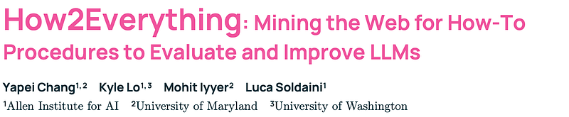
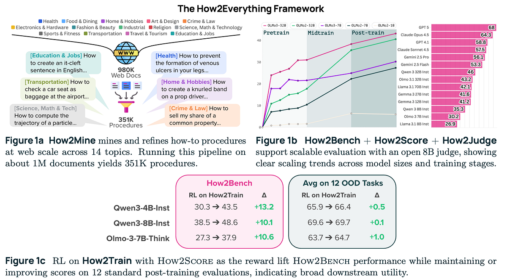
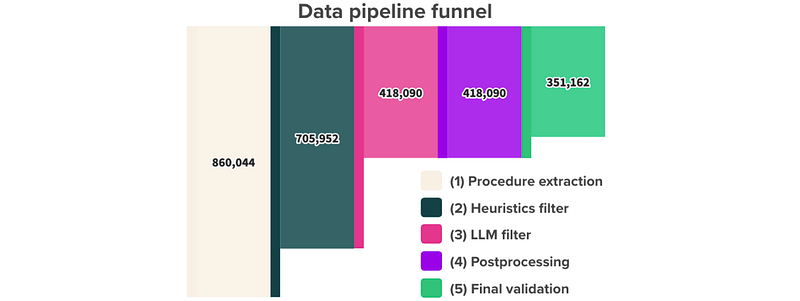
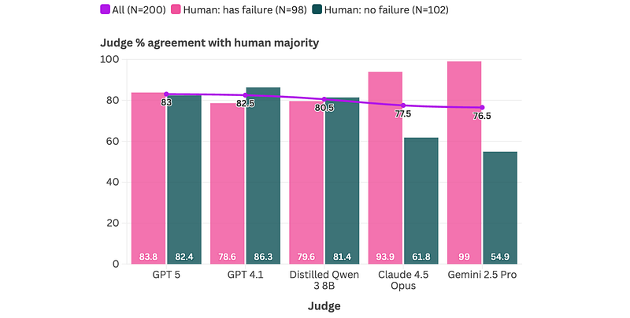
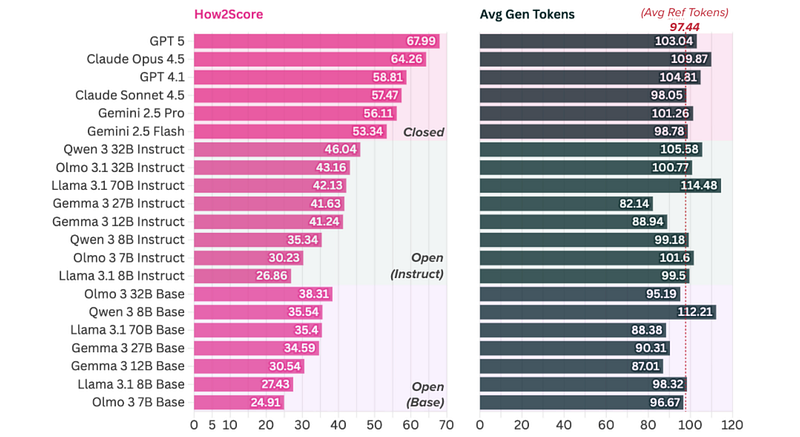
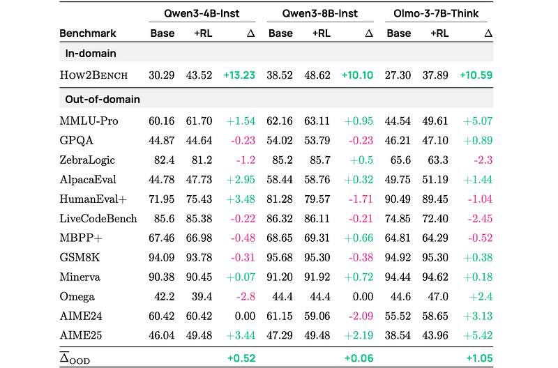

# Papers Explained - How2Everything

Candidate documents are sourced from the DCLM web corpus. Because tutorial-style documents tend to have a high density of explicitly ordered, imperative steps, the document pool is restricted to those labeled as Tutorial & How-to Guide by the WebOrganizer format classifier.

This page ingests the source article into the wiki and connects it to [[Papers Explained Corpus]], [[Large Language Models]], [[Document AI]].

## Source Metadata

- Source file: `raw/draft_Papers-Explained--How2Everything-baef4f7ae61f.html`
- Source title: Papers Explained: How2Everything
- Canonical: [https://medium.com/p/baef4f7ae61f](https://medium.com/p/baef4f7ae61f)

## Key Ideas

- Candidate documents are sourced from the DCLM web corpus. Because tutorial-style documents tend to have a high density of explicitly ordered, imperative steps, the document pool is restricted to those labeled as Tutorial & How-to Guide by the WebOrganizer...
- A multi-stage pipeline is run to extract, filter, and post-process procedures starting from a pool of tutorial documents. All LLM-based stages use GPT-4.1.
- Procedure extraction involves using an LLM to identify whether a candidate web document contains a well-formed sequential procedure and, if so, extract the goal and an ordered list of steps.
- A heuristics filter removes candidates with fewer than 5 or more than 15 steps to avoid trivial or overly complex procedures, and those with high n-gram overlap within the extracted steps.
- An LLM-based filter excludes examples that depend on specific named entities, are purely mathematical calculations, require interacting with UI elements, involve open-ended creative generation, are non-sequential, or are unreasonable/nonsensical.

## Notes

Generating step-by-step “how-to” procedures is a key LLM. Measuring and improving procedural validity at scale on real-world tasks remains challenging and understudied. To address this, a scalable framework to evaluate and improve goal-conditioned procedure generation is introduced. This framework includes How2Mine, which mines 351K procedures from 980K web pages across 14 topics and readily scales to larger corpora. From this pool, How2Bench, a 7K-example evaluation set balanced across topics, is built. To reliably score model outputs, How2Score, an evaluation protocol that uses an LLM judge to detect whether a generation contains any critical failure that would prevent achieving the goal, is developed.

## Problem Setting

In this work,“procedure” is described to be a goal-conditioned sequence of actions. Descriptive procedures are where a model can generate textual representations of such sequences. Executable procedures are where correctness is determined by execution, either in grounded environments with explicit state transitions, such as formal transition systems or simulated environments, or through internally executed reasoning strategies for problem solving. This work focuses on real-world procedures, which fall under the first category.

## How2Mine

Candidate documents are sourced from the DCLM web corpus. Because tutorial-style documents tend to have a high density of explicitly ordered, imperative steps, the document pool is restricted to those labeled as Tutorial & How-to Guide by the WebOrganizer format classifier. The final pool of 351K procedure instances spans 189K unique domains.

A multi-stage pipeline is run to extract, filter, and post-process procedures starting from a pool of tutorial documents. All LLM-based stages use GPT-4.1.

- Procedure extraction involves using an LLM to identify whether a candidate web document contains a well-formed sequential procedure and, if so, extract the goal and an ordered list of steps.

- A heuristics filter removes candidates with fewer than 5 or more than 15 steps to avoid trivial or overly complex procedures, and those with high n-gram overlap within the extracted steps.

- An LLM-based filter excludes examples that depend on specific named entities, are purely mathematical calculations, require interacting with UI elements, involve open-ended creative generation, are non-sequential, or are unreasonable/nonsensical. These criteria are derived from multiple rounds of data inspection.

- For each remaining example, the goal is rewritten to be as specific and deterministic as possible, explicitly stating the required constraints and expected outcome. Because multiple distinct procedures can still satisfy a goal, the resources referenced by the steps in the reference procedure are also listed. Together, these edits narrow the space of valid solutions.

- Finally, an LLM-based sanity check removes any remaining nonsensical or otherwise invalid procedures.

Each procedure instance includes a topic, goal, list of resources (possibly empty), and reference steps. From this pool, How2Bench is constructed by sampling 500 instances per topic (7,000 total), and the remaining instances are used as How2Train.

## How2Score

Taking inspiration from PRMs, the earliest incorrect step identified is treated as the point of failure. A critical failure is defined as an omission, extraneous action, contradiction, severe vagueness, or other deviation from the reference that is severe enough to prevent achieving the goal, or to make the procedure unusable as instructions.

Given an evaluation set D of examples x = ( g, R, S ⋆ , S ˆ ), where g is a goal, R is an extracted resource list, S ⋆ is a reference procedure, and S ˆ is a model-generated procedure, an LLM judge identifies critical failures. Each failure is accompanied by a description and references to the relevant steps S ⋆ and/or in S ˆ .

*Figure: Agreement between LLM judges and the human majority label on critical-failure detection.*

To validate a definition of critical failures, human annotators list all critical failures. Annotations are obtained from various LLM judges and their percentage agreement with the human majority labels is computed.

GPT 5 has the highest overall agreement (83.0%) and is well-calibrated across classes (83.7% on human-majority has_failure cases; 82.4% on no_failure cases). GPT 5 is therefore used as a teacher judge and distilled into How2Judge, a smaller Qwen 3 8B model for stable, low-cost large-scale evaluation. 73K GPT 5 annotations on outputs from a diverse set of generator models are collected and deduplicated to remove any overlap with the human-annotated set. On the human-labeled set, How2Judge achieves 90.5% agreement with GPT 5 and 80.5% agreement with the human majority label.

## How2Bench

How2Bench is created by sampling 500 procedures per topic, resulting in a total of 7,000 examples for systematic evaluation.

At inference time, models are given a goal, resource list, and required step count, and must generate procedures with exactly that number of steps. Each step must be concise and follow example concision levels. This setup controls for comparability across models, though it may not reflect real-world use.

*Figure: How2Bench results on selected models.*

How2Score and How2Judge are used to assess a variety of models. Performance scales with model size and training stage, and closed models outperform open models distinctly.

## Improving Step by Step Procedure Generation with RL.

A training set is created by sampling 100K examples from How2Train, balanced across 14 topics and with low semantic similarity to How2Bench instances.

For SFT, base and instruction-tuned checkpoints of Qwen 3 4B and 8B, and OLMo 3 7B are fine-tuned for one epoch.

For RL, Qwen 3 4B Instruct and 8B Instruct, and OLMo 3 7B Think are trained using GRPO for 1000 optimizer steps with three rewards:

- How2Score computed by How2Judge

- A step-format verifier

- A reference-calibrated length reward to prevent length gaming.

### Results

*Figure: Results before and after RL with How2Score as reward.*

Length control in RL:

- Prevents length gaming by keeping generations close to reference length (|gen|/|ref| ≈ 1.0).

- Without this, models inflate length (up to 1.34×–1.53× the reference), artificially boosting How2Bench scores due to verbosity bias.

RL model evaluation:

- Gains from RL persist even under external judges (GPT 5, Gemini 2.5 Pro), not just How2Judge.

Out-of-domain performance:

- RL-trained models improve How2Bench scores without systematic out-of-domain degradation.

- Changes across domains (knowledge, chat, math, code, reasoning) are mixed but usually modest; no evidence of consistent regression

Effect of additional SFT stage:

- SFT provides small gains for base model checkpoints.

- Offers no benefit for instruction-tuned checkpoints, potentially due to objective mismatch; SFT aims to match a single reference text per goal, which may not minimize critical failures under How2Score.

## Paper

How2Everything: Mining the Web for How-To Procedures to Evaluate and Improve LLMs [2602.08808](https://arxiv.org/abs/2602.08808)

## Figures

Figures from the Medium HTML export (`raw/draft_Papers-Explained--How2Everything-baef4f7ae61f.html`); local copies under `wiki/assets/papers-explained-how2everything/` when download succeeded.

| Figure | Caption |
|--------|---------|
|  | Title block of *How2Everything: Mining the Web for How-To Procedures to Evaluate and Improve LLMs*. |
|  | Framework overview: How2Mine data mining, How2Bench + How2Score + How2Judge scaling trends, and RL gains on How2Train. |
|  | Data pipeline funnel showing candidate reduction across extraction, heuristics filtering, LLM filtering, postprocessing, and final validation. |
|  | Agreement of multiple LLM judges with human-majority critical-failure labels (overall, has-failure, and no-failure subsets). |
|  | How2Bench leaderboard (left) with average generated length (right) compared against reference length. |
|  | Before-vs-after RL results on in-domain How2Bench plus out-of-domain benchmarks for Qwen3-4B, Qwen3-8B, and OLMo-3-7B. |
## Related

- [[Papers Explained Corpus]]
- [[Large Language Models]]
- [[Document AI]]
- [[Papers Explained - GLIDE]]
- [[Papers Explained - Likelihood-Based Reward Designs for General LLM Reasoning]]

#summary #topic
