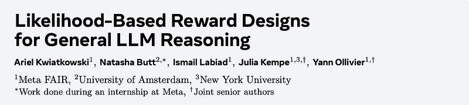
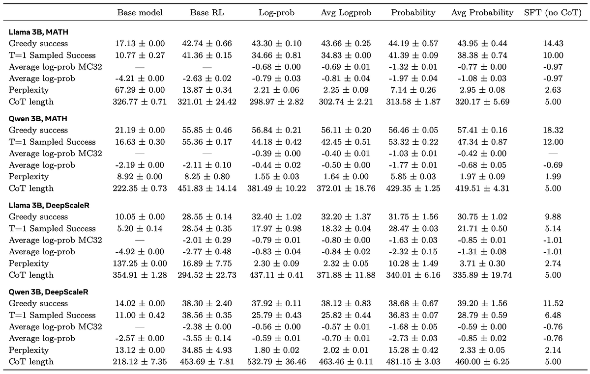
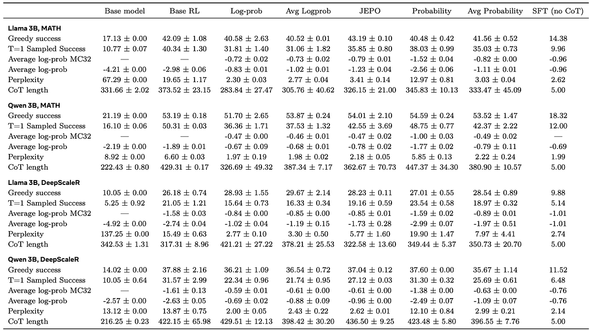
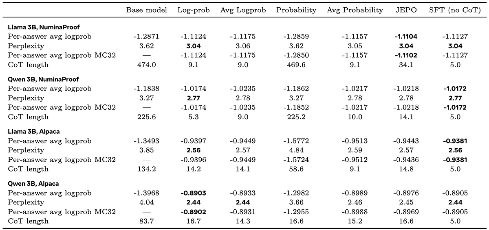

# Papers Explained - Likelihood-Based Reward Designs for General LLM Reasoning

This work systematically compares variants of likelihood-based rewards with standard baselines, testing performance both on standard mathematical reasoning benchmarks and on long-form answers where no external verifier is available.

This page ingests the source article into the wiki and connects it to [[Papers Explained Corpus]], [[Reasoning Models]], [[Reinforcement Learning Topic]], [[Synthetic Data]], [[Large Language Models]], [[Reinforcement Learning]], [[Supervised Fine-Tuning]], [[Verifier-Bounded Learning]].

## Source Metadata

- Source file: `raw/draft_Papers-Explained--Likelihood-Based-Reward-Designs-for-General-LLM-Reasoning-e889106eff08.html`
- Source title: Papers Explained: Likelihood-Based Reward Designs for General LLM Reasoning
- Canonical: [https://medium.com/p/e889106eff08](https://medium.com/p/e889106eff08)

## Key Ideas

- Chain-of-thought fine-tuning via Reinforcement Learning
- The general context involves fine-tuning an LLM to improve performance on a set of questions-answers via a Chain-of-Thought optimized by reinforcement learning. For each prompt p, the fine-tuned model should first print a CoT z, then an answer a.
- Denoting πθ the generative probabilistic model with parameter θ, and D the dataset (a distribution of questions or prompts p), the objective is to maximize
- where R(z,a) is the reward obtained for CoT z and answer a.
- RL fine-tuning with probability-based rewards

## Notes

This work systematically compares variants of likelihood-based rewards with standard baselines, testing performance both on standard mathematical reasoning benchmarks and on long-form answers where no external verifier is available. It is found that using the log-probability of the reference answer as the reward for chain-of-thought learning is the only option that performs well in all setups. This reward is also consistent with the next-token log-likelihood loss used during pretraining.

## Method

Chain-of-thought fine-tuning via Reinforcement Learning

The general context involves fine-tuning an LLM to improve performance on a set of questions-answers via a Chain-of-Thought optimized by reinforcement learning. For each prompt p, the fine-tuned model should first print a CoT z, then an answer a. A reward R is computed depending on a (such as correctness, or matching some reference answer). Fine-tuning should optimize the expected reward.

Denoting πθ the generative probabilistic model with parameter θ, and D the dataset (a distribution of questions or prompts p), the objective is to maximize

where R(z,a) is the reward obtained for CoT z and answer a.

RL fine-tuning with probability-based rewards

This research focuses on the case when a reference answer a⋆ is available for each prompt in the dataset. This allows for the estimation of the probability of this answer given the CoT.

The research will compare RL training with several rewards derived in this setting. For instance, a reward similar to the log-loss used during pretraining can be set:

This setting is called log-prob rewards. Given a CoT z, this quantity can be computed in one pass of a transformer on the reference answer a⋆. In particular, since the reward depends on z and a⋆ but not on a, sampling of an answer a given the CoT z is not necessary.

### Algorithms and rewards tested

For every RL algorithm except JEPO, the advantages used for the Reinforce gradient updates are obtained by RLOO. This involves subtracting from the reward a leave-one-out estimate of the mean reward estimated on a minibatch for a given prompt. This is an unbiased version of GRPO.

SFT involves standard fine-tuning with the next-token cross-entropy loss, omitting the CoT, and fine-tuning the model to predict the ground truth directly from the prompt.

Base RL is the most direct RL method. For each prompt p, a CoT z is sampled from πθ(z|p), followed by an answer a from πθ(a|p,z), and the correctness of the answer is checked:

Probability (VeriFree) uses the reward

directly computing the probability of the reference answer a⋆ given z using the model πθ, instead of sampling an answer a from the model.

Average prob (AvgProb) sets the reward to the average per-token probabilities of the reference answer:

Log-prob computes the reward as

directly computing the log-likelihood of the reference answer a⋆ given z.

Average log-prob (AvgLogprob) rescales the reward to account for longer answers having rewards of a bigger magnitude, since log πθ(a⋆|p,z) is a sum over all tokens in a⋆. The reward is

where |a⋆| is the number of tokens in a⋆. This means different answers in the dataset are weighted differently compared to log-probs.

JEPO uses a refined version of the group reward in GRPO and RLOO, noting that the expected log-probability Ez∼πθ(z|p) log πθ(a⋆|p,z) is an underestimate of the actual log of the probability to get a⋆ using πθ, which is log Ez∼πθ(z|p)πθ(a⋆|p,z). Starting from GRPO, a group-level reward based on G samples z1,…,zG for a given prompt is introduced:

Compared to log-probs over a similar minibatch zi, the reward is the log-mean-exp of rewards in the minibatch. For Reinforce advantage estimation, the similar estimate over G−1 samples without the sample zi is subtracted.

### Setup

Models: Llama-3.2–3B-Instruct and Qwen-2.5–3B-Instruct.

Two verifiable math benchmarks and two non-verifiable long-form datasets are considered:

- MATH accuracy is reported on the official test split. The resulting training set contains∼7,000 short-answer problems.

- DeepScaleR (Preview) has a random 10% held out for validation. The training set has∼39,000 short-answer problems.

- Alpaca (cleaned) uses the standard cleaned variant; 1,000 random examples are used for validation, leaving∼50,000 training samples with predominantly long-form answers.

- NuminaProof starts from NuminaMath-1.5 and filters for theorem–proof style items. 1,000 examples are reserved for validation, yielding∼50,000 long-form training samples.

## Evaluation

*Figure: Results on verifiable domains, G=32.*

Success rates with greedy decoding:

- All RL variants that use ground-truth answers achieve similar success rates when answers are decoded greedily.

- For G = 32, all (log-)probability-based variants outperform Base RL on success rate.

Effect of temperature T = 1 sampling:

- Sampling at T = 1 generally degrades performance across all methods.

- T = 1 also changes the ranking: logprob and average logprob variants underperform both Base RL and the Prob variant under this sampling regime.

Perplexity vs success rate trade-off:

- Only Logprob, AvgLogprob, and JEPO achieve good perplexities, significantly improving over SFT on this metric.

- Base RL and Prob yield very poor perplexities despite acceptable success rates.

- This indicates that models trained directly for success rate (probability/verifier-based) sacrifice perplexity, while logprob-trained models achieve both good success rate and good perplexity.

*Figure: Results on verifiable domains, G=4.*

- Under greedy sampling, JEPO and simple Logprob show no strong performance difference in success rate.

- Conceptually, JEPO is a more precise but more computationally heavy version of Logprob (due to dependence on the whole group and larger Monte Carlo N).

- The extra complexity of JEPO is not justified in this setting.

*Figure: Results on non-verifiable domains.*

Performance of Log-prob Family vs SFT:

- Training with logprobs, average logprobs, or JEPO consistently matches the performance of SFT on: Per-answer average logprob, Perplexity, MC32.

- This holds across both models (Llama 3B, Qwen 3B) and both datasets (NuminaProof, Alpaca).

Failure of Probability-based Rewards:

- Probability (VeriFree) fails to improve on key metrics (per-answer avg logprob, perplexity, MC32) due to extremely low and sparse rewards.

- Average Probability (RLPR) is noisier but its performance trails the logprob family closely, without clear advantages.

CoT Collapse with Log-prob Rewards:

- Methods using the log-probability experience a “CoT collapse”, where chain-of-thought length rapidly shrinks and effectively reduces to SFT-like behavior (short or no CoT).

- Despite this collapse in CoT length, performance on logprob and perplexity matches SFT.

## Paper

Likelihood-Based Reward Designs for General LLM Reasoning [2602.03979](https://arxiv.org/abs/2602.03979)

## Figures

Figures from the Medium HTML export (`raw/draft_Papers-Explained--Likelihood-Based-Reward-Designs-for-General-LLM-Reasoning-e889106eff08.html`); local copies under `wiki/assets/papers-explained-likelihood-based-reward-designs-for-general-llm-reasoning/` when download succeeded.

| Figure | Caption |
|--------|---------|
|  | Title block of *Likelihood-Based Reward Designs for General LLM Reasoning*. |
|  | Chain-of-thought RL objective: expected reward over prompt, sampled reasoning trace, and sampled answer. |
|  | Log-prob reward definition using reference-answer likelihood conditioned on prompt and CoT. |
|  | Base RL correctness reward (RLOO-style indicator) for sampled answers. |
|  | Probability (VeriFree) reward computed as model probability of the reference answer. |
|  | Average-probability reward: mean token probability across the reference answer sequence. |
|  | Log-probability reward variant used as a central likelihood-based baseline. |
|  | Length-normalized average log-probability reward. |
|  | JEPO group reward: log-mean reference likelihood across sampled CoTs. |
|  | Verifiable-domain results with group size \(G=32\) on MATH and DeepScaleR (Llama 3B, Qwen 3B). |
|  | Verifiable-domain results with \(G=4\), comparing JEPO/log-prob family against Base RL and SFT. |
|  | Non-verifiable-domain results on NuminaProof and Alpaca across log-prob, perplexity, MC32, and CoT length. |
## Related

- [[Papers Explained Corpus]]
- [[Reasoning Models]]
- [[Reinforcement Learning Topic]]
- [[Synthetic Data]]
- [[Large Language Models]]
- [[Reinforcement Learning]]
- [[Supervised Fine-Tuning]]
- [[Verifier-Bounded Learning]]
- [[Papers Explained - How2Everything]]
- [[Papers Explained - Nemotron 3 Super]]

#summary #topic
