# Papers Explained - Mistral 7B

Mistral 7B is an LLM engineered for superior performance and efficiency. It leverages grouped-query attention (GQA) for faster inference, coupled with sliding window attention (SWA) to effectively handle sequences of arbitrary length with a reduced inference cost.

This page ingests the source article into the wiki and connects it to [[Papers Explained Corpus]], [[Large Language Models]], [[Model Compression and Efficiency]], [[Synthetic Data]], [[Reasoning Models]], [[Code Models]].

## Source Metadata

- Source file: `raw/2023-10-23_Papers-Explained--Mistral-7B-b9632dedf580.md`
- Source title: Papers Explained: Mistral 7B
- Published: 2023-10-23
- Canonical: [https://medium.com/@ritvik19/papers-explained-mistral-7b-b9632dedf580](https://medium.com/@ritvik19/papers-explained-mistral-7b-b9632dedf580)

## Key Ideas

- Mistral 7B is an LLM engineered for superior performance and efficiency. It leverages grouped-query attention (GQA) for faster inference, coupled with sliding window attention (SWA) to effectively handle sequences of arbitrary length with a reduced inference...
- Mistral 7B outperforms the best open 13B model (Llama 2) across all evaluated benchmarks, and the best released 34B model (Llama 1) in reasoning, mathematics, and code generation.
- Mistral 7B — Instruct, model fine-tuned to follow instructions on instruction datasets publicly available on the Hugging Face repository, surpasses Llama 2 13B — chat model both on human and automated benchmarks.
- Mistral 7B is based on a transformer architecture.
- Compared to Llama, it introduces a few changes:

## Notes

## Papers Explained 64: Mistral

Mistral 7B is an LLM engineered for superior performance and efficiency. It leverages grouped-query attention (GQA) for faster inference, coupled with sliding window attention (SWA) to effectively handle sequences of arbitrary length with a reduced inference cost.

Mistral 7B outperforms the best open 13B model (Llama 2) across all evaluated benchmarks, and the best released 34B model (Llama 1) in reasoning, mathematics, and code generation.

Mistral 7B — Instruct, model fine-tuned to follow instructions on instruction datasets publicly available on the Hugging Face repository, surpasses Llama 2 13B — chat model both on human and automated benchmarks.

## Architecture

Mistral 7B is based on a transformer architecture.

Compared to Llama, it introduces a few changes:

### Sliding Window Attention

Sliding Window Attention leverages the layers of a transformer model to extend its attention beyond a fixed window size, denoted as W. In SWA, the hidden state at position i in layer k can attend to hidden states from the preceding layer within the range of positions i — W to i, allowing access to tokens at a distance of up to W * k tokens. By employing a window size of W = 4096, SWA theoretically achieves an attention span of approximately 131K tokens. In practice with a sequence length of 16K and W = 4096, SWA modifications in FlashAttention and xFormers result in a 2x speed enhancement compared to vanilla attention methods.

### Rolling Buffer Cache

A Rolling Buffer Cache, employs a fixed attention span to limit cache size. The cache is of fixed size W, and it stores keys and values for timestep i at position i mod W in the cache. When i exceeds W, earlier values are overwritten, halting cache size growth. For instance, with W = 3, on a 32k-token sequence, cache memory usage is reduced by 8x without compromising model quality.

### Pre-fill and chunking

In sequence generation, tokens are predicted sequentially based on prior context. To optimize efficiency, a (k, v) cache is pre-filled with the known prompt. If the prompt is very long, it is chunked into smaller segments using a chosen window size. Each chunk is used to pre-fill the cache. This approach involves computing attention both within the cache and over the current chunk, Thus aiding in more effective sequence generation.

## Results

Mistral is evaluated against the following benchmarks:

- Commonsense Reasoning (0-shot): Hellaswag, Winogrande, PIQA, SIQA, OpenbookQA, ARC-Easy, ARC-Challenge, CommonsenseQA

- World Knowledge (5-shot): NaturalQuestions, TriviaQA

- Reading Comprehension (0-shot): BoolQ, QuAC

- Math: GSM8K (8-shot) with maj@8 and MATH (4-shot) with maj@4

- Code: Humaneval (0-shot) and MBPP (3-shot)

- Popular aggregated results: MMLU (5-shot), BBH (3-shot), and AGI Eval (3–5-shot, English multiple-choice questions only)

*Figure: Performance of Mistral 7B and different Llama models on a wide range of benchmarks.*

*Figure: Comparison of Mistral 7B with Llama.*

- Mistral 7B surpasses Llama 2 13B across all metrics and outperforms Llama 1 34B on most benchmarks.

- In particular, Mistral 7B displays superior performance in code, mathematics, and reasoning benchmarks.

### Instruction Following

*Figure: Comparison of Chat models.*

- Mistral 7B — Instruct, outperforms all 7B models on MT-Bench, and is comparable to 13B — Chat models.

- In an independent human evaluation, conducted on https://llmboxing.com/leaderboard. The outputs generated by Mistral 7B were preferred 5020 times, compared to 4143 times for Llama 2 13B.

## Mistral 7B-v0.2

Mistral-7B-v0.2 has the following changes compared to Mistral-7B-v0.1

- 32k context window (vs 8k context in v0.1)

- Rope-theta = 1e6

- No Sliding-Window Attention

## Mistral 7B-v0.3

Mistral-7B-v0.3 has the following changes compared to Mistral-7B-v0.2

- Extended vocabulary to 32768

- Supports v3 Tokenizer

- Supports function calling

## Codestral 22B

Codestral is a 22B open-weight code model, specifically designed for code generation tasks, which is an open-weight generative AI model. It is trained on a diverse dataset of over 80 programming languages, including popular ones like Python, Java, C, C++, JavaScript, and Bash, as well as more specific ones like Swift and Fortran. This broad language base enables Codestral to assist developers in various coding environments and projects.

Codestral can save developers time and effort by completing coding functions, writing tests, and filling in partial code using a fill-in-the-middle mechanism. Interacting with Codestral can help developers improve their coding skills and reduce the risk of errors and bugs.

Codestral is licensed under the Mistral AI Non-Production License, allowing it to be used for research and testing purposes.

### Setting the Bar for Code Generation Performance

> As a 22B model, Codestral sets a new standard on the performance/latency space for code generation compared to previous models used for coding.

> With its larger context window of 32k (compared to 4k, 8k or 16k for competitors), Codestral outperforms all other models in RepoBench, a long-range eval for code generation.

> Additionally, Codestral’s performance is evaluated in multiple HumanEval pass@1 across six different languages in addition to Python: C++, bash, Java, PHP, Typescript, and C#, and calculated the average of these evaluations.

> Codestral’s Fill-in-the-middle performance was assessed using HumanEval pass@1 in Python, JavaScript, and Java and compared to DeepSeek Coder 33B, whose fill-in-the-middle capacity is immediately usable.

## Mathstral

Mathstral is a 7B model designed for math reasoning and scientific discovery based on Mistral 7B specializing in STEM subjects. It achieves state-of-the-art reasoning capacities in its size category across various industry-standard benchmarks. The model has a 32k context window.

In particular, it achieves 56.6% on MATH and 63.47% on MMLU.

*Figure: MMLU performance: difference by subject between Mathstral 7B and Mistral 7B.*

> Mathstral can achieve significantly better results with more inference-time computation: Mathstral 7B scores 68.37% on MATH with majority voting and 74.59% with a strong reward model among 64 candidates.

## Mistral Nemo

Mistral NeMo is a 12B language model built in collaboration with NVIDIA. It features a large context window of up to 128k tokens and state-of-the-art reasoning, world knowledge, and coding accuracy.

The model is available as pre-trained base and instruction-tuned checkpoints. The model was trained with quantization awareness, enabling FP8 inference without any performance loss.

The models are available at HuggingFace: [Base Model](https://huggingface.co/mistralai/Mistral-Nemo-Base-2407) and [Instruct Model](https://huggingface.co/mistralai/Mistral-Nemo-Instruct-2407).

### Tekken Tokenizer

*Figure: Tekken compression rate.*

Mistral NeMo uses a new tokenizer called Tekken, which was trained on over 100 languages. Tekken compresses natural language text and source code more efficiently than the SentencePiece tokenizer used in previous Mistral models.

### Evaluation

Benchmark Results

*Figure: Mistral NeMo base model performance compared to Gemma 2 9B and Llama 3 8B.*

Multilingual Model

*Figure: Mistral NeMo performance on multilingual benchmarks.*

Mistral NeMo is designed for global, multilingual applications. It is trained on function calling and has a large context window. The model performs well in multiple languages, including English, French, German, Spanish, Italian, Portuguese, Chinese, Japanese, Korean, Arabic, and Hindi.

Instruction Fine-tuning

*Figure: Mistral NeMo instruction-tuned model accuracy. Evals done with GPT4o as judge on official references.*

Mistral NeMO underwent advanced fine-tuning and alignment to improve its ability to follow precise instructions, reason, handle multi-turn conversations, and generate code.

## Mistral Large 2

Mistral Large 2 is a 123B model, offering significant improvements in code generation, mathematics, and reasoning capabilities compared to its predecessor. It also provides advanced function calling capabilities. It has a 128k context window. It Support for dozens of languages (including French, German, Spanish, Italian, Portuguese, Arabic, Hindi, Russian, Chinese, Japanese, and Korean) and over 80 coding languages (such as Python, Java, C, C++, JavaScript, and Bash).

The model is available at [HuggingFace](https://huggingface.co/mistralai/Mistral-Large-Instruct-2407).

### Evaluation

General performance

- Achieves an accuracy of 84.0% on MMLU, setting a new point on the performance/cost Pareto front of open models

Code & Reasoning

- Vastly outperforms previous Mistral Large model and performs on par with leading models such as GPT-4o, Claude 3 Opus, and Llama 3 405B

- Minimized the tendency to “hallucinate” or generate plausible but factually incorrect information through fine-tuning

- Trained to be more cautious and discerning in its responses, ensuring reliable and accurate outputs

- Improved performance on popular mathematical benchmarks, demonstrating enhanced reasoning and problem-solving skills

Instruction following & Alignment

- Drastically improved instruction-following and conversational capabilities

- Better at following precise instructions and handling long multi-turn conversations

- Average length of generations remains succinct and to the point whenever possible

Language diversity

- Excels in English, French, German, Spanish, Italian, Portuguese, Dutch, Russian, Chinese, Japanese, Korean, Arabic, and Hindi

- Performs well on the multilingual MMLU benchmark compared to previous models

Tool Use & Function Calling

- Trained to proficiently execute both parallel and sequential function calls

## Mistral Small

Mistral Small v24.09 is an upgrade of Mistral Small v24.02.

With 22B parameters, Mistral Small v24.09 offers a convenient mid-point between Mistral NeMo 12B and Mistral Large 2. It delivers significant improvements in human alignment, reasoning capabilities, and code over the previous model.

It has context length of 128K, and supports function calling.

The model is available at [HuggingFace](https://huggingface.co/mistralai/Mistral-Small-Instruct-2409).

## Ministral

Ministral are 3B and 8B are models for on-device computing and at-the-edge use cases. Both models support up to 128k context length (currently 32k on vLLM). Ministral 8B has a special interleaved sliding-window attention pattern for faster and memory-efficient inference and is available on [HuggingFace](https://huggingface.co/mistralai/Ministral-8B-Instruct-2410).

### Pre-trained Models

### Fine Tuned Models

## Mistral Small 3

Mistral Small 3 is a 24-billion parameter, latency-optimized language model released under the Apache 2.0 license. Designed for the “80%” of generative AI tasks requiring robust language and instruction following with low latency, it’s optimized for local deployment.

- Performance: Achieves over 81% accuracy on MMLU. Competitive with larger models like Llama 3.3 70B and Qwen 32B, and outperforms proprietary models like GPT4o-mini in speed and some benchmarks.

- Multilingual: Supports numerous languages, including English, French, German, Spanish, Italian, Chinese, Japanese, Korean, Portuguese, Dutch, and Polish.

- Context Window: 32k

- Mistral Small 3 is competitive with larger models such as Llama 3.3 70B or Qwen 32B, and is an excellent open replacement for opaque proprietary models like GPT4o-mini.

- Mistral Small 3 is on par with Llama 3.3 70B instruct, while being more than 3x faster on the same hardware.

*Figure: Human Evaluations*

*Figure: Instruct performance*

*Figure: Pretraining performance*

- Mistral Small 3 offers the best performance for its size class and rivals with models three times larger such as Llama 3.3 70B.

## Mistral Saba

Mistral Saba is a specialized regional language model designed to address the growing need for AI that understands cultural nuances and regional parlance. It’s a 24B parameter model specifically trained on curated datasets from the Middle East and South Asia, with particular strength in South Indian languages like Tamil. Despite being a 24B parameter model, it outperforms models over five times its size in terms of accuracy and relevance, while also offering faster response times (over 150 tokens per second) and lower costs.

## Mistral Small 3.1

Mistral Small 3.1 is a new open-source language model that boasts best-in-class performance for its size. It builds upon its predecessor, Mistral Small 3, with significant improvements in several key areas:

- Improved Text Performance: General improvements in text-based tasks. Specific benchmarks and metrics detailing the improvements are not explicitly provided.

- Multimodal Understanding: Enhanced ability to process and understand information from multiple modalities (e.g., text and images). Performance metrics are visualized in provided charts comparing Mistral Small 3.1 to other models on benchmarks like MM-MT-Bench, ChartQA, DocVQA, and AI2D.

- Expanded Context Window: Increased context window of up to 128k tokens, enabling the model to handle significantly longer input sequences compared to its predecessor. Performance is visualized in a chart comparing it to other models on LongBench v2 and RULER benchmarks.

- Faster Inference Speed: Delivers inference speeds of 150 tokens per second.

*Figure: Text instruct benchmarks*

*Figure: Multimodal Instruct Benchmarks*

## Mistral Medium 3

Mistral Medium 3 is a new language model balancing state-of-the-art (SOTA) performance with cost-effectiveness and ease of deployment for enterprise use.

- Performance and Cost: Achieves 90% or more of Claude Sonnet 3.7’s performance on various benchmarks at a significantly lower cost, representing an 8x cost reduction compared to similar performing models. Outperforms open models like Llama 4 Maverick and enterprise models like Cohere Command A. Offers better pricing than cost leaders like DeepSeek v3.

- Strengths: Excels in professional use cases, particularly coding and STEM tasks, rivaling the performance of larger, slower competitors. Demonstrates superior performance in human evaluations for coding tasks compared to larger models. Beta customers are utilizing it in financial services, energy, and healthcare for enhanced customer service, personalized processes, and complex data analysis.

- Performance Benchmarks: Mistral Medium 3 demonstrates top-tier performance, especially in professional domains.

- Human Evaluations: Third-party human evaluations confirm Mistral Medium 3’s strong performance in real-world scenarios, particularly in coding, where it surpasses larger competitors.

## Devstral

Devstral is an agentic LLM for software engineering tasks, developed through a collaboration between Mistral AI and All Hands AI, designed for agentic coding tasks, excelling at using tools to explore codebases and edit multiple files.

The model is available at [HuggingFace](https://huggingface.co/mistralai/Devstral-Small-2505/).

It is finetuned from Mistral-Small-3.1, therefore it has a long context window of up to 128k tokens. As a coding agent, Devstral is text-only and before fine-tuning from Mistral-Small-3.1 the vision encoder was removed.

It achieves a score of 46.8% on SWE-Bench Verified, outperforming previous open-source models by 6%. It also exceeds larger models like Deepseek-V3–0324 (671B) and Qwen3 232B-A22B when evaluated under the same test scaffold (OpenHands). Devstral surpasses GPT-4.1-mini by over 20% on SWE-Bench Verified.

### Devstal Small 1.1

Devstral Small 1.1 comes with significant improvements over its predecessor. It achieves a score of 53.6% on SWE-Bench Verified, and sets a new state-of-the-art for open models without test-time scaling.

The model is available on [HuggingFace](https://huggingface.co/mistralai/Devstral-Small-2507).

## Magistral

Magistral is Mistral AI’s first reasoning model, designed for domain-specific, transparent, and multilingual reasoning. It comes in two versions:

- Magistral Small: A 24B parameter open-source version: Available on [HuggingFace](https://huggingface.co/mistralai/Magistral-Small-2506)

- Magistral Medium: A more powerful, enterprise version.

Key Features and Capabilities:

- Real-world Reasoning: Focused on practical reasoning and improvement through feedback.

- Native Reasoning in Multiple Languages: Chain-of-thought reasoning works across global languages and alphabets (English, French, Spanish, German, Italian, Arabic, Russian, and Simplified Chinese).

## Mistral 3

Mistral 3 includes three state-of-the-art small, dense models (14B, 8B, and 3B) and Mistral Large 3, a sparse mixture-of-experts trained with 41B active and 675B total parameters. The Ministral models represent the best performance-to-cost ratio in their category. At the same time, Mistral Large 3 joins the ranks of frontier instruction-fine-tuned open-source models.

Mistral Large 3 is Mistral’s first mixture-of-experts model since the seminal Mixtral series, and represents a substantial step forward in pretraining at Mistral. After post-training, the model achieves parity with the best instruction-tuned open-weight models on the market on general prompts, while also demonstrating image understanding and best-in-class performance on multilingual conversations (i.e., non-English/Chinese).

Ministral 3 achieves the best cost-to-performance ratio of any OSS model.

## Devstral2

Devstral 2 is a 123B-parameter dense transformer supporting a 256K context window. It reaches 72.2% on SWE-bench Verified — establishing it as one of the best open-weight models while remaining highly cost efficient. Released under a modified MIT license, Devstral sets the open state-of-the-art for code agents.

Devstral Small 2 scores 68.0% on SWE-bench Verified, and places firmly among models up to five times its size while being capable of running locally on consumer hardware.

Devstral 2 supports exploring codebases and orchestrating changes across multiple files while maintaining architecture-level context. It tracks framework dependencies, detects failures, and retries with corrections — solving challenges like bug fixing and modernizing legacy systems.

The model can be fine-tuned to prioritize specific languages or optimize for large enterprise codebases.

## Mistral Small 4

Mistral Small 4 is the latest model in the Mistral Small family and the first Mistral model that unifies four previously separate capability lines into a single system:

- Magistral (reasoning)

- Pixtral (multimodal: text + images)

- Devstral (agentic coding)

- Mistral Small (instruct)

It uses a Mixture of Experts (MoE) architecture with:

- 128 experts, with 4 active per token, enabling efficient scaling and specialization.

- 119B total parameters, with 6B active parameters per token (or 8B including embedding and output layers).

- 256k context window, allowing very long-form interactions and document analysis.

- Configurable reasoning effort, letting users choose between fast, low-latency responses and deep, reasoning-intensive outputs.

- Native multimodality, accepting both text and image inputs.

The models are available at [HuggingFace](https://huggingface.co/collections/mistralai/mistral-small-4).

## Leanstral

Leanstral is an open‑source, Lean 4–focused code and proof agent designed to both generate code and formally verify it against strict specifications, reducing the need for intensive human review in high‑stakes domains like advanced mathematics and mission‑critical software.

As AI code generation scales into areas such as frontier research mathematics and critical software systems, human verification becomes the main bottleneck: it is slow, requires deep expertise, and limits engineering velocity. The vision behind Leanstral is to move from “AI writes, humans debug” to “humans specify, AI implements and proves,” where the agent not only writes code but also produces formal proofs that the implementation satisfies the specification.

Leanstral is the first open‑source code agent specifically designed for Lean 4, a proof assistant capable of:

- Expressing complex mathematical objects (e.g., perfectoid spaces).

- Expressing software specifications (e.g., properties of Rust code fragments).

It is trained and optimized to operate in realistic formal repositories and proof engineering workflows.

The model is available on [HuggingFace](https://huggingface.co/mistralai/Leanstral-2603).

## Paper

- Mistral 7B [2310.06825](https://arxiv.org/abs/2310.06825)

- [Codestral: Hello, World!](https://mistral.ai/news/codestral/)

- [MathΣtral](https://mistral.ai/news/mathstral/)

- [Mistral NeMo](https://mistral.ai/news/mistral-nemo/)

- [Large Enough](https://mistral.ai/news/mistral-large-2407/)

- [AI in abundance](https://mistral.ai/news/september-24-release/)

- [Un Ministral, des Ministraux](https://mistral.ai/news/ministraux/)

- [Mistral Small 3](https://mistral.ai/news/mistral-small-3/)

- [Mistral Saba](https://mistral.ai/en/news/mistral-saba)

- [Mistral Small 3.1](https://mistral.ai/news/mistral-small-3-1)

- [Medium is the new large](https://mistral.ai/news/mistral-medium-3)

- [Devstral](https://mistral.ai/news/devstral)

- [Magistral](https://mistral.ai/news/magistral)

- [Introducing Mistral 3](https://mistral.ai/news/mistral-3)

- [Devstral2 Mistral Vibe CLI](https://mistral.ai/news/devstral-2-vibe-cli)

- [Introducing Mistral Small 4](https://mistral.ai/news/mistral-small-4)

- [Leanstral: Open-Source foundation for trustworthy vibe-coding](https://mistral.ai/news/leanstral)

## Figures

Figures from the Medium HTML export (`raw/2023-10-23_Papers-Explained--Mistral-7B-b9632dedf580.md`); local copies under `wiki/assets/papers-explained-mistral-7b/` when download succeeded.

| Figure | Caption |
|--------|---------|
| 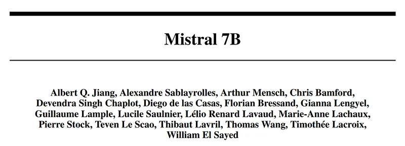 | Title block of the original *Mistral 7B* paper. |
| 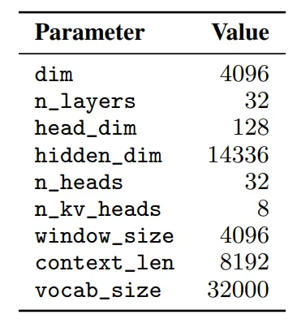 | Core Mistral 7B architecture hyperparameters (layers, heads, window size, context length, vocabulary). |
| 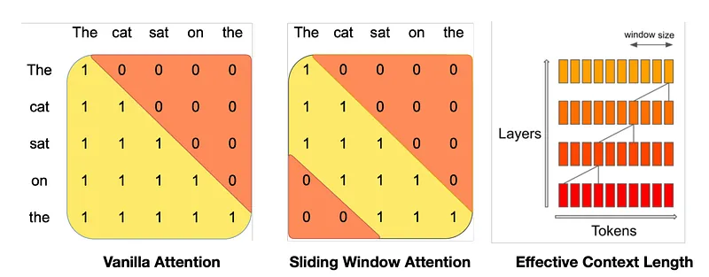 | Vanilla attention vs sliding-window attention, plus effective context growth across stacked layers. |
| 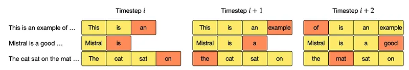 | Rolling KV-cache example showing overwrite-by-modulo behavior over timesteps. |
| 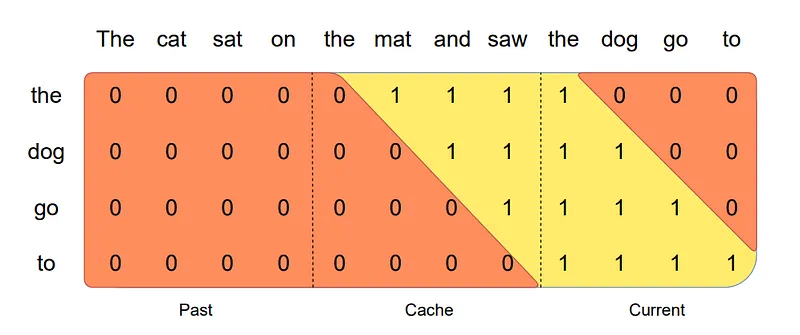 | Chunked prefill attention mask over past/cache/current segments for long prompts. |
| 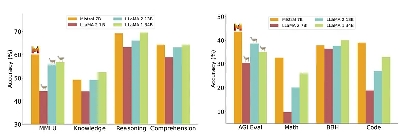 | Mistral 7B vs Llama family aggregate benchmark bars across MMLU, knowledge, reasoning, comprehension, AGI-Eval, math, BBH, and code. |
| 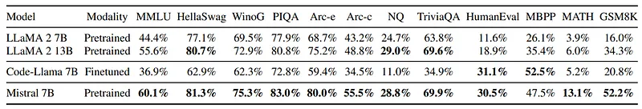 | Detailed benchmark table comparing Mistral 7B with Llama and CodeLlama on language, reasoning, code, and math tasks. |
| 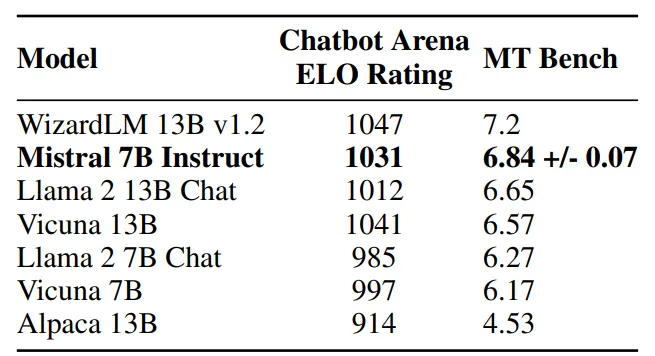 | Chat model comparison (Chatbot Arena Elo + MT-Bench), highlighting Mistral 7B Instruct. |
| 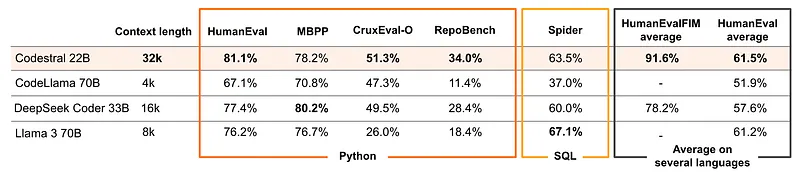 | Codestral benchmark table across HumanEval, MBPP, CRUXEval-O, RepoBench, Spider, and FIM aggregates. |
| 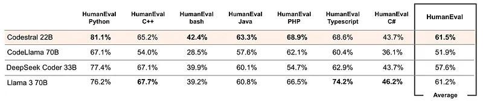 | HumanEval pass@1 by programming language for Codestral vs CodeLlama, DeepSeek Coder, and Llama 3. |
| 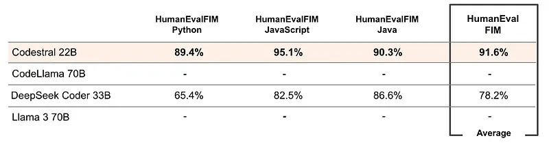 | Fill-in-the-middle HumanEvalFIM performance for Python/JavaScript/Java. |
| 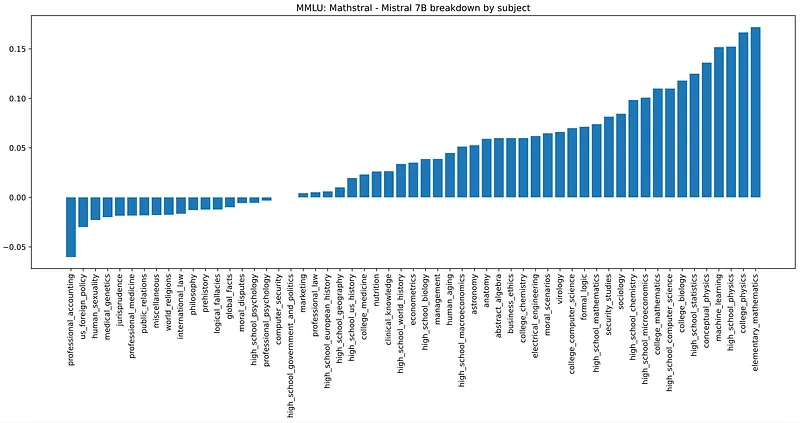 | Subject-wise MMLU delta: Mathstral 7B minus Mistral 7B. |
| 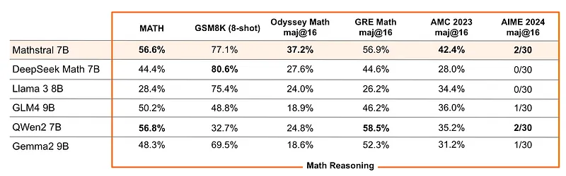 | Mathstral benchmark table on MATH, GSM8K, Odyssey/GRE/AMC/AIME-style evaluations. |
| 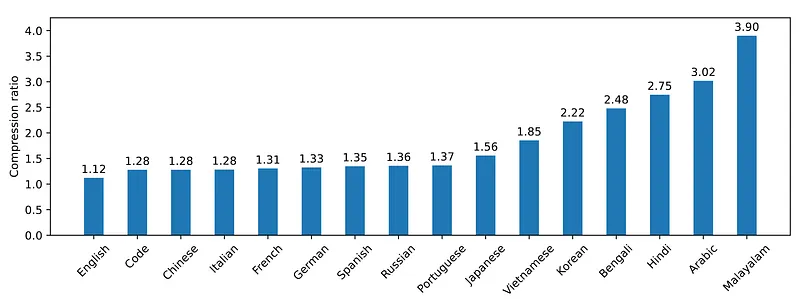 | Tekken tokenizer compression ratio by language. |
| 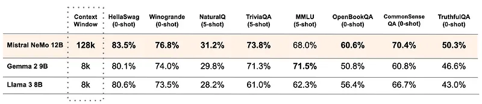 | Mistral NeMo base benchmark comparison vs Gemma 2 9B and Llama 3 8B. |
| 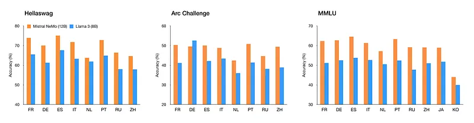 | Mistral NeMo multilingual benchmark bars (HellaSwag, ARC-Challenge, MMLU) across FR/DE/ES/IT/NL/PT/RU/ZH. |
|  | Mistral NeMo instruction-tuned results on MT-Bench and WildBench. |
| 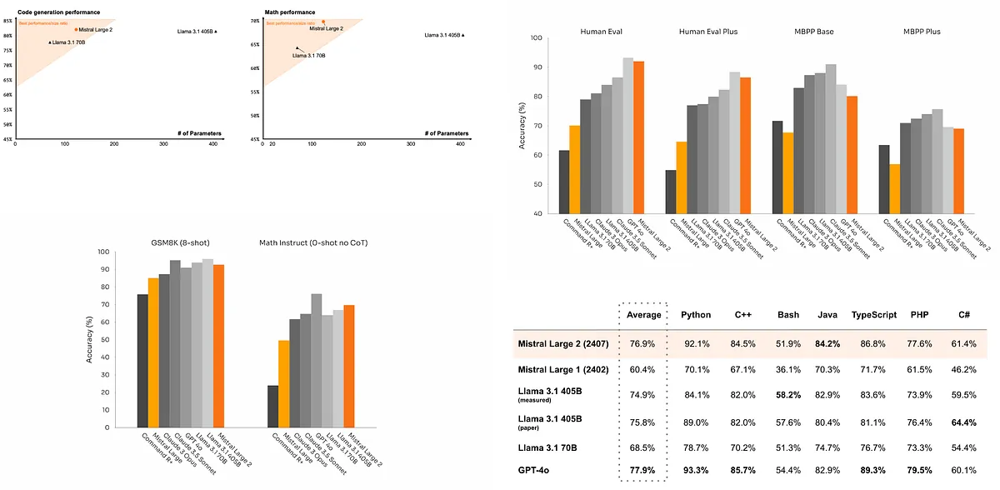 | Mistral Large 2 code/math benchmark comparisons and multilingual HumanEval summary by language. |
| 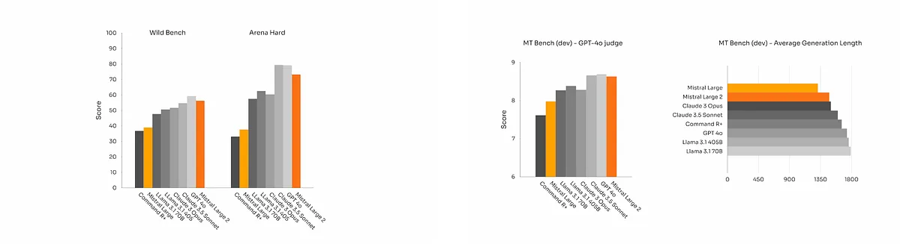 | Mistral Large 2 chat-alignment plots: WildBench, ArenaHard, MT-Bench scores, and generation length. |
| 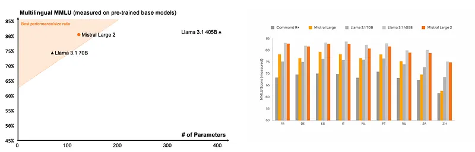 | Multilingual MMLU comparison: parameter-efficiency scatter and per-language bars. |
| 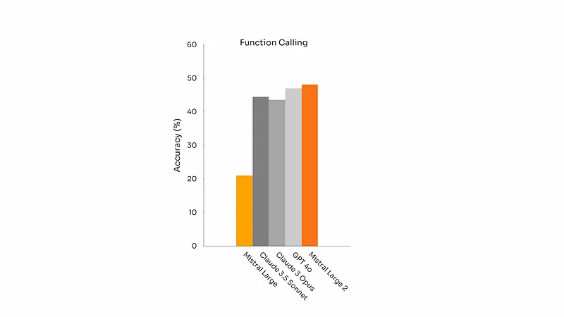 | Function-calling accuracy comparison for Mistral Large 2 vs Claude 3.5 Sonnet, GPT-4o, and Command R+. |
| 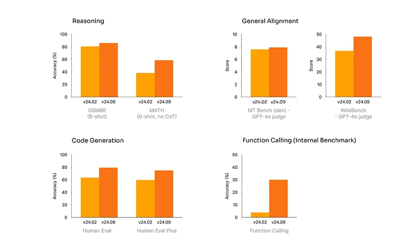 | Mistral Small v24.02 vs v24.09 improvements across reasoning, general alignment, code generation, and function-calling. |
| 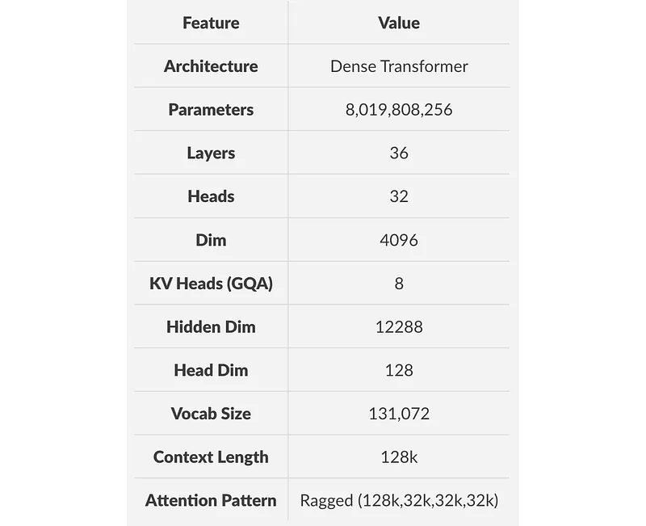 | Ministral architecture/specification table (parameters, heads, context length, ragged attention pattern). |
| 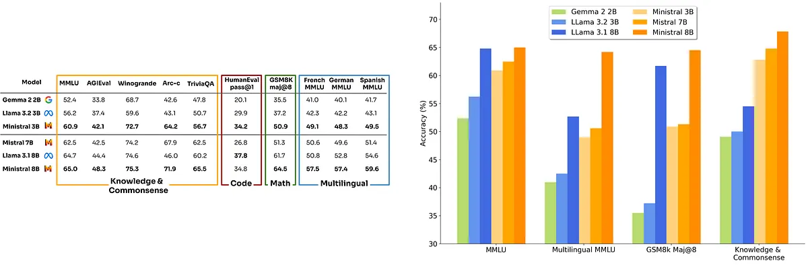 | Ministral 3B/8B benchmark overview with grouped tables/bars for knowledge, code, math, and multilingual metrics. |
| 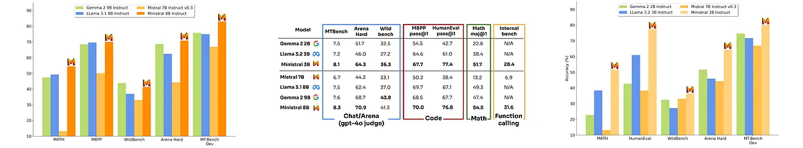 | Ministral instruct benchmark comparison including ChatArena, code, math, and function-calling metrics. |
| 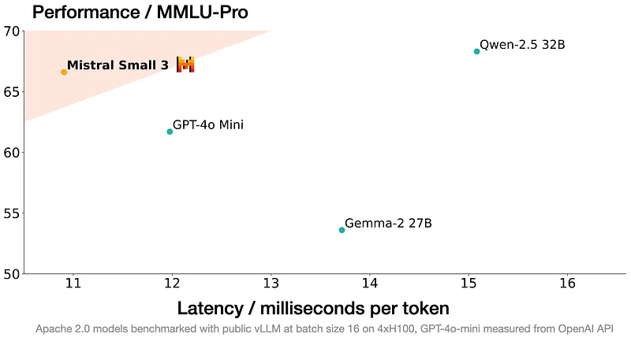 | Mistral Small 3 latency vs MMLU-Pro performance scatter against open compact models. |
| 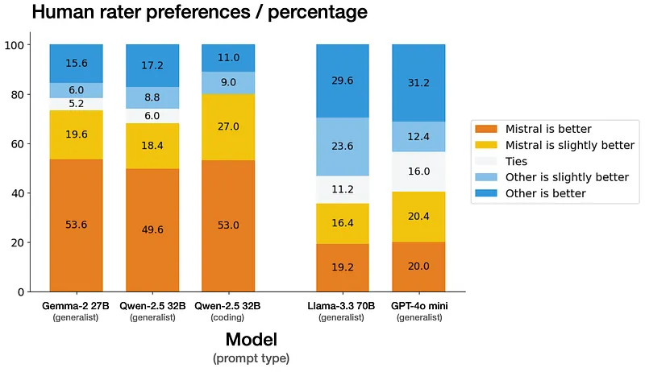 | Human rater preference breakdowns vs competing models (generalist/coding prompt types). |
| 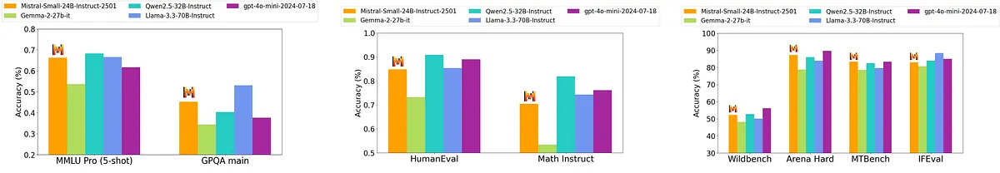 | Mistral Small 3.1 instruct benchmark comparison across reasoning, coding, and alignment tasks. |
| 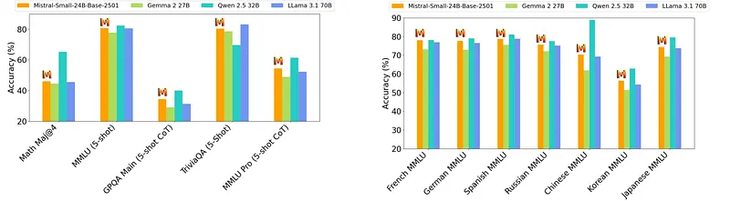 | Mistral Small 3.1 base-model benchmark comparison on math/knowledge plus multilingual MMLU slices. |
| 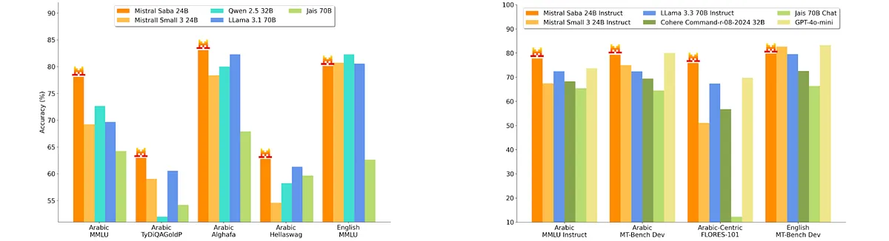 | Mistral Saba 24B benchmark bars on Arabic/English tasks and instruction evaluations. |
| 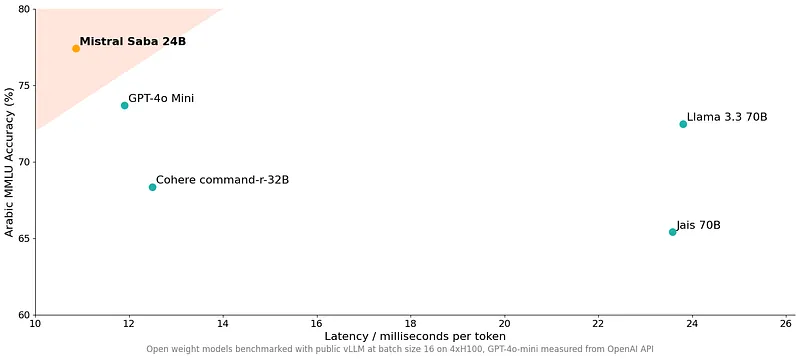 | Mistral Saba 24B efficiency plot: Arabic MMLU accuracy vs latency. |
| 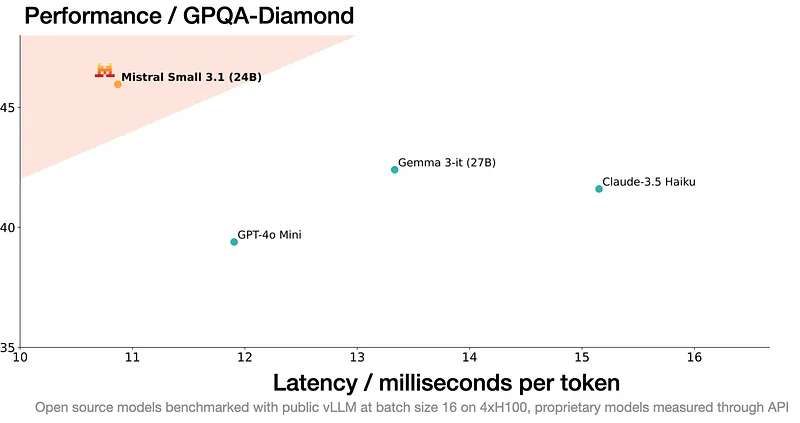 | Mistral Small 3.1 latency vs GPQA-Diamond performance scatter vs compact competitors. |
| 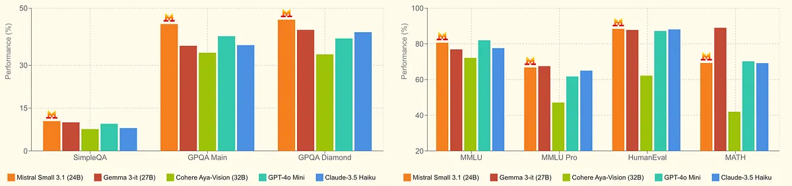 | Mistral Small 3.1 text benchmark comparisons on SimpleQA/GPQA/MMLU/HumanEval/MATH. |
| 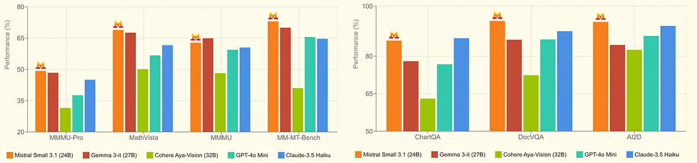 | Mistral Small 3.1 multimodal benchmark comparisons (MMMU-Pro, MathVista, MMMU, MM-MT-Bench, ChartQA, DocVQA, AI2D). |
| 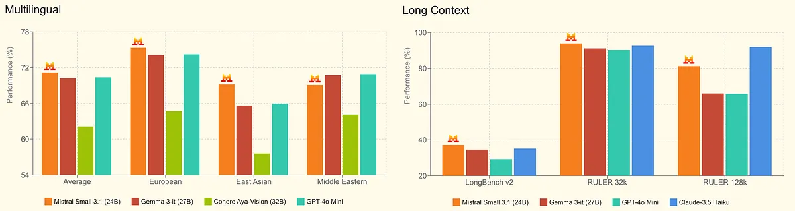 | Mistral Small 3.1 multilingual and long-context benchmark comparisons (LongBench v2, RULER 32k/128k). |
| 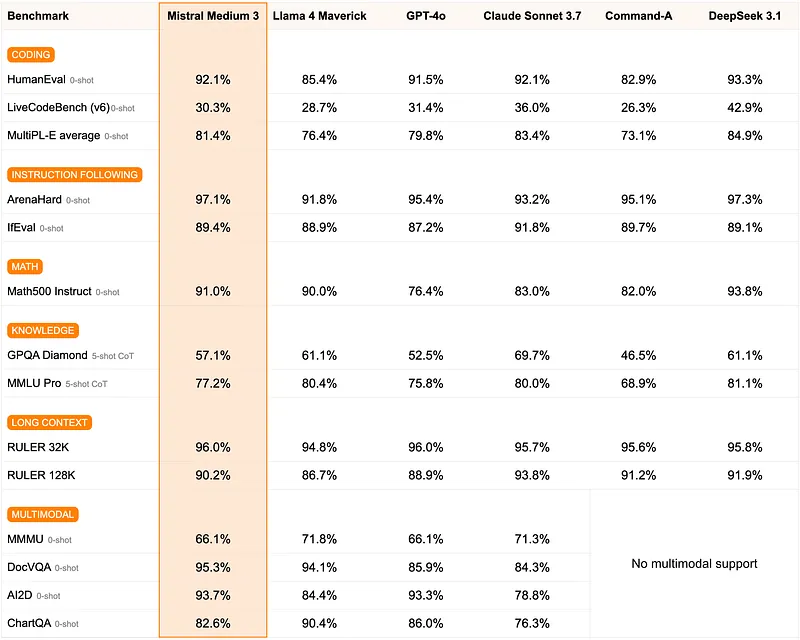 | Mistral Medium 3 table vs frontier/open models across coding, instruction, math, knowledge, long-context, and multimodal tasks. |
| 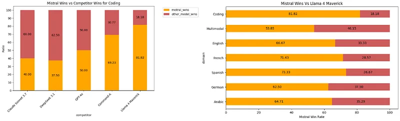 | Devstral coding win-rate comparisons vs multiple competitors and domain-wise wins vs Llama 4 Maverick. |
| 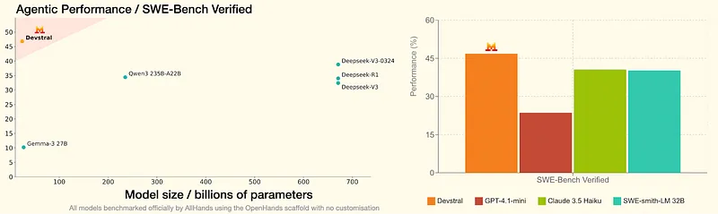 | Devstral SWE-Bench Verified performance/size frontier and direct comparison bars vs GPT-4.1-mini, Claude 3.5 Haiku, SWE-smith-LM. |
| 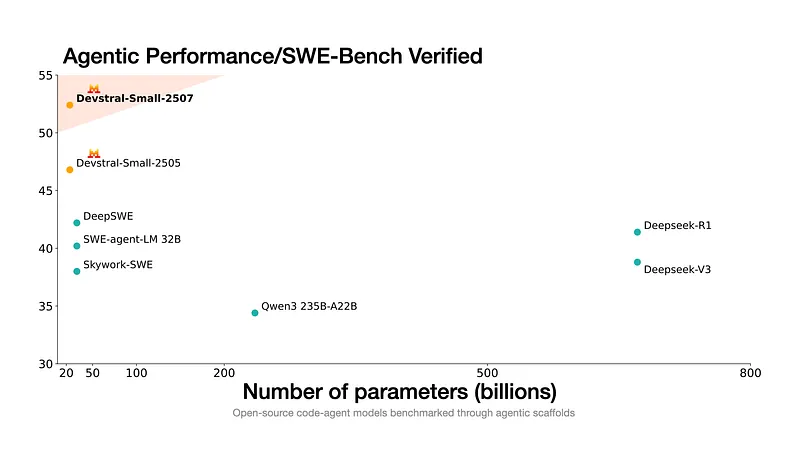 | Devstral Small 1.1 vs prior/open code-agent models on SWE-Bench Verified vs parameter count. |
| 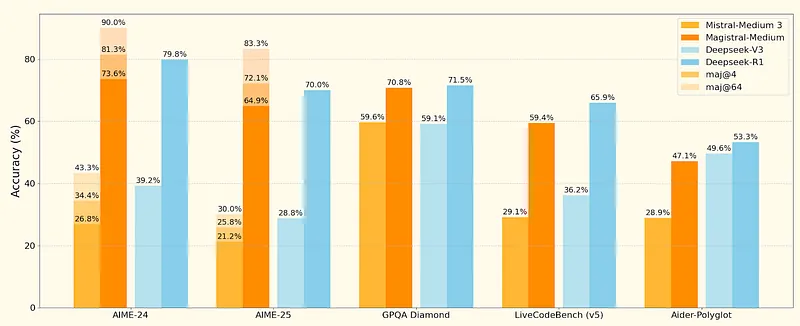 | Magistral benchmark comparison across AIME, GPQA, LiveCodeBench, and Aider-Polyglot (including pass@k variants). |
| 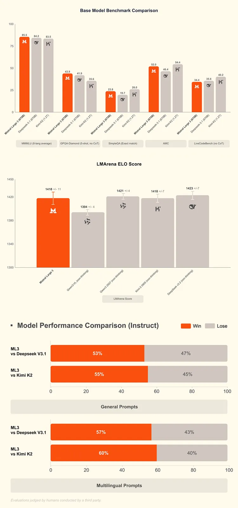 | Mistral 3 benchmark roll-up: base benchmarks, LM Arena score, and human win-rate comparisons vs DeepSeek V3.1 and Kimi K2. |
| 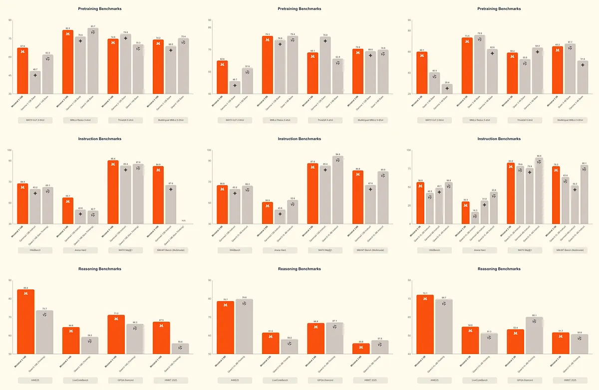 | Multi-panel benchmark comparison across Mistral 3 family variants for pretraining, instruction, and reasoning tasks. |
| 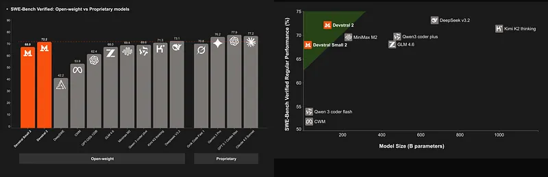 | Devstral 2 SWE-Bench Verified comparison vs open-weight/proprietary models and parameter-scaled frontier plot. |
| 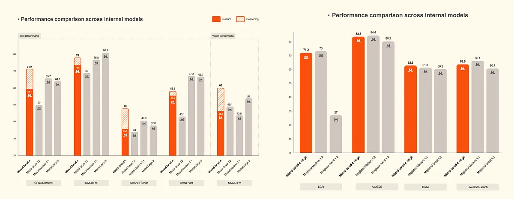 | Mistral Small 4 internal-model comparison across text and vision benchmarks (instruct vs reasoning modes). |
| 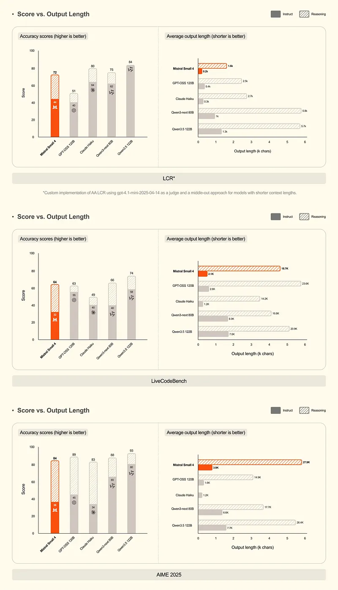 | Mistral Small 4 score-vs-output-length tradeoffs on LCR, LiveCodeBench, and AIME 2025 (instruct vs reasoning). |
| 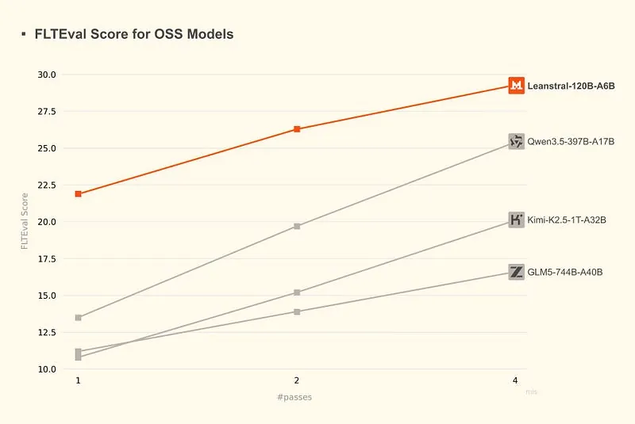 | Leanstral FLTEval score scaling with increased pass counts, compared against OSS baselines. |
## Related

- [[Mistral 7B]] — official Mistral AI launch blog post (Apache 2.0, GQA, SWA, benchmark claims).
- [[Papers Explained Corpus]]
- [[Large Language Models]]
- [[Model Compression and Efficiency]]
- [[Synthetic Data]]
- [[Reasoning Models]]
- [[Code Models]]
- [[Papers Explained 63 - LLaMA 2 Long]]
- [[Papers Explained 65 - GPT-2]]

#summary #topic
