# Papers Explained - Nemotron 3 Super

Nemotron 3 Super is a 120B (active 12B) parameter hybrid Mamba-Attention Mixture-of-Experts model, pre-trained in NVFP4. It leverages LatentMoE, a new Mixture-of-Experts architecture that optimizes for both accuracy per FLOP and accuracy per parameter, and includes MTP layers for inference acceleration through native speculative decoding.

This page ingests the source article into the wiki and connects it to [[Papers Explained Corpus]], [[Mixture of Experts]], [[Large Language Models]], [[Model Compression and Efficiency]], [[Synthetic Data]], [[Code Models]].

## Source Metadata

- Source file: `raw/draft_Papers-Explained--Nemotron-3-Super-a85eaac06bc3.html`
- Source title: Papers Explained: Nemotron 3 Super
- Canonical: [https://medium.com/p/a85eaac06bc3](https://medium.com/p/a85eaac06bc3)

## Key Ideas

- Nemotron 3 Super is a 120B (active 12B) parameter hybrid Mamba-Attention Mixture-of-Experts model, pre-trained in NVFP4.
- The dataset and models are available at [HuggingFace](https://huggingface.co/collections/nvidia/nvidia-nemotron-v3/).
- Nemotron 3 Super 120B-A12B Base scales up the hybrid Mamba-Attention Mixture-of-Experts (MoE) architecture introduced in Nemotron-3 Nano.
- Existing MoE designs are optimized for offline, throughput-oriented settings and do not consider the constraints of online deployments such as latency, memory bandwidth, and communication.
- The MoE design is revisited from a hardware-software co-design perspective, leading to the following principles for efficient MoE scaling:

## Notes

Nemotron 3 Super is a 120B (active 12B) parameter hybrid Mamba-Attention Mixture-of-Experts model, pre-trained in NVFP4. It leverages LatentMoE, a new Mixture-of-Experts architecture that optimizes for both accuracy per FLOP and accuracy per parameter, and includes MTP layers for inference acceleration through native speculative decoding.

The dataset and models are available at [HuggingFace](https://huggingface.co/collections/nvidia/nvidia-nemotron-v3/).

## Model Architecture

Nemotron 3 Super 120B-A12B Base scales up the hybrid Mamba-Attention Mixture-of-Experts (MoE) architecture introduced in Nemotron-3 Nano. The architecture comprises three core pillars: Aparse LatentMoE scaling, Multi-Token Prediction (MTP) for inference acceleration, and a periodic hybrid interleaving pattern.

### LatentMoE: Hardware-Aware Expert Design for Improved Accuracy per Byte

Existing MoE designs are optimized for offline, throughput-oriented settings and do not consider the constraints of online deployments such as latency, memory bandwidth, and communication. Accuracy per FLOP reflects computational efficiency, accuracy per parameter captures memory footprint, memory bandwidth, routing-induced communication, and sharding overhead. Neglecting these factors can yield architectures that appear efficient in aggregate compute yet incur substantial inefficiency in practice.

The MoE design is revisited from a hardware-software co-design perspective, leading to the following principles for efficient MoE scaling:

- In low-latency serving, the memory bandwidth cost of reading expert weights dominates MoE inference. Reducing the hidden dimension (𝑑) or the expert FFN intermediate dimension (𝑚) can decrease this cost.

- In throughput-oriented serving, distributed MoE inference is dominated by all-to-all routing. Reducing the hidden dimension (𝑑) or the number of active experts (𝐾) can decrease communication overhead.

- Preserving model quality requires maintaining the effective nonlinear budget (𝐾·𝑚). Therefore, 𝐾 and 𝑚 should be held fixed to relieve memory and communication bottlenecks without sacrificing quality.

- There is a lower limit on how much the hidden dimension (𝑑) can be reduced, determined by the task-specific effective feature rank (𝑟eff). Reducing 𝑑 below this limit causes model quality to collapse.

- Scaling both the total number of experts (𝑁) and the top-𝐾 experts per token improves quality by exponentially expanding the space of expert combinations.

These principles suggest that reducing the hidden dimension (𝑑) is the most promising approach for improving both throughput- and latency-oriented regimes without significant loss in accuracy. Increasing the number of experts (𝑁) and the top-𝐾 experts per token can improve quality, and this can be achieved by reducing 𝑑 and increasing 𝐾 by the same factor (𝛼).

*Figure: Standard MoE vs. LatentMoE.*

Guided by these insights, LatentMoE is developed. In LatentMoE:

- Each input token is projected into a lower-dimensional latent space via a learnable down-projection matrix.

- The compressed representation is routed to an expanded set of experts operating in the latent space.

- After expert computation, the outputs are aggregated and projected back to the original dimension via a learnable up-projection matrix.

Shifting routed expert computation and all-to-all traffic into the latent space reduces per-expert weight loads and communication payloads by a factor of 𝑑/ℓ. These savings are used to increase the total number of experts and the top-𝐾 active experts per token, resulting in higher model quality at a similar computational and communication budget. Non-routed computations, including the routing gate, shared expert computation, and non-expert layers, remain in the full hidden dimension to preserve quality.

### Multi-Token Prediction

Standard MTP predicts multiple future tokens at each position, enabling speculative decoding (generating candidate continuations). It uses independent prediction heads, each trained to predict a fixed offset (e.g., n+2, n+3,…). This approach is effective during training but limits speculative decoding to at most N draft tokens. Reusing a single offset-trained head autoregressively introduces a training-inference mismatch, reducing acceptance rates as draft length increases.

Nemotron-3 Super addresses these limitations by sharing parameters across multiple MTP heads during training. This creates a unified prediction head exposed to multiple offsets, regularizing the head across prediction horizons. This improves robustness to self-generated hidden states encountered during autoregressive drafting. The same head can be applied recursively at inference for longer drafts with more stable acceptance behavior. Nemotron-3 Super achieves more effective speculative decoding without additional parameters or a separate draft model.

### Hybrid Interleaved MoE Architecture and Global Anchors

The primary bottleneck in modern sequence models is the quadratic growth of the KV cache in self-attention layers. To address this, Mamba-2 blocks are used, which operate with a constant-sized state during generation, reducing memory overhead and latency. The 88-layer stack follows a periodic interleaving pattern where MoE layers are paired with Mamba-2 blocks. Mamba provides efficient linear-time sequence modeling, and a few self-attention layers are inserted as global “anchors” for full-token interaction and long-range information routing. This hybrid interleaving maintains global dependency modeling while offloading most computation to the more efficient Mamba and sparse MoE components.

*Figure: Nemotron 3 Super layer pattern.*

*Figure: Nemotron 3 Super Architectural Dimensions.*

The attention layers use Grouped-Query Attention (GQA) with 32 query heads and 2 KV heads (head dimension 128). Positional embeddings, dropout, and bias terms in linear layers are omitted. RMSNorm is used for normalization, and un-tied embedding and output weights are maintained. Each MoE layer activates only a subset of experts per token (top-22 routing), allowing the model to scale to 120.6B total parameters while maintaining a 12.7B active parameter budget per forward pass.

## Pretraining

*Figure: Precision by Layer Type.*

Several new datasets were added to pretraining since Nemotron 3 Nano. These datasets are being released on HuggingFace as Nemotron-Pretraining-Specialized-v1.1.

### Synthetic Code Concepts

- 91 high-level programming concepts were extracted from the HumanEval benchmark dataset using a taxonomy built from Nemotron-Pretraining-Code and GPT-OSS-120B datasets.

- GPT-OSS 20B was instructed to generate Python programming problems testing these concepts. Each problem included a descriptive function name and problem description in the docstring. Up to four concepts were combined per generation, resulting in approximately 14 million problems.

- GPT-OSS 120B generated five self-contained solutions (limited to 60 lines) for each problem. This resulted in approximately 23 million problem-solution pairs.

- Solutions were checked to ensure they didn’t include imports not specified in the original problem.

- Solutions were parsed and appended to the original problem to maintain the desired format.

- An abstract-syntax tree (AST) was generated for each solution to ensure it was valid Python code.

- After cleaning, the dataset contained 15 million problem-solution pairs.

### Synthetic Unconditional Algorithmic

- Minimalistic prompts like “Write a function” and specified difficulty levels (easy, medium, hard) are used to guide the base models Qwen3–235B-A22B and gpt-oss-120b in generating Python coding problems and solutions.

- gpt-oss-120b was further instructed to rewrite the generated samples, ensuring they handle edge cases, include unit tests, and are formatted consistently.

- Another variant involved prompting gpt-oss-120b to generate LeetCode-style questions and answers with randomized difficulty levels. The model also scored the correctness of the solutions and corrected them if needed.

- To avoid redundancy, short titles generated by gpt-oss-120b are used to deduplicate similar problems.

- The dataset was decontaminated by removing exact matches of solutions against existing benchmarks like HumanEval, MBPP, CRUXEval, and LiveCodeBench.

- Qwen3-Embedding-0.6 was used to encode problems and solutions, and any data with over 80% similarity to the benchmarks was filtered out.

- The dataset is relatively small (0.2B tokens) compared to typical pretraining datasets.

- Despite its size, the dataset appears to be effective in teaching coding practices like edge case handling and program execution reasoning. This is evidenced by improvements of 1–2 points on benchmarks like HumanEval, MBPP, and CRUXEval-O when the dataset was incorporated into a 100B token pretraining run.

### Synthetic Economics

- A diverse set of economics multiple-choice questions covering microeconomics, macroeconomics, and econometrics is created.

- Qwen3–235B-A22B-Thinking-2507 is used to generate questions for each topic-term pair, providing detailed, step-by-step solutions for each. To increase diversity, the model was prompted to create new questions based on the initial outputs.

- Finally, each question-solution pair was verified by the model for clarity, ambiguity, solvability, and accuracy.

### Synthetic Formal Logic

- Formal logic problems and solutions are generated across various tasks, including translating between natural language and predicate or propositional logic, deriving antecedents of conditional propositions, and solving logic problems using indirect or complete truth tables.

- Variability was introduced into the scenarios, premises, and formulas by incorporating random personas, letters, and logic connectives (such as ∧, ∨, ⊃, ≡, ∼) into the prompts.

- The problems and solutions were generated and evaluated using Qwen3–235B-A22B-Thinking-2507.

### Synthetic Multiple Choice

- The dataset is built by “bootstrapping” from the MMLU auxiliary training set, which itself is a collection of MCQs from various sources like ARC, MC_TEST, OpenBookQA, and RACE.

- For each seed question in the MMLU set, similar questions with corresponding answer options are generated using the Qwen3–235B-A22B LLM.

- The DeepSeek-V3 model is used to solve each generated question, selecting an answer and providing supporting knowledge or reasoning. Multiple solutions are generated with different random seeds and majority voting is used to select the most consistent answer.

- This results in ~3.5 million MMLU-style MCQ samples (~1.6 billion tokens)

### Data Mixture and Ordering

*Figure: Data mixtures for each phase of pre-training.*

The pretraining corpus spans 16 high-level categories. The largest component is web crawl data, which is partitioned into five quality-based groups following the Nemotron-CC taxonomy: crawl-medium, crawl-medium-high, and crawl-high, representing progressively higher-quality crawl data, along with their synthetic counterparts, syn-crawl-medium-high and syn-crawl-high, generated from filtered web documents. Beyond web crawl, the mixture includes math, Wikipedia, code, Nemotron-CC-Code, academic text, Crawl++, multilingual data, finepdfs and synthetic SFT-style datasets. The SFT-style data is further divided into general-sft, stem-sft, and code-sft. As part of the SFT-style component, reasoning-focused datasets are incorporated into pretraining. Crawl++ consists of OpenWebText, BigScience, and Reddit datasets.

A two-phase curriculum is adopted. In Phase 1, the mixture emphasizes data diversity to promote broad coverage and generalization. In Phase 2, the blend shifts toward predominantly high-quality sources (e.g., Wikipedia) to refine model performance. The transition to Phase 2 occurs at 80% of total training tokens.

### Training Details

The pretraining of Nemotron 3 Super 120B-A12B Base was conducted using a Warmup-Stable-Decay (WSD) learning rate schedule over a total horizon of 25 trillion tokens. The learning rate (LR) was warmed up over the initial 200 billion tokens to a peak value of 4.5×10−4. Following a sustained stable plateau phase, a minus-sqrt decay schedule was implemented for the final 5 trillion tokens, annealing the LR to a minimum of 4.5×10−6. The model was trained with a sequence length of 8,192 and a batch size of 3,072 sequences. During the stable phase, the learning rate remains constant, and individual trained checkpoints exhibit noisy benchmark performance from step to step. Checkpoint merging (weighted averaging over a sliding window of recent checkpoints) was applied to produce stronger readouts of model quality without requiring dedicated learning rate decay runs.

### Long-Context Extension

In the LC-Phase, continuous pretraining (CPT) was performed to equip the base model with long-context ability. The long-context document QA dataset from Nemotron 2 & 3 Nano was reused. The document QA data was allocated to 20% in the Phase LC data blend, with the remaining 80% being downscaled Phase 2 data. CPT was initially performed on 1,048,576 (1m) context length for 34 billion tokens. Following that, another stage was added to alternatingly train on both 1m and 4k sequences in order to mitigate the minor impact observed on the math-related benchmarks. The second stage lasted for 17 billion tokens.

## Post Training

*Figure: Overview of the post-training pipeline for Nemotron 3 Super.*

The general recipe followed is the same as Nemotron 3 Nano, with a stronger emphasis on agentic tasks.

### Supervised Fine Tuning

The chat template remains identical to Nemotron 3 Nano. In addition, low effort reasoning mode is added, giving users further control over reasoning length. A single-stage SFT led to a marked degradation on long-input-short-output scenarios. A two-stage SFT procedure is therefore adopted: Stage 1 emphasizes learning from token-level supervision and induces strong reasoning behavior, while Stage 2 switches to per-conversation normalization to prevent long outputs from dominating the loss, which restores long-input-short-output performance while retaining reasoning.

For a packed global batch ℬ containing multiple conversations 𝑐, let 𝒪𝑐 denote the set of output-token positions for conversation 𝑐 and |𝒪𝑐| its output-token count. With token-level negative log-likelihood ℓ𝑡 = −log 𝑝𝜃(𝑦𝑡 | 𝑥, 𝑦<𝑡), the following stages are used:

Stage 1: token-level (global) average:

Minimize the average loss over all output tokens in the packed global batch.

This corresponds to summing the output-token log probabilities across all conversations and normalizing by the total number of output tokens.

Stage 2: sample-level average:

Switch to a per-conversation normalized loss and average equally across conversations.

This stage reduces the dominance of long outputs by normalizing each conversation by its own output-token count before averaging across the batch.

Nemotron 3 Super is trained for three reasoning modes: reasoning-off, regular and low-effort.

Data

Reused datasets from Nemotron 3 Nano SFT: Chat, Infinibyte, and Formal Proofs.

Refreshed datasets with new teacher models (DeepSeek v3.2, Kimi K2): Competition Math, Competition Code, Conversational Tool Use, Multilingual, Science.

Software Engineering

The issues and containerized execution environments from the SWE-Gym, R2E-Gym, and SWE-rebench datasets are used. For R2E-Gym, problem statements are regenerated with Qwen3-Coder-480B-A35B-Instruct. Trajectories are distilled from the OpenHands agent harness using Qwen3-Coder-480B-A35B-Instruct as the teacher model.

Agentic Programming

*Figure: Agentic Command Line Interface Dataset Construction & Training Pipeline.*

A foundational set of 20,000 queries was generated based on 24 common CLI actions. GPT-OSS 120B was used to filter out tasks involving pre-existing codebases, leaving approximately 15,000 tasks.

Each task was paired with a markdown specification (AGENTS.md) imposing constraints and design requirements, encouraging more complex and varied solutions from the agent.

3,000 challenging software engineering (SWE) tasks with pre-existing repositories and specific git hashes were added to the dataset.

10,000 web development tasks were synthesized based on a taxonomy of 100 common user requests. LLM-as-a-Judge was used to eliminate tasks requiring pre-existing repositories. These tasks were executed in a Node.js environment, requiring the agent to manage dependencies and plugins.

High-performance open-source agentic LLMs (e.g., Qwen-3-Coder-480B, Minimax M2.5) were evaluated by interacting with various CLI environments (Codex, OpenCode, Qwen Code CLI, Stirrup).

Interaction traces were filtered, normalized into the OpenAI message format, and used for large-scale supervised fine-tuning (SFT) to embed agentic operational knowledge within the models.

Long Context

The long-context SFT dataset from Nemotron 3 Nano is extended.

Long sequences are gathered from a pre-training blend encompassing books, papers, financial reports, and code repositories. Documents are grouped by topic/domain and concatenated to achieve target sequence lengths (128K, 256K, or 512K tokens).

For each long-context sample, a Large Language Model (LLM) generates one or more QA pairs. Prompts are designed to necessitate cross-document or cross-section navigation, ensuring information is dispersed rather than localized. Multi-hop reasoning is strictly enforced, requiring at least 4 to 7 distinct retrieval or reasoning steps involving computational or logical processing. Formatting instructions are often included to prevent simple copy-pasting.

Eight independent reasoning traces are generated for each context-question pair. Answers are grouped using semantic majority voting, either by exact match or via an LLM judge. The answer with the shortest reasoning trace from the majority group is selected.

Financial Reasoning

The process starts with 565 expert-authored financial analysis questions from the SecQue benchmark, which are anchored to SEC 10-K and 10-Q filings. These seed questions are expanded combinatorially across S&P 500 companies and fiscal years (2019–2024). Comparative questions are limited to company pairs within the same GICS Sub-Industry to maintain semantic coherence.

GPT-OSS-120B paraphrases each template instantiation, generating up to three diverse reformulations per combination. The generated questions are mapped to relevant SEC filing sections using the original SecQue metadata. The corresponding documents are converted to markdown with a configurable token limit.

Five candidate answers are sampled per question using GPT-OSS-120B with distinct random seeds.

Qwen3–235B-A22B selects the best response based on numerical accuracy, financial methodology, and logical soundness. Qwen3–30B-A3B classifies each pair as ANSWERABLE or UNANSWERABLE, retaining only those with complete, substantive responses.

This data undergoes percentile-based outlier removal and deduplication. The resulting dataset comprises 366,243 financial Q&A pairs with reasoning traces.

CUDA

A large-scale synthetic CUDA dataset called CUDA-C, containing 100,000 samples is generated. Questions were sourced from open-source libraries, NVIDIA API documentation, and BackendBench to serve as starting points. For each seed, the dataset generates tuples of the form:

- (PyTorch reference, CUDA C++ kernel)

- (Natural language specification, CUDA C++ kernel)

Each tuple includes reasoning explaining the relationship between the PyTorch reference and the generated CUDA kernel. Multiple candidate kernels were generated for each seed and rigorously tested for correctness in an internal CUDA environment. The highest-performing kernel was selected and retained.

Traces were collected from an internal CUDA agent, capturing:

- (PyTorch reference, faulty CUDA C++ kernel, error message, corrected CUDA C++ kernel)

- (PyTorch reference, slow CUDA C++ kernel, Nsight Compute log, optimized CUDA C++ kernel)

Publicly available documentation and code samples from libraries like Thrust, CUB, cuBLAS, cuDNN, cuSPARSE, cuRAND, and cuSOLVER were used to generate additional PyTorch references and corresponding CUDA implementations, along with reasoning chains and natural language specifications.

Safety

Compared to Nemotron 3 Nano, the model utilizes a comprehensive set of prompts covering content safety, jailbreak techniques, over-refusals, demographic biases, and copyright reproduction. This broader coverage aims to identify and mitigate a wider range of potential safety issues.

Inspired by the deliberative alignment framework, the model employs a two-stage process:

- A reasoning trace is constructed, guiding the model to reflect on the safety properties of the prompt and identify potential risks.

- The final response is generated based on the reasoning trace, adhering to the predefined response policy and behavior guidelines. This structured approach encourages deliberate reflection on safety while producing consistent and contextually appropriate responses.

An additional layer of safety is provided by a content-moderation classifier that filters any flagged unsafe responses, further ensuring alignment with safety objectives.

Search

Starting with the Wikidata knowledge graph. SPARQLis queried to find well-connected “hub” entities across 25 verified categories (cities, universities, films, etc.). Random walks of 4–8 hops are performed through the graph, filtering out invalid paths using stop-node lists, anti-meta-relation exclusions, and minimum path-length thresholds. Each valid walk yields a start entity, a chain of factual relations, and a final answer entity.

The structured knowledge-graph walk is converted into a natural-language multi-hop question. The question is rewritten to hide intermediate entities and eliminate “breadcrumb” chaining, creating search-riddle queries that require independent problem decomposition. MiniMax-M2 is used to solve the obfuscated question by issuing web searches via the Tavily MCP search tool. This generates a grounded search trajectory with supporting URLs.

Each resulting SFT record is a multi-turn conversation where the assistant’s turns interleave chain-of-thought reasoning with structured tool calls. Tool-response turns return search results as JSON, preserving a “Thought–Action–Observation” loop across an average of 12 tool calls per trajectory.

A final stage normalizes the agent’s raw response into a validated JSON schema.

Terminal Use

The dataset used to improve terminal capabilities is built using the Terminal-Task-Gen methodology from Nemotron-Terminal. It contains 84,864 samples, combining:

- 68,924 samples generated using a comprehensive terminal skill taxonomy.

- 8,125 samples from Nemotron-Cascade-Math and 7,815 samples from Nemotron-Cascade-Code

DeepSeek-V3.2 is used to generate step-by-step solution traces within isolated Dockerized environments through an agentic execution-feedback loop.

Terminus 2 agent framework provides a unified set of terminal tools and a structured interaction protocol to ensure consistency and quality across long-horizon trajectories.

Multilingual

The dataset combines synthetic translations of English SFT (Supervised Fine-Tuning) examples with a sentence-level parallel corpus.

The translation pipeline from Nemotron 3 Nano, employing Qwen2.5-Instruct-14B is used to translate into six languages: German, Spanish, French, Italian, Japanese, and Chinese.

After translation, samples in the wrong language and common failure modes are filtered out.

Structured Query Language (SQL)

A synthetic text-to-SQL dataset of 96.5k samples is created using NeMo Data Designer covering MySQL, PostgreSQL, and SQLite across 60 industries, 700 domain topics, and 90 SQL concept buckets. Each sample pairs a natural-language prompt with a synthetic database schema context, including distractor tables and columns to mimic the complexity of production databases. Prompts are designed with variations in instruction style (imperative, declarative, interrogative, contextual, abbreviated), linguistic register (formal, conversational, technical, academic, direct), and politeness level to reflect natural user requests.

Conversational Tool Use

Conversational tool-use data is scaled via a fully synthetic, six-stage generation pipeline:

- Synthetic domains are created and expanded into specialized subdomains using a language model.

- Customer service policies and related tools are generated and iteratively refined using self-refinement techniques, guided by few-shot prompting and an LM-as-a-Judge for quality control.

- User personas, background information, and inquiries are generated for each policy setting, creating plausible customer service scenarios.

- For each policy-scenario pair, 16 simulated customer service interactions are generated between a model-based agent, user, and environment.

- Trajectories are evaluated at both outcome and process levels using an LM-as-a-Judge to ensure quality and effectiveness.

- Successful trajectories are selected and filtered to exclude scenarios with consistently successful or unsuccessful outcomes.

This pipeline utilizes various language models, including Qwen3, DeepSeek, and GPT-OSS, to generate 279,116 conversations across 838 domains. This represents a significant increase in scale compared to Nemotron 3 Nano, which used a smaller dataset of 15,588 conversations across 5 domains.

General-Purpose Tool Use

*Figure: Overview of the pipeline for general-purpose tool-calling data used in Nemotron 3 Super.*

The pipeline starts by assembling diverse tool sets from various sources like ToolEyes, API-Bank, UltraTools, AutoTools, xLAM, Glaive-Function-Calling-v2, Toucan-1.5M, and custom-written tools. A tool-calling trajectory is simulated using three LLM roles:

- User-LLM: Sees the tool set, a persona (sampled from Nemotron-Personas-USA), and a tool-calling scenario (single-turn, multi-turn, or multi-step). It designs a task relevant to the persona and solvable with the tools.

- Assistant-LLM: Attempts to solve the task by generating tool-calls and responding to tool execution results.

- Tool-LLM: Simulates tool execution based on the Assistant-LLM’s tool-calls and the selected tool. It uses a rubric to identify errors and the original user query for context.

Turn-level and Trajectory-level Judges evaluate the accuracy of the generated data. Rule-based Verification ensures the correctness of tool-calls at the turn level.

The pipeline is scaled using DeepSeek-v3.2 and GLM-4.7 to generate a dataset of 1.5 million diverse tool-calling trajectories.

### Reinforcement Learning

*Figure: Overview of the post-training pipeline for Nemotron 3 Super.*

The RL phase of Nemotron 3 Super post-training consists of three stages followed by an MTP healing stage.

Training and inference are decoupled and run on separate GPUs. Inference workers continuously generate trajectories, which are stored in a buffer. Once enough trajectories form a batch, it’s sent to the training engine for model updates. Updated weights are pushed to inference workers immediately. To minimize accuracy degradation, inference workers are kept at most one step behind the latest model version. To stabilize training and minimize off-policy effects, the importance sampling ratio is masked based on training and inference logprobs.

Stage 1: Multi-environment RL from Verifiable Rewards

RLVR significantly expands the RL dataset compared to Nemotron 3 Nano, utilizing 37 different datasets across 21 environments. The multi-environment approach leads to stable performance gains across benchmarks, unlike single-environment training which causes regressions. Similar to Nemotron 3 Nano, RLVR uses a filtered and sorted dataset. Prompts where the SFT model consistently provides correct answers are removed, and the remaining samples are sorted based on difficulty to create a curriculum. A subset of prompts are designated as “low-effort” during the RL stages. Rewards for these prompts are adjusted based on both correctness and the number of generated tokens, encouraging efficient and concise responses. This low-effort mode is gradually reduced over time, focusing on Math and STEM QA prompts.

- 256 prompts are sampled per step, with 16 responses generated per prompt.

- Batch size of 4096 corresponds to a single gradient update per rollout.

- Training starts with a maximum generation length of 49K tokens, increasing to 64K later.

Stage 2: End-to-end RL for Software Engineering

Each training iteration involves launching a container with the target repository, running an “OpenHands agent loop” to generate a code patch, and evaluating the patch against pre-existing tests for a simple “pass/fail” reward.

To improve the model’s adaptability, two agent classes, “OpenCode” and “Codex,” are implemented within OpenHands. These agents mimic the functionalities of Claude Code and Codex CLI, respectively. This allows the model to be trained on a single harness (the testing environment) while using different tools and prompts, enhancing its generalization capabilities.

This multi-harness training approach aims to improve the model’s performance and ability to solve GitHub issues effectively across various tools and environments during inference (real-world application).

Post-training for long-horizon agentic tasks (e.g., conversational AI, code editing) faces a trade-off between efficiency and accuracy. Hence, PivotRL, an assistant-turn-level RL method, reuses offline SFT expert trajectories during RL.

Stage 3: Reinforcement Learning from Human Feedback

Instead of a standard GenRM, a “principle-following” GenRM is trained which incorporates ethical guidelines to influence Nemotron 3 Super’s behavior in sensitive areas like identity and safety.

GenRM starts with Qwen3–235B-A22B-Thinking-2507, trained on Helpsteer 3 dataset, commercially friendly subsets of the lmarena-140k dataset and newly collected human preference data

The trained GenRM is used throughout the multi-environment RL stage to guide the model’s learning.

After the multi-environment RL stage, a dedicated RLHF-only stage is performed to further refine the model’s behavior based on human feedback

## Evaluation

### Base Model

### Post Trained Model

## Paper

Nemotron 3 Super: Open, Efficient Mixture-of-Experts Hybrid Mamba-Transformer Model for Agentic Reasoning [2604.12374](https://arxiv.org/abs/2604.12374)

## Figures

Figures from the Medium HTML export (`raw/draft_Papers-Explained--Nemotron-3-Super-a85eaac06bc3.html`); local copies under `wiki/assets/papers-explained-nemotron-3-super/` when download succeeded.

| Figure | Caption |
|--------|---------|
| 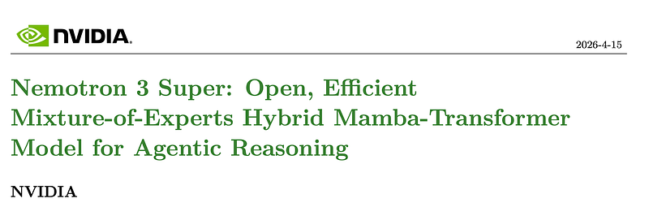 | Title page of *Nemotron 3 Super: Open, Efficient Mixture-of-Experts Hybrid Mamba-Transformer Model for Agentic Reasoning*. |
| 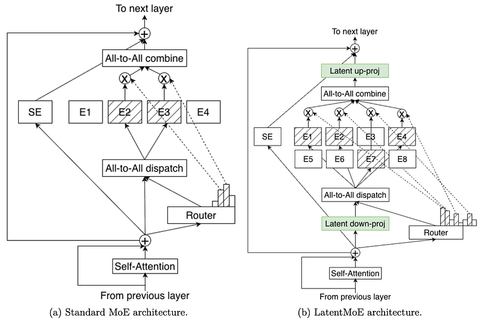 | Standard MoE vs LatentMoE block diagrams, highlighting latent down/up projections and expanded expert pool under routed computation. |
| 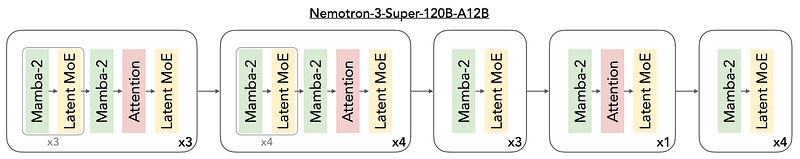 | Nemotron-3-Super 120B-A12B layer interleaving pattern of Mamba-2, latent MoE, and periodic attention anchor blocks. |
| 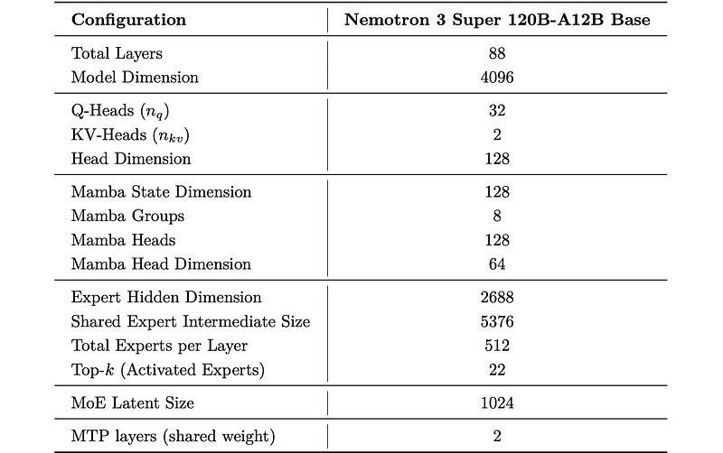 | Architectural-dimension table (layer count, hidden size, attention heads, Mamba settings, expert counts, latent size, MTP layers). |
| 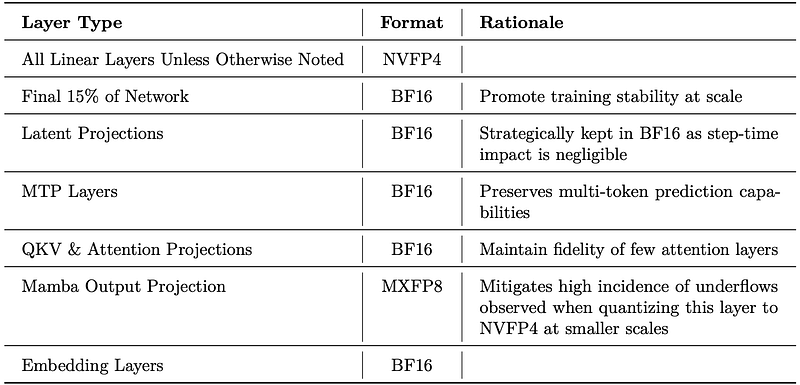 | Precision-by-layer-type table showing NVFP4/BF16/MXFP8 assignment rationale across linear, latent, attention, MTP, and embedding layers. |
| 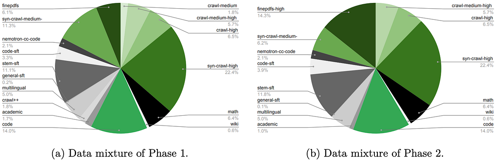 | Pretraining curriculum data mixtures for Phase 1 vs Phase 2. |
| 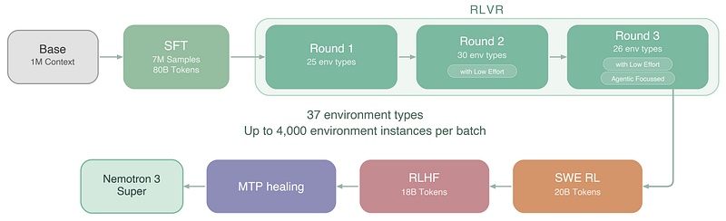 | Post-training overview: SFT to RLVR rounds, then SWE RL, RLHF, MTP healing, and final Nemotron 3 Super checkpoint. |
|  | Stage-1 token-level SFT objective \( \mathcal{L}_{tok} \) (global output-token average). |
|  | Stage-2 sample-level SFT objective \( \mathcal{L}_{samp} \) (per-conversation normalization). |
| 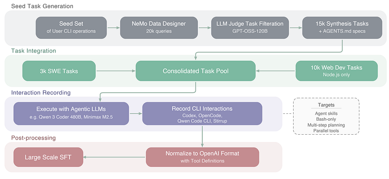 | Agentic CLI dataset construction and training pipeline from seed task generation through interaction recording and OpenAI-format normalization. |
| 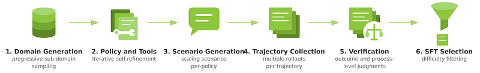 | Conversational tool-use synthesis pipeline: domain generation, policy/tools, scenario generation, trajectory collection, verification, and SFT selection. |
| 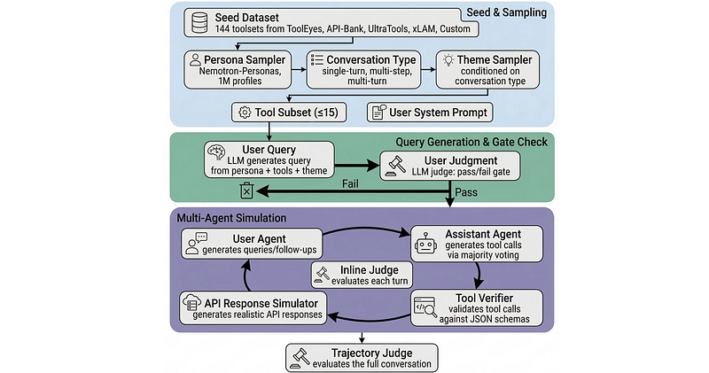 | General-purpose tool-calling data pipeline with seed sampling, query gating, multi-agent simulation, tool/schema verification, and trajectory judging. |
| 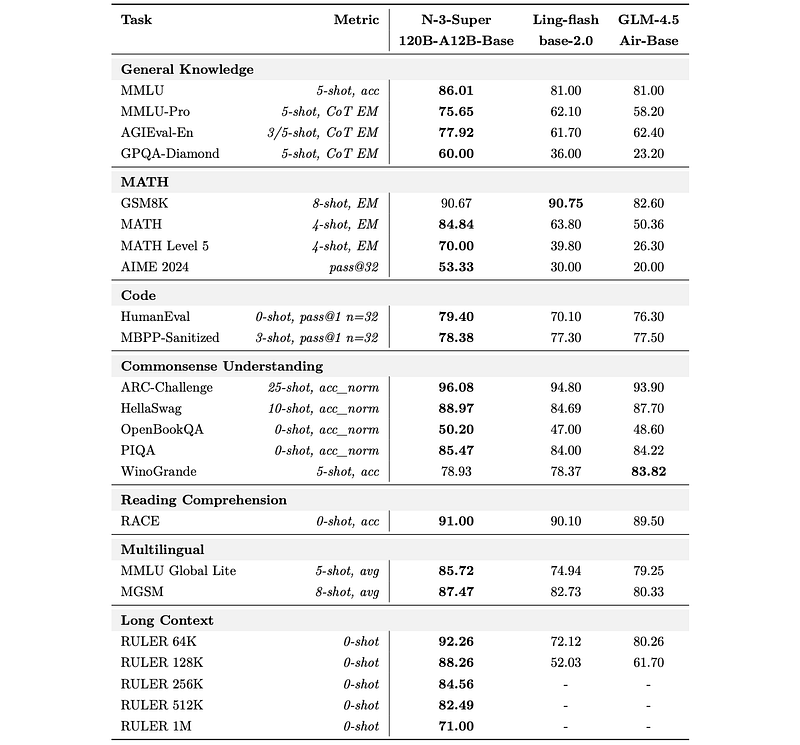 | Base-model benchmark table across knowledge, math, code, commonsense, reading, multilingual, and long-context tasks vs Ling-flash and GLM-4.5-Air. |
| 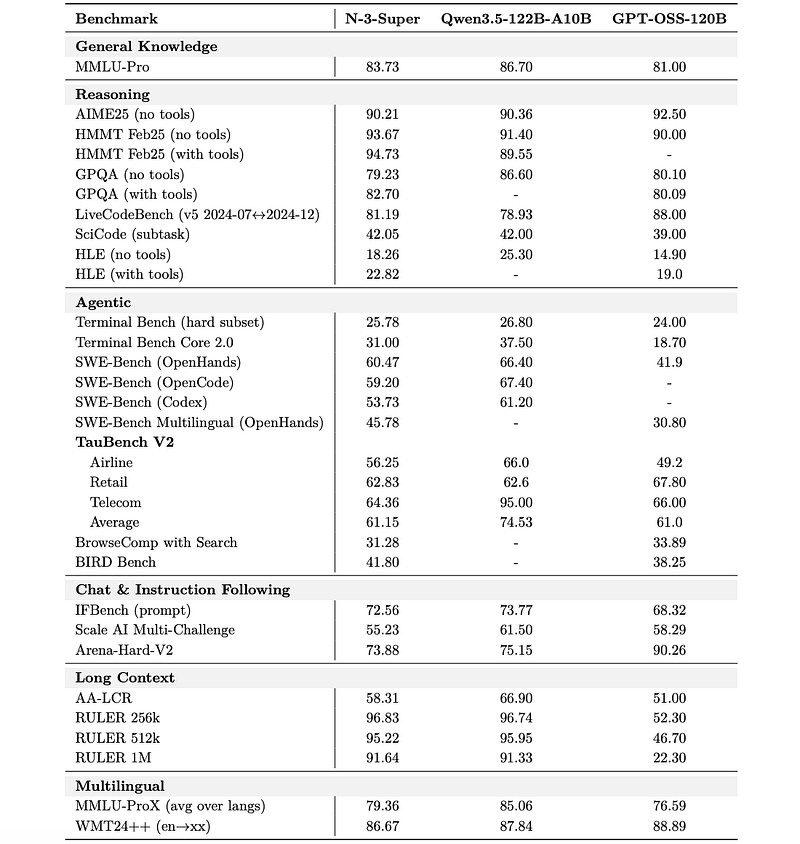 | Post-trained benchmark comparison across reasoning, agentic, chat/instruction, long-context, and multilingual tasks vs Qwen3.5-122B-A10B and GPT-OSS-120B. |
## Related

- [[Papers Explained Corpus]]
- [[Papers Explained 580: Nemotron 3 Ultra]] — scaled-up successor (550B/55B active, 1M context, MOPD).
- [[Mixture of Experts]]
- [[Large Language Models]]
- [[Model Compression and Efficiency]]
- [[Synthetic Data]]
- [[Code Models]]
- [[Papers Explained - Likelihood-Based Reward Designs for General LLM Reasoning]]
- [[Papers Explained - OpenAI Privacy Filter]]

#summary #topic
