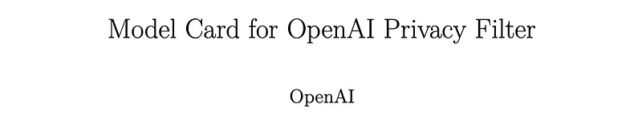
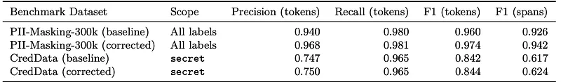
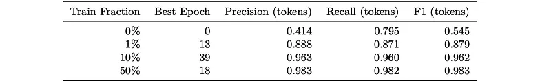

# Papers Explained - OpenAI Privacy Filter

OpenAI Privacy Filter is a bidirectional token-classification model for personally identifiable information (PII) detection and redaction in text. It is designed for high-throughput privacy workflows, and is able to perform context-aware detection of PII in unstructured text.

This page ingests the source article into the wiki and connects it to [[Papers Explained Corpus]], [[Safety and Alignment]], [[Large Language Models]].

Official source: [[OpenAI Privacy Filter]].

## Source Metadata

- Source file: `raw/draft_Papers-Explained--OpenAI-Privacy-Filter-04d7eae93107.md`
- Source title: Papers Explained: OpenAI Privacy Filter
- Canonical: [https://medium.com/p/04d7eae93107](https://medium.com/p/04d7eae93107)

## Key Ideas

- OpenAI Privacy Filter is a bidirectional token-classification model for personally identifiable information (PII) detection and redaction in text.
- The model is available on [HuggingFace](https://huggingface.co/openai/privacy-filter).
- Privacy Filter is a bidirectional token classification model with span decoding. It is trained in phases, beginning with autoregressive pretraining.
- Privacy Filter can detect 8 privacy span categories:
- account_number: A credit card number, bank account number, or other account identifier.

## Notes

OpenAI Privacy Filter is a bidirectional token-classification model for personally identifiable information (PII) detection and redaction in text. It is designed for high-throughput privacy workflows, and is able to perform context-aware detection of PII in unstructured text.

The model is available on [HuggingFace](https://huggingface.co/openai/privacy-filter).

## Model Details

Privacy Filter is a bidirectional token classification model with span decoding. It is trained in phases, beginning with autoregressive pretraining. The pretrained language model is then modified and post-trained as a bidirectional banded attention token classifier. At inference time, constrained sequence decoding is applied to produce coherent BIOES (Begin, Inside, Outside, End, Single) span labels.

Privacy Filter uses a pre-norm transformer encoder-style stack. The model begins with token embeddings and then passes those representations through eight repeated transformer blocks. Within each block, attention uses grouped-query attention with rotary positional embeddings, with 14 query heads and 2 key-value heads, corresponding to a group size of 7 query heads per key-value head. The feed-forward sublayers are implemented as sparse mixture-of-experts blocks with 128 experts total and top-4 routing per token. The final layer is a token-classification head over privacy labels, rather than a natural-language vocabulary, and uses a residual-stream width of dmodel = 640.

Privacy Filter can detect 8 privacy span categories:

- account_number: A credit card number, bank account number, or other account identifier.

- private_address: A specific location or address associated with a private person.

- private_email: An email address used for personal communication or that identifies a private person.

- private_person: The name of a private person, including usernames and handles that identify a specific person.

- private_phone: A phone number associated with a private person.

- private_url: A web URL or IP address that is meant for a private audience or identifies a private person.

- private_date: The date of birth, birth year, or other datetime that identifies a private person.

- secret: An API key, password, or other credential.

After the token classifier produces per-token logits, labels are decoded with a constrained Viterbi decoder using linear-chain transition scoring, rather than taking an independent argmax for each token. The decoder enforces allowed BIOES boundary transitions and scores complete label paths with start, transition, and end terms, plus six transition-bias parameters that control background persistence, span entry, span continuation, span closure, and boundary-to-boundary handoff. This global path optimization is intended to improve span coherence and boundary stability by making each token decision depend on sequence-level structure, not just local logits, especially in noisy or mixed-format text where local token decisions alone can produce fragmented or inconsistent boundaries.

## Training Details

Privacy Filter was trained on a mix of publicly available data and internally generated synthetic datasets. The training data was intended to cover both realistic natural text and targeted privacy-pattern diversity, and to refine the model’s understanding of real vs. fake secrets in the context of software development.

In cases where ground truths were missing for publicly available data, a frontier model in the GPT-5 family was used for annotation with a 2x2 protocol: two prompt formats (structured JSON with explicit offsets and inline span tagging) crossed with two reasoning settings (medium and high).

Synthetic privacy datasets were constructed from public datasets by applying format-matching augmentation to increase subtype and surface-form diversity. The resulting spans were inserted into a natural context, and automated quality controls were run that removed examples with missing target spans, extraneous spans from the same taxonomy, or formatting failures.

Training Privacy Filter was done in stages. First, the base model is pretrained as a generative language model. Then, the architecture is modified by replacing the language-model output layer with a token-classification head over the privacy label taxonomy. At the same time, the original causal attention mask is relaxed into a bidirectional banded attention pattern so the model can use both left and right context while preserving the local-attention structure used at inference time and post-trained with a supervised token classification loss. Pretraining was done following the routines described for pretraining the gpt-oss models.

## Evaluation

Evaluation Datasets:

- PII-Masking-300k: a large multilingual synthetic benchmark that supports broad measurement across privacy categories, languages, and textual formats.

- CredData: consists of codebase text containing credential-like strings and is used to assess the model’s ability to detect secrets in software and technical content

- SPY: a synthetic dataset of medical consultations and legal questions that provides a more domain-specific setting for evaluating privacy detection in sensitive, high-context text.

*Figure: Privacy Filter performance on benchmark datasets.*

- Privacy Filter demonstrated strong overall performance on PII detection and high recall for secret-credential detection.

- Span-level scores (especially for CredData) were lower than token-level scores, mostly due to discrepancies at the exact span boundaries.

*Figure: Fine-tuning results on fractions of the SPY training dataset.*

- Fine-tuning even on small fractions of domain-specific data (as in the SPY dataset) led to substantial improvements, with F1 scores above 96% when trained on just 10%, nearly saturating the benchmark.

## Paper

[Model Card for OpenAI Privacy Filter](https://cdn.openai.com/pdf/c66281ed-b638-456a-8ce1-97e9f5264a90/OpenAI-Privacy-Filter-Model-Card.pdf)

## Figures

Figures from the Medium HTML export (`raw/draft_Papers-Explained--OpenAI-Privacy-Filter-04d7eae93107.md`); local copies under `wiki/assets/papers-explained-openai-privacy-filter/` when download succeeded.

| Figure | Caption |
|--------|---------|
|  | Title page from the OpenAI Privacy Filter model card. |
|  | Benchmark summary on PII-Masking-300k and CredData, reporting token-level precision/recall/F1 and span-level F1. |
|  | SPY fine-tuning data-fraction ablation: performance climbs rapidly from 1% to 10% and nearly saturates by 50%. |
## Related

- [[Papers Explained Corpus]]
- [[Safety and Alignment]]
- [[Large Language Models]]
- [[Papers Explained - Nemotron 3 Super]]
- [[Papers Explained - Probabilistic Diffusion Models]]

#summary #topic
