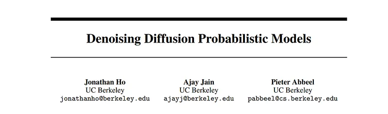
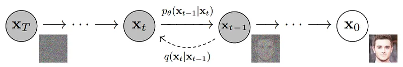
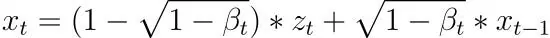
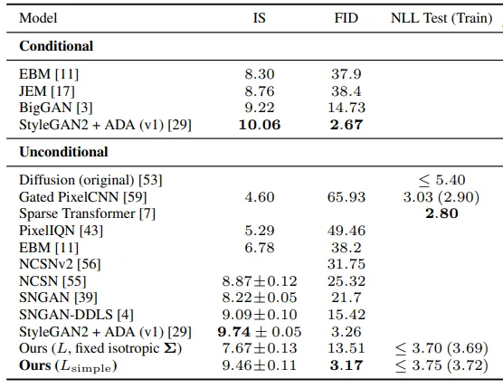
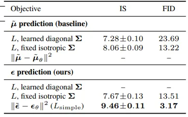

# Papers Explained - Probabilistic Diffusion Models

Diffusion models are a class of powerful generative models used to generate high-quality samples and perform tasks like image denoising, inpainting, super-resolution, and image synthesis.

This page ingests the source article into the wiki and connects it to [[Papers Explained Corpus]], [[Synthetic Data]].

## Source Metadata

- Source file: `raw/draft_Papers-Explained--Probabilistic-Diffusion-Models-2b3a9f14cb04.md`
- Source title: Papers Explained: Probabilistic Diffusion Models
- Canonical: [https://medium.com/p/2b3a9f14cb04](https://medium.com/p/2b3a9f14cb04)

## Key Ideas

- Diffusion models are based on the concept of diffusion processes that progressively transform a data distribution to a target distribution. The key idea is to model a sequence of noisy data points that evolve through a series of diffusion steps.
- The core component of the diffusion model is the diffusion process, which is defined by the following recurrence relation:
- where x_t is the data point at time t, z_t is the associated Gaussian noise, and β_t is the diffusion coefficient that decreases at each step. The noise z_t is sampled from a standard Gaussian distribution, and x_0 is initialized with the data.
- To learn the parameters effectively, the authors propose a denoising autoencoder as the diffusion model.
- The training dataset would consist of pairs of clean images and their corresponding noisy versions.

## Notes

Diffusion models are a class of powerful generative models used to generate high-quality samples and perform tasks like image denoising, inpainting, super-resolution, and image synthesis.

Diffusion models are based on the concept of diffusion processes that progressively transform a data distribution to a target distribution. The key idea is to model a sequence of noisy data points that evolve through a series of diffusion steps. Each step is defined as a stochastic transformation that gradually decreases the noise level in the data. The final step of the process corresponds to the target distribution.

The core component of the diffusion model is the diffusion process, which is defined by the following recurrence relation:

where x_t is the data point at time t, z_t is the associated Gaussian noise, and β_t is the diffusion coefficient that decreases at each step. The noise z_t is sampled from a standard Gaussian distribution, and x_0 is initialized with the data. The goal of training the diffusion model is to learn the time-varying parameters β_t and the initial data distribution x_0.

To learn the parameters effectively, the authors propose a denoising autoencoder as the diffusion model. It consists of an encoder that maps the data x and the corresponding noise z to a latent representation h, and a decoder that reconstructs the original data x. The training process involves updating the parameters of both the encoder and decoder networks through a denoising objective.

## Training Methodology

The training dataset would consist of pairs of clean images and their corresponding noisy versions.

Diffusion Process Sampling: During training, the diffusion process is sampled to generate a sequence of noisy data points. Starting from the initial noisy data x_0, the process iteratively updates the data points using the recurrence relation mentioned in the Model Architecture section. By sampling the diffusion process, we obtain pairs of (x_t, β_t).

Noise Scheduling: The coefficients β_t control the amount of noise reduction at each step of the diffusion process. The scheduling of β_t is essential for effective training. Commonly used scheduling strategies include linear scheduling (where β_t = t / T, with T as the total number of diffusion steps) and cosine annealing.

Denoising Autoencoder Objective: Given the pairs of (x_t, β_t) generated in step 1, the objective of the denoising autoencoder is to reconstruct x_t from the noisy input x_t and noise z_t. The reconstruction loss is usually measured using the mean squared error (MSE) or other appropriate loss functions.

## Experiments

To represent the reverse process, we use a U-Net backbone similar to an unmasked PixelCNN++ with group normalization throughout. Parameters are shared across time, which is specified to the network using the Transformer sinusoidal position embedding. We use self-attention at the 16 × 16 feature map resolution.

*Figure: CIFAR10 results. NLL measured in bits/dim*

*Figure: Unconditional CIFAR10 reverse process parameterization and training objective ablation. Blank entries were unstable to train and generated poor samples with out-ofrange scores.*

## Paper

Denoising Diffusion Probabilistic Models [2006.11239](https://arxiv.org/abs/2006.11239)

## Figures

Figures from the Medium HTML export (`raw/draft_Papers-Explained--Probabilistic-Diffusion-Models-2b3a9f14cb04.md`); local copies under `wiki/assets/papers-explained-probabilistic-diffusion-models/` when download succeeded.

| Figure | Caption |
|--------|---------|
|  | Title block of *Denoising Diffusion Probabilistic Models* (Ho, Jain, Abbeel). |
|  | Forward and reverse diffusion chain from noisy \(x_T\) to denoised sample \(x_0\), with learned reverse transitions \(p_\theta(x_{t-1}\mid x_t)\). |
|  | One-step diffusion recurrence showing noise injection controlled by \(\beta_t\). |
|  | CIFAR-10 comparison table (IS, FID, NLL): diffusion variants vs GAN, score-based, autoregressive, and EBM baselines. |
|  | Reverse-process parameterization ablation: \(\mu\)-prediction vs \(\epsilon\)-prediction objectives and learned/fixed-variance choices. |
## Related

- [[Papers Explained Corpus]]
- [[Synthetic Data]]
- [[Papers Explained - OpenAI Privacy Filter]]
- [[Papers Explained - Sarvam 30B and Sarvam 105B]]

#summary #topic
