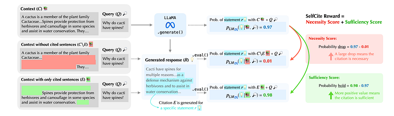
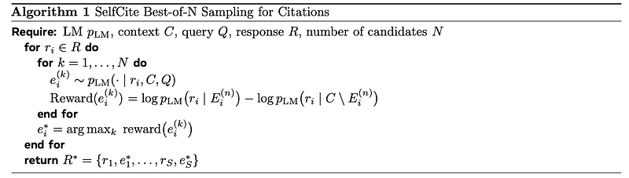
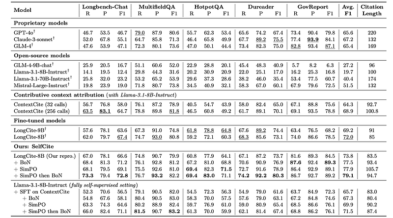
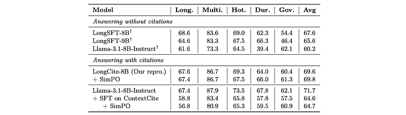

# Papers Explained - SelfCite

SelfCite is a novel self-supervised approach that aligns LLMs to generate high-quality, fine-grained, sentence-level citations for the statements in their generated responses. Instead of only relying on costly and labor-intensive annotations, SelfCite leverages a reward signal provided by the LLM itself through context ablation.

This page ingests the source article into the wiki and connects it to [[Papers Explained Corpus]], [[Evaluation and Benchmarks]], [[Large Language Models]].

## Source Metadata

- Source file: `raw/2025-02-17_Papers-Explained--SelfCite-841a9e60006a.html`
- Source title: Papers Explained: SelfCite
- Published: 2025-02-17
- Canonical: [https://medium.com/@ritvik19/papers-explained-selfcite-841a9e60006a](https://medium.com/@ritvik19/papers-explained-selfcite-841a9e60006a)

## Key Ideas

- SelfCite is a novel self-supervised approach that aligns LLMs to generate high-quality, fine-grained, sentence-level citations for the statements in their generated responses.
- The objective of optimizing the LM is to ensure that the citation sequence ei accurately reflects the evidence from the context that supports the generation of ri.
- The quality of a citation sequence ei is measured by the changes in the LM’s probability of generating ri when the cited sentences are either removed from or isolated within the context. All the cited context sentences are denoted as Ei.
- Necessity Score: Probability Drop. This metric quantifies the decrease in the probability of generating ri when the cited sentences in Ei are all removed from the context.
- Sufficiency Score: Probability Hold. Conversely, this metric measures if the probability of generating ri is still kept large when only the cited sentences are kept in the context, effectively testing the sufficiency of the citation to support the response...

## Notes

## Papers Explained 311: SelfCite

SelfCite is a novel self-supervised approach that aligns LLMs to generate high-quality, fine-grained, sentence-level citations for the statements in their generated responses. Instead of only relying on costly and labor-intensive annotations, SelfCite leverages a reward signal provided by the LLM itself through context ablation.

## Problem Formulation

Consider employing an autoregressive language model (LM) to generate a response to a specific query given a context of relevant information. Specifically, given an LM pLM, let pLM(ti | t1, . . . , ti−1) denote its output distribution over the next token ti based on a sequence of preceding tokens t1 , . . . , ti−1 . Next, let C represent the context of relevant information. This context is partitioned into |C| sentences: c1, c2, . . . , c|C|. Each sentence cj is prepended with a unique identifier (e.g. sentence index j) as a way for the model to reference the sentence when generating citations. The context C is followed by a query Q, a question or instruction for the model. A response R is then sampled from the LM pLM.

In SelfCite, each statement ri in the response R is followed by a citation sequence ei consisting of the identifiers of sentences from the context C. Thus, the entire response sequence R is {r1,e1,r2,e2,…,rS,eS}, where S is the total number of generated statements. The citation ei is intended to reference sentences that support the generation of ri. Formally, for each response statement ri, the model outputs a citation sequence ei = {e1i ,e2i ,…,emi }, where each eji ∈ {1,2,…,|C|} corresponds to a specific sentence number in the context C, and m sentences are cited. Note that this citation sequence may be empty. The entire response R consisting of statements ri followed by citations ei is sampled from the LM pLM as follows:

The objective of optimizing the LM is to ensure that the citation sequence ei accurately reflects the evidence from the context that supports the generation of ri.

## Self-Supervised Reward via Context Ablation

The quality of a citation sequence ei is measured by the changes in the LM’s probability of generating ri when the cited sentences are either removed from or isolated within the context. All the cited context sentences are denoted as Ei. Two key metrics, the necessity score and the sufficiency score, are defined and finally combined into the final reward:

- Necessity Score: Probability Drop. This metric quantifies the decrease in the probability of generating ri when the cited sentences in Ei are all removed from the context.

- Sufficiency Score: Probability Hold. Conversely, this metric measures if the probability of generating ri is still kept large when only the cited sentences are kept in the context, effectively testing the sufficiency of the citation to support the response statement.

- Final Reward. To comprehensively evaluate the necessity and sufficiency of the generated citations, we add the two metrics together, where the opposing terms cancel out:

The combined reward measures if the citations are both necessary and sufficient for generating the response ri.

## Best-of-N Sampling

To leverage the self-supervised reward computed via context ablation, a best-of-N sampling strategy is employed. After generating the full response, the position where the citation tags <cite>…</cite> are generated is located. Within the citation tags, N candidate citation sequences are sampled and the citation set that maximizes the combined reward metric is selected.

After obtaining the selected citations {e∗1,…,e∗S}, the original citation sequence e is replaced with the optimal citation set e∗ for the response statement r, while keeping the response statements {r1,…,rS} unchanged. This process is repeated for each statement in the response R to obtain the final, citation-improved output R∗ = {r1,e∗1,…,rS,e∗S}.

## Preference Optimization

Given documents and queries, a language model (LM) can be prompted to generate responses along with citations R = {r1,e1,…,rS,eS}. By further applying best-of-N sampling, new responses of the same statements but with better citations R∗ = {r1,e∗1,…,rS,e∗S} can be obtained. Such preference data can be used in direct preference optimization (DPO) to align the model based on the preference between the original outputs and improved outputs.

DPO typically requires more memory usage than SFT due to the need of a reference model. Also, optimizing with preference data pairs inherently makes the per-GPU batch size to be at least 2, limiting the maximum context length that can be used. To address these challenges, SimPO, a variant of DPO that does not require a reference model, can be used. This frees up memory for long-context fine-tuning.

Through this self-supervised alignment process, which does not require ground-truth answers or human annotations, the model learns to generate more accurate and contextually grounded citations on its own.

## Experiment Setup

The Llama-3.1–8B model fine-tuned on LongCite-45K SFT data, namely the LongCite-8B model, is used as the start point for both best-of-N sampling and preference optimization. The same text segmentation strategy from LongCite is adopted: each document is split into individual sentences using NLTK (Bird, 2006) and Chinese punctuations. Each sentence is prepended with a unique identifier in <C{i}> format. These identifiers serve as the citation indices, enabling the model to cite relevant context right after the statements with the format of <statement> {content …} <cite>[i1 − i2][i3 − i4]…</cite></statement>. This format allows the model to cite a single sentence (e.g. i1 = i2) or a span (e.g. i1 < i2) efficiently within several tokens.

## Evaluation

SelfCite is evaluated on the LongBench-Cite benchmark. Baselines include prompting LLMs (like GPT-4, Claude, and Llama), Contributive Context Attribution (ContextCite), and fine-tuned models (LongCite). The evaluation metrics include citation recall, precision, F1 score, average citation length, and answer correctness.

*Figure: LongBench-Cite benchmark.*

- SelfCite with BoN consistently improves citation recall and precision, leading to a higher F1 score compared to the baseline LongCite model.

- SimPO training, which internalizes the gains of BoN, achieves similar improvements without requiring BoN sampling at inference time.

- Combining SimPO with BoN further improves the F1 score, achieving the highest score across datasets and suggesting potential for further improvement.

- SelfCite outperforms proprietary models and LongCite while producing shorter citations.

- SelfCite significantly outperforms ContextCite, likely due to SelfCite’s more efficient and accurate citation quality estimation by reranking existing LLM-generated candidates.

- SelfCite achieves results close to the Claude Citations API, a commercial-level API specialized for citations.

- Starting from a fully self-supervised SFT model and applying SimPO alignment significantly improves citation quality, demonstrating the effectiveness of the alignment method even without supervised data.

*Figure: Answer correctness when responding with or without citations.*

- SimPO fine-tuning does not significantly impact answer correctness, which remains comparable to baselines trained without citation information.

- Using ContextCite SFT data slightly degrades answer correctness, potentially due to the lack of instruction following data in the SFT stage. However, the SimPO step improves citations without further impacting correctness.

## Paper

SelfCite: Self-Supervised Alignment for Context Attribution in Large Language Models [2502.09604](https://arxiv.org/abs/2502.09604)

## Figures

Figures from the Medium HTML export (`raw/2025-02-17_Papers-Explained--SelfCite-841a9e60006a.html`); local copies under `wiki/assets/papers-explained-selfcite/` when download succeeded.

| Figure | Caption |
|--------|---------|
|  | Title block of *SelfCite: Self-Supervised Alignment for Context Attribution in Large Language Models*. |
|  | Autoregressive formulation for generating statement \(r_i\) followed by citation sequence \(e_i\). |
|  | Context-ablation reward intuition: compare full context, context without cited evidence, and cited-only context to measure necessity and sufficiency. |
|  | Necessity metric (Prob-Drop): likelihood decrease when cited evidence is removed from context. |
|  | Sufficiency metric (Prob-Hold): likelihood retained when only cited evidence is kept. |
|  | Combined SelfCite reward: cited-only likelihood minus no-citation-context likelihood. |
|  | Best-of-\(N\) citation sampling algorithm: generate candidates, score by reward, keep the highest-scoring citation sequence per statement. |
|  | LongBench-Cite results: recall/precision/F1 across datasets and models, showing gains from SelfCite + SimPO and further gains with BoN. |
|  | Answer-correctness comparison with and without citations, indicating citation improvements without major correctness loss. |
## Related

- [[Papers Explained Corpus]]
- [[Evaluation and Benchmarks]]
- [[Large Language Models]]
- [[Papers Explained 310 - SmolLM2]]
- [[Papers Explained 312 - It’s All in The MASK]]

#summary #topic
