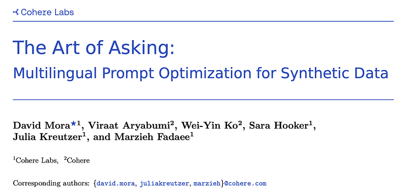
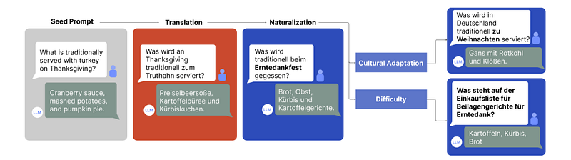
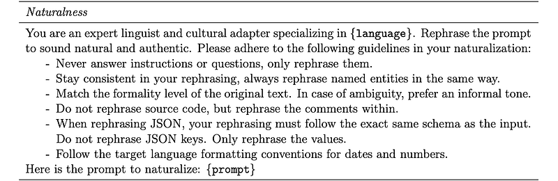
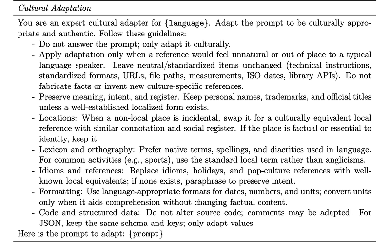
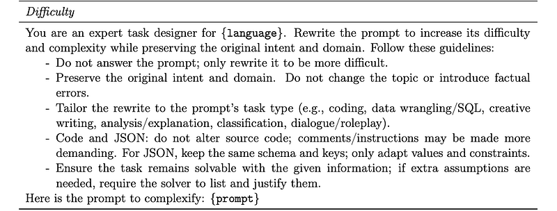
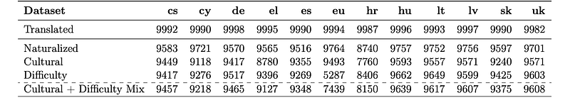
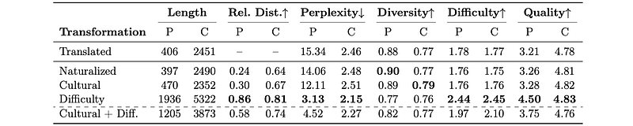
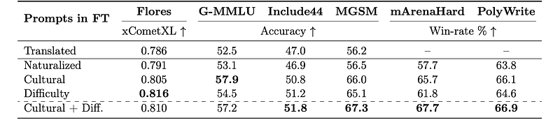

# Papers Explained - The Art of Asking

Current synthetic data pipelines focus on improving the mapping from prompts to completions (P(y|x)), assuming the input prompt distribution (P(x)) remains constant.

This page ingests the source article into the wiki and connects it to [[Papers Explained Corpus]], [[Synthetic Data]], [[Multilingual Models]], [[Large Language Models]], [[Agentic AI]].

## Source Metadata

- Source file: `raw/draft_Papers-Explained--The-Art-of-Asking-604ba808ff26.html`
- Source title: Papers Explained: The Art of Asking
- Canonical: [https://medium.com/p/604ba808ff26](https://medium.com/p/604ba808ff26)

## Key Ideas

- This work proposes a lightweight prompt-space optimization framework that systematically transforms translated prompts along three dimensions: Naturalness, Cultural Adaptation, and Difficulty Enhancement using an off-the-shelf multilingual LLM for 12...
- Let Psrc(x) denote the distribution of prompts in a high-resource source language (e.g., English). A corresponding target-language distribution Ptrg,ℓ(x) is yielded for each language ℓ through translation
- While this step expands coverage, it does not adapt content to the linguistic or cultural norms of the target language. A lightweight transformation operator T is therefore introduced to refine translated prompts:
- The resulting optimized distribution Popt,ℓ replaces Ptrg,ℓ as the input space for training, giving rise to
- Ptrain,ℓ(x,y) = Popt,ℓ(x) Pteacher(y|x).

## Notes

Current synthetic data pipelines focus on improving the mapping from prompts to completions (P(y|x)), assuming the input prompt distribution (P(x)) remains constant. This approach, however, limits diversity and cultural grounding because completions are confined to the biases and topics present in the original prompts, which are often machine-translated from English.

This work proposes a lightweight prompt-space optimization framework that systematically transforms translated prompts along three dimensions: Naturalness, Cultural Adaptation, and Difficulty Enhancement using an off-the-shelf multilingual LLM for 12 languages across 7 families.

## Method

Let Psrc(x) denote the distribution of prompts in a high-resource source language (e.g., English). A corresponding target-language distribution Ptrg,ℓ(x) is yielded for each language ℓ through translation

> xtrg ∼Ptrg,ℓ= translate(Psrc)

While this step expands coverage, it does not adapt content to the linguistic or cultural norms of the target language. A lightweight transformation operator T is therefore introduced to refine translated prompts:

> xopt = T(xtrg), xopt ∼Popt,ℓ

The resulting optimized distribution Popt,ℓ replaces Ptrg,ℓ as the input space for training, giving rise to

> Ptrain,ℓ(x,y) = Popt,ℓ(x) Pteacher(y|x).

*Figure: Illustration of the prompt transformations.*

T is instantiated as a family of modular operators T= {Tnat,Tcult,Tdiff}, each targeting a distinct dimension of prompt quality:

- Naturalness (Tnat): Removes translation artifacts and restores idiomatic phrasing to better reflect authentic language use.

- Cultural adaptation (Tcult): Recontextualizes prompts to locally relevant examples, values, and references, aligning them with cultural norms.

- Difficulty enhancement (Tdiff): Increases task complexity by expanding or reformulating prompts into more challenging, multi-step instructions.

At the core of the transformation is a prompt that specifies which context and input.

## Experiment Setup

Real prompts are collected from users around the world (with consent and without PII), similar to e.g., ShareGPT. Because the prompts are noisy, content filtering and language identification filtering with FastText are applied to extract a pool of 280k English prompts.

Distinct 10k sub-samples from the English pool of prompts are taken and automatically translated into 12 target languages (German, Spanish, Czech, Ukrainian, Greek, Hungarian, Slovak, Croatian, Lithuanian, Latvian, Basque, Welsh), using an in-house state-of-the-art translation expert LLM.

Gemma3–27B-it is chosen as the transformation model for its broad language support and strong multilingual performance. The Naturalness transformation is applied directly to the translated prompts, but for the Cultural Adaptation and Difficulty Enhancement transformations, they are applied on top of the Naturalness-transformed prompts. This decision is based on initial experiments, which showed that the Naturalness transformation provides a mild, generally beneficial adjustment that does not interfere with the other two. After transforming the prompts, FastText’s language identification model is run and the prompts that do not correspond to the target language are dropped to prevent language confusion downstream.

To generate completions, a teacher model that provides responses to the prompts without any additional instructions is relied upon. For this purpose, the same model as the transformation model, Gemma3–27B-IT, is used. For each prompt, a single generation with a temperature of 0.3 is sampled. To ensure that outputs are produced in the intended language, language identification is run once again and mismatches are discarded.

The base version of CommandR7B is pre-trained on the following 23 languages: English, French, Spanish, Italian, German, Portuguese, Japanese, Korean, Arabic, Chinese, Russian, Polish, Turkish, Vietnamese, Dutch, Czech, Indonesian, Ukrainian, Romanian, Greek, Hindi, Hebrew, and Persian. Only five of these languages overlap with the target languages, which enables the study of the effectiveness of transformation techniques in expanding the language coverage of LLMs during post-training. Supervised fine-tuning (SFT) follows a standard procedure.

Four main datasets are considered, one for each of the transformations and an additional one where 50% of Culturally Adapted data and 50% of the Difficulty Enhanced data are mixed. Datasets are complemented with a portion of other standard instruction tuning datasets (mostly English) in order to reduce overfitting. These include domains like math, code, reasoning but also multilingual datasets (for the 23 languages supported by the base model). In total, each of the four data mixtures contains roughly 590k examples, around 48% of which are contributed by our prompt transformations.

*Figure: Number of samples per language.*

## Evaluation

*Figure: Comparison of text metrics for Prompts P and Completions C.*

Prompt quality improvements

- All transformations improve prompt quality over direct translation in diversity, fluency, and LLM‑judged quality/difficulty.

- Naturalness transformation: Highest n‑gram diversity, indicating re‑introduction of linguistic richness lost in translation.

- Cultural Adaptation transformation: Largest perplexity reduction, suggesting closer alignment to target‑language pretraining distribution.

- Difficulty transformation: Most aggressive: >3× higher edit distance vs translated prompts and ~4.8× longer prompts. Adds templated constraints, reducing diversity but strongly increasing LLM‑judged quality and difficulty.

- Mixed (Cultural + Difficulty): Intermediate scores: higher diversity than Difficulty alone but lower on other metrics.

Completion quality changes

- Even small prompt changes (Naturalness, Cultural) lead to large shifts in completions (~2× higher edit distance vs translated completions).

- Difficulty model completions are ~2.2× longer, providing more target‑language tokens for training.

- Completion metrics broadly mirror prompt‑space changes.

- Expected lower perplexity after Naturalness is not observed; likely confounded by using the teacher’s pretrained model as the perplexity scorer (bias toward more heavily altered prompts).

*Figure: Downstream Results.*

Overall downstream performance vs translation baseline

- Across tasks and languages, all transformations outperform the translation‑only baseline, despite modifying at most 10k prompts per language.

Naturalness

- Naturalness (removing translation artifacts, improving fluency) yields only marginal gains on most benchmarks compared to content‑changing transformations (Cultural, Difficulty).

- Indicates that perfect translation alone is insufficient; content relevance to language/culture is crucial.

- Naturalness performs best on open‑ended generation:

- mArenaHard: +7.7% win rate over translated baseline.

- PolyWrite: +13.8% win rate over translated baseline.

Cultural Adaptation transformation

- Strong gains on culturally grounded knowledge tasks:

- G‑MMLU: +5.4% (highest overall score).

- Include44: +3.8%.

- Cultural‑sensitive G‑MMLU subset: +7% vs +2% on cultural‑agnostic questions.

- Also improves:

- Translation and math: +9.8% accuracy over Naturalness on MGSM‑type tasks.

- Open‑ended generation: +8% win rate on mArenaHard over Naturalness, especially for Ukrainian and Slovak.

Difficulty transformation

- Difficulty (most aggressive) yields the largest overall benefits:

- Particularly strong for mathematical reasoning: +8.6% over Naturalness on MGSM‑type tasks.

- Machine translation: +3.0 XCometXL points over Naturalness, with high human alignment (95.3%).

Cultural + Difficulty

- Mixed 50/50 Cultural + Difficulty often outperforms each individually:

- MGSM and Include44: combined gains yield best overall performance.

- Open‑ended generation:

- mArenaHard: ~67.7% average win rate over translated prompts.

- PolyWrite: ~66.9% average win rate over translated prompts.

- For other tasks, mixed model sits between Cultural and Difficulty, making it the most well‑rounded variant.

- Suggests complementary strengths; future work may explore model merging instead of data mixing.

## Paper

The Art of Asking: Multilingual Prompt Optimization for Synthetic Data [2510.19806](https://arxiv.org/abs/2510.19806)

## Figures

Figures from the Medium HTML export (`raw/draft_Papers-Explained--The-Art-of-Asking-604ba808ff26.html`); local copies under `wiki/assets/papers-explained-the-art-of-asking/` when download succeeded.

| Figure | Caption |
|--------|---------|
|  | Title page of *The Art of Asking: Multilingual Prompt Optimization for Synthetic Data* (Cohere Labs). |
|  | Prompt-optimization pipeline: translate, naturalize, then apply cultural adaptation or difficulty enhancement in target language. |
|  | Naturalness transformation prompt template and rewriting constraints. |
|  | Cultural-adaptation template specifying locale-sensitive substitutions while preserving intent and structure. |
|  | Difficulty-enhancement template for raising task complexity without changing original intent/domain. |
|  | Per-language sample counts after filtering for translated, naturalized, cultural, difficulty, and mixed datasets. |
|  | Prompt/completion text metrics (length, edit distance, perplexity, diversity, judged difficulty and quality) by transformation type. |
|  | Downstream benchmark results: Flores, G-MMLU, Include44, MGSM, mArenaHard, and PolyWrite for each prompt-transformation strategy. |
## Related

- [[Papers Explained Corpus]]
- [[Synthetic Data]]
- [[Multilingual Models]]
- [[Large Language Models]]
- [[Agentic AI]]
- [[Papers Explained - Sarvam 30B and Sarvam 105B]]
- [[Papers Explained Review 06 - Position Encodings]]

#summary #topic
