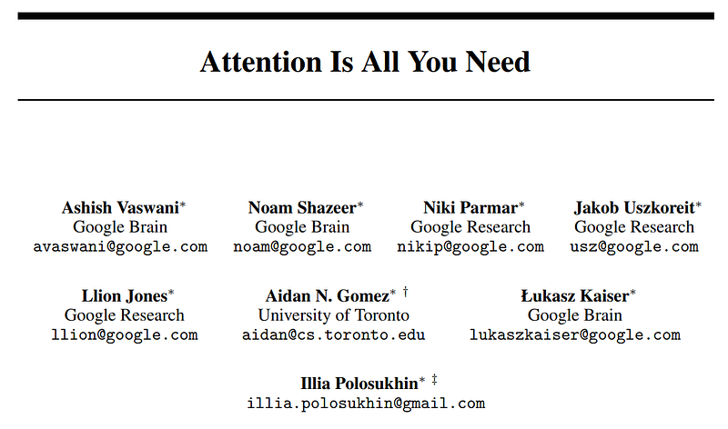
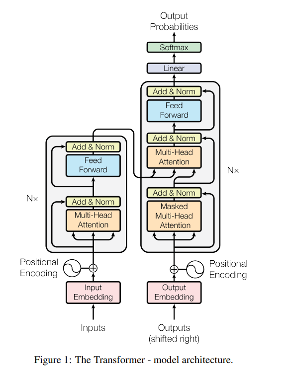
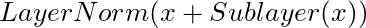
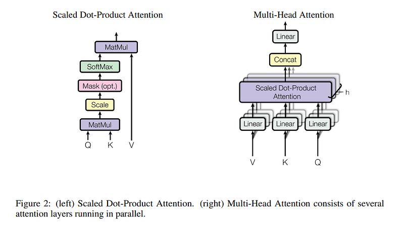
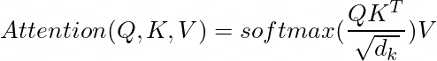
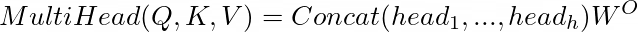
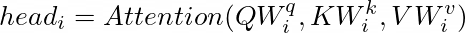
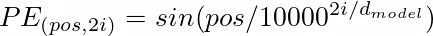
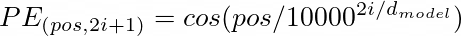

# Papers Explained 01 - Transformer

Most competitive neural sequence transduction models have an encoder-decoder structure. Here, the encoder maps an input sequence of symbol representations (x1, …, xn) to a sequence of continuous representations z = (z1, …, zn). Given z, the decoder then generates an output sequence (y1, …, ym) of symbols one element at a time.

This page ingests the source article into the wiki and connects it to [[Papers Explained Corpus]], [[Large Language Models]], [[Embedding and Retrieval]].

## Source Metadata

- Source file: `raw/2023-02-06_Papers-Explained-01--Transformer-474bb60a33f7.html`
- Source title: Papers Explained 01: Transformer
- Published: 2023-02-06
- Canonical: [https://medium.com/@ritvik19/papers-explained-01-transformer-474bb60a33f7](https://medium.com/@ritvik19/papers-explained-01-transformer-474bb60a33f7)

## Key Ideas

- Most competitive neural sequence transduction models have an encoder-decoder structure. Here, the encoder maps an input sequence of symbol representations (x1, …, xn) to a sequence of continuous representations z = (z1, …, zn).
- The Transformer follows this overall architecture using stacked self-attention and point-wise, fully connected layers for both the encoder and decoder,
- The encoder is composed of a stack of N = 6 identical layers. Each layer has two sub-layers. The first is a multi-head self-attention mechanism, and the second is a simple, positionwise fully connected feed-forward network.
- That is, the output of each sub-layer is
- where Sublayer(x) is the function implemented by the sub-layer itself.

## Notes

Most competitive neural sequence transduction models have an encoder-decoder structure. Here, the encoder maps an input sequence of symbol representations (x1, …, xn) to a sequence of continuous representations z = (z1, …, zn). Given z, the decoder then generates an output sequence (y1, …, ym) of symbols one element at a time. At each step the model is auto-regressive, consuming the previously generated symbols as additional input when generating the next.

The Transformer follows this overall architecture using stacked self-attention and point-wise, fully connected layers for both the encoder and decoder,

Encoder

The encoder is composed of a stack of N = 6 identical layers. Each layer has two sub-layers. The first is a multi-head self-attention mechanism, and the second is a simple, positionwise fully connected feed-forward network. A residual connection is employed around each of the two sub-layers, followed by layer normalization.

That is, the output of each sub-layer is

where Sublayer(x) is the function implemented by the sub-layer itself.

To facilitate these residual connections, all sub-layers in the model, as well as the embedding layers, produce outputs of dimension d_model = 512.

Decoder

The decoder is also composed of a stack of N = 6 identical layers. In addition to the two sub-layers in each encoder layer, the decoder inserts a third sub-layer, which performs multi-head attention over the output of the encoder stack.

The self-attention sub-layer in the decoder stack is also modified to prevent positions from attending to subsequent positions. This masking, combined with fact that the output embeddings are offset by one position, ensures that the predictions for position i can depend only on the known outputs at positions less than i.

Attention

An attention function can be described as mapping a query and a set of key-value pairs to an output, where the query, keys, values, and output are all vectors. The output is computed as a weighted sum of the values, where the weight assigned to each value is computed by a compatibility function of the query with the corresponding key.

Multi-Head Attention

Instead of performing a single attention function with dmodel-dimensional keys, values and queries, it is beneficial to linearly project the queries, keys and values h times with different, learned linear projections to dk, dk and dv dimensions, respectively.

On each of these projected versions of queries, keys and values the attention function is performed in parallel, yielding dv-dimensional output values. These are concatenated and once again projected, resulting in the final values,

Multi-head attention allows the model to jointly attend to information from different representation subspaces at different positions. With a single attention head, averaging inhibits this.

where

Embeddings

Similarly to other sequence transduction models, Transformers also use learned embeddings to convert the input tokens and output tokens to vectors of dimension d_model.

Positional Encoding

Since transformer model contains no recurrence and no convolution, in order for the model to make use of the order of the sequence, some information about the relative or absolute position of the tokens must be injected in the sequence.

Hence positional encodings are added to the input embeddings at the
bottoms of the encoder and decoder stacks. The positional encodings have the same dimension d_model as the embeddings, so that the two can be summed

Training Data

The transformer is trained on the standard WMT 2014 English-German dataset consisting of about 4.5 million sentence pairs. Sentences were encoded using byte-pair encoding, which has a shared sourcetarget vocabulary of about 37000 tokens.

For English-French, the significantly larger WMT 2014 English-French dataset consisting of 36M sentences is used and split tokens into a 32000 word-piece vocabulary.

## Figures

Figures from the Medium HTML export (`raw/2023-02-06_Papers-Explained-01--Transformer-474bb60a33f7.html`); local copies under `wiki/assets/papers-explained-01-transformer/` when download succeeded.

| Figure | Caption |
|--------|---------|
|  | Encoder maps inputs to continuous representations; decoder generates outputs autoregressively. |
|  | Overall Transformer architecture with stacked self-attention and feed-forward layers. |
|  | Output of each sub-layer: LayerNorm(x + Sublayer(x)) with residual connections. |
|  | Attention maps a query and key–value pairs to a weighted sum of values. |
|  | Form of the attention weights (scaled dot-product). |
|  | Parallel heads concatenated and projected to final values. |
|  | Linear projections of Q, K, V for each head. |
|  | Positional encodings added to input embeddings (sinusoidal form). |
|  | Related positional encoding expression from the article figures. |
## Paper

Attention Is All You Need [1706.03762](https://arxiv.org/abs/1706.03762)

## Related

- [[Papers Explained Corpus]]
- [[Large Language Models]]
- [[Embedding and Retrieval]]
- [[Papers Explained Review 06 - Position Encodings]]
- [[Papers Explained 02 - BERT]]

#summary #topic
