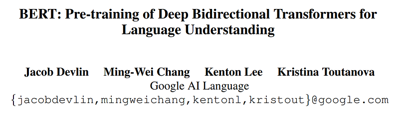
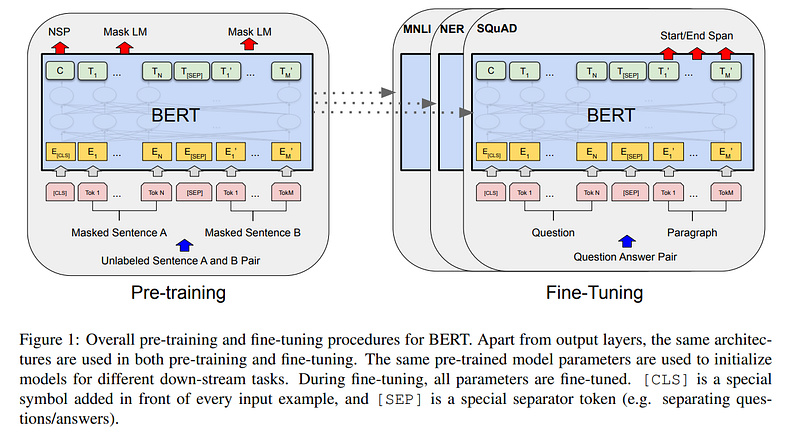
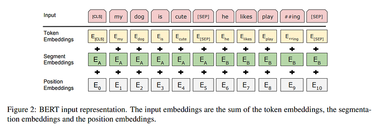
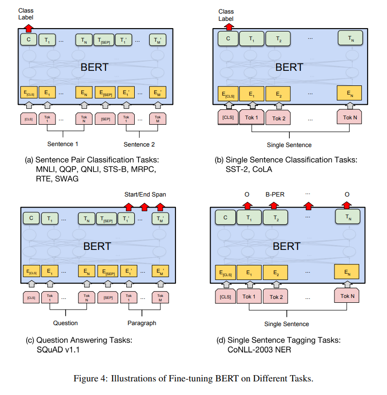

# Papers Explained 02 - BERT

During pre-training, the model is trained on unlabeled data over different pre-training tasks.

This page ingests the source article into the wiki and connects it to [[Papers Explained Corpus]], [[Large Language Models]], [[Supervised Fine-Tuning]].

## Source Metadata

- Source file: `raw/2023-02-06_Papers-Explained-02--BERT-31e59abc0615.html`
- Source title: Papers Explained 02: BERT
- Published: 2023-02-06
- Canonical: [https://medium.com/@ritvik19/papers-explained-02-bert-31e59abc0615](https://medium.com/@ritvik19/papers-explained-02-bert-31e59abc0615)

## Key Ideas

- BERT introduced two steps training framework: pre-training and fine-tuning.
- For finetuning, the BERT model is first initialized with the pre-trained parameters, and all of the parameters are fine-tuned using labeled data from the downstream tasks.
- A distinctive feature of BERT is its unified architecture across different tasks. There is minimal difference between the pre-trained architecture and the final downstream architecture.
- BERT’s model architecture is a multi-layer bidirectional Transformer encoder based on the original implementation.
- BERT primarily reported results on two model sizes:

## Notes

BERT introduced two steps training framework: pre-training and fine-tuning.

During pre-training, the model is trained on unlabeled data over different pre-training tasks.

For finetuning, the BERT model is first initialized with the pre-trained parameters, and all of the parameters are fine-tuned using labeled data from the downstream tasks.

A distinctive feature of BERT is its unified architecture across different tasks. There is minimal difference between the pre-trained architecture and the final downstream architecture.

BERT’s model architecture is a multi-layer bidirectional Transformer encoder based on the original implementation.

BERT primarily reported results on two model sizes:

- BERTBASE (L=12, H=768, A=12, Total Parameters=110M)

- BERTLARGE (L=24, H=1024, A=16, Total Parameters=340M).

BERTBASE was chosen to have the same model size as OpenAI GPT for comparison purposes.

Critically, however, the BERT Transformer uses bidirectional self-attention, while the GPT Transformer uses constrained self-attention where every token can only attend to context to its left.

## Input/Output Representations

- BERT uses WordPiece embeddings with a 30,000 token vocabulary.

- The first token of every sequence is always a special classification token ([CLS]).

- The final hidden state corresponding to this token is used as the aggregate sequence representation for classification tasks.

- Sentence pairs are packed together into a single sequence. The sentences are differentiated in two ways.

- First, those are separated with a special token ([SEP]).

- Second, a learned embedding is added to every token indicating whether it belongs to sentence A or sentence B.

- For a given token, its input representation is constructed by summing the corresponding token, segment, and position embeddings.

## Pre-Training

Masked Language Modelling

- 15% of all WordPiece tokens are masked in each sequence at random. In contrast to denoising auto-encoders, only the masked words are predicted rather than reconstructing the entire input.

- A downside of this approach is that we are creating a mismatch between pre-training and fine-tuning, since the ([MASK]) token does not appear during fine-tuning.

- To mitigate this, we replace the token with:

- the [MASK] token 80% of the time

- a random token 10% of the time

- the unchanged token 10% of the time.

Next Sentence Prediction

- Many important downstream tasks such as Question Answering (QA) and Natural Language Inference (NLI) are based on understanding the relationship between two sentences, which is not directly captured by language modeling.

- To mitigate this NSP is introduced.

- NSP is binary classification task, where the sentences A and B are selected for each pretraining example, 50% of the time B is the actual next sentence that follows A (labeled as IsNext), and 50% of the time it is a random sentence from the corpus (labeled as NotNext).

Pre-Training Data

For the pre-training corpus the BooksCorpus (800M words) and English Wikipedia (2,500M words) are used.

For Wikipedia only the text passages are extracted and lists, tables, and headers are ignored.

It is critical to use a document-level corpus rather than a shuffled sentence-level corpus such as the Billion Word Benchmark in order to extract long contiguous sequences.

## Fine-Tuning

## Figures

Figures from the Medium HTML export (`raw/2023-02-06_Papers-Explained-02--BERT-31e59abc0615.html`); local copies under `wiki/assets/papers-explained-02-bert/` when download succeeded.

| Figure | Caption |
|--------|---------|
|  | Two-stage framework: pre-training on unlabeled data, then fine-tuning on labeled downstream tasks. |
|  | Multi-layer bidirectional Transformer encoder (BERTBASE vs BERTLARGE context). |
|  | Token, segment, and position embeddings summed for each input token ([CLS], [SEP], WordPiece). |
|  | Task-specific fine-tuning heads over the shared BERT encoder. |
## Paper

BERT: Pre-training of Deep Bidirectional Transformers for Language Understanding [1810.04805](https://arxiv.org/abs/1810.04805)

## Related

- [[Papers Explained Corpus]]
- [[Large Language Models]]
- [[Supervised Fine-Tuning]]
- [[Papers Explained 01 - Transformer]]
- [[Papers Explained 03 - RoBERTa]]

#summary #topic
