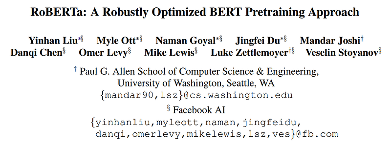
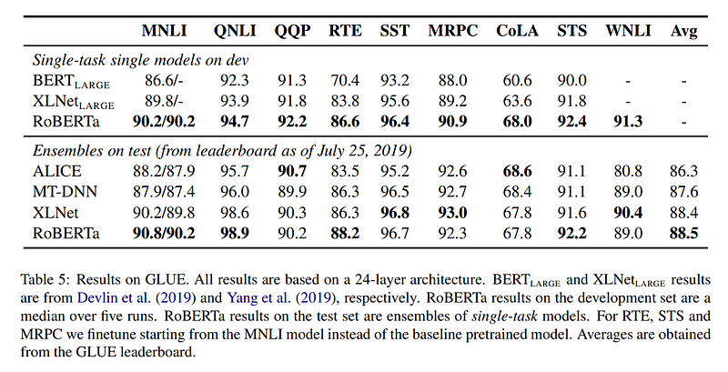

# Papers Explained 03 - RoBERTa

RoBERTa presents a replication study of BERT pretraining that carefully measures the impact of many key hyperparameters and training data size. It is found that BERT was significantly undertrained, and can match or exceed the performance of every model published after it.

This page ingests the source article into the wiki and connects it to [[Papers Explained Corpus]], [[Large Language Models]], [[Synthetic Data]].

## Source Metadata

- Source file: `raw/2023-02-06_Papers-Explained-03--RoBERTa-81db014e35b9.html`
- Source title: Papers Explained 03: RoBERTa
- Published: 2023-02-06
- Canonical: [https://medium.com/@ritvik19/papers-explained-03-roberta-81db014e35b9](https://medium.com/@ritvik19/papers-explained-03-roberta-81db014e35b9)

## Key Ideas

- RoBERTa presents a replication study of BERT pretraining that carefully measures the impact of many key hyperparameters and training data size.
- RoBERTa primarily follow the original BERT optimization hyperparameters, except for the peak learning rate and number of warmup steps, which are tuned separately for each setting.
- It was additionally found that training is highly sensitive to the Adam epsilon term. In some cases, better performance or improved stability was achieved after tuning it.
- RoBERTa consider five English-language corpora of varying sizes and domains, totaling over 160GB of uncompressed text:
- BOOKCORPUS plus English WIKIPEDIA. This is the original data used to train BERT. (16GB).

## Notes

RoBERTa presents a replication study of BERT pretraining that carefully measures the impact of many key hyperparameters and training data size. It is found that BERT was significantly undertrained, and can match or exceed the performance of every model published after it.

RoBERTa primarily follow the original BERT optimization hyperparameters, except for the peak learning rate and number of warmup steps, which are tuned separately for each setting.

It was additionally found that training is highly sensitive to the Adam epsilon term. In some cases, better performance or improved stability was achieved after tuning it. Similarly, it was found that stability is enhanced when training with large batch sizes by setting β2 = 0.98. Pretraining is done with sequences of up to T = 512 tokens.

## Data

RoBERTa consider five English-language corpora of varying sizes and domains, totaling over 160GB of uncompressed text:

- BOOKCORPUS plus English WIKIPEDIA. This is the original data used to train BERT. (16GB).

- CC-NEWS, which we collected from the English portion of the CommonCrawl News dataset. The data contains 63 million English news articles crawled between September 2016 and February 2019. (76GB after filtering).

- OPENWEBTEXT, an open-source recreation of the WebText corpus. The text is web content extracted from URLs shared on Reddit with at least three upvotes. (38GB).

- STORIES, a dataset containing a subset of CommonCrawl data filtered to match the story-like style of Winograd schemas. (31GB).

## Training Procedure Analysis

Static vs Dynamic Masking

The original BERT implementation performed masking once during data preprocessing, resulting in a single static mask.

To avoid using the same mask for each training instance in every epoch, training data was duplicated 10 times so that each sequence is masked in 10 different ways over the 40 epochs of training.

RoBERTa compare this strategy with dynamic masking where we generate the masking pattern every time we feed a sequence to the model.

Training with large batches

BERTBASE for 1M steps with a batch size of 256 sequences. This is equivalent in computational cost, via gradient accumulation, to training for 125K steps with a batch size of 2K sequences, or for 31K steps with a batch size of 8K.

RoBERTa observe that training with large batches improves perplexity for the masked language modeling objective, as well as end-task accuracy.

Text Encoding

The original BERT implementation uses a character-level BPE vocabulary of size 30K, which is learned after preprocessing the input with heuristic tokenization rules.

RoBERTa instead consider training BERT with a larger byte-level BPE vocabulary containing 50K subword units, without any additional preprocessing or tokenization of the input.

This adds approximately 15M and 20M additional parameters for BERTBASE and BERTLARGE, respectively.

All these improvements are aggregated and evaluated for their combined impact, and this configuration is called RoBERTa for Robustly optimized BERT approach.

## Results

## Paper

RoBERTa: A Robustly Optimized BERT Pretraining Approach [1907.11692](https://arxiv.org/abs/1907.11692)

## Figures

Figures from the Medium HTML export (`raw/2023-02-06_Papers-Explained-03--RoBERTa-81db014e35b9.html`); local copies under `wiki/assets/papers-explained-03-roberta/` when download succeeded.

| Figure | Caption |
|--------|---------|
|  | Title and author block of *RoBERTa: A Robustly Optimized BERT Pretraining Approach*. |
|  | GLUE results table comparing RoBERTa against BERT, XLNet, and leaderboard ensembles on dev/test splits. |
## Related

- [[Papers Explained Corpus]]
- [[Large Language Models]]
- [[Synthetic Data]]
- [[Papers Explained 02 - BERT]]
- [[Papers Explained 04 - Sentence BERT]]

#summary #topic
