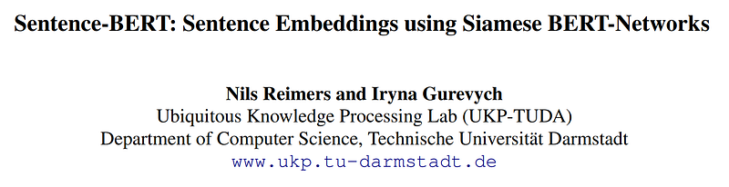
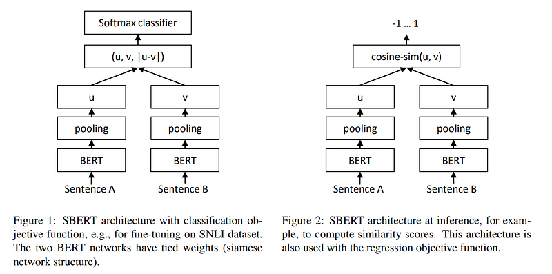
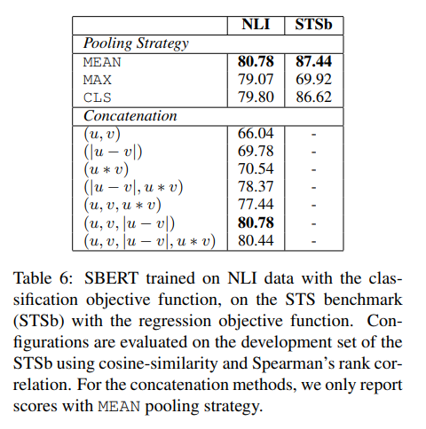

# Papers Explained 04 - Sentence BERT

BERT and RoBERTa require that both sentences are fed into the network, which causes a massive computational overhead: Finding the most similar pair in a collection of 10,000 sentences requires about 50 million inference computations (~65 hours) with BERT.

This page ingests the source article into the wiki and connects it to [[Papers Explained Corpus]], [[Large Language Models]], [[Embedding and Retrieval]], [[Agentic AI]].

## Source Metadata

- Source file: `raw/2023-02-06_Papers-Explained-04--Sentence-BERT-5159b8e07f21.html`
- Source title: Papers Explained 04: Sentence BERT
- Published: 2023-02-06
- Canonical: [https://medium.com/@ritvik19/papers-explained-04-sentence-bert-5159b8e07f21](https://medium.com/@ritvik19/papers-explained-04-sentence-bert-5159b8e07f21)

## Key Ideas

- Sentence-BERT (SBERT), presents a modification of the pretrained BERT network that use siamese and triplet network structures to derive semantically meaningful sentence embeddings that can be compared using cosine-similarity.
- SBERT adds a pooling operation to the output of BERT / RoBERTa to derive a fixed sized sentence embedding. Three pooling strategies are experimented:
- Computing the mean of all output vectors (MEAN-strategy)
- Computing a max-over-time of the output vectors (MAX-strategy).
- In order to fine-tune BERT / RoBERTa, siamese and triplet networksare created to update the weights such that the produced sentence embeddings are semantically meaningful and can be compared with cosine-similarity.

## Notes

BERT and RoBERTa require that both sentences are fed into the network, which causes a massive computational overhead: Finding the most similar pair in a collection of 10,000 sentences requires about 50 million inference computations (~65 hours) with BERT. The construction of BERT makes it unsuitable for semantic similarity search as well as for unsupervised tasks like clustering.

Sentence-BERT (SBERT), presents a modification of the pretrained BERT network that use siamese and triplet network structures to derive semantically meaningful sentence embeddings that can be compared using cosine-similarity. This reduces the effort for finding the most similar pair from 65 hours with BERT / RoBERTa to about 5 seconds with SBERT, while maintaining the accuracy from BERT.

## Architecture

SBERT adds a pooling operation to the output of BERT / RoBERTa to derive a fixed sized sentence embedding. Three pooling strategies are experimented:

- Using the output of the CLS-token

- Computing the mean of all output vectors (MEAN-strategy)

- Computing a max-over-time of the output vectors (MAX-strategy).

The default configuration is MEAN

In order to fine-tune BERT / RoBERTa, siamese and triplet networksare created to update the weights such that the produced sentence embeddings are semantically meaningful and can be compared with cosine-similarity.

Classification Objective Function

The sentence embeddings u and v are concatenated with the element-wise difference |u−v| and multiplied with the trainable weight Wt and Cross-entropy loss is optimized:

Regression Objective Function

The cosine similarity between the two sentence embeddings u and v is computed and mean squared-error loss is used as the objective function.

Triplet Objective Function

Given an anchor sentence a, a positive sentence p, and a negative sentence n, triplet loss tunes the network such that the distance between a and p is smaller than the distance between a and n.

Mathematically, we minimize the following loss function:

## Training and Evaluation

SBERT is trained on the combination of the SNLI and the Multi-Genre NLI dataset. The SNLI is a collection of 570,000 sentence pairs annotated with the labels contradiction, eintailment, and neutral. MultiNLI contains 430,000 sentence pairs and covers a range of genres of spoken and written text.

The performance of SBERT is evaluated for common Semantic Textual Similarity (STS) tasks.

Cosine-similarity is used to compare the similarity between two sentence embeddings.

## Paper

Sentence-BERT: Sentence Embeddings using Siamese BERT-Networks [1908.10084](https://arxiv.org/abs/1908.10084)

## Figures

Figures from the Medium HTML export (`raw/2023-02-06_Papers-Explained-04--Sentence-BERT-5159b8e07f21.html`); local copies under `wiki/assets/papers-explained-04-sentence-bert/` when download succeeded.

| Figure | Caption |
|--------|---------|
|  | Title block of *Sentence-BERT: Sentence Embeddings using Siamese BERT-Networks*. |
|  | SBERT siamese architecture for training (classification objective) and inference (cosine similarity / regression objective). |
|  | Classification objective formulation combining sentence embeddings \(u\), \(v\), and \(|u-v|\). |
|  | Triplet-loss objective used to enforce \(d(a,p) < d(a,n)\) with margin. |
|  | Pooling/concatenation ablation table showing STS-B performance, with mean pooling as the strongest default. |
## Related

- [[Papers Explained Corpus]]
- [[Large Language Models]]
- [[Embedding and Retrieval]]
- [[Agentic AI]]
- [[Papers Explained 03 - RoBERTa]]
- [[Papers Explained 05 - Tiny BERT]]

#summary #topic
