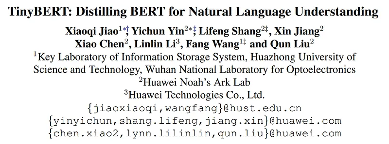
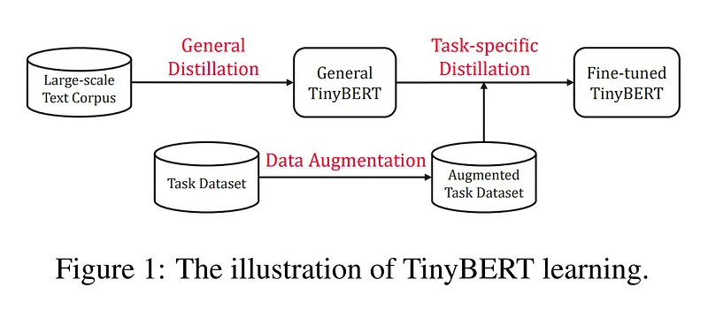
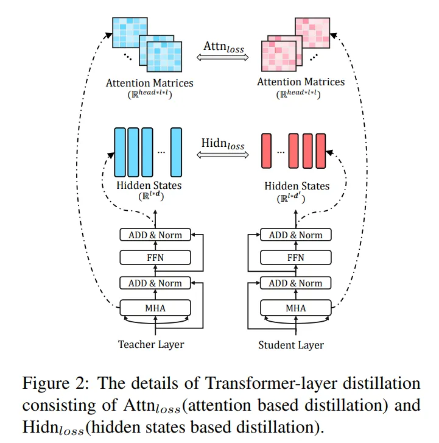
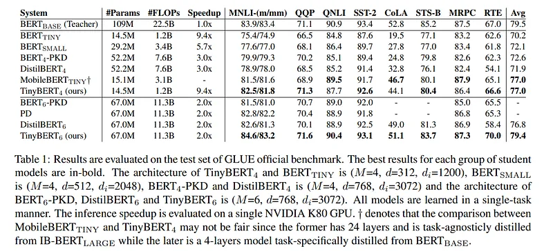

# Papers Explained 05 - Tiny BERT

Knowledge Distillation aims to transfer the knowledge of a large teacher network T to a small student network S. Let fT and fS represent the behavior functions of teacher and student networks, respectively.

This page ingests the source article into the wiki and connects it to [[Papers Explained Corpus]], [[Model Compression and Efficiency]], [[Large Language Models]], [[Synthetic Data]], [[Model Distillation]].

## Source Metadata

- Source file: `raw/2023-02-06_Papers-Explained-05--Tiny-BERT-5e36fe0ee173.md`
- Source title: Papers Explained 05: Tiny BERT
- Published: 2023-02-06
- Canonical: [https://medium.com/@ritvik19/papers-explained-05-tiny-bert-5e36fe0ee173](https://medium.com/@ritvik19/papers-explained-05-tiny-bert-5e36fe0ee173)

## Key Ideas

- In the context of Transformer distillation, the output of MHA layer or FFN layer, or some intermediate representations (such as the attention matrix A) can be used as behavior function.
- where L(·) is a loss function that evaluates the difference between teacher and student networks, x is the text input and X denotes the training dataset.
- Assuming that the student model has M Transformer layers and teacher model has N Transformer layers, we start with choosing M out of N layers from the teacher model for the Transformer-layer distillation.
- Thus, the student can acquire knowledge from the teacher by minimizing the following objective:
- where Llayer refers to the loss function of a given model layer. and λm is the hyperparameter that represents the importance of m-th layers’s distillation.

## Notes

Knowledge Distillation aims to transfer the knowledge of a large teacher network T to a small student network S. Let fT and fS represent the behavior functions of teacher and student networks, respectively.

In the context of Transformer distillation, the output of MHA layer or FFN layer, or some intermediate representations (such as the attention matrix A) can be used as behavior function. Formally, KD can be modeled as minimizing the following objective function:

where L(·) is a loss function that evaluates the difference between teacher and student networks, x is the text input and X denotes the training dataset.

Assuming that the student model has M Transformer layers and teacher model has N Transformer layers, we start with choosing M out of N layers from the teacher model for the Transformer-layer distillation. Then a function n = g(m) is defined as the mapping function between indices from student layers to teacher layers.

Thus, the student can acquire knowledge from the teacher by minimizing the following objective:

where Llayer refers to the loss function of a given model layer. and λm is the hyperparameter that represents the importance of m-th layers’s distillation.

Transformer Layer Distillation

where h is the number of attention heads and Ai refers to the attention matrix corresponding to the i-th head.

where the matrics HS and HT refer to hidden states of student and teacher networks respectively. The matrix Wh is a learnable linear transformation which transforms the hidden states of student network into the same space as the teacher network’s states.

Embedding Layer Distillation

where the matrices ES and ET refer to the embeddings of student and teacher networks, respectively. The matrix We is a linear transformation playing a similar role as Wh.

Prediction Layer Distillation

where ZT and zS are the logits vectors predicted by the student and teacher respectively and t means the temperature value. In the experiments, it was found that t = 1 performs well.

Unified Distillation Loss

Using the above distillation objectives, we can unify the distillation loss of the corresponding layers between the teacher and the student network:

## TinyBERT Learning

TinyBERT proposed a novel two-stage learning framework including the general distillation and the task-specific distillation.

General distillation helps TinyBERT learn the rich knowledge embedded in pre-trained BERT, which plays an important role in improving the generalization capability of TinyBERT. The task-specific distillation further teaches TinyBERT the knowledge from the fine-tuned BERT.

TinyBERT Settings

TinyBERT4

- Student: TinyBERT4 (M=4, d=312, d’=1200 h=12) has a total of 14.5M parameters

- Teacher: BERT BASE (M=12, d=768, d’=3072 h=12) has a total of 109M parameters

- g(m) = 3m, \lambda = 1λ=1

TinyBERT6

- Student: TinyBERT6 (M=6, d=768, d’=3072 h=12) has a total of 14.5M parameters

- Teacher: BERT BASE (M=12, d=768, d’=3072 h=12) has a total of 109M parameters

- g(m) = 2m, \lambda = 1λ=1

## Results

## Paper

TinyBERT: Distilling BERT for Natural Language Understanding [1909.10351](https://arxiv.org/abs/1909.10351)

## Figures

Figures from the Medium HTML export (`raw/2023-02-06_Papers-Explained-05--Tiny-BERT-5e36fe0ee173.md`); local copies under `wiki/assets/papers-explained-05-tiny-bert/` when download succeeded.

| Figure | Caption |
|--------|---------|
|  | Title block of *TinyBERT: Distilling BERT for Natural Language Understanding*. |
|  | Two-stage TinyBERT pipeline: general distillation, data augmentation, and task-specific distillation. |
|  | Core knowledge-distillation objective matching teacher and student behavior on pretraining data. |
|  | Layer-mapped distillation objective across student/teacher Transformer depths. |
|  | Transformer-layer distillation details: attention-matrix loss and hidden-state loss between teacher and student layers. |
|  | Attention distillation loss formulation over per-head attention matrices. |
|  | Hidden-state distillation loss with student-to-teacher projection matrix \(W_h\). |
|  | Embedding-layer distillation loss with embedding projection matrix \(W_e\). |
|  | Prediction-layer distillation objective with temperature-scaled logits. |
|  | Unified TinyBERT distillation loss combining embedding, layer, and prediction objectives. |
|  | GLUE benchmark comparison vs BERT-base and compact baselines, showing strong TinyBERT4/6 efficiency-accuracy tradeoffs. |
## Related

- [[Papers Explained Corpus]]
- [[Model Compression and Efficiency]]
- [[Large Language Models]]
- [[Synthetic Data]]
- [[Model Distillation]]
- [[Papers Explained 04 - Sentence BERT]]
- [[Papers Explained 06 - Distil BERT]]

#summary #topic
