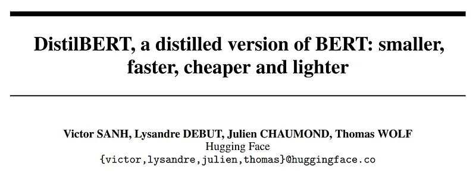
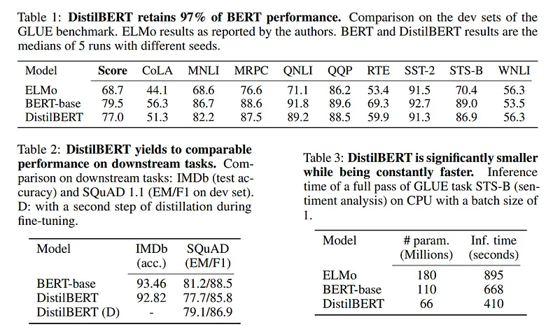

# Papers Explained 06 - Distil BERT

Knowledge distillation is a compression technique in which a compact model (the student) is trained to reproduce the behaviour of a larger model, (the teacher) or an ensemble of models.

This page ingests the source article into the wiki and connects it to [[Papers Explained Corpus]], [[Model Compression and Efficiency]], [[Large Language Models]], [[Embedding and Retrieval]], [[Model Distillation]].

## Source Metadata

- Source file: `raw/2023-02-06_Papers-Explained-06--Distil-BERT-6f138849f871.md`
- Source title: Papers Explained 06: Distil BERT
- Published: 2023-02-06
- Canonical: [https://medium.com/@ritvik19/papers-explained-06-distil-bert-6f138849f871](https://medium.com/@ritvik19/papers-explained-06-distil-bert-6f138849f871)

## Key Ideas

- The student is trained with a distillation loss over the soft target probabilities of the teacher:
- where ti and si are the probabilities estimated by teacher and student respectively.
- where T controls the smoothness of the output distribution and zi is the model score for the class i.
- The same temperature T is applied to the student and the teacher at training time, while at inference, T is set to 1 to recover a standard softmax.
- The final training objective is a linear combination of the distillation loss Lce with the supervised training loss, in DistilBERT the masked language modeling loss Lmlm.

## Notes

Knowledge distillation is a compression technique in which a compact model (the student) is trained to reproduce the behaviour of a larger model, (the teacher) or an ensemble of models.

Training Loss

The student is trained with a distillation loss over the soft target probabilities of the teacher:

where ti and si are the probabilities estimated by teacher and student respectively.

DistilBERT uses a softmax temperature:

where T controls the smoothness of the output distribution and zi is the model score for the class i.

The same temperature T is applied to the student and the teacher at training time, while at inference, T is set to 1 to recover a standard softmax.

The final training objective is a linear combination of the distillation loss Lce with the supervised training loss, in DistilBERT the masked language modeling loss Lmlm. It is found beneficial to add a cosine embedding loss (Lcos) which will tend to align the directions of the student and teacher hidden states vectors.

Student Architecture

DistilBERT has the same general architecture as BERT. The token-type embeddings and the pooler are removed while the number of layers is reduced by a factor of 2.

Taking advantage of the common dimensionality between teacher and student networks, DistilBERT is initialised from BERT by taking one layer out of two.

DistilBERT is distilled on very large batches leveraging gradient accumulation (up to 4K examples per batch) using dynamic masking and without the next sentence prediction objective on the same corpus as the original BERT model.

## Results

## DistilRoBERTa

DistilRoBERTa is a distilled version of the RoBERTa-base model, designed to be smaller, faster, and more efficient while retaining a significant portion of the original model’s performance.

Model Architecture: DistilRoBERTa adopts the Transformer architecture, similar to its parent model, RoBERTa. However, it reduces the number of layers to 6, compared to 12 in RoBERTa-base, resulting in a model with 82 million parameters, significantly less than RoBERTa-base’s 125 million parameters. This reduction in layers and parameters makes DistilRoBERTa approximately twice as fast as RoBERTa-base while maintaining a balance between size and performance.

Training Data: While RoBERTa was trained on a massive dataset, DistilRoBERTa was trained on the OpenWebTextCorpus, a reproduction of OpenAI’s WebText dataset. This dataset is approximately four times smaller than the one used to train RoBERTa. Despite training on less data, DistilRoBERTa manages to capture a significant amount of the knowledge from its teacher model.

Case Sensitivity: Unlike some language models that treat uppercase and lowercase letters the same, DistilRoBERTa is case-sensitive. This means it distinguishes between words like “english” and “English,” allowing it to capture nuances in meaning that might be lost in case-insensitive models.

## Paper

DistilBERT, a distilled version of BERT: smaller, faster, cheaper and lighter [1910.01108](https://arxiv.org/abs/1910.01108)

## Figures

Figures from the Medium HTML export (`raw/2023-02-06_Papers-Explained-06--Distil-BERT-6f138849f871.md`); local copies under `wiki/assets/papers-explained-06-distil-bert/` when download succeeded.

| Figure | Caption |
|--------|---------|
|  | Title block of *DistilBERT, a distilled version of BERT: smaller, faster, cheaper and lighter*. |
|  | Distillation cross-entropy loss over teacher and student soft targets. |
|  | Temperature-scaled softmax and the combined DistilBERT pretraining objective (MLM + distillation + cosine alignment). |
|  | DistilBERT results summary: GLUE retention, downstream IMDb/SQuAD performance, and inference-time/parameter-size comparisons. |
## Related

- [[Papers Explained Corpus]]
- [[Model Compression and Efficiency]]
- [[Large Language Models]]
- [[Embedding and Retrieval]]
- [[Model Distillation]]
- [[Papers Explained 05 - Tiny BERT]]
- [[Papers Explained 07 - ALBERT]]

#summary #topic
