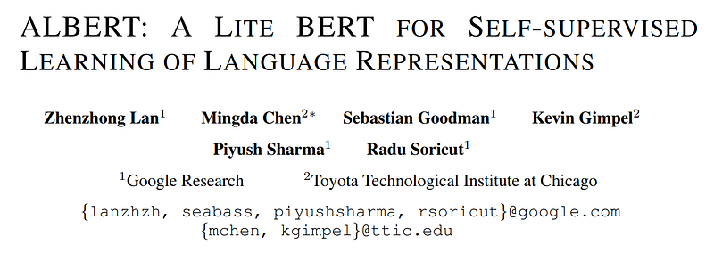
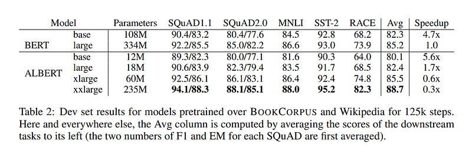

# Papers Explained 07 - ALBERT

ALBERT presents certain parameter reduction techniques to lower memory consumption and increase the training speed of BERT

This page ingests the source article into the wiki and connects it to [[Papers Explained Corpus]], [[Large Language Models]], [[Embedding and Retrieval]], [[Model Compression and Efficiency]].

## Source Metadata

- Source file: `raw/2023-02-06_Papers-Explained-07--ALBERT-46a2a0563693.html`
- Source title: Papers Explained 07: ALBERT
- Published: 2023-02-06
- Canonical: [https://medium.com/@ritvik19/papers-explained-07-albert-46a2a0563693](https://medium.com/@ritvik19/papers-explained-07-albert-46a2a0563693)

## Key Ideas

- The backbone of the ALBERT architecture is similar to BERT in that it uses a transformer encoder with GELU nonlinearities. ALBERT uses the feed-forward/filter size as 4H and the number of attention heads as H/64. where H is the hidden size in BERT.
- Similar to BERT, all the experiments with ALBERT use a vocabulary size V of 30,000.
- In BERT, as well as subsequent modeling improvements the WordPiece embedding size E is tied with the hidden layer size H, i.e., E ≡ H. This decision appears suboptimal:
- From a modeling perspective, WordPiece embeddings are meant to learn context-independent representations, whereas hidden-layer embeddings are meant to learn context-dependent representations.
- From a practical perspective, natural language processing usually require the vocabulary size V to be large. If E ≡ H, then increasing H increases the size of the embedding matrix, which has size V ×E.

## Notes

ALBERT presents certain parameter reduction techniques to lower memory consumption and increase the training speed of BERT

Model Architecture Choice

The backbone of the ALBERT architecture is similar to BERT in that it uses a transformer encoder with GELU nonlinearities. ALBERT uses the feed-forward/filter size as 4H and the number of attention heads as H/64. where H is the hidden size in BERT.

Similar to BERT, all the experiments with ALBERT use a vocabulary size V of 30,000.

Factorized Embedding Parameterization

In BERT, as well as subsequent modeling improvements the WordPiece embedding size E is tied with the hidden layer size H, i.e., E ≡ H. This decision appears suboptimal:

From a modeling perspective, WordPiece embeddings are meant to learn context-independent representations, whereas hidden-layer embeddings are meant to learn context-dependent representations. untying the WordPiece embedding size E from the hidden layer size H allows us to make a more efficient usage of the total model parameters as informed by modeling needs, which dictate that H >> E.

From a practical perspective, natural language processing usually require the vocabulary size V to be large. If E ≡ H, then increasing H increases the size of the embedding matrix, which has size V ×E. This can easily result in a model with billions of parameters, most of which are only updated sparsely during training.

Therefore, for ALBERT, a factorization of the embedding parameters is used, decomposing them into two smaller matrices. Instead of projecting the one-hot vectors directly into the hidden space of size H, we first project them into a lower dimensional embedding space of size E, and then project it to the hidden space. By using this decomposition, we reduce the embedding parameters from O(V × H) to O(V × E + E × H). This parameter reduction is significant when H >> E.

Cross-Layer Parameter Sharing

ALBERT proposes cross-layer parameter sharing as another way to improve parameter efficiency. There are multiple ways to share parameters, e.g., only sharing feed-forward network (FFN) parameters across layers, or only sharing attention parameters. The default decision for ALBERT is to share all parameters across layers.

Inter-Sentence Coherence Loss

In addition to the masked language modeling (MLM) loss, BERT uses an additional loss called next-sentence prediction (NSP). Subsequent studies found NSP’s impact unreliable and decided to eliminate it, a decision supported by an improvement in downstream task performance across several tasks.

ALBERT conjecture that the main reason behind NSP’s ineffectiveness is its lack of difficulty as a task.

That is, for ALBERT, sentence-order prediction (SOP) loss is used. The SOP loss uses as positive examples the same technique as BERT (two consecutive segments from the same document), and as negative examples the same two consecutive segments but with their order swapped. This forces the model to learn finer-grained distinctions about discourse-level coherence properties.

## Model Setup

ALBERT-large has about 18x fewer parameters compared to BERT-large, 18M versus 334M.

An ALBERT-xlarge configuration with H = 2048 has only 60M parameters.

ALBERT-xxlarge configuration with H = 4096 has 233M parameters, i.e., around 70% of BERTlarge’s parameters

To keep the comparison as meaningful as possible, we follow the BERT setup in using the BOOKCORPUS and English Wikipedia for pretraining baseline models.

## Results

## Paper

ALBERT: A Lite BERT for Self-supervised Learning of Language Representations [1909.11942](https://arxiv.org/abs/1909.11942)

## Figures

Figures from the Medium HTML export (`raw/2023-02-06_Papers-Explained-07--ALBERT-46a2a0563693.html`); local copies under `wiki/assets/papers-explained-07-albert/` when download succeeded.

| Figure | Caption |
|--------|---------|
|  | Title and author block of *ALBERT: A Lite BERT for Self-supervised Learning of Language Representations*. |
|  | Dev-set comparison table for BERT vs ALBERT sizes showing parameter reductions with strong downstream accuracy. |
## Related

- [[Papers Explained Corpus]]
- [[Large Language Models]]
- [[Embedding and Retrieval]]
- [[Model Compression and Efficiency]]
- [[Papers Explained 06 - Distil BERT]]
- [[Papers Explained 08 - DeBERTa]]

#summary #topic
