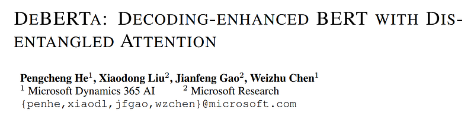
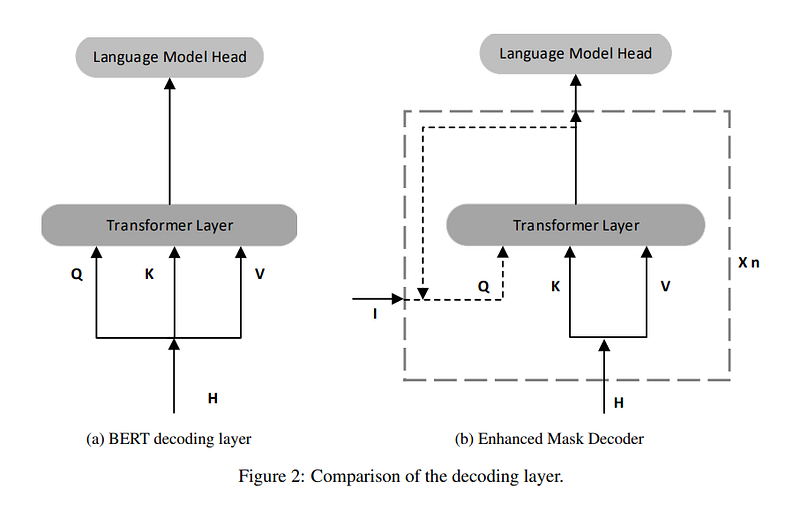

# Papers Explained 08 - DeBERTa

DeBERTa (Decoding-enhanced BERT with disentangled attention) improves the BERT and RoBERTa models using two novel techniques.

This page ingests the source article into the wiki and connects it to [[Papers Explained Corpus]], [[Large Language Models]], [[Supervised Fine-Tuning]].

## Source Metadata

- Source file: `raw/2023-02-06_Papers-Explained-08--DeBERTa-a808d9b2c52d.html`
- Source title: Papers Explained 08: DeBERTa
- Published: 2023-02-06
- Canonical: [https://medium.com/@ritvik19/papers-explained-08-deberta-a808d9b2c52d](https://medium.com/@ritvik19/papers-explained-08-deberta-a808d9b2c52d)

## Key Ideas

- The first is the disentangled attention mechanism, where each word is represented using two vectors that encode its content and position, respectively, and the attention weights among words are computed using disentangled matrices on their contents and...
- Second, an enhanced mask decoder is used to incorporate absolute positions in the decoding layer to predict the masked tokens in model pre-training.
- In addition, a new virtual adversarial training method is used for fine-tuning to improve models’ generalization.
- For a token at position i in a sequence, we represent it using two vectors, {Hi} and {Pi,j}, which represent its content and relative position with the token at position j, respectively.
- That is, the attention weight of a word pair can be computed as a sum of four attention scores using disentangled matrices on their contents and positions as content-to-content, content-to-position, position-to-content, and position-to-position.

## Notes

DeBERTa (Decoding-enhanced BERT with disentangled attention) improves the BERT and RoBERTa models using two novel techniques.

- The first is the disentangled attention mechanism, where each word is represented using two vectors that encode its content and position, respectively, and the attention weights among words are computed using disentangled matrices on their contents and relative positions, respectively.

- Second, an enhanced mask decoder is used to incorporate absolute positions in the decoding layer to predict the masked tokens in model pre-training.

- In addition, a new virtual adversarial training method is used for fine-tuning to improve models’ generalization.

Disentagled Attention

Unlike BERT where each word in the input layer is represented using a vector which is the sum of its word (content) embedding and position embedding, each word in DeBERTa is represented using two vectors that encode its content and position, respectively, and the attention weights among words are computed using disentangled matrices based on their contents and relative positions, respectively. This is motivated by the observation that the attention weight of a word pair depends on not only their contents but their relative positions.

For a token at position i in a sequence, we represent it using two vectors, {Hi} and {Pi,j}, which represent its content and relative position with the token at position j, respectively. The calculation of the cross attention score between tokens i and j can be decomposed into four components as:

That is, the attention weight of a word pair can be computed as a sum of four attention scores using disentangled matrices on their contents and positions as content-to-content, content-to-position, position-to-content, and position-to-position.

Taking single-head attention as an example, the standard self-attention operation can be formulated as:

Denote k as the maximum relative distance, δ as the relative distance from token i to token j, which is defined as:

The disentangled self-attention with relative position bias as can be represented as

Enhanced Mask Decoder

DeBERTa incorporates absolute word position embeddings right before the softmax layer where the model decodes the masked words based on the aggregated contextual embeddings of word contents and positions.

There are two methods of incorporating absolute positions. The BERT model incorporates absolute positions in the input layer. In DeBERTa, these are incorporated right after all the Transformer layers but before the softmax layer for masked token prediction. In this way, DeBERTa captures the relative positions in all the Transformer layers and only uses absolute positions as complementary information when decoding the masked words. Thus, we call DeBERTa’s decoding component an Enhanced Mask Decoder (EMD).

Scale Invariant Fine Tuning

SiFT is a new virtual adversarial training algorithm that improves the training stability by applying the perturbations to the normalized word embeddings.

Specifically, when fine-tuning DeBERTa to a downstream NLP task in the experiments, SiFT first normalizes the word embedding vectors into stochastic vectors, and then applies the perturbation to the normalized embedding vectors. It was found that the normalization substantially improves the performance of the fine-tuned models. The improvement is more prominent for larger DeBERTa models.

## DeBERTa v2

> Vocabulary In v2 the tokenizer is changed to use a new vocabulary of size 128K built from the training data. Instead of a GPT2-based tokenizer, the tokenizer is now sentencepiece-based tokenizer.

> nGiE(nGram Induced Input Encoding) The DeBERTa-v2 model uses an additional convolution layer aside with the first transformer layer to better learn the local dependency of input tokens.

> Sharing position projection matrix with content projection matrix in attention layer Based on previous experiments, this can save parameters without affecting the performance.

> Apply bucket to encode relative positions The DeBERTa-v2 model uses log bucket to encode relative positions similar to T5.

> 900M model & 1.5B model Two additional model sizes are available: 900M and 1.5B, which significantly improves the performance of downstream tasks.

Source: https://huggingface.co/docs/transformers/model_doc/deberta-v2

## Paper

DeBERTa: Decoding-enhanced BERT with Disentangled Attention [2006.03654](https://arxiv.org/abs/2006.03654)

## Figures

Figures from the Medium HTML export (`raw/2023-02-06_Papers-Explained-08--DeBERTa-a808d9b2c52d.html`); local copies under `wiki/assets/papers-explained-08-deberta/` when download succeeded.

| Figure | Caption |
|--------|---------|
|  | Title block of *DeBERTa: Decoding-enhanced BERT with Disentangled Attention*. |
|  | Disentangled attention definition: sum of content-to-content, content-to-position, and position-aware interaction terms. |
|  | Relative position indexing term \( \delta(i,j) \) used by DeBERTa’s disentangled attention. |
|  | Standard single-head self-attention formulation used as the baseline reference. |
|  | Disentangled self-attention equation with explicit relative-position bias term. |
|  | Scale-invariant fine-tuning step: normalize word embeddings before perturbation. |
|  | Normalized embedding representation used in SiFT adversarial training. |
|  | Adversarial perturbation objective on normalized embeddings for stable fine-tuning. |
|  | Combined fine-tuning loss integrating task objective with scale-invariant perturbation regularization. |
|  | Decoding-layer comparison: BERT mask decoder vs DeBERTa Enhanced Mask Decoder (EMD). |
## Related

- [[Papers Explained Corpus]]
- [[Large Language Models]]
- [[Supervised Fine-Tuning]]
- [[Papers Explained 07 - ALBERT]]
- [[Papers Explained 09 - BART]]

#summary #topic
