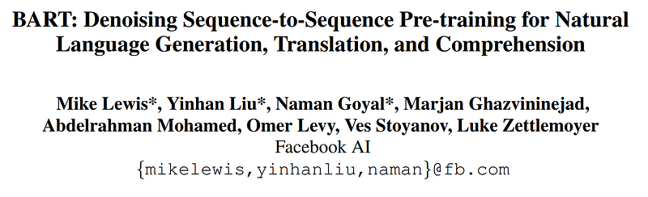
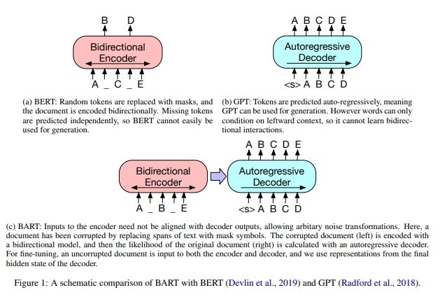
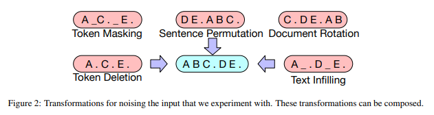
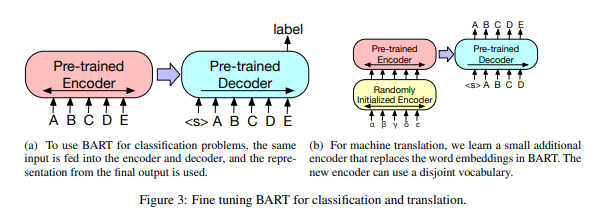

# Papers Explained 09 - BART

BART is a denoising autoencoder built with a sequence-to-sequence model that is applicable to a very wide range of end tasks. Pretraining has two stages (1) text is corrupted with an arbitrary noising function, and (2) a sequence-to-sequence model is learned to reconstruct the original text.

This page ingests the source article into the wiki and connects it to [[Papers Explained Corpus]], [[Large Language Models]], [[Document AI]].

## Source Metadata

- Source file: `raw/2023-02-06_Papers-Explained-09--BART-7f56138175bd.html`
- Source title: Papers Explained 09: BART
- Published: 2023-02-06
- Canonical: [https://medium.com/@ritvik19/papers-explained-09-bart-7f56138175bd](https://medium.com/@ritvik19/papers-explained-09-bart-7f56138175bd)

## Key Ideas

- BART is a denoising autoencoder built with a sequence-to-sequence model that is applicable to a very wide range of end tasks.
- BART uses the standard sequence-to-sequence Transformer architecture, except, following GPT, that ReLU activation functions are modified to GeLUs and parameters initialised from N (0, 0.02).
- For the base model, 6 layers are used in encoder and decoder, and for large model 12 layers are used in each. In total, BART contains roughly 10% more parameters than the equivalently sized BERT model.
- BART is trained by corrupting documents and then optimizing a reconstruction loss: the cross-entropy between the decoder’s output and the original document. The transformations we used are summarized below:
- Token Masking: Following BERT, random tokens are sampled and replaced with [MASK] elements.

## Notes

BART is a denoising autoencoder built with a sequence-to-sequence model that is applicable to a very wide range of end tasks. Pretraining has two stages (1) text is corrupted with an arbitrary noising function, and (2) a sequence-to-sequence model is learned to reconstruct the original text. This approach generalizes the original word masking and next sentence prediction objectives in BERT by forcing the model to reason more about overall sentence length and make longer range transformations to the input.

## Architecture

BART uses the standard sequence-to-sequence Transformer architecture, except, following GPT, that ReLU activation functions are modified to GeLUs and parameters initialised from N (0, 0.02).

For the base model, 6 layers are used in encoder and decoder, and for large model 12 layers are used in each. In total, BART contains roughly 10% more parameters than the equivalently sized BERT model.

## Pre Training

BART is trained by corrupting documents and then optimizing a reconstruction loss: the cross-entropy between the decoder’s output and the original document. The transformations we used are summarized below:

- Token Masking: Following BERT, random tokens are sampled and replaced with [MASK] elements.

- Token Deletion: Random tokens are deleted from the input. In contrast to token masking, the model must decide which positions are missing inputs.

- Text Infilling: A number of text spans are sampled, with span lengths drawn from a Poisson distribution
(λ = 3). Each span is replaced with a single [MASK] token.

- Sentence Permutation A document is divided into sentences based on full stops, and these sentences are
shuffled in a random order.

- Document Rotation A token is chosen uniformly at random, and the document is rotated so that it begins
with that token. This task trains the model to identify the start of the document.

## Fine Tuning

- Sequence Classification Tasks: For sequence classification tasks, the same input is fed into the encoder and decoder, and the final hidden state of the final decoder token is fed into new multi-class linear classifier. This approach is related to the CLS token in BERT; however we add the additional token to the end so that representation for the token in the decoder can attend to decoder states from the complete input.

- Token Classification Tasks: For token classification tasks, such as answer endpoint classification for SQuAD, we feed the complete document into the encoder and decoder, and use the top hidden state of the decoder as a representation for each word. This representation is used to classify the token.

- Sequence Generation Tasks: Because BART has an autoregressive decoder, it can be directly fine tuned for sequence generation tasks such as abstractive question answering and summarization. In both of these tasks, information is copied from the input but manipulated, which is closely related to the denoising pre-training objective. Here, the encoder input is the input sequence, and the decoder generates outputs autoregressively.

- Machine Translation: BART’s encoder embedding layer is replaced with a new randomly initialized encoder. The model is trained end-to-end, which trains the new encoder to map foreign words into an input that BART can de-noise to English. The new encoder can use a separate vocabulary from the original BART model.
The source encoder is trained in two steps, in both cases backpropagating the cross-entropy loss from the
output of the BART model. In the first step, most of BART parameters are frozen and only update the randomly initialized source encoder, the BART positional embeddings, and the self-attention input projection matrix of BART’s encoder first layer. In the second step, all model parameters are trained for a small number of iterations.

## Tasks

- SQuAD: an extractive question answering task on Wikipedia paragraphs. Answers are text spans extracted from a given document context.

- MNLI: a bitext classification task to predict whether one sentence entails another. The fine-tuned model concatenates the two sentences with appended an EOS token, and passes them to both the BART encoder and decoder. In contrast to BERT, the representation of the EOS token is used to classify the sentences relations.

- ELI5: a long-form abstractive question answering dataset. Models generate answers conditioned on the concatenation of a question and supporting documents.

- XSum: a news summarization dataset with highly abstractive summaries.

- ConvAI2: a dialogue response generation task, conditioned on context and a persona.

- CNN/DM: a news summarization dataset. Summaries here are typically closely related to source sentences.

## Paper

BART: Denoising Sequence-to-Sequence Pre-training for Natural Language Generation, Translation, and Comprehension [1910.13461](https://arxiv.org/abs/1910.13461)

## Figures

Figures from the Medium HTML export (`raw/2023-02-06_Papers-Explained-09--BART-7f56138175bd.html`); local copies under `wiki/assets/papers-explained-09-bart/` when download succeeded.

| Figure | Caption |
|--------|---------|
|  | Title block of *BART: Denoising Sequence-to-Sequence Pre-training for Natural Language Generation, Translation, and Comprehension*. |
|  | BART schematic vs BERT and GPT, showing bidirectional encoder + autoregressive decoder with corrupted-input reconstruction. |
|  | Input noising transformations used in BART pretraining: token masking/deletion, text infilling, sentence permutation, and document rotation. |
|  | Fine-tuning setups for BART on classification and machine translation with an added source encoder. |
## Related

- [[Papers Explained Corpus]]
- [[Large Language Models]]
- [[Document AI]]
- [[Papers Explained 08 - DeBERTa]]
- [[Papers Explained 10 - Layout LM]]

#summary #topic
