# Papers Explained 100 - CLIP

CLIP is pre-trained on a large dataset of 400M (image, text) pairs from the internet, instead of relying on fixed sets of predetermined object categories. The model learns powerful image representations, and natural language is used to reference or describe visual concepts, enabling zero-shot transfer to various downstream tasks.

This page ingests the source article into the wiki and connects it to [[Papers Explained Corpus]], [[Vision Language Models]], [[Synthetic Data]], [[Computer Vision]], [[Large Language Models]], [[Embedding and Retrieval]].

## Source Metadata

- Source file: `raw/2024-02-14_Papers-Explained-100--CLIP-f9873c65134.md`
- Source title: Papers Explained 100: CLIP
- Published: 2024-02-14
- Canonical: [https://medium.com/@ritvik19/papers-explained-100-clip-f9873c65134](https://medium.com/@ritvik19/papers-explained-100-clip-f9873c65134)

## Key Ideas

- CLIP is pre-trained on a large dataset of 400M (image, text) pairs from the internet, instead of relying on fixed sets of predetermined object categories.
- The approach is zero-shot evaluated on over 30 different computer vision datasets, demonstrating competitive performance with fully supervised baselines.
- The core idea of the approach is to learn perception from natural language supervision.
- The datasets MS-COCO, Visual Genome, and YFCC100M have been used in existing work, but they have limitations in terms of size and metadata quality.
- Jointly training an image CNN and text transformer from scratch to predict the caption of an image, would be very difficult as it may require huge amount of compute, and predicting the exact text of an image is also very difficult due to a wide variety of...

## Notes

CLIP is pre-trained on a large dataset of 400M (image, text) pairs from the internet, instead of relying on fixed sets of predetermined object categories. The model learns powerful image representations, and natural language is used to reference or describe visual concepts, enabling zero-shot transfer to various downstream tasks.

The approach is zero-shot evaluated on over 30 different computer vision datasets, demonstrating competitive performance with fully supervised baselines.

## Approach

*Figure: Summary of CLIP approach.*

The core idea of the approach is to learn perception from natural language supervision. Various methods have been introduced for learning visual representations from text and images, each described as unsupervised, self-supervised, weakly supervised, or supervised, but they all share the commonality of learning from natural language.

The datasets MS-COCO, Visual Genome, and YFCC100M have been used in existing work, but they have limitations in terms of size and metadata quality. To overcome these limitations, a new dataset called WIT (WebImageText) was constructed, consisting of 400 million (image, text) pairs collected from various publicly available sources on the internet, whose text includes one of a set of 500,000 queries, providing a large quantity of data for natural language supervision.

Jointly training an image CNN and text transformer from scratch to predict the caption of an image, would be very difficult as it may require huge amount of compute, and predicting the exact text of an image is also very difficult due to a wide variety of descriptions.

Therefore CLIP is trained on a Contrastive learning task, ie Given a batch of N (image, text) pairs, CLIP is trained to predict which of the N × N possible (image, text) pairings across a batch actually occurred.

CLIP is trained from scratch without initializing the image encoder with ImageNet weights or the text encoder with pre-trained weights, also a linear projection is used to map from each encoders’ representation to multimodal embedding space.

## Models

Two different architectures are considered for the Image Encoder:

First, ResNet-50, several modifications are made to the original version, using ResNet-D improvements and the antialiased rect-2 blur pooling. The global average pooling is replaced with an attention pooling mechanism.

The attention pooling is implemented as a single layer of transformer-style multi-head QKV attention, where the query is conditioned on the global average-pooled representation of the image.

Second, Vision Transformer, minor modifications are made such as adding an additional layer normalization to the combined patch and position embeddings before the transformer and using a slightly different initialization scheme.

The Text Encoder is a 63M parameter Transformer with 12 layers and 512 wide with 8 attention heads. The transformer operates on a lower-cased byte pair encoding (BPE) representation of the text with a 49,152 vocab size. For computational efficiency, the max sequence length was capped at 76. The text sequence is bracketed with [SOS] and [EOS] tokens and the activations of the highest layer of the transformer at the [EOS] token are treated as the feature representation of the text which is layer normalized and then linearly projected into the multi-modal embedding space.

## Training

*Figure: Numpy-like pseudocode for the core of an implementation of CLIP.*

A series of 5 ResNets and 3 Vision Transformers are trained.

For the ResNets, a ResNet-50, a ResNet-101, and 3 more are trained, which follow EfficientNet-style model scaling and use approximately 4x, 16x, and 64x the compute of a ResNet-50. They are denoted as RN50x4, RN50x16, and RN50x64, respectively.

For the Vision Transformers, a ViT-B/32, a ViT-B/16, and a ViT-L/14 are trained. All models are trained for 32 epochs.

For the ViT-L/14, it is also pre-trained at a higher 336-pixel resolution for one additional epoch to boost performance. This model is denoted as ViT-L/14@336px. Unless otherwise specified, all results reported in this paper as “CLIP” use this model, which is found to perform best.

## Experiments

### Initial Comparison to Visual N Grams

*Figure: Comparing CLIP to prior zero-shot transfer image classification results.*

CLIP improves performance on all three datasets by a large amount. This improvement reflects many differences in the 4 years since the development of Visual N-Grams.

### Prompt Engineering and Ensembling

*Figure: Prompt engineering and ensembling improve zeroshot performance.*

Compared to the baseline of using contextless class names, prompt engineering and ensembling boost zero-shot classification performance by almost 5 points on average across 36 datasets. This improvement is similar to the gain from using 4 times more compute with the baseline zero-shot method but is “free” when amortized over many predictions.

### Analysis of Zero Shot CLIP Performance

*Figure: Zero-shot CLIP is competitive with a fully supervised baseline.*

Across a 27 dataset eval suite, a zero-shot CLIP classifier outperforms a fully supervised linear classifier fitted on ResNet-50 features on 16 datasets, including ImageNet.

*Figure: Zero-shot CLIP outperforms few-shot linear probes.*

Zero-shot CLIP matches the average performance of a 4-shot linear classifier trained on the same feature space and nearly matches the best results of a 16-shot linear classifier across publicly available models. For both BiT-M and SimCLRv2, the best performing model is highlighted. Light gray lines are other models in the eval suite. The 20 datasets with at least 16 examples per class were used in this analysis.

*Figure: The data efficiency of zero-shot transfer varies widely.*

Calculating the number of labeled examples per class a linear classifier on the same CLIP feature space requires to match the performance of the zero-shot classifier contextualizes the effectiveness of zero-shot transfer. Values are estimated based on log-linear interpolation of 1, 2, 4, 8, 16-shot and fully supervised results. Performance varies widely from still underperforming a one-shot classifier on two datasets to matching an estimated 184 labeled examples per class.

*Figure: Zero-shot performance is correlated with linear probe performance but still mostly sub-optimal.*

Comparing zero-shot and linear probe performance across datasets shows a strong correlation with zero-shot performance mostly shifted 10 to 25 points lower. On only 5 datasets does zero-shot performance approach linear probe performance (≤3 point difference).

*Figure: Zero-shot CLIP performance scales smoothly as a function of model compute.*

Across 39 evals on 36 different datasets, average zero-shot error is well modeled by a log-log linear trend across a 44x range of compute spanning 5 different CLIP models. Lightly shaded lines are performance on individual evals, showing that performance is much more varied despite the smooth overall trend.

### Representation Learning

*Figure: Linear probe performance of CLIP models in comparison with state-of-the-art computer vision models*

Scores are averaged over 27 datasets that contain a wider variety of distributions. Dotted lines indicate models fine-tuned or evaluated on images at a higher-resolution than pre-training.

*Figure: CLIP’s features outperform the features of the best ImageNet model on a wide variety of datasets.*

Fitting a linear classifier on CLIP’s features outperforms using the Noisy Student EfficientNet-L2 on 21 out of 27 datasets.

### Robustness to Natural Distribution Shift

*Figure: CLIP’s features are more robust to task shift when compared to models pre-trained on ImageNet.*

For both dataset splits, the transfer scores of linear probes trained on the representations of CLIP models are higher than other models with similar ImageNet performance. This suggests that the representations of models trained on ImageNet are somewhat overfit to their task.

*Figure: Zero-shot CLIP is much more robust to distribution shift than standard ImageNet models.*

An ideal robust model (dashed line) performs equally well on the ImageNet distribution and on other natural image distributions. Zero-shot CLIP models shrink this “robustness gap” by up to 75%. Linear fits on logit transformed values are shown with bootstrap estimated 95% confidence intervals.

Visualizing distribution shift for bananas, a class shared across 5 of the 7 natural distribution shift datasets. The performance of the best zero-shot CLIP model, ViT-L/14@336px, is compared with a model that has the same performance on the ImageNet validation set, ResNet-101.

*Figure: While supervised adaptation to ImageNet increases ImageNet accuracy by 9.2%, it slightly reduces average robustness.*

Customizing zero-shot CLIP to each dataset improves robustness compared to using a single static zero-shot ImageNet classifier and pooling predictions across similar classes. CLIP models adapted to ImageNet have similar effective robustness as the best prior ImageNet models.

Details of per dataset changes in accuracy for the two robustness interventions. Adapting to ImageNet increases accuracy on ImageNetV2 noticeably but trades off accuracy on several other distributions. Dataset specific zero-shot classifiers can improve accuracy by a large amount but are limited to only a few datasets that include classes which don’t perfectly align with ImageNet categories.

*Figure: Few-shot CLIP also increases effective robustness compared to existing ImageNet models but is less robust than zero-shot CLIP.*

Minimizing the amount of ImageNet training data used for adaption increases effective robustness at the cost of decreasing relative robustness. 16-shot logistic regression CLIP matches zero-shot CLIP on ImageNet, but is less robust.

### Comparison to Human Performance

*Figure: Comparison of human performance on Oxford IIT Pets*

The metric is average per-class classification accuracy. Most of the gain in performance when going from the human zero shot case to the human one shot case is on images that participants were highly uncertain on. “Guesses” refers to restricting the dataset to where participants selected an answer other than “I don’t know”, the “majority vote” is taking the most frequent (exclusive of ties) answer per image.

*Figure: The hardest problems for CLIP also tend to be the hardest problems for humans.*

### Data Overlap Analysis

*Figure: Few statistically significant improvements in accuracy due to detected data overlap.*

While several datasets have up to ±20% apparent differences in zero-shot accuracy on detected overlapping vs clean examples only 5 datasets out of 35 total have 99.5% Clopper-Pearson confidence intervals that exclude a 0% accuracy difference. 2 of these datasets do worse on overlapping data.

Since the percentage of detected overlapping examples is almost always in the single digits, the overall test accuracy gain due to overlap is much smaller with the largest estimated increase being only 0.6% on Birdsnap. Similarly, for only 6 datasets are the accuracy improvements statistically significant when calculated using a one-sided binomial test.

## Paper

Learning Transferable Visual Models From Natural Language Supervision [2103.00020](https://arxiv.org/abs/2103.00020)

Recommended Reading: [Retrieval and Representation Learning](https://ritvik19.medium.com/list/retrieval-and-representation-learning-bcd23de0bd8e)

## Figures

Figures from the Medium HTML export (`raw/2024-02-14_Papers-Explained-100--CLIP-f9873c65134.md`); local copies under `wiki/assets/papers-explained-100-clip/` when download succeeded.

| Figure | Caption |
|--------|---------|
| 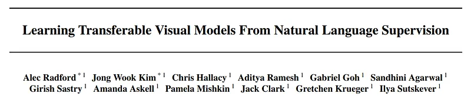 | Title block of *Learning Transferable Visual Models From Natural Language Supervision*. |
| 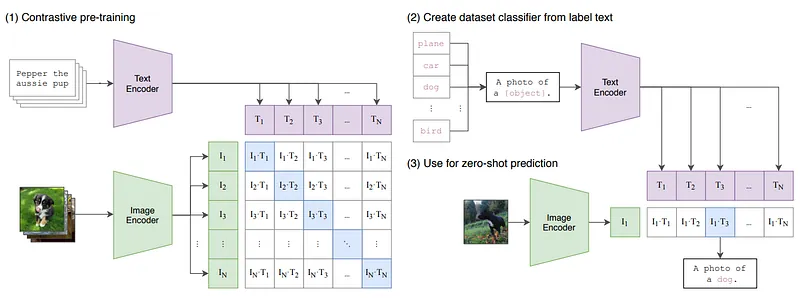 | CLIP overview: contrastive pretraining on image-text pairs, text-prompt classifier construction, and zero-shot prediction. |
| 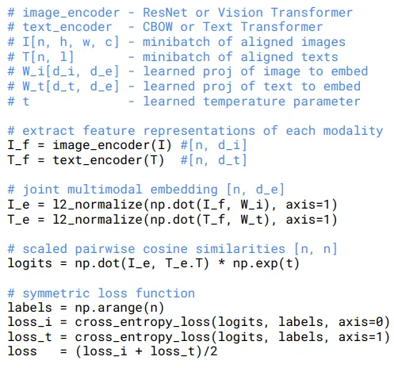 | Numpy-style pseudocode for CLIP’s symmetric contrastive loss with learned temperature scaling. |
| 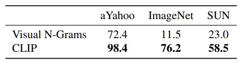 | Initial zero-shot transfer comparison showing CLIP vs Visual N-Grams on aYahoo, ImageNet, and SUN. |
| 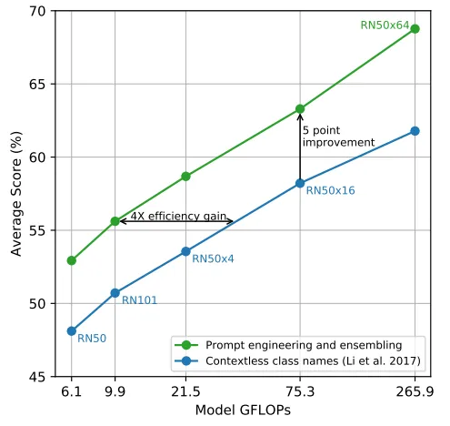 | Prompt engineering and prompt ensembling improve zero-shot score across CLIP model scales. |
| 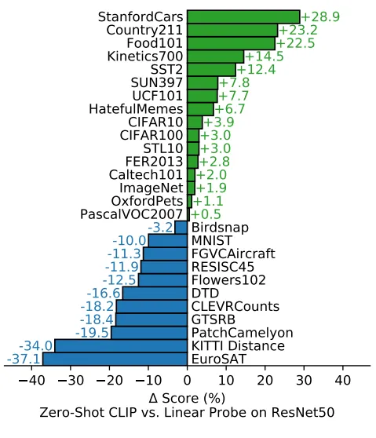 | Per-dataset delta between zero-shot CLIP and a supervised linear probe on ResNet-50 features. |
| 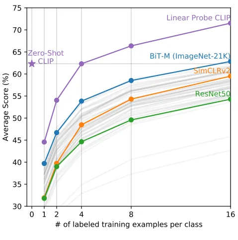 | Zero-shot CLIP vs few-shot linear probes as labeled examples per class increase. |
| 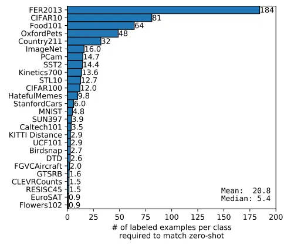 | Labeled examples per class needed for a linear probe to match zero-shot CLIP across datasets. |
| 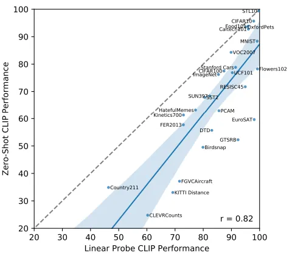 | Correlation plot between linear-probe and zero-shot CLIP performance across benchmarks. |
| 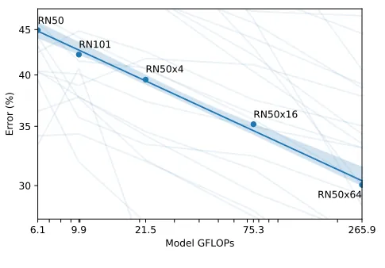 | Zero-shot CLIP error scaling trend vs model compute (GFLOPs). |
| 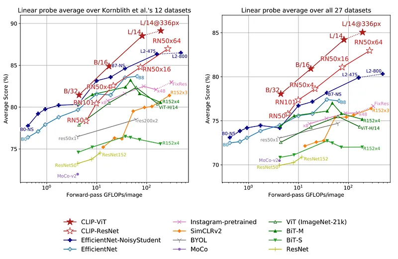 | Linear-probe comparison of CLIP models against prior vision backbones over compute budgets. |
| 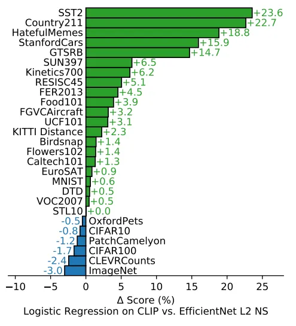 | Per-dataset linear-probe gains of CLIP features over EfficientNet-L2 Noisy Student. |
| 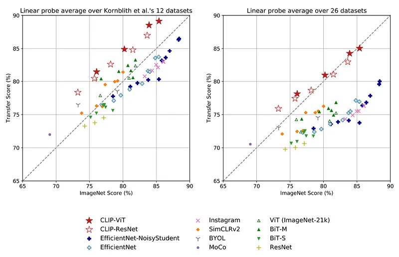 | Transfer score vs ImageNet score for CLIP and prior approaches across benchmark suites. |
| 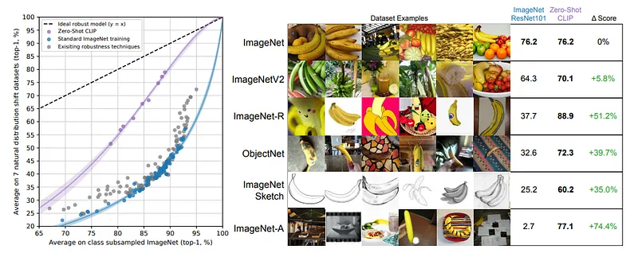 | Distribution-shift robustness: CLIP vs standard ImageNet models, with banana-class examples across shifted datasets. |
| 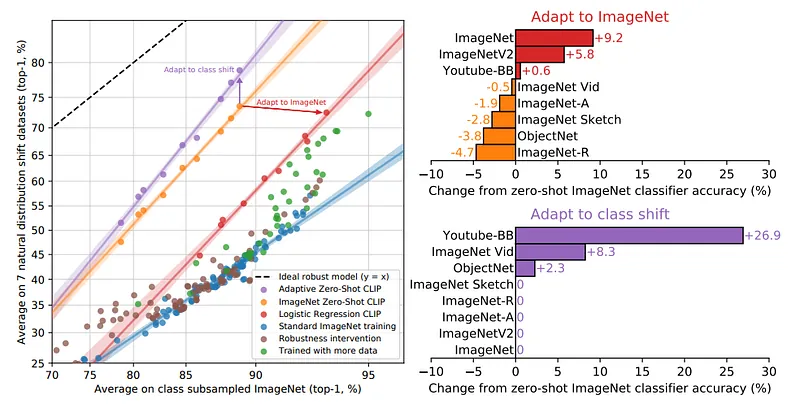 | Robustness interventions: adapting CLIP to ImageNet vs adapting zero-shot classifier to class shift. |
| 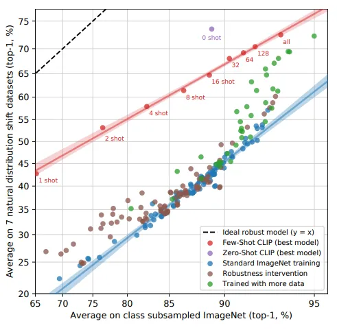 | Few-shot CLIP robustness tradeoff as adaptation shots increase from 1 to 128. |
| 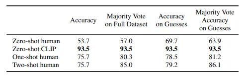 | Human vs CLIP performance table on Oxford-IIT Pets under zero-shot/one-shot and majority-vote settings. |
| 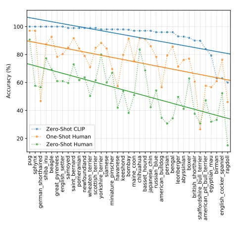 | Per-class accuracy on Oxford-IIT Pets showing hardest classes for zero-shot humans and zero-shot CLIP. |
| 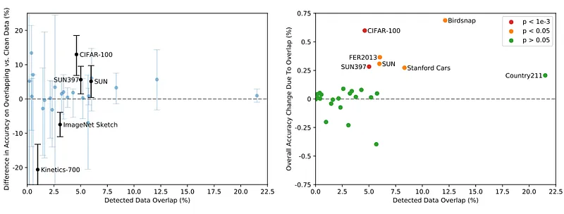 | Data-overlap analysis: accuracy difference on overlapping samples and overall effect size across datasets. |
## Related

- [[Papers Explained Corpus]]
- [[Vision Language Models]]
- [[Synthetic Data]]
- [[Computer Vision]]
- [[Large Language Models]]
- [[Embedding and Retrieval]]
- [[Papers Explained 99 - BLOOMZ, mT0]]
- [[Papers Explained 101 - Vicuna]]

#summary #topic
