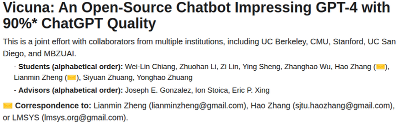
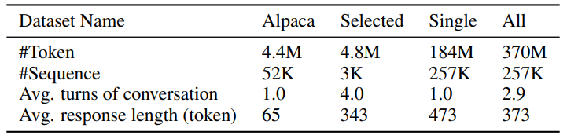
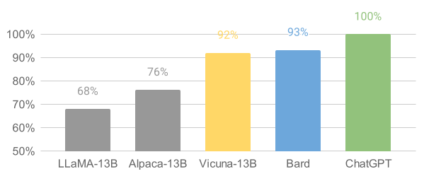
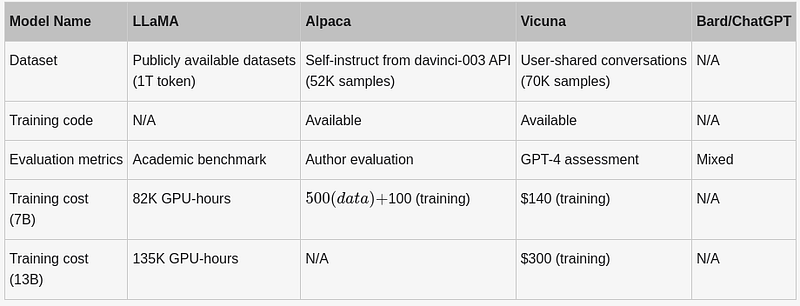
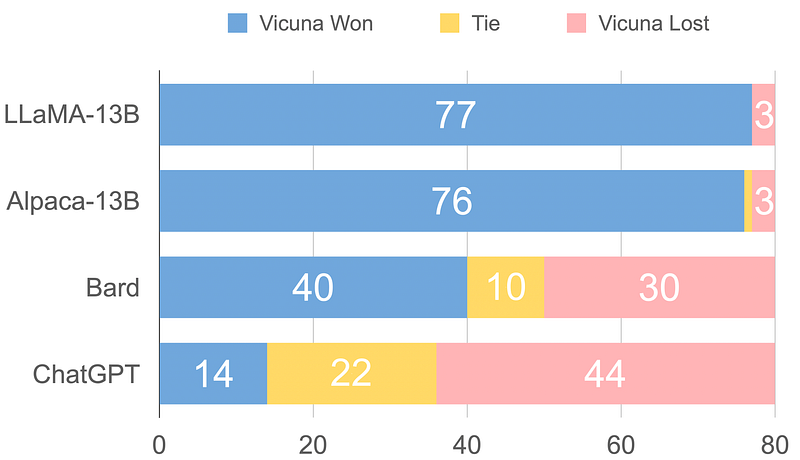
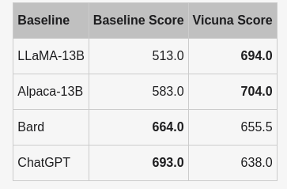

# Papers Explained 101 - Vicuna

Vicuna-13B is an open-source chatbot trained by fine-tuning LLaMA on user-shared conversations collected from ShareGPT, capable of generating more detailed and well-structured answers compared to Alpaca.

This page ingests the source article into the wiki and connects it to [[Papers Explained Corpus]], [[Large Language Models]], [[Synthetic Data]], [[Evaluation and Benchmarks]], [[Code Models]], [[Supervised Fine-Tuning]].

## Source Metadata

- Source file: `raw/2024-02-16_Papers-Explained-101--Vicuna-daed99725c7e.html`
- Source title: Papers Explained 101: Vicuna
- Published: 2024-02-16
- Canonical: [https://medium.com/@ritvik19/papers-explained-101-vicuna-daed99725c7e](https://medium.com/@ritvik19/papers-explained-101-vicuna-daed99725c7e)

## Key Ideas

- Preliminary (a fun and non-scientific) evaluation using GPT-4 as a judge shows Vicuna-13B achieves more than 90% quality of OpenAI ChatGPT and Google Bard while outperforming other models like LLaMA and Stanford Alpaca in more than 90% of cases.
- The training code is available at [GitHub](https://github.com/lm-sys/FastChat.).
- ShareGPT is a website where users can share their ChatGPT conversations. To ensure data quality, the HTML is converted back to markdown and inappropriate or low-quality samples are filtered out, which results in 125K conversations after data cleaning.
- “All” is the full dataset. “Single” only includes the first turn of each conversation. “Selected” is a small high-quality dataset of 3K sequences.
- The “Selected” dataset is constructed by picking sequences that include at least 3 turns of conversations generated by GPT-4 and running a clustering algorithm to divide them into 3K clusters and pick the centroid of each cluster.

## Notes

Vicuna-13B is an open-source chatbot trained by fine-tuning LLaMA on user-shared conversations collected from ShareGPT, capable of generating more detailed and well-structured answers compared to Alpaca.

Preliminary (a fun and non-scientific) evaluation using GPT-4 as a judge shows Vicuna-13B achieves more than 90% quality of OpenAI ChatGPT and Google Bard while outperforming other models like LLaMA and Stanford Alpaca in more than 90% of cases.

The training code is available at [GitHub](https://github.com/lm-sys/FastChat.).

## Training

ShareGPT is a website where users can share their ChatGPT conversations. To ensure data quality, the HTML is converted back to markdown and inappropriate or low-quality samples are filtered out, which results in 125K conversations after data cleaning. :engthy conversations are then divided into smaller segments that fit the model’s maximum context length. Three training datasets are created with different scales from this cleaned ShareGPT dataset.

*Figure: Dataset statistics*

“All” is the full dataset. “Single” only includes the first turn of each conversation. “Selected” is a small high-quality dataset of 3K sequences.

The “Selected” dataset is constructed by picking sequences that include at least 3 turns of conversations generated by GPT-4 and running a clustering algorithm to divide them into 3K clusters and pick the centroid of each cluster.

The training recipe builds on top of Stanford’s alpaca with the following improvements.

- Multi-turn conversations: The training loss is adjusted to account for multi-turn conversations and compute the fine-tuning loss solely on the chatbot’s output.

- Memory Optimisations: To enable Vicuna’s understanding of long context, the max context length is expanded from 512 in alpaca to 2048, which substantially increases GPU memory requirements. To tackle the memory pressure gradient checkpointing and flash attention are used

- Cost Reduction via Spot Instance: The 40x larger dataset and 4x sequence length for training poses a considerable challenge in training expenses. SkyPilot managed spot are used to reduce the cost by leveraging the cheaper spot instances with auto-recovery for preemptions and auto zone switch.

## Evaluation

*Figure: Relative Response Quality Assessed by GPT-4.*

A preliminary evaluation of the model quality is conducted by creating a set of 80 diverse questions and utilizing GPT-4 to judge the model outputs. To compare two different models, the outputs from each model are combined into a single prompt for each question. The prompts are then sent to GPT-4, which assesses which model provides better responses.

*Figure: Comparison between several notable models.*

Evaluating AI chatbots involves assessing language understanding, reasoning, and context awareness. Current benchmarks may be insufficient due to advancements in AI chatbots, making it hard to differentiate their performance. Hence the proposed evaluation framework uses GPT-4 to automate the assessment of chatbot performance.

Eight question categories are devised to test various aspects of a chatbot’s capabilities. GPT-4 generates diverse, challenging questions and rates chatbot answers based on helpfulness, relevance, accuracy, and detail. Five chatbots (LLaMA, Alpaca, ChatGPT, Bard, Vicuna) are tested with ten questions per category. It is noted that GPT-4 struggles to accurately judge coding/math tasks.

*Figure: Response Comparison Assessed by GPT-4*

- Vicuna is preferred over state-of-the-art models (LLaMA, Alpaca) in over 90% of questions and competitive with proprietary models (ChatGPT, Bard).

*Figure: Total Scores Assessed by GPT-4.*

- Vicuna’s total score is 92% of ChatGPT’s, as calculated from quantitative scores on 80 questions.

- Despite advancements, chatbots still face challenges with basic math problems and limited coding ability.

## Limitations

- It is not good at tasks involving reasoning or mathematics,

- It may have limitations in accurately identifying itself or ensuring the factual accuracy of its outputs.

- Additionally, it has not been sufficiently optimized to guarantee safety or mitigate potential toxicity or bias. To address the safety concerns, the OpenAI moderation API is used to filter out inappropriate user inputs.

## Updates

### v1.5

- Use Llama2 as the base model.

- Provide 16K context length versions using linear RoPE scaling.

### v1.3

- Train with twice the amount of ShareGPT data compared to previous versions.

- Provide merged weights directly instead of delta weights.

### v1.1

- Refactor the tokenization and separator. In Vicuna v1.1, the separator has been changed from ### to the EOS token </s>. This change makes it easier to determine the generation stop criteria and enables better compatibility with other libraries.

- Fix the supervised fine-tuning loss computation for better model quality.

## Paper

[Vicuna: An Open-Source Chatbot Impressing GPT-4 with 90%* ChatGPT Quality](https://lmsys.org/blog/2023-03-30-vicuna/)

Recommended Reading [Decoder-Only Language Transformers](https://ritvik19.medium.com/list/decoderonly-language-transformers-5448110c6046)

## Figures

Figures from the Medium HTML export (`raw/2024-02-16_Papers-Explained-101--Vicuna-daed99725c7e.html`); local copies under `wiki/assets/papers-explained-101-vicuna/` when download succeeded.

| Figure | Caption |
|--------|---------|
|  | Title banner of the Vicuna release blog: “An Open-Source Chatbot Impressing GPT-4 with 90% ChatGPT Quality.” |
|  | ShareGPT-derived training data statistics comparing Alpaca, Selected, Single, and full datasets. |
|  | Relative response quality (GPT-4 judged): Vicuna vs LLaMA, Alpaca, Bard, and ChatGPT. |
|  | Comparison table of model data sources, training code, evaluation setup, and estimated training costs. |
|  | Pairwise response comparison outcomes (Vicuna win/tie/loss) against LLaMA-13B, Alpaca-13B, Bard, and ChatGPT. |
|  | GPT-4-assessed total score table showing Vicuna close to ChatGPT and stronger than other open baselines. |
## Related

- [[Papers Explained Corpus]]
- [[Large Language Models]]
- [[Synthetic Data]]
- [[Evaluation and Benchmarks]]
- [[Code Models]]
- [[Supervised Fine-Tuning]]
- [[Papers Explained 100 - CLIP]]
- [[Papers Explained 102 - LLaVA 1]]

#summary #topic
