# Papers Explained 102 - LLaVA 1

LLaVA (Large Language and Vision Assistant) is an end-to-end trained large multimodal model that connects a vision encoder (CLIP) and an LLM (Vicuna) for general purpose visual and language understanding.

This page ingests the source article into the wiki and connects it to [[Papers Explained Corpus]], [[Vision Language Models]], [[Large Language Models]], [[Reasoning Models]].

## Source Metadata

- Source file: `raw/2024-02-19_Papers-Explained-102--LLaVA-1-eb0a3db7e43c.md`
- Source title: Papers Explained 102: LLaVA 1
- Published: 2024-02-19
- Canonical: [https://medium.com/@ritvik19/papers-explained-102-llava-1-eb0a3db7e43c](https://medium.com/@ritvik19/papers-explained-102-llava-1-eb0a3db7e43c)

## Key Ideas

- The project is available on [GitHub](https://github.com/haotian-liu/LLaVA).
- Recommended Reading [Papers Explained 100: CLIP](https://ritvik19.medium.com/papers-explained-100-clip-f9873c65134) [Papers Explained 101: Vicuna](https://ritvik19.medium.com/papers-explained-101-vicuna-daed99725c7e)
- For an image Xv and its associated caption Xc, a simple way to expand it to the instruction following version is to create a set of questions Xq with the intent to instruct the assistant to describe the image content.
- Human : Xq Xv<STOP> Assistant : Xc<STOP>.
- This simple expanded version lacks diversity and in-depth reasoning in both the instructions and responses. Hence language-only GPT-4 is used to create instruction-following data involving visual content.

## Notes

LLaVA (Large Language and Vision Assistant) is an end-to-end trained large multimodal model that connects a vision encoder (CLIP) and an LLM (Vicuna) for general purpose visual and language understanding. The paper presents a data reformation perspective and pipeline to convert image-text pairs into an appropriate instruction following format, using ChatGPT/GPT-4. The paper further presents LLaVA-Bench with two challenging benchmarks, with a diverse selection of paired images, instructions and detailed annotations.

The project is available on [GitHub](https://github.com/haotian-liu/LLaVA).

Recommended Reading [Papers Explained 100: CLIP](https://ritvik19.medium.com/papers-explained-100-clip-f9873c65134) [Papers Explained 101: Vicuna](https://ritvik19.medium.com/papers-explained-101-vicuna-daed99725c7e)

## GPT-assisted Visual Instruction Data Generation

For an image Xv and its associated caption Xc, a simple way to expand it to the instruction following version is to create a set of questions Xq with the intent to instruct the assistant to describe the image content. GPT-4 is used to curate such a list of questions. Therefore, the simple instruction following version can be :

Human : Xq Xv<STOP> Assistant : Xc<STOP>.

This simple expanded version lacks diversity and in-depth reasoning in both the instructions and responses. Hence language-only GPT-4 is used to create instruction-following data involving visual content. Two types of symbolic representations are used to encode an image as an LLM-recognizable sequence:

- Captions, typically describing the visual scene from various perspectives.

- Bounding boxes, localizing the objects in the scene, and each box encoding the object concept and its spatial location.

*Figure: Contexts i.e. captions and boxes used to prompt GPT.*

COCO images are used to generate three types of instruction-following data.

- Conversation. A conversation is designed between the assistant and a person asking questions about the photo. The answers are in a tone as if the assistant is seeing the image and answering the question. A diverse set of questions are asked about the visual content of the image, including the object types, counting the objects, object actions, object locations, relative positions between objects. Only questions that have definite answers are considered.

- Detailed description. To include a rich and comprehensive description for an image, a list of questions are created with such an intent. For each image, one question is randomly sampled from the list to ask GPT-4 to generate the detailed description.

- Complex reasoning. The above two types focus on the visual content itself, based on which further in-depth reasoning questions are created. The answers typically require a step-by-step reasoning process by following rigorous logic.

*Figure: The three types of responses.*

For each type, a few examples are manually designed. These are the only human annotations, during data collection, and are used as seed examples in in-context-learning to query GPT-4.

*Figure: The prompt construction process for collecting query[‘response’] from query[‘context’].*

In total 158K unique language-image instruction-following samples are collected, including 58K in conversations, 23K in detailed description, and 77k in complex reasoning, respectively.

## LLaVA Architecture

*Figure: LLaVA network architecture.*

Vicuna is used as the LLM fϕ(·) parameterized by ϕ, as it has the best instruction following capabilities in language tasks among publicly available checkpoints.

For an input image Xv, the pre-trained CLIP visual encoder ViT-L/14, provides the visual feature Zv = g(Xv). The grid features before and after the last Transformer layer are considered in the experiments.

A trainable projection matrix W is applied to convert Zv into language embedding tokens Hv, which have the same dimensionality as the word embedding space in the language model:

## Visual Instruction Tuning

For each image Xv, multi-turn conversation data (X1

q,X1 a, · · · ,XT q ,XT a ) is generated, by treating all answers as the assistant’s response, and the t-th turn instruction as :

Then instruction-tuning of the LLM is performed on the prediction tokens, using its original auto-regressive training objective.

Specifically, for a sequence of length L, we compute the probability of the target answers Xa by:

where θ is the trainable parameters.

A two-stage instruction-tuning procedure is adopted

### Pre-training for Feature Alignment

To strike a balance between concept coverage and training efficiency, CC3M dataset is filtered to 595K image-text pairs.These pairs are converted to the instruction-following data using the naive expansion method. Each sample can be treated as a single-turn conversation. Both the visual encoder and LLM weights are frozen, and the likelihood is maximized with trainable parameters θ =W (the projection matrix) only. In this way, the image features Hv can be aligned with the pre-trained LLM word embedding. This stage can be understood as training a compatible visual tokenizer for the frozen LLM.

### Fine-tuning End-to-End

The visual encoder weights are kept frozen, and both the pre-trained weights of the projection layer and LLM in LLaVA are continued to be updated; i.e., the trainable parameters are θ = {W, ϕ}. The specific use case are considered :

- Multimodal Chatbot: a Chatbot is developed by fine-tuning on the 158K language-image instruction following data.

- Science QA: a multimodal science question dataset that annotates the answers with detailed lectures and explanations. The assistant provides the reasoning process in natural language and selects the answer among multiple choices. For training, the data is organized as a single turn conversation, the question & context as Xinstruct, and reasoning & answer as Xa.

## Experiments

### Multimodal Chatbot

- A chatbot demo was developed to showcase LLaVA’s image understanding and conversation abilities, focusing on its capacity to digest visual inputs and follow instructions.

- The demo involved comparing LLaVA’s performance on image understanding tasks with multimodal GPT-4, BLIP-2, and OpenFlamingo

- Despite being trained on a relatively small dataset (~80K unique images), LLaVA demonstrated reasoning results similar to multimodal GPT-4, even with out-of-domain images.

- BLIP-2 and OpenFlamingo were more focused on describing images rather than following user instructions to provide appropriate responses.

- A quantitative metric was proposed to measure a model’s instruction-following capability on multimodal data, leveraging GPT-4 to evaluate the quality of generated responses.

- The evaluation involved creating triplets of image, ground-truth textual descriptions, and question, with responses judged by text-only GPT-4 for helpfulness, relevance, accuracy, and detail, scoring on a scale of 1 to 10.

- Two benchmarks were created for evaluation: LLaVA-Bench (COCO) with 30 images from COCO-Val-2014 and 90 questions, and LLaVA-Bench (In-the-Wild) with 24 diverse images and 60 questions.

*Figure: Ablation on LLaVA-Bench (COCO) with different training data.*

- LLaVA-Bench (COCO) showed that instruction tuning significantly improved the model’s ability to follow instructions, with detailed description and complex reasoning questions further enhancing overall capability.

*Figure: Instruction-following capability comparison using relative scores on LLaVA-Bench (In-theWild).*

- LLaVA-Bench (In-the-Wild) demonstrated LLaVA’s superior performance over BLIP-2 and OpenFlamingo, achieving 81.7% on complex reasoning questions and an overall score of 67.3%.

- Limitations of LLaVA were highlighted through challenging examples in LLaVA-Bench (In-the-Wild), revealing weaknesses in knowledge coverage, multilingual understanding, and the processing of high-resolution images.

### ScienceQA

*Figure: Accuracy (%) on Science QA dataset. Question categories: NAT = natural science, SOC = social science, LAN = language science, TXT = text context, IMG = image context, NO = no context, G1–6 = grades 1–6, G7–12 = grades 7–12.*

- The study evaluates GPT-3.5 (with and without chain-of-thought), LLaMA-Adapter, and multimodal chain-of-thought (MM-CoT).

- LLaVA model’s performance is highlighted, achieving 90.92% accuracy after training for 12 epochs, closely following the SoTA accuracy of 91.68%.

- GPT-4, prompted with 2-shot in-context learning, achieves 82.69% accuracy, marking a 7.52% absolute improvement over GPT-3.5’s 75.17%.

- GPT-4’s limitation is noted in its inability to process images or plots, leading to failures in answering a significant number of questions.

- Two schemes are proposed to combine model outcomes with GPT-4: (i) using GPT-4 as a complement, and (ii) using GPT-4 as a judge, the latter achieving a new SoTA accuracy of 92.53%.

## Paper

Visual Instruction Tuning [2304.08485](https://arxiv.org/abs/2304.08485)

Recommended Reading [Multi Modal Transformers](https://ritvik19.medium.com/list/multi-modal-transformers-67453f215ecf)

## Figures

Figures from the Medium HTML export (`raw/2024-02-19_Papers-Explained-102--LLaVA-1-eb0a3db7e43c.md`); local copies under `wiki/assets/papers-explained-102-llava-1/` when download succeeded.

| Figure | Caption |
|--------|---------|
| 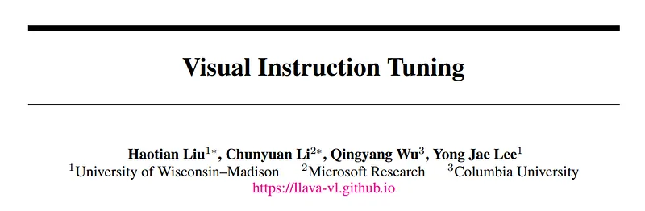 | Title block of *Visual Instruction Tuning*. |
| 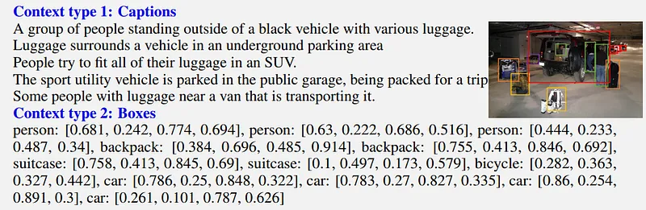 | GPT prompt context inputs for data generation: caption descriptions plus object bounding boxes. |
| 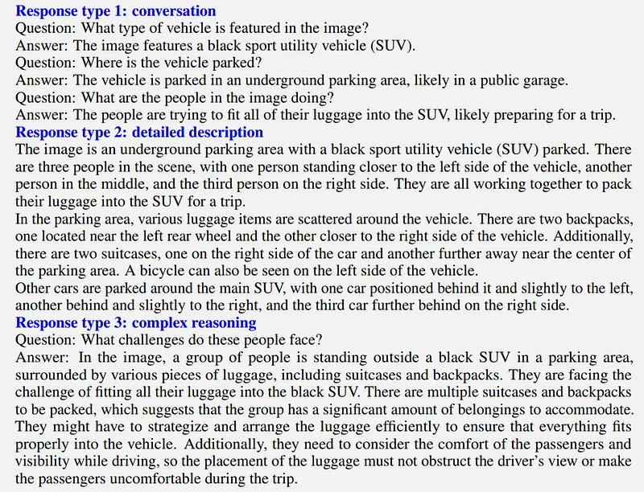 | Three generated response styles used in the dataset: conversation, detailed description, and complex reasoning. |
| 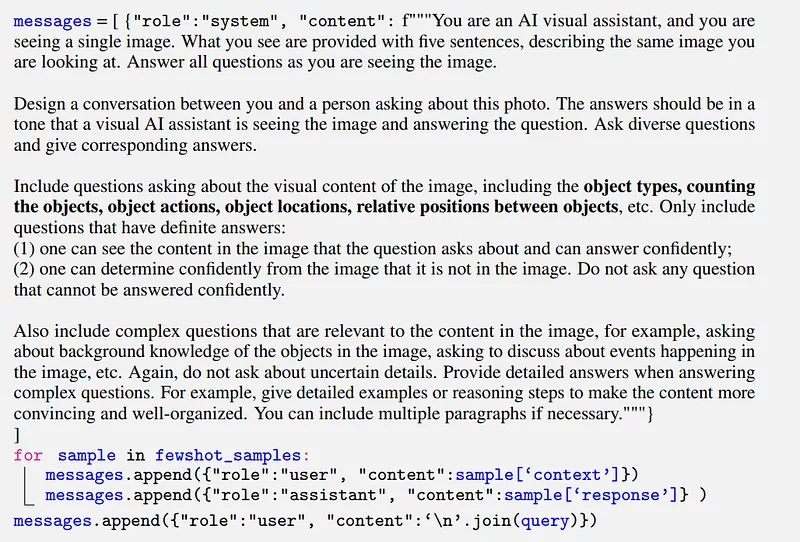 | Prompt-construction template for querying GPT with few-shot examples and visual-context instructions. |
| 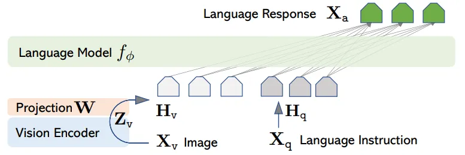 | LLaVA architecture connecting CLIP visual features to Vicuna through a trainable projection layer. |
| 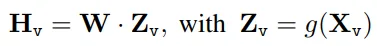 | Visual-token projection equation mapping encoder features into LLM embedding space. |
| 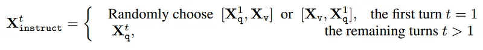 | Multi-turn instruction formatting rule for placing image tokens and user query across dialogue turns. |
| 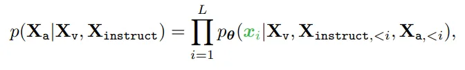 | Autoregressive objective used for visual instruction tuning over answer token sequence. |
| 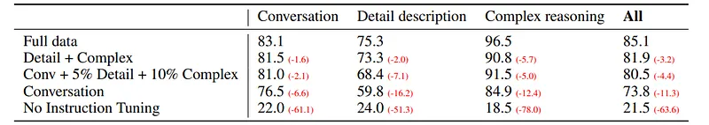 | Ablation on LLaVA-Bench (COCO): effect of conversation/detail/reasoning data on instruction-following performance. |
| 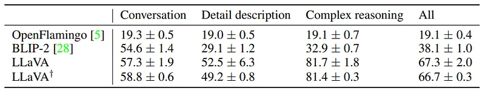 | LLaVA-Bench (In-the-Wild) comparison vs OpenFlamingo and BLIP-2 across conversation, detail, and reasoning. |
| 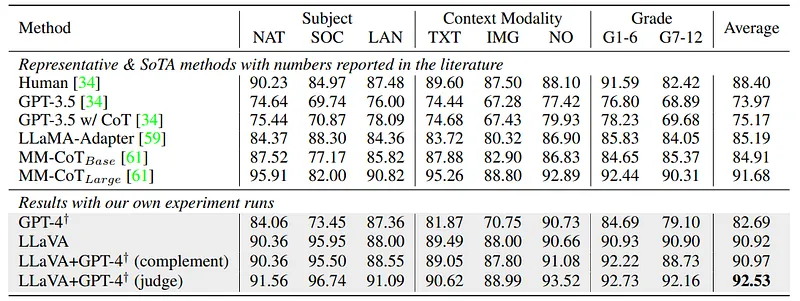 | ScienceQA accuracy breakdown by subject/context/grade, including LLaVA and GPT-4 combination strategies. |
## Related

- [[Papers Explained Corpus]]
- [[Vision Language Models]]
- [[Large Language Models]]
- [[Reasoning Models]]
- [[Papers Explained 101 - Vicuna]]
- [[Papers Explained 103 - LLaVA 1.5]]

#summary #topic
