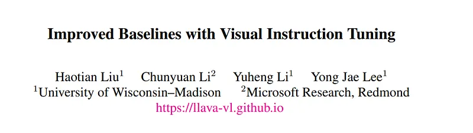
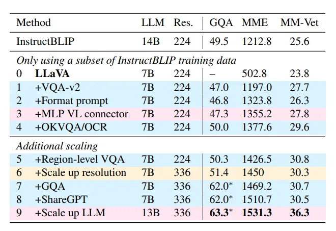
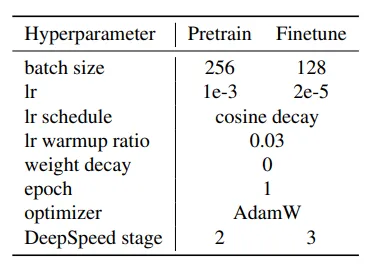
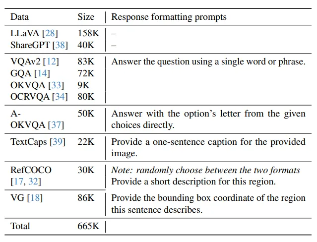
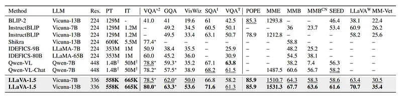
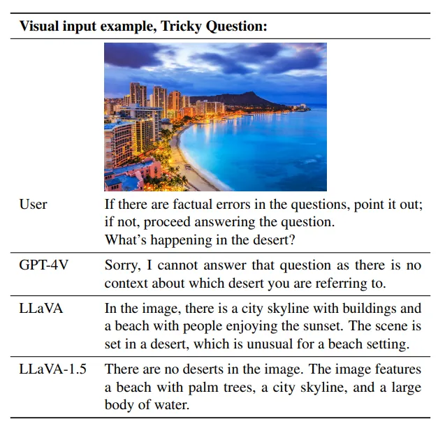
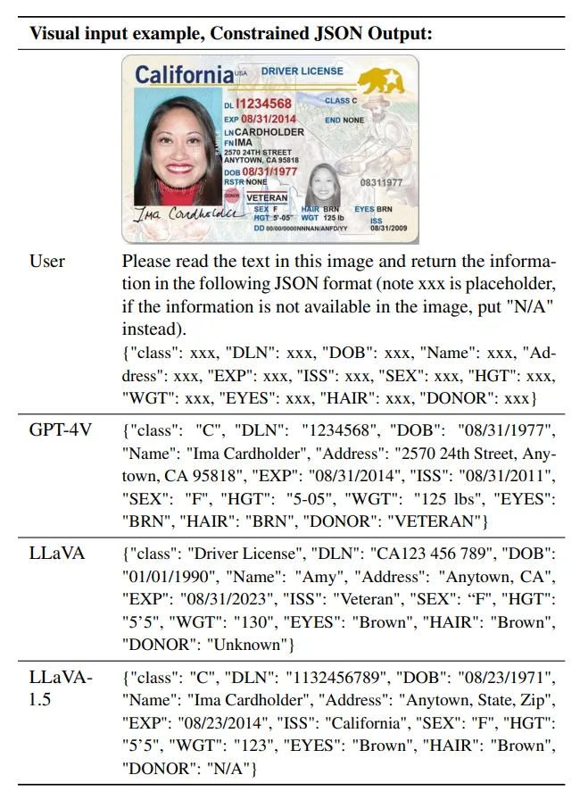
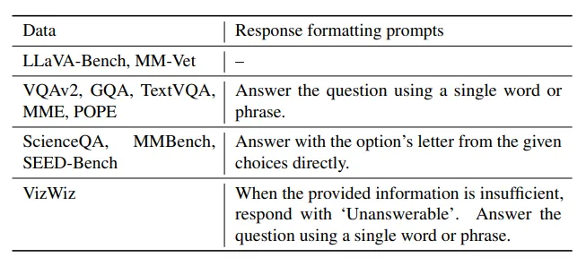

# Papers Explained 103 - LLaVA 1.5

LLaVA 1.5 is a 13B model that uses 12M publicly available data along with simple modifications to LLaVA, namely, using CLIP-ViT-L-336px with an MLP projection and adding academic-task-oriented VQA data with simple response formatting prompts to establish stronger baselines that achieve state-of-the-art across 11 benchmarks.

This page ingests the source article into the wiki and connects it to [[Papers Explained Corpus]], [[Vision Language Models]], [[Computer Vision]], [[Large Language Models]], [[Reasoning Models]].

## Source Metadata

- Source file: `raw/2024-02-21_Papers-Explained-103--LLaVA-1-5-ddcb2e7f95b4.md`
- Source title: Papers Explained 103: LLaVA 1.5
- Published: 2024-02-21
- Canonical: [https://medium.com/@ritvik19/papers-explained-103-llava-1-5-ddcb2e7f95b4](https://medium.com/@ritvik19/papers-explained-103-llava-1-5-ddcb2e7f95b4)

## Key Ideas

- LLaVA 1.5 is a 13B model that uses 12M publicly available data along with simple modifications to LLaVA, namely, using CLIP-ViT-L-336px with an MLP projection and adding academic-task-oriented VQA data with simple response formatting prompts to establish...
- The project is available on [GitHub](https://github.com/haotian-liu/LLaVA).
- Recommended Reading [Papers Explained 102: LLaVA 1](https://ritvik19.medium.com/papers-explained-102-llava-1-eb0a3db7e43c)
- LLaVA has showcased commendable proficiency in visual reasoning capabilities, but fall short on academic benchmarks that typically require short-form answers.This was attributed to the fact that LLaVA has not been pre trained on large-scale data, as other...
- The inability to balance between short- and long-form VQA is mainly due to ambiguous prompts on the response format and not fine tuning the LLM.

## Notes

LLaVA 1.5 is a 13B model that uses 12M publicly available data along with simple modifications to LLaVA, namely, using CLIP-ViT-L-336px with an MLP projection and adding academic-task-oriented VQA data with simple response formatting prompts to establish stronger baselines that achieve state-of-the-art across 11 benchmarks.

The project is available on [GitHub](https://github.com/haotian-liu/LLaVA).

Recommended Reading [Papers Explained 102: LLaVA 1](https://ritvik19.medium.com/papers-explained-102-llava-1-eb0a3db7e43c)

## Improved Baselines of LLaVA

LLaVA has showcased commendable proficiency in visual reasoning capabilities, but fall short on academic benchmarks that typically require short-form answers.This was attributed to the fact that LLaVA has not been pre trained on large-scale data, as other approaches do. In this note, the scaling effect of data, models and input image resolution are studied on a selection of three datasets and then compare the final model against existing LMMs on a diverse set of 12 benchmarks.

*Figure: Scaling results on data, model, and resolution.*

### Response formatting prompts

The inability to balance between short- and long-form VQA is mainly due to ambiguous prompts on the response format and not fine tuning the LLM.

Ambiguous prompts on the response format. For example, `Q: {Question} A: {Answer}`. Such prompts do not clearly indicate the desirable output format, and can overfit an LLM behaviorally to short-form answers even for natural visual conversations.

To address this, a single response formatting prompt that clearly indicates the output format, is appended at the end of VQA questions when promoting short answers: `Answer the question using a single word or phrase`.

When fine tuned with such prompts, LLaVA is able to properly adjust the output format according to the user’s instructions, and does not require additional processing of the VQA data using ChatGPT.

By merely including VQAv2 in training, LLaVA’s performance on MME significantly improves (1323.8 vs 502.8) and outperforms InstructBLIP by 111 points.

### MLP vision-language connector

Inspired by the improved performance in self-supervised learning by changing from a linear projection to an MLP, it is found that improving the vision-language connector’s representation power with a two layer MLP can improve LLaVA’s multimodal capabilities, compared with the original linear projection design.

*Figure: Hyperparameters of LLaVA-1.5.*

LLaVA-1.5 uses the same set of hyperparameters as the original LLaVA, except that we halve the learning rate in pretraining due to the usage of the MLP projection layer instead of the original linear projection layer design.

### Academic task oriented data

Four additional datasets that are used in InstructBLIP are included: OKVQA, A-OKVQA OCRVQA and TextCaps. A-OKVQA is converted to multiple choice questions and a specific response formatting prompt is used: `Answer with the option’s letter from the given choices directly`.

With only a subset of the datasets InstructBLIP uses, LLaVA already surpasses it on all three tasks suggesting LLaVA’s effective design.

Further adding region-level VQA datasets (Visual Genome, RefCOCO) improves the model’s capability of localizing fine-grained visual details.

## Additional scaling

The input image resolution is further scaled up to allow LLM to clearly “see” the details of images, and the GQA dataset is added as an additional visual knowledge source. ShareGPT data is also incorporated and the LLM is scaled up to 13B.

### Training Data

*Figure: Instruction-following Data Mixture of LLaVA-1.5.*

The final training data mixture contains a variety of datasets: VQA, OCR, region-level VQA, visual conversation and language conversation data. Multiple strategies are used to reduce training cost and enhance efficiency:

- For all VQA datasets, QA pairs from the same training image are merged into a single conversation.

- For ShareGPT, invalid conversations are filtered out. Unlike Vicuna, long conversations that surpass 2048 tokens are truncated rather than splitting to multiple conversations. This results in ∼40K conversations.

- Each QA pair in A-OKVQA is augmented k times, where k is the number of choices per question, to counterbalance the lack of multiple-choice data.

- 80K conversations are sampled from OCRVQA.

- For Visual Genome, 10 annotations are sampled for images with additional annotations.

- For RefCOCO, conversations are dissected into segments, each containing fewer than 10 conversations.

- Language conversations are often longer than visual ones. Hence for each batch, conversations are sampled only from a single modality, and this speeds up the training by 25%, and the final outcome is not affected.

All data splits are concatenated together and sampled

with the same probability.

## Evaluation

*Figure: Comparison with SoTA methods on 12 benchmarks.*

- LLaVA achieves the best performance on 11/12 benchmarks, and ranks the second on the other, while using significantly less pretraining and instruction tuning data.

- It achieves top performance with a simple architecture, academic compute, and public datasets, providing a reproducible and affordable baseline for future research.

- Visual instruction tuning is highlighted as more crucial for improving LMM capabilities than extensive pretraining.

- LLaVA-1.5, even with a smaller model size, surpasses the 80B IDEFICS model in multimodal instruction-following capabilities.

- It exhibits zero-shot multilingual capabilities without specific fine-tuning for multilingual multimodal instruction following.

- LLaVA-1.5 outperforms Qwen-VL-Chat in Chinese multimodal instruction following on MMBenchCN by 7.3%.

- The computational cost of training LLaVA-1.5 is approximately double that of its predecessor due to increased image input resolution.

- LLaVA-1.5 demonstrates zero-shot format instruction generalization, effectively handling “Unanswerable” responses and constrained JSON formats.

- The response format prompt effectively instructs the model to do so (11.1% → 67.8% on unanswerable questions)

*Figure: Response format prompt for evaluation.*

- Despite reduced hallucination, LLaVA-1.5 can still produce misinformation, necessitating cautious use in critical applications.

- Futher limitations include the model’s use of full image patches, which may extend training iterations, and its inability to process multiple images or excel in certain problem-solving domains.

## Paper

Improved Baselines with Visual Instruction Tuning [2310.03744](https://arxiv.org/abs/2310.03744)

Recommended Reading [Multi Modal Transformers](https://ritvik19.medium.com/list/multi-modal-transformers-67453f215ecf)

## Figures

Figures from the Medium HTML export (`raw/2024-02-21_Papers-Explained-103--LLaVA-1-5-ddcb2e7f95b4.md`); local copies under `wiki/assets/papers-explained-103-llava-1-5/` when download succeeded.

| Figure | Caption |
|--------|---------|
|  | Title block of *Improved Baselines with Visual Instruction Tuning*. |
|  | LLaVA-1.5 scaling ablation across data additions, connector changes, resolution, and model size (GQA/MME/MM-Vet). |
|  | LLaVA-1.5 pretrain/finetune hyperparameter table. |
|  | Instruction-following data mixture with response-format prompts per dataset family. |
|  | 12-benchmark comparison showing LLaVA-1.5 against prior LMM baselines. |
|  | Response-format generalization example for unanswerable/tricky visual questions. |
|  | Constrained JSON-output example showing improved structured extraction behavior in LLaVA-1.5. |
|  | Evaluation-time response-format prompt templates used across benchmark types. |
## Related

- [[Papers Explained Corpus]]
- [[Vision Language Models]]
- [[Computer Vision]]
- [[Large Language Models]]
- [[Reasoning Models]]
- [[Papers Explained 102 - LLaVA 1]]
- [[Papers Explained 104 - MoE-LLaVA]]

#summary #topic
