# Papers Explained 104 - MoE-LLaVA

MoE-LLaVA is a MoE-based sparse LVLM architecture that incorporates a mixture of experts and learnable routers. It consists of multiple sparse paths where each token is dispatched to different experts through the router. The activated experts collectively process the tokens, while the inactive paths remain silent.

This page ingests the source article into the wiki and connects it to [[Papers Explained Corpus]], [[Mixture of Experts]], [[Vision Language Models]].

## Source Metadata

- Source file: `raw/2024-02-23_Papers-Explained-104--MoE-LLaVA-cf14fda01e6f.md`
- Source title: Papers Explained 104: MoE-LLaVA
- Published: 2024-02-23
- Canonical: [https://medium.com/@ritvik19/papers-explained-104-moe-llava-cf14fda01e6f](https://medium.com/@ritvik19/papers-explained-104-moe-llava-cf14fda01e6f)

## Key Ideas

- MoE-LLaVA is a MoE-based sparse LVLM architecture that incorporates a mixture of experts and learnable routers. It consists of multiple sparse paths where each token is dispatched to different experts through the router.
- The paper introduces MoE-Tuning, a novel three-stage training strategy for adapting MoE to LVLMs and preventing the model degradation caused by sparsity.
- The project is available at [GitHub](https://github.com/PKU-YuanGroup/MoE-LLaVA).
- Recommended Reading: [Papers Explained 103: LLaVA 1.5](https://ritvik19.medium.com/papers-explained-103-llava-1-5-ddcb2e7f95b4)
- The MLP f consists of two linear layers with GELU activation function between them.

## Notes

MoE-LLaVA is a MoE-based sparse LVLM architecture that incorporates a mixture of experts and learnable routers. It consists of multiple sparse paths where each token is dispatched to different experts through the router. The activated experts collectively process the tokens, while the inactive paths remain silent.

The paper introduces MoE-Tuning, a novel three-stage training strategy for adapting MoE to LVLMs and preventing the model degradation caused by sparsity.

The project is available at [GitHub](https://github.com/PKU-YuanGroup/MoE-LLaVA).

Recommended Reading: [Papers Explained 103: LLaVA 1.5](https://ritvik19.medium.com/papers-explained-103-llava-1-5-ddcb2e7f95b4)

## Architecture of MoE-LLaVA

Given a RGB image v ∈ R^H×W×3, where H and W are the origin resolution. The vision encoder processes input images to obtain a visual token sequence Z = [z1, z2, · · · , zP] ∈ R^P×C, where P = H×W/14² represents the sequence length of visual tokens. A visual projection layer f is used to map Z ∈ R^P×C to V ∈ R^P×D, where D represents the hidden size of LLM. Similarly, the text undergoes a word embedding layer g and is projected to obtain the sequence tokens T = [t1, t2, · · · , tN] ∈ R^N×D, where N represents the sequence length of text tokens. The visual tokens and text tokens are concatenated together and fed into an LLM.

The MLP f consists of two linear layers with GELU activation function between them.

*Figure: Architecture details of the MoE-LLaVA model.*

- “FFN Factor“ represents the number of linear layers in the FFN.

- “*” donates the dimension of the hidden states for the keys (k) and values (v) is 1024.

- “1.6B×4-Top2” represents a dense foundation model with 1.6B parameters, which will be equipped with a total of four experts, with two of them being activated.

- “†” donates all layers will equipped with MoE layer.

MoE Forward Typically, a MoE layer consists of multiple FFNs and a router. The router is a linear layer that predicts the probability of each token being assigned to each expert.

where the router produces weight logits f(x) = W · x, which are normalized by the softmax function.

where W ∈ R^D×E represents the lightweight training parameters and E represents the number of experts. Each token is processed by the top-k experts with the highest probabilities, and the weighted sum is calculated based on the softmax results of the probabilities.

## MoE-tuning

*Figure: Training framework and strategy.*

Stage 1: The objective is to adapt the image tokens to LLM, allowing the LLM to comprehend the instances in the images. The whole LLM is kept frozen and only the visual projection MLP is trained on image captioning task.

Stage 2: In this stage, the LLM is adjusted to become an LVLM with multi-modal understanding. The whole model is trained on more complex instructions, including tasks such as image logical reasoning and text recognition requiring strong multi-modal understanding.

Stage 3: The FFN are replicated multiple times to initialize the experts. When image tokens and text tokens are fed into the MoE layers, the router calculates the matching weights between each token and the experts. Each token is then processed by the top-k experts, and the outputs are aggregated by weighted summation based on the router’s weights.

Objective: The loss function has two components: auto-regressive loss and auxiliary loss scaled by the balancing coefficient α.

where

Due to the presence of multiple experts, it is necessary to impose load balancing constraints on the MoE layer. Hence Differentiable Load Balancing Loss is incorporated into each MoE layer to encourage experts to handle tokens in a balanced manner.

where F represents the fraction of tokens processed by each expert Ei, and P represents the average routing probability of Ei, which can be expressed by the following formula:

## Training Data

*Figure: Composition of the data groups.*

The currently available data is reorganised for the three-stage training.

For the MIMIC-IT and SViT datasets, only the LA split and core split are used, respectively.

## Evaluation

### Zero-shot Image Question Answering and Evaluation under Benchmark Toolkits

*Figure: Comparison among different LVLMs on image understanding benchmarks*

- MoE-LLaVA demonstrated powerful image understanding capabilities, performing very close to the state-of-the-art method LLaVA-1.5 on five benchmarks.

- Specifically, MoE-LLaVA-Phi-2.7B×4 surpassed LLaVA1.5–7B by 2.7% on SQAI using 3.6B sparse activated parameters.

- MoE-LLaVA-StableLM-1.6B×4 achieved comprehensive superiority over IDEFICS-80B with only 2.0B activated parameters.

- MoE-LLaVA-Phi-2.7B×4 outperformed LLaVA-Phi by more than 6.2% on VQAv2, showcasing strong comprehension abilities in natural vision.

- Under benchmark toolkits, MoE-LLaVA-Qwen-1.8B×4 surpassed Qwen-VL-7B by 21.5% on MMBench, despite the latter utilizing higher image resolutions.

- These results collectively indicate that the sparse model MoE-LLaVA achieves comparable or superior performance to dense models with fewer activated parameters, highlighting its efficiency and effectiveness in image question-answering tasks.

### Object Hallucination Evaluation

*Figure: Zero-shot object hallucination evaluation results. “Yes” indicates the proportion of positive responses to the given question.*

- MoE-LLaVA is outperforming LLaVA-1.5–13B in all sampling methods:

- Surpassed by 1.0% in adversarial sampling.

- Surpassed by 1.5% in popular sampling.

- Surpassed by 0.8% in random sampling.

- MoE-LLaVA-1.8B×4, with 2.2B activated parameters, exhibits the best performance, indicating a higher consistency in generating objects relevant to the given image.

- The “yes ratio” of MoE-LLaVA remains relatively balanced, suggesting that the sparse model provides accurate feedback based on the given questions, highlighting its efficiency and effectiveness in evaluating object hallucination.

### Quantitative Analysis

- The study aims to analyze the routing distributions and modalities preferences in MoELLaVA-2.7B×4-Top2 on ScienceQA, focusing on how different experts within the model handle tasks and their preferences for modalities (text and image).

- The analysis involves examining expert loads and modalities preferences through visualizations.

- The study also tracks token pathways using PCA to identify the top-10 pathways.

*Figure: Distribution of expert loadings.*

- Expert loads are initially balanced across all MoE layers, but expert 3’s load increases significantly in layers 17 to 27, dominating the workload.

- In the shallow layers (5–11), experts 2, 3, and 4 mainly collaborate, while expert 1 predominantly works in the initial layers and gradually withdraws.

*Figure: Distribution of modalities across different experts.*

- Experts develop their own preferences for handling text and image tokens, but the routing distributions for these modalities are highly similar, indicating no clear preference for any modality and demonstrating strong interaction in multimodal learning.

*Figure: Visualization of activated pathways.*

- At the token level, experts 2 and 3 are consistently assigned to handle unseen text and image tokens in the deeper layers, while experts 1 and 4 are more involved in the initial phase.

- These findings suggest that the experts in MoE-LLaVA have learned to divide their tasks in a specific manner and are capable of handling both text and image tokens simultaneously, contributing to a better understanding of sparse models in multimodal learning.

## Paper

MoE-LLaVA: Mixture of Experts for Large Vision-Language Models [2401.15947](https://arxiv.org/abs/2401.15947)

Recommended Reading [Multi Modal Transformers](https://ritvik19.medium.com/list/multi-modal-transformers-67453f215ecf)

## Figures

Figures from the Medium HTML export (`raw/2024-02-23_Papers-Explained-104--MoE-LLaVA-cf14fda01e6f.md`); local copies under `wiki/assets/papers-explained-104-moe-llava/` when download succeeded.

| Figure | Caption |
|--------|---------|
| 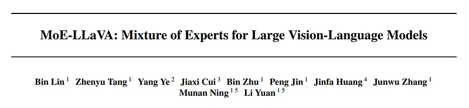 | Title block of *MoE-LLaVA: Mixture of Experts for Large Vision-Language Models*. |
| 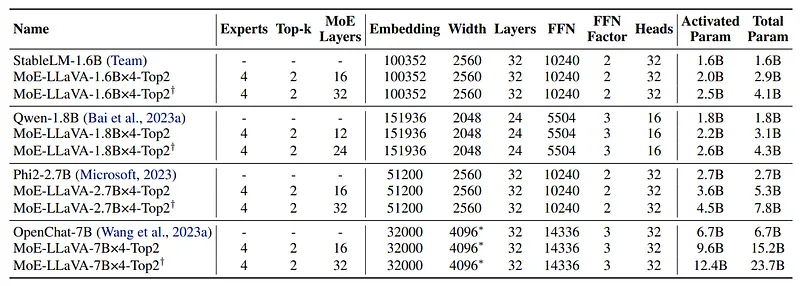 | Architecture/hyperparameter table for dense backbones and MoE-LLaVA variants (experts, top-k, activated params). |
| 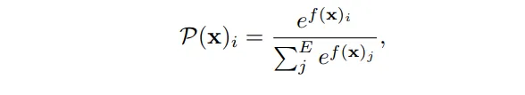 | Router softmax probability formulation for token-to-expert assignment. |
| 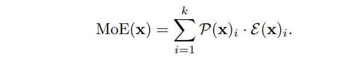 | MoE forward equation aggregating top-k expert outputs with routing weights. |
| 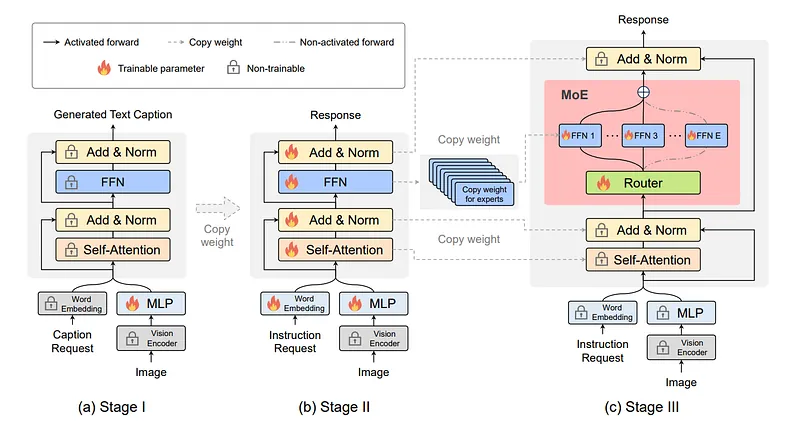 | Three-stage MoE-Tuning pipeline from dense initialization to routed sparse LVLM training. |
| 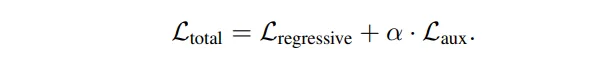 | Total objective combining autoregressive loss and auxiliary load-balancing loss. |
| 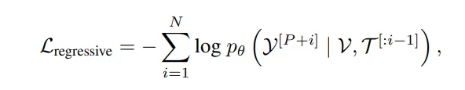 | Autoregressive language-modeling loss over multimodal token sequence. |
| 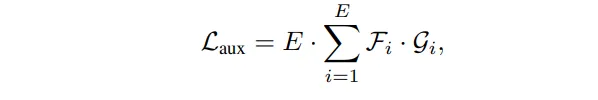 | Auxiliary load-balancing loss for expert utilization regularization. |
| 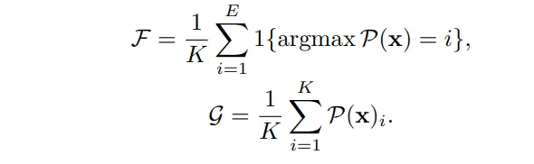 | Definitions of expert token fraction and mean routing probability terms used in balancing. |
| 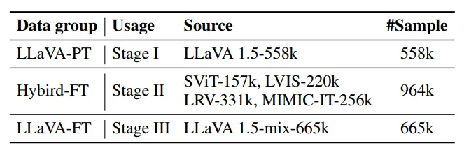 | Training-data composition by stage (LLaVA-PT, Hybrid-FT, LLaVA-FT). |
| 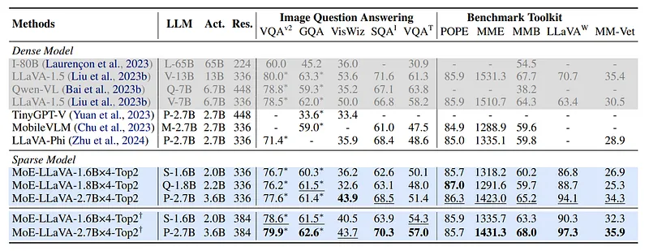 | Image-question-answering benchmark comparison: MoE-LLaVA vs dense LVLM baselines. |
| 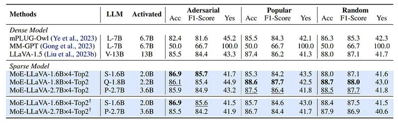 | Zero-shot object hallucination results under adversarial/popular/random sampling. |
| 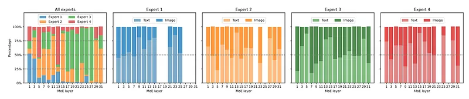 | Expert-loading distribution across MoE layers, separated by expert and modality. |
| 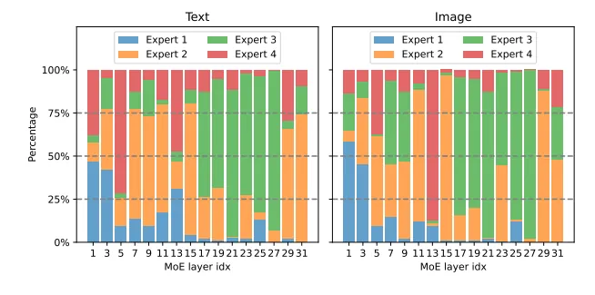 | Text vs image modality distributions routed to each expert across layers. |
| 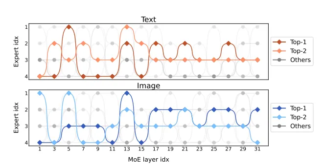 | Token-level activated pathway visualization showing top-1/top-2 expert routing in text and image streams. |
## Related

- [[Papers Explained Corpus]]
- [[Mixture of Experts]]
- [[Vision Language Models]]
- [[Papers Explained 103 - LLaVA 1.5]]
- [[Papers Explained 105 - Gemini 1.5 Pro]]

#summary #topic
