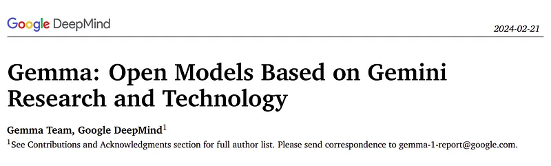
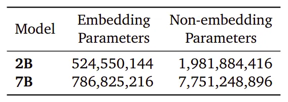
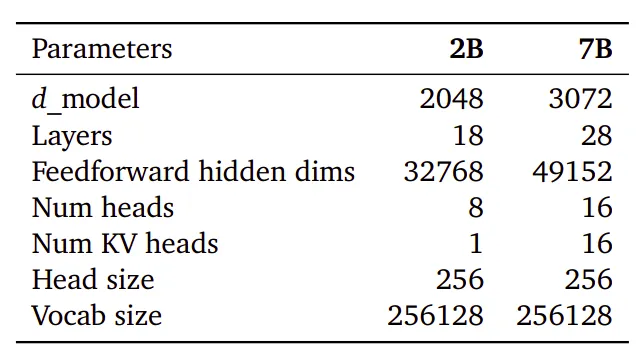
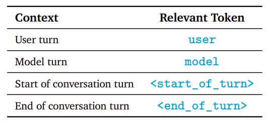
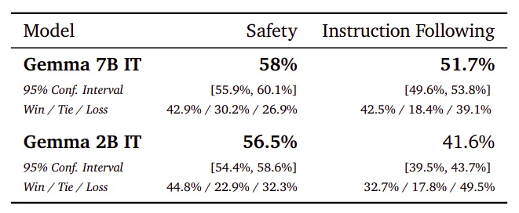
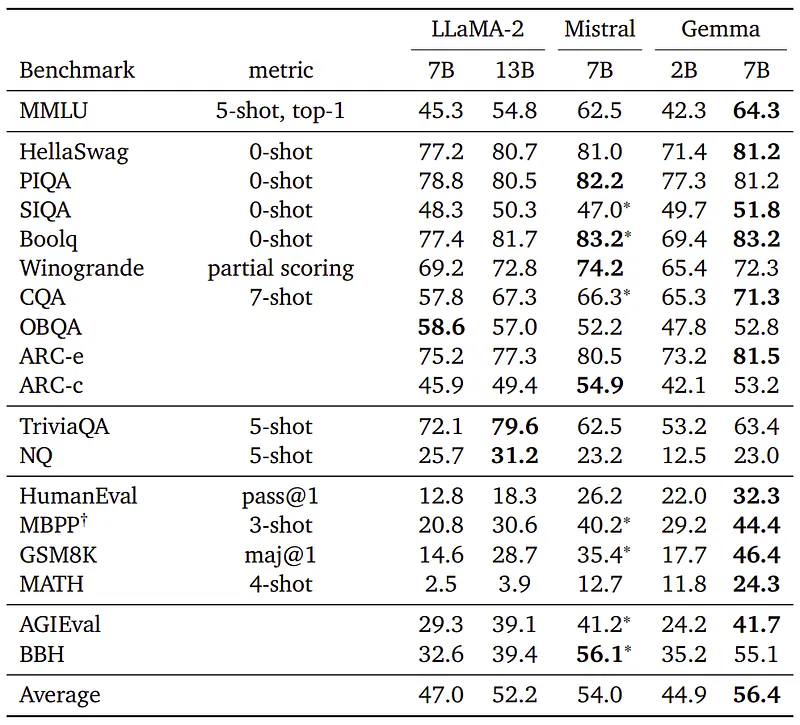
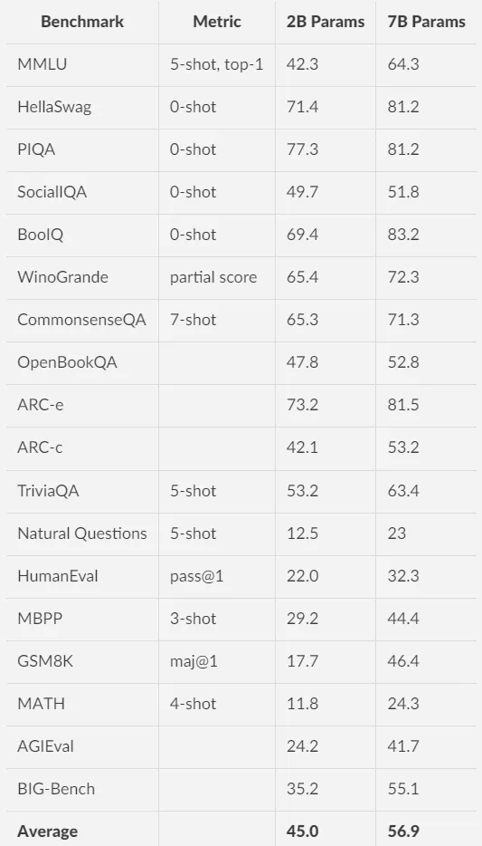
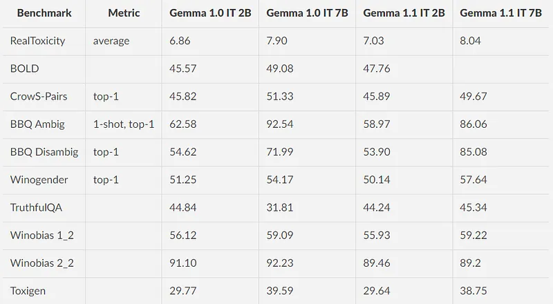

# Papers Explained 106 - Gemma

Gemma are a family of lightweight (2B and 7B), state-of-the art open language models built from the research and technology used to create Gemini models. Unlike Gemini, these models are not multimodal, nor are they trained for state-of-the-art performance on multilingual tasks.

This page ingests the source article into the wiki and connects it to [[Papers Explained Corpus]], [[Large Language Models]], [[Embedding and Retrieval]], [[Vision Language Models]], [[Multilingual Models]].

## Source Metadata

- Source file: `raw/2024-02-28_Papers-Explained-106--Gemma-ca2b449321ac.md`
- Source title: Papers Explained 106: Gemma
- Published: 2024-02-28
- Canonical: [https://medium.com/@ritvik19/papers-explained-106-gemma-ca2b449321ac](https://medium.com/@ritvik19/papers-explained-106-gemma-ca2b449321ac)

## Key Ideas

- Gemma are a family of lightweight (2B and 7B), state-of-the art open language models built from the research and technology used to create Gemini models.
- The models are available at [HuggingFace](https://huggingface.co/collections/google/gemma-release-65d5efbccdbb8c4202ec078b). And the project is available at [GitHub](https://github.com/google-deepmind/gemma).
- Recommended Reading [Papers Explained 105: Gemini 1.5 Pro](https://ritvik19.medium.com/papers-explained-105-gemini-1-5-pro-029bbce3b067)
- The Gemma model architecture is based on the transformer decoder with the following improvements:
- The 7B model uses multi-head attention while the 2B models use multi-query attention (with 𝑛𝑢𝑚_𝑘𝑣_ℎ𝑒𝑎𝑑𝑠 = 1)

## Notes

Gemma are a family of lightweight (2B and 7B), state-of-the art open language models built from the research and technology used to create Gemini models. Unlike Gemini, these models are not multimodal, nor are they trained for state-of-the-art performance on multilingual tasks.

*Figure: Parameter counts for both sizes of Gemma models.*

The models are available at [HuggingFace](https://huggingface.co/collections/google/gemma-release-65d5efbccdbb8c4202ec078b). And the project is available at [GitHub](https://github.com/google-deepmind/gemma).

Recommended Reading [Papers Explained 105: Gemini 1.5 Pro](https://ritvik19.medium.com/papers-explained-105-gemini-1-5-pro-029bbce3b067)

## Model Architecture

The Gemma model architecture is based on the transformer decoder with the following improvements:

- The 7B model uses multi-head attention while the 2B models use multi-query attention (with 𝑛𝑢𝑚_𝑘𝑣_ℎ𝑒𝑎𝑑𝑠 = 1)

- RoPE Embeddings in place of absolute positional embeddings.

- Embeddings are shared across the inputs and outputs to reduce model size.

- ReLU nonlinearity is replaced by the GeGLU activation function.

- Both the input and the output of each transformer sub-layer are normalized using RMSNorm.

- The models are trained on a context length of 8192 tokens.

*Figure: Key model parameters.*

## Training

A subset of the SentencePiece tokenizer of Gemini is used. It splits digits, does not remove extra whitespace, and relies on byte-level encodings for unknown tokens. The vocabulary size is 256k tokens.

### Pretraining

Gemma 2B and 7B are trained on 2T and 6T tokens respectively of primarily-English data from web documents, mathematics, and code. The data is filtered using both heuristics and model-based classifiers to remove harmful or low-quality content. All evaluation sets from the pre-training data mixture are also filtered out.

### Instruction Tuning

Gemma models are firmtuned with supervised fine-tuning on a mix of English only synthetic and human-generated prompt response pairs and reinforcement learning from human feedback (RLHF) with the reward model trained on labeled English-only preference data and the policy based on a set of high-quality prompts.

Instruction tuned models are trained with a specific format indicating roles in a conversation, such as the User role, and delineating turns in a conversation.

*Figure: Relevant formatting control tokens used for both Instruction Tuning of Gemma models.*

Supervised Fine-Tuning

Given a set of held out prompts, responses are generated from a test model, and a baseline model, and a larger, high capability model is asked to express a preference between two responses, removing examples that show certain personal information, unsafe or toxic model outputs, mistaken self-identification data, or duplicated examples.

Reinforcement Learning from Human Feedback

Pairs of preferences are collected from human raters and a reward function is trained under the Bradley-Terry model. The policy was trained to optimize this reward function using a variant of REINFORCE with a Kullback–Leibler regularization term towards the initially tuned model.

## Evaluation

### Human Preference Evaluations

*Figure: Win rate of Gemma models versus Mistral 7B v0.2 Instruct with 95% confidence intervals.*

- To compare Gemma 7B IT and Gemma 2B IT models against Mistral v0.2 7B Instruct model in human preference evaluations

- Human evaluation studies were conducted on a held-out collection of around 1000 prompts for creative writing tasks, coding, and following instructions, and set of around 400 prompts was used to test basic safety protocols.

- Gemma 7B IT outperforms Mistral v0.2 7B Instruct in creative writing tasks, coding, and following instructions, as well as in testing basic safety protocols. Gemma 2B IT also performs well but slightly lower than Gemma 7B IT.

### Automated Benchmarks

*Figure: Academic benchmark results, compared to similarly sized, openly-available models trained on general English text data.*

- Gemma models’ performance on various domains including physical reasoning, social reasoning, question answering, coding, mathematics, commonsense reasoning, language modeling, reading comprehension, etc. is compared to OSS LLMs.

- Gemma 7B outperforms all open-source alternatives at the same or smaller scale on the MMLU benchmark, and even several larger models, including LLaMA2 13B. However, it still falls short of the human expert performance benchmarked at 89.8%.

- Gemma models demonstrate strong performance on mathematics and coding benchmarks, outperforming other models by at least 10 points on GSM8K and the MATH benchmark, and by at least 6 points on HumanEval.

- Gemma 7B surpasses the performance of code-fine-tuned CodeLLaMA-7B models on the MBPP benchmark, achieving a score of 44.4% compared to CodeLLaMA’s 41.4%.

## Gemma 1.1

Gemma 1.1 is an update over the original Gemma release, trained using a novel RLHF method, leading to substantial gains on quality, coding capabilities, factuality, instruction following and multi-turn conversation quality.

A bug in multi-turn conversations is fixed, ensuring that model responses do not always start with ‘Sure’.

The training dataset consists of a vast collection of text data, totaling 6 trillion tokens, which includes:

- Web documents: a diverse range of English-language content to expose the model to various linguistic styles, topics, and vocabulary.

- Code: programming languages to help the model learn syntax and patterns, improving its ability to generate code or understand code-related questions.

- Mathematics: mathematical text to teach the model logical reasoning, symbolic representation, and to address mathematical queries.

To prepare the training data, the following data cleaning and filtering methods were applied:

- CSAM (Child Sexual Abuse Material) filtering: rigorous filtering was applied at multiple stages to ensure the exclusion of harmful and illegal content.

- Sensitive Data Filtering: automated techniques were used to filter out personal information and other sensitive data from the training set.

- Additional methods: filtering based on content quality and safety, in line with the company’s policies.

### Benchmark Results

### Safety Evaluations

Gemma 1.1 consistently perform better than Gemma 1 models

## Paper

[Gemma: Open Models Based on Gemini Research and Technology](https://storage.googleapis.com/deepmind-media/gemma/gemma-report.pdf)

## Figures

Figures from the Medium HTML export (`raw/2024-02-28_Papers-Explained-106--Gemma-ca2b449321ac.md`); local copies under `wiki/assets/papers-explained-106-gemma/` when download succeeded.

| Figure | Caption |
|--------|---------|
|  | Title page of *Gemma: Open Models Based on Gemini Research and Technology*. |
|  | Parameter-count split for Gemma 2B and 7B across embedding and non-embedding weights. |
|  | Key architecture hyperparameters for Gemma 2B and 7B (layers, heads, hidden sizes, vocab). |
|  | Conversation-format control tokens used during Gemma instruction tuning. |
|  | Human preference win rates vs Mistral 7B v0.2 Instruct on safety and instruction-following. |
|  | Academic benchmark comparison against LLaMA-2 and Mistral across reasoning, QA, coding, and math. |
|  | Consolidated benchmark results for Gemma 2B vs 7B. |
|  | Safety-evaluation table comparing Gemma 1.0 IT and Gemma 1.1 IT variants. |
## HF Blog Cross-References

- [Welcome Gemma - Google's new open LLM](https://huggingface.co/blog/gemma) (2024-02-21) — the Hugging Face launch/integration post for this release: Transformers, TGI, PEFT, and Text Generation Inference support, plus terms of use and the responsible generative AI toolkit. No new technical claims beyond the report covered above.

## Related

- [[Papers Explained Corpus]]
- [[Large Language Models]]
- [[Embedding and Retrieval]]
- [[Vision Language Models]]
- [[Multilingual Models]]
- [[Papers Explained 105 - Gemini 1.5 Pro]]
- [[Papers Explained 107 - LLaVA 1.6]]

#summary #topic
