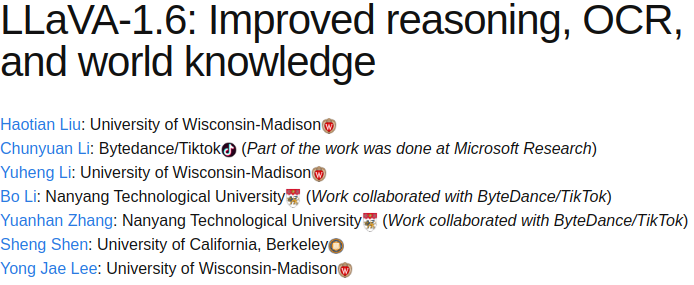
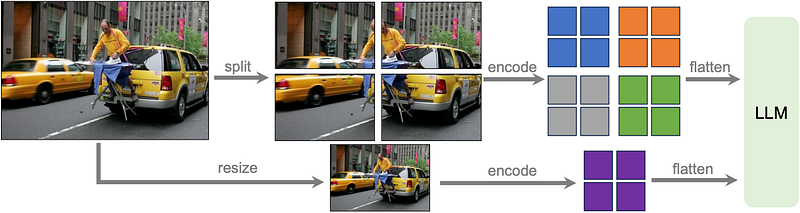
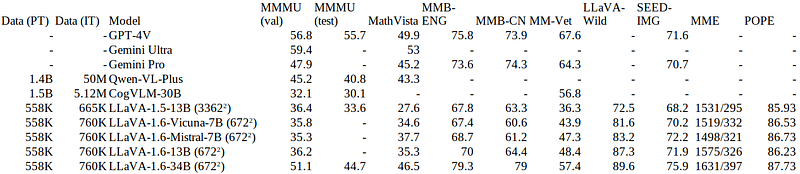

# Papers Explained 107 - LLaVA 1.6

LLaVA 1.6 is an advancement LLaVA 1.5 featuring enhanced reasoning, OCR, and world knowledge capabilities, surpassing its predecessor and other models in several benchmarks.

This page ingests the source article into the wiki and connects it to [[Papers Explained Corpus]], [[Vision Language Models]], [[Large Language Models]], [[Document AI]], [[Reasoning Models]], [[Model Compression and Efficiency]], [[Supervised Fine-Tuning]].

## Source Metadata

- Source file: `raw/2024-03-01_Papers-Explained-107--LLaVA-1-6-a312efd496c5.html`
- Source title: Papers Explained 107: LLaVA 1.6
- Published: 2024-03-01
- Canonical: [https://medium.com/@ritvik19/papers-explained-107-llava-1-6-a312efd496c5](https://medium.com/@ritvik19/papers-explained-107-llava-1-6-a312efd496c5)

## Key Ideas

- The project is available on [GitHub](https://github.com/haotian-liu/LLaVA).
- Recommended Reading [Papers Explained 103: LLaVA 1.5](https://ritvik19.medium.com/papers-explained-103-llava-1-5-ddcb2e7f95b4)
- LLaVA 1.6 introduces a suite of enhancements aimed at refining its performance, expanding its capabilities, and maintaining its efficiency and minimalist design ethos.
- Additionally, to bolster the model’s OCR and visual reasoning capabilities, LLaVA-1.6 removes TextCaps from its training data, replacing it with DocVQA and SynDog-EN for improved zero-shot OCR performance.
- LlaVA-1.6 expands its underlying language model (LLM) backbone to include a wider array of models such as Vicuna-1.5 (7B and 13B), Mistral-7B, and Nous-Hermes-2-Yi-34B.

## Notes

LLaVA 1.6 is an advancement LLaVA 1.5 featuring enhanced reasoning, OCR, and world knowledge capabilities, surpassing its predecessor and other models in several benchmarks. This paper introduces significant technical advancements in image processing, data mixture for improved visual conversation, and scalable integration with various large language models, offering the research community insights into efficient model design and deployment for enhanced multimodal interactions.

The project is available on [GitHub](https://github.com/haotian-liu/LLaVA).

Recommended Reading [Papers Explained 103: LLaVA 1.5](https://ritvik19.medium.com/papers-explained-103-llava-1-5-ddcb2e7f95b4)

## Technical Improvements

LLaVA 1.6 introduces a suite of enhancements aimed at refining its performance, expanding its capabilities, and maintaining its efficiency and minimalist design ethos. These improvements are pivotal for advancing the model’s utility across a broader range of applications, particularly in scenarios demanding high-resolution visual processing, sophisticated visual reasoning, and enhanced interaction through visual conversation.

### Dynamic High Resolution

A significant upgrade in LLaVA-1.6 is the introduction of the Dynamic High Resolution feature. By increasing the input image resolution to four times more pixels, the model now supports images up to 672x672, 336x1344, and 1344x336 resolutions across three aspect ratios. This enhancement enables the model to capture more visual details, crucial for tasks requiring fine-grained visual understanding. The implementation of the ‘AnyRes’ technique allows the model to process various high-resolution images efficiently, using a grid configuration to balance performance and operational costs effectively. This approach significantly reduces the model’s tendency to hallucinate or misinterpret visual content in low-resolution images, thereby improving accuracy and reliability.

### Enhanced Data Mixture for Visual Instruction Tuning

LlaVA-1.6 benefits from an enriched data mixture aimed at improving visual instruction following and conversation capabilities. The model leverages high-quality User Instruct Data, emphasizing diversity in task instructions and the quality of responses. This data mixture includes existing GPT-V data sources like LAION-GPT-V and ShareGPT-4V, alongside a newly curated 15K visual instruction tuning dataset derived from real-world user requests from the LLaVA demo. This dataset is meticulously filtered to address privacy concerns and potential harm, ensuring the model’s responses are both relevant and safe.

Additionally, to bolster the model’s OCR and visual reasoning capabilities, LLaVA-1.6 removes TextCaps from its training data, replacing it with DocVQA and SynDog-EN for improved zero-shot OCR performance. The inclusion of ChartQA, DVQA, and AI2D further enhances the model’s ability to understand charts and diagrams, motivated by the advancements seen in Qwen-VL-7B-Chat.

### Scaling LLM Backbone

LlaVA-1.6 expands its underlying language model (LLM) backbone to include a wider array of models such as Vicuna-1.5 (7B and 13B), Mistral-7B, and Nous-Hermes-2-Yi-34B. This expansion not only increases the model’s language capacity but also extends its bilingual support and flexibility for commercial use. By integrating these diverse LLMs, LLaVA-1.6 can cater to a broader spectrum of users and application scenarios, demonstrating the model’s scalability and versatility.

### Minimalist Design and Data Efficiency

Despite the performance improvements, LLaVA-1.6 maintains the minimalist design and data efficiency of its predecessor. It reuses the pretrained connector from LLaVA-1.5 and continues to utilize less than 1 million visual instruction tuning samples. This design approach ensures that the model remains efficient in terms of computational resources and data requirements.

## Results

- LLaVA-1.6 achieves the best performance compared with open-source LMMs such as [CogVLM](https://github.com/THUDM/CogVLM) or [Yi-VL](https://huggingface.co/01-ai/Yi-VL-34B). Compared with commercial ones, it catches up to Gemini Pro and outperforms [Qwen-VL-Plus](https://huggingface.co/spaces/Qwen/Qwen-VL-Plus) on selected benchmarks.

- LLaVA-1.6’s Chinese capability is an emerging zero-shot capability (i.e., only English multimodal data is considered). Its performance on Chinese multimodal scenarios is surprisingly good, e.g., SoTA on MMBench-CN.

## Paper

[LLaVA-1.6: Improved reasoning, OCR, and world knowledge](https://llava-vl.github.io/blog/2024-01-30-llava-1-6/)

Recommended Reading [Multi Modal Transformers](https://ritvik19.medium.com/list/multi-modal-transformers-67453f215ecf)

## Figures

Figures from the Medium HTML export (`raw/2024-03-01_Papers-Explained-107--LLaVA-1-6-a312efd496c5.html`); local copies under `wiki/assets/papers-explained-107-llava-1-6/` when download succeeded.

| Figure | Caption |
|--------|---------|
|  | Title block of *LLaVA-1.6: Improved reasoning, OCR, and world knowledge*. |
|  | Dynamic high-resolution (AnyRes) pipeline splitting images into tiles plus a resized global view before LLM input. |
|  | Benchmark comparison across LLaVA-1.6 variants and competing multimodal models. |
## Related

- [[Papers Explained Corpus]]
- [[Vision Language Models]]
- [[Large Language Models]]
- [[Document AI]]
- [[Reasoning Models]]
- [[Model Compression and Efficiency]]
- [[Supervised Fine-Tuning]]
- [[Papers Explained 106 - Gemma]]
- [[Papers Explained 108 - Aya Dataset]]

#summary #topic
