# Papers Explained 108 - Aya Dataset

This work contributes four key resources: the Aya Annotation Platform, the Aya Dataset, the Aya Collection, and the Aya Evaluation Suite.

This page ingests the source article into the wiki and connects it to [[Papers Explained Corpus]], [[Multilingual Models]], [[Synthetic Data]], [[Evaluation and Benchmarks]], [[Agentic AI]].

## Source Metadata

- Source file: `raw/2024-03-04_Papers-Explained-108--Aya-Dataset-9e299ac74a19.html`
- Source title: Papers Explained 108: Aya Dataset
- Published: 2024-03-04
- Canonical: [https://medium.com/@ritvik19/papers-explained-108-aya-dataset-9e299ac74a19](https://medium.com/@ritvik19/papers-explained-108-aya-dataset-9e299ac74a19)

## Key Ideas

- The Aya Annotation Platform is a robust annotation tool to facilitate the collection of multilingual data in an instruction style format supporting 182 languages, including dialects. The platform is accessible at: https://aya.for.ai
- The Aya dataset is a human-curated instruction-following dataset spanning 65 languages, curated by working with fluent speakers of languages from around the world to collect natural instances of instructions and completions.
- The Aya collection is an extensive aggregation of 44 monolingual and multilingual templated instruction datasets and 19 translated datasets comprising 513 million instances through templating and translating existing datasets across 114 languages and three...
- Aya Evaluation Suite is created for multilingual open-ended generation. This collection consists of original annotation and post-edits of translations covering several languages, and translation of high-quality and universal prompts into 101 languages.
- The number of languages in a dataset are indicated with the value in the blue ovals in the figure.

## Notes

This work contributes four key resources: the Aya Annotation Platform, the Aya Dataset, the Aya Collection, and the Aya Evaluation Suite.

The Aya Annotation Platform is a robust annotation tool to facilitate the collection of multilingual data in an instruction style format supporting 182 languages, including dialects. The platform is accessible at: https://aya.for.ai

The Aya dataset is a human-curated instruction-following dataset spanning 65 languages, curated by working with fluent speakers of languages from around the world to collect natural instances of instructions and completions. The dataset is available at https://hf.co/datasets/CohereForAI/aya_dataset

The Aya collection is an extensive aggregation of 44 monolingual and multilingual templated instruction datasets and 19 translated datasets comprising 513 million instances through templating and translating existing datasets across 114 languages and three main tasks: Text Classification, Natural Language Generation, and Question Answering. The collection is available at https://hf.co/datasets/CohereForAI/aya_collection

Aya Evaluation Suite is created for multilingual open-ended generation. This collection consists of original annotation and post-edits of translations covering several languages, and translation of high-quality and universal prompts into 101 languages. The evaluation suite is available at https://hf.co/datasets/CohereForAI/aya_evaluation_suite

*Figure: Aya Dataset, Aya Collection & Aya Evaluation Suite.*

The number of languages in a dataset are indicated with the value in the blue ovals in the figure.

*Figure: Comparison of different instruction-tuning datasets. ✓represents permissive licenses that allow commercial use while ≈ represents restrictive licenses that do not allow commercial use. ✗represents non availability of license.*

## Aya Annotation Platform

On the Aya Annotation Platform, contributors were able to contribute to three different tasks, following the find-fix-verify paradigm:

- Writing new examples from scratch (original annotations)

- Editing existing examples to improve the quality and comprehensiveness (re-annotations)

- Giving feedback on the quality of existing contributions (annotation feedback)

- Approximately 54% of users accessed Aya UI via desktop browsers while 46% utilized mobile browsers.

- The high fraction of mobile users to the skew towards mobile users in the Global South

*Figure: Geographical distribution of the users registered on the Aya platform.*

- India has the highest number of registered users (346 out of 2,997).

*Figure: Left: Distribution of registered users on the Aya UI by age using specified values. Right: Distribution of registered users on the Aya UI by gender using specified values.*

- More than two-thirds users were aged between 18 and 35.

- 6.6% of users self-reported dialects. Within this group, 75% specified one dialect, 20% specific two dialects, and the remaining 5% specified three or more dialects, with a maximum of six.

*Figure: Distribution of total contributions across different regions.*

- More than half (58.8%) of all contributions came from Asia.

## Aya Dataset

The Aya Dataset includes all original annotations and the re-annotations if there is a difference between the original and the edited version, with an acceptance threshold edit distance d >= 5 .

Only languages with at least 50 contributions were included in the final release of Aya Dataset.

*Figure: Aya Dataset Statistics.*

- The dataset covers 65 languages: 22 high-resource, 12 mid-resource, and 31 low-resource languages

*Figure: Average Completion Length before and after re-annotation.*

- Across all data sources, the average length of completion increased by 25% after editing.

*Figure: Average prompt and completion length of instances in the Aya Dataset across different language categories.*

- A distinct contrast exists in completion lengths between mid and low-resource languages when compared to high-resource languages.

*Figure: Relationship between Average Prompt and Completion Length in characters and the Average Approval Rate of the example.*

- A positive correlation (0.27) is observed between how long the prompts and completions are and their resulting average approval ratio.

*Figure: Comparison of completion lengths between Aya Dataset, Aya Collection, and xP3 (excluding the “code” split).*

- The Aya Dataset has considerably longer completions on average when compared with other data collections

- This is particularly noteworthy given that the Aya Dataset is human-curated.

*Figure: Top: Ratio of all annotations per language with respect to the whole dataset. Bottom: Ratio of annotations done by the top-k most active contributors.*

- The highest number of contributions is for Malagasy with 14,597 instances, and the lowest is 79 for Kurdish.

- The median number of annotators per language is 15 (mean is 24.75) with one language having only a single active annotator (Sindhi) and some having over 80 annotators (English and Portuguese).

- A skewed pattern is observed where for 12 languages, the 5 most active annotators contributed all examples.

- The most extreme cases are Zulu and Sindhi, where one annotator in each language volunteered for all contributions in Annotation and Re-annotation tasks.

- The languages with the least skewed distributions are Malagasy, Tamil, Nepali, Hindi, English and Portuguese.

- The language English also had the highest number of unique annotators with 130 individuals out of which 95 annotators contributed to English as their second language for annotation purposes.

*Figure: The volume of original annotations and re-annotations increases after the introduction of Aya Score.*

- To encourage high-quality examples from the annotators, the Aya Score was introduced halfway through the project to focus on the quality, in addition to the quantity, of contributions.

- The Aya Score encouraged participants to incorporate more edits during annotation, with one specific guideline urging them to transform short answers into full sentences or paragraphs.

## Aya Collection

The Aya Collection consists of three different sources of data:

- Templated data: collaborated with fluent speakers to create templates that allowed for the automatic expansion of existing datasets into various languages.

- Translated data: translated a hand-selected subset of 19 datasets into 101 languages (114 dialects) using the NLLB 3.3B machine translation model.

- Aya Dataset: the only dataset in the collection that is human-annotated in its entirety.

*Figure: Task Taxonomy of NLP tasks in the Aya Collection.*

- The final Aya Collection consists of 44 multilingual and non-English templated datasets and 19 translated datasets, with 513M individual instances. Overall, the collection covers 114 languages.

*Figure: Number of prompt/completion pairs in each language in the Aya Collection (templated).*

- Although the number of instances for languages varies in the Aya Collection, it does not disadvantage languages with fewer Wikipedia pages. The distribution still ensures a reasonable coverage across all languages.

*Figure: The average length of prompts and completions for high (HR), medium (MR) and lowresource (LR) languages in Aya Collection.*

- No discernible pattern is observed when examining lengths for high-resource languages compared to low-resource languages. Low-resource languages appear at both ends of the distribution, occupying both the head and tail.

*Figure: Average approval ratio per dataset group, constrained to datasets receiving at least 20 votes.*

- The average approval ratio is computed as T+/T, where T+ represents the total number of thumbs up, and T represents the total number of votes per dataset.

- The majority of datasets were of above average (0.5) quality based on their approval ratio, with all translated data as well as Original Annotations.

- However, across all the datasets within each group, Aya original annotations were perceived to be of the highest quality, with an average approval ratio of approximately 0.81, compared to the lowest quality dataset, xP3, which had an average approval ratio of approximately 0.50.

## Aya Evaluation Suite

It is an evaluation suite tailored for multilingual models that includes :

- human-curated examples in a limited set of languages

- automatic translations of handpicked examples into a more extensive number of languages

- human-post-edited translations into a small number of languages.

The subsets comprising the Aya evaluation suite are:

aya-human-annotated test set

The test set of the Aya Dataset contains 1,750 of the total instances (250 instances from 7 languages), selected at random from original annotations. It consists of

- English (high-resource, Latin script, Indo-European)

- Portuguese (mid-resource, Latin script, Indo-European)

- Simplified Chinese (high-resource, Han, Sino-Tibetan)

- Standard Arabic (high-resource, Arabic script, Afro-Asiatic)

- Telugu (low-resource, Telugu script, Dravidian)

- Turkish (mid-resource, Latin script, Turkic)

- Yoruba (low-resource, Latin script, Atlantic-Congo)

dolly-machine-translated test set

A curated subset of 200 Dolly prompts is separated to serve as an additional translated evaluation set. The prompts are automatically with NLLB into 101 languages and their dialects that are captured by NLLB. Including the original English prompts this dataset covers 115 dialects.

dolly-human-edited test set

The automatic translation process may introduce errors in the prompts that render them nonsensical. Hence the prompts for a subset of six languages: Arabic, Hindi, Spanish, French, Serbian and Russian are post edited.

Note from the authors:

> If using the automatically translated test set, we recommend it be paired and reported with the professionally post-edited dolly-human-edited for 6 languages, or the aya-human annotated set which also only covers 7 languages but is entirely created by proficient target language speakers.

## Paper

Aya Dataset: An Open-Access Collection for Multilingual Instruction Tuning [2402.06619](https://arxiv.org/abs/2402.06619)

Recommended Reading [Aya Series](https://ritvik19.medium.com/list/aya-series-83ee469cf14f) [Datasets](https://ritvik19.medium.com/list/datasets-b465a5d8a2d6)

## Figures

Figures from the Medium HTML export (`raw/2024-03-04_Papers-Explained-108--Aya-Dataset-9e299ac74a19.html`); local copies under `wiki/assets/papers-explained-108-aya-dataset/` when download succeeded.

| Figure | Caption |
|--------|---------|
| 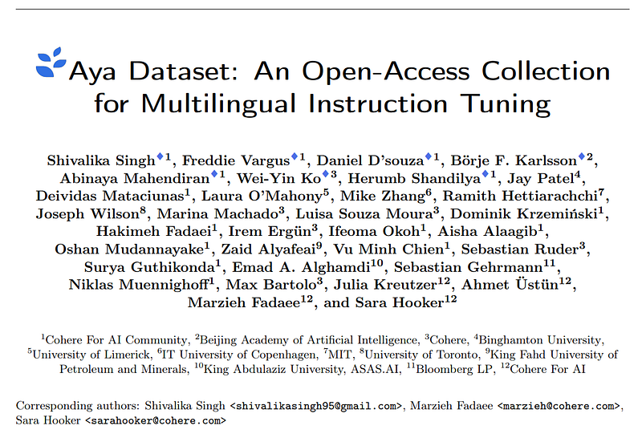 | Title page of *Aya Dataset: An Open-Access Collection for Multilingual Instruction Tuning*. |
| 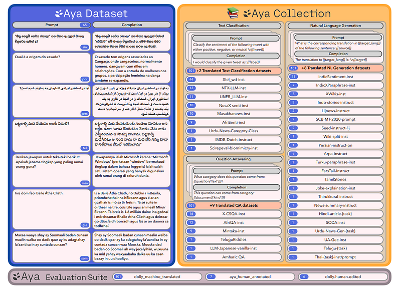 | Overview of Aya resources: Aya Dataset, Aya Collection, and Aya Evaluation Suite. |
| 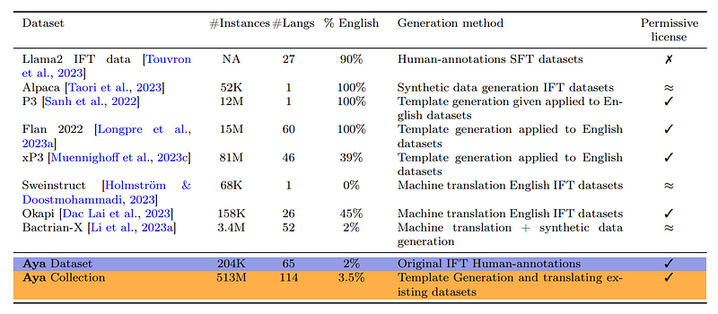 | Comparison of instruction-tuning datasets by scale, language coverage, generation method, and licensing. |
| 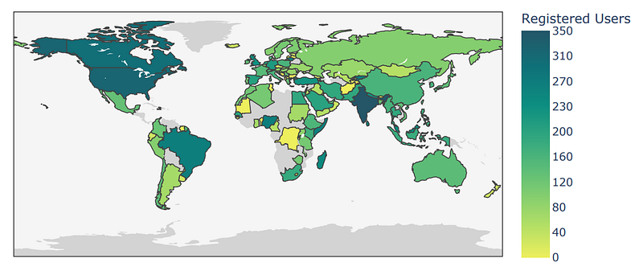 | Geographic distribution of registered users on the Aya platform. |
| 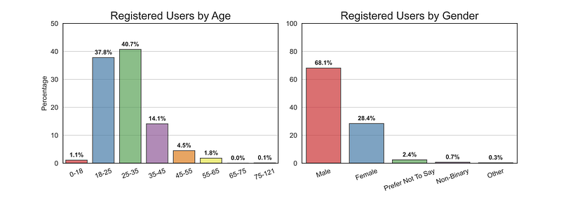 | Registered-user demographics by age and gender. |
| 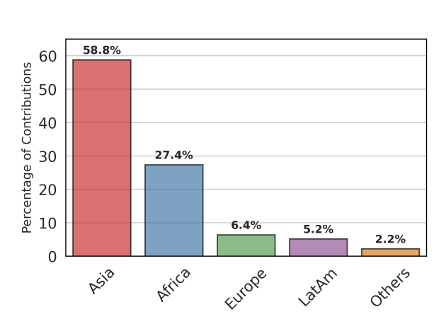 | Regional share of total Aya contributions. |
| 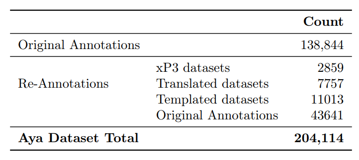 | Aya Dataset composition counts: original annotations, re-annotations, and total size. |
| 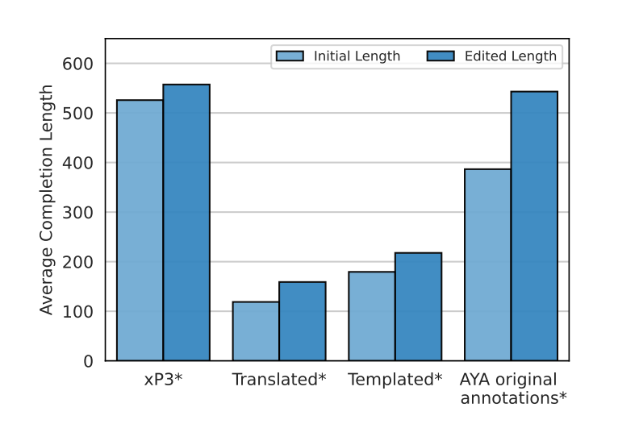 | Average completion length before and after re-annotation across data sources. |
| 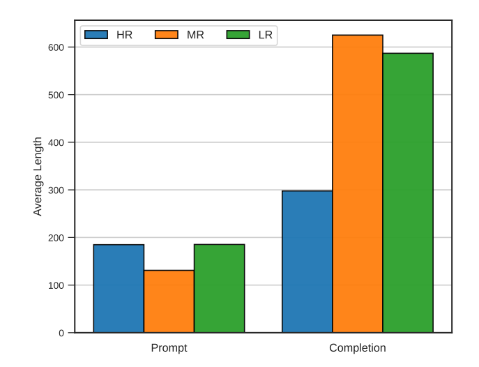 | Average prompt and completion lengths by language-resource category (HR/MR/LR). |
| 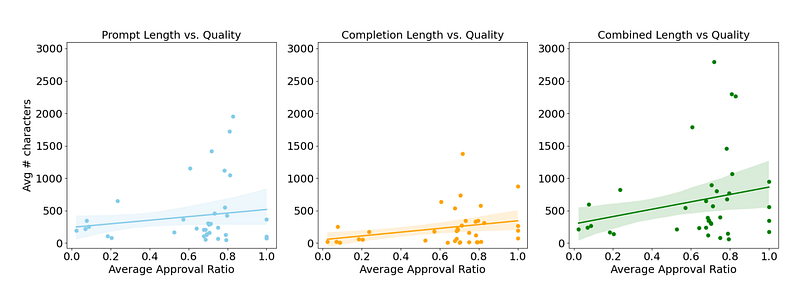 | Correlation between approval ratio and prompt/completion length. |
| 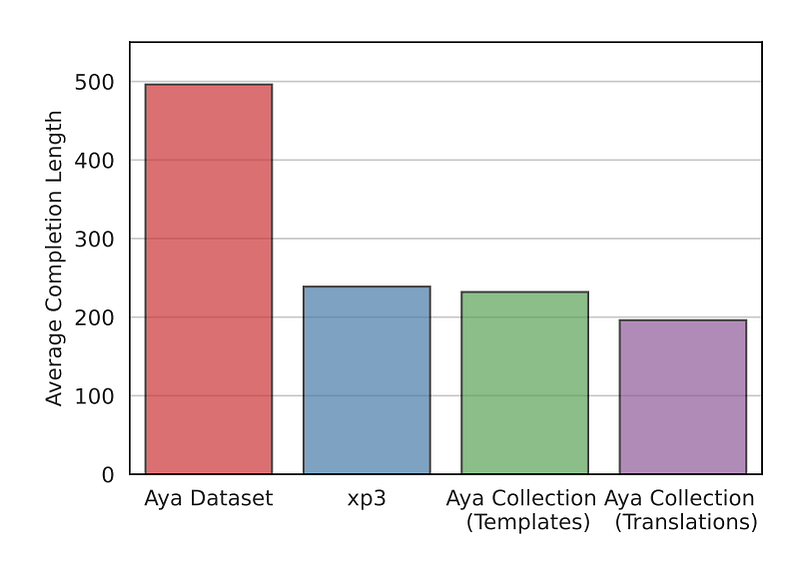 | Completion-length comparison between Aya Dataset, Aya Collection, and xP3. |
| 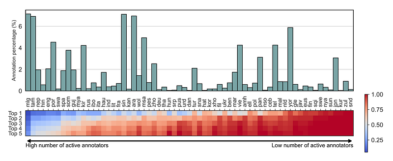 | Per-language annotation share and concentration among top-k annotators. |
| 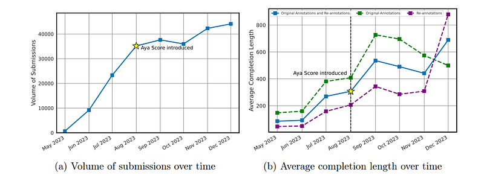 | Effect of Aya Score introduction on submission volume and average completion length over time. |
| 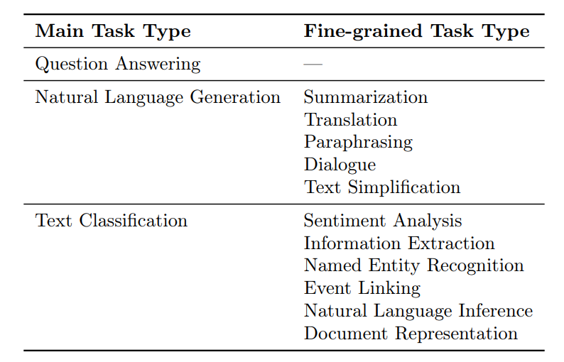 | Aya Collection task taxonomy with main and fine-grained NLP task types. |
| 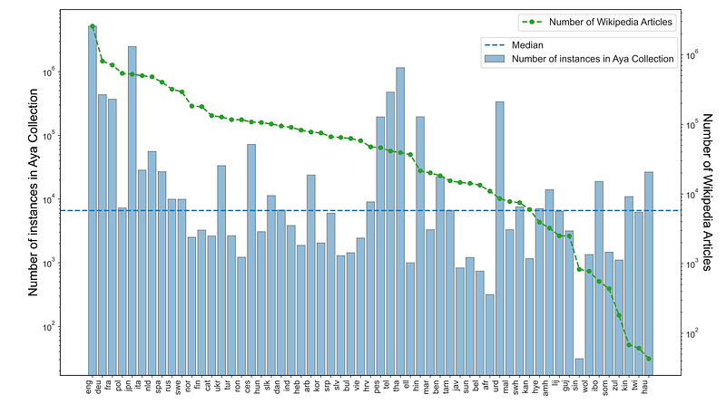 | Per-language instance counts in Aya Collection (templated) alongside Wikipedia article counts. |
| 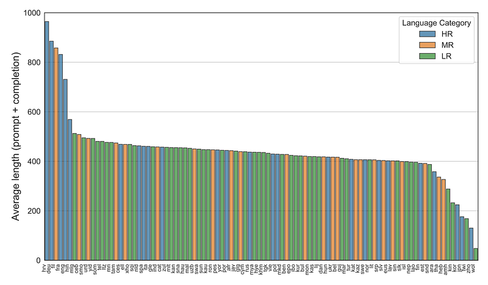 | Average prompt+completion length across languages, colored by resource category. |
| 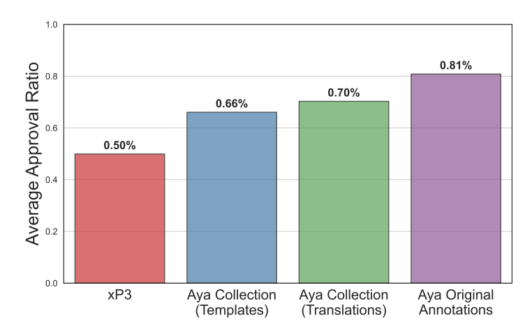 | Average approval ratio by dataset group (xP3, Aya Collection templates/translations, Aya original annotations). |
## Related

- [[Papers Explained Corpus]]
- [[Multilingual Models]]
- [[Synthetic Data]]
- [[Evaluation and Benchmarks]]
- [[Agentic AI]]
- [[Papers Explained 107 - LLaVA 1.6]]
- [[Papers Explained 109 - Aya 101]]
- [[C4AI Launches Aya, an LLM Covering More Than 100 Languages]] — official Cohere Labs blog announcement for the Aya model and dataset release.

#summary #topic
