# Papers Explained 110 - Nomic Embed

Nomic-embed-text is a fully open-source English text embedding model with a large context length of 8192. It surpasses existing models like OpenAI’s Ada-002 and text-embedding-3-small in handling both short and long-context tasks. With 137M parameters, it’s designed for broad utility in NLP applications.

This page ingests the source article into the wiki and connects it to [[Papers Explained Corpus]], [[Embedding and Retrieval]], [[Large Language Models]], [[Long Context]], [[Synthetic Data]], [[Document AI]].

## Source Metadata

- Source file: `raw/2024-03-08_Papers-Explained-110--Nomic-Embed-8ccae819dac2.md`
- Source title: Papers Explained 110: Nomic Embed
- Published: 2024-03-08
- Canonical: [https://medium.com/@ritvik19/papers-explained-110-nomic-embed-8ccae819dac2](https://medium.com/@ritvik19/papers-explained-110-nomic-embed-8ccae819dac2)

## Key Ideas

- Nomic-embed-text is a fully open-source English text embedding model with a large context length of 8192. It surpasses existing models like OpenAI’s Ada-002 and text-embedding-3-small in handling both short and long-context tasks.
- The model, training code, and a large dataset of 235 million text pairs are released [here](https://github.com/nomicai/contrastors), promoting full reproducibility and transparency.
- The following architecture changes and optimizations Are applied to BERT base:
- Rotary positional embeddings in place of Absolute positional encodings.
- resulting in a 137M parameter encoder, referred as nomic-bert-2048.

## Notes

Nomic-embed-text is a fully open-source English text embedding model with a large context length of 8192. It surpasses existing models like OpenAI’s Ada-002 and text-embedding-3-small in handling both short and long-context tasks. With 137M parameters, it’s designed for broad utility in NLP applications.

The model, training code, and a large dataset of 235 million text pairs are released [here](https://github.com/nomicai/contrastors), promoting full reproducibility and transparency. This initiative enables researchers and developers to replicate, audit, and build upon this advanced embedding model.

## Model Architecture

The following architecture changes and optimizations Are applied to BERT base:

- Rotary positional embeddings in place of Absolute positional encodings.

- SwiGLU activation instead of GeLU.

- Use of Flash Attention.

- 0 Dropout.

- Vocab size as a multiple of 64.

resulting in a 137M parameter encoder, referred as nomic-bert-2048.

The model is trained with a max sequence length of 2048 in all the stages. Dynamic NTK interpolation at inference is used to scale the model to 8192 sequence length

The BooksCorpus and a Wikipedia dump from 2023 is used as the pretraining corpus. Each document is tokenized using the bert-base-uncased tokenizer and packed to chunks of 2048 tokens. A 30% masking rate is used instead of 15%. The Next Sentence Prediction task is not considered for pretraining.

## Unsupervised Contrastive Pretraining

Unsupervised contrastive pretraining aims to teach a model to distinguish the most similar documents from other irrelevant documents.

Large collections of publicly available data are used to form pairs. These datasets span various objectives and domains, from web retrieval to clustering of scientific articles. In total, 470M pairs across 29 datasets are curated.

To remove the noisy samples, consistency filtering is applied using the gte-base model.

Each pair is embedded for both the queries and documents of a 1M point sub-sample of the dataset. If the document is not in the top-k , (2 in this case) using cosine similarity, the example is discarded. After filtering ~ 235M pairs are obtained.

*Figure: Pretraining Dataset Distribution.*

Additional, long context dataset is curated using full Wikipedia articles paired with their titles as well as abstracts and full paper bodies from a single paper from S2ORC.

During training, pairs are sampled from one data source at a time and the entire batch is filled with samples from that single source to discourage the model from learning source-specific shortcuts.

The InfoNCE contrastive loss is used. For a given batch B = (q0, d0), (q1, d1), …, (qn, dn), the following is minimized:

where s(q, d) is the cosine similarity of (q, d).

The following task specific prefixes are used to break the symmetry of the biencoder :

- search query (typically used for question)

- search document (typically used for response)

- classification (used for STS-related tasks like rephrasals)

- clustering (used for tasks where to objective is to group semantically similar texts close together)

## Supervised Contrastive Fine-tuning

This stage of training aims to boost performance by utilizing human-labeled datasets.

Supervised fine tuning is performed on MSMarco, NQ, NLI, HotpotQA, FEVER, portions of MEDI, WikiAnswers and Reddit

The paired contrastive loss is adapted to include hard negatives in each batch. It is found that increasing the number of negatives above 7 does not meaningfully improve performance. Also, training for multiple epochs hurts performance.

## Evaluations

*Figure: Benchmarking nomic-embed-text-v1 against OpenAI models and other top long context open-source models.*

- A few-shot evaluation of BEIR was conducted to understand the impact of training on specific datasets on the overall MTEB score.

- Training on FEVER, HotpotQA, and MEDI datasets improves the overall MTEB score, suggesting the importance of dataset selection in training for achieving competitive performance.

*Figure: GLUE Dev Set Results.*

- nomic-bert-2048 was evaluated on the GLUE benchmark. It was initialized from an MNLI checkpoint for certain tasks.

- nomic-bert-2048 is competitive with similarly sized and trained models on the GLUE benchmark, scoring similarly to MosaicBERT and JinaBERT across tasks, except on Cola where it performed differently due to longer sequence length model and more tokens seen during pretraining.

*Figure: Results on the MTEB benchmark.*

*Figure: Jina Long Context Evaluation Benchmark.*

*Figure: Results on the LoCo benchmark.*

- nomic-embed-text-v1 was evaluated on MTEB for a broad range of tasks and on Jina’s Long Context Benchmark and LoCo for long sequence performance. The evaluation included comparisons with other models like text-embedding-ada-002 and jina-embeddings-v2-base-en

- nomic-embed-text-v1 exceeds the performance of text-embedding-ada-002 and jina-embeddings-v2-base-en on MTEB. It uniformly outperforms jina-embeddings-v2-base-en on long context benchmarks (LoCo and Jina Long Context Benchmark), showing superior performance on longer sequences.

## Nomic Embed 1.5

Recommended Reading [Papers Explained 96: Matryoshka Representation Learning](https://ritvik19.medium.com/papers-explained-matryoshka-representation-learning-e7a139f6ad27)

The model is available at [HuggingFace](https://huggingface.co/nomic-ai/nomic-embed-text-v1.5).

Nomic Embed v1.5 is an enhanced version of the Nomic Embed model that incorporates Matryoshka Representation Learning, allowing for adjustable embedding dimensions within a single model. The training process involves a multi-stage pipeline, starting with unsupervised contrastive training on weakly related text pairs and progressing to fine-tuning on higher quality labeled datasets.

In particular the nomic-embed-text-unsupervised is fine-tuned on the nomic-embed-text fine-tuning dataset using MRL.

Nomic Embed v1.5 supports embedding dimensions ranging from 64 to 768, outperforming other models at both 512 and 768 dimensions. It achieves significant memory reduction compared to previous versions while maintaining performance levels comparable to other advanced models like MiniLM-L6-v2.

## Nomic Embed Vision

Nomic Embed Vision v1 and v1.5 are high-quality, fully replicable vision embedding models that share the same latent space as Nomic Embed Text v1 and v1.5 models. This means that existing Nomic Embed Text embeddings can be used to query Nomic Embed Vision embeddings and vice versa, making all Nomic Embed Text embeddings multimodal.

The models are available at [HuggingFace](https://huggingface.co/collections/nomic-ai/nomic-embed-vision-66607c681b11fdaed5b04d1c).

The Nomic Embed Vision models can be used for:

- Embedding image and text data

- Unimodal semantic search within image and text datasets

- Multimodal semantic search across image and text datasets

The vision encoder has only 92M parameters, making it suitable for high-volume production use cases alongside the 137M Nomic Embed Text model.

### Multimodal Embedding Models

Multimodal embedding models, specifically Contrastive Language Image Pretrained (CLIP) models, are trained on large-scale image-caption datasets. They learn relationships between images and text by predicting image-caption pairs. To train these models, a large batch size (16k-32k) and a large dataset (400M image-text pairs and larger) are used. For example, OpenAI’s CLIP model was trained on 400 million image-text pairs for 32 epochs, resulting in approximately 13 billion image-text pairs seen during training. While CLIP models excel in tasks like zero-shot multimodal classification and retrieval, they underperform in unimodal text tasks such as semantic similarity and text retrieval.

### Training Nomic Embed Vision

Nomic Embed Vision, a vision encoder that is compatible with Nomic Embed Text is trained. The training process involved aligning the vision encoder with the existing text encoder without affecting the downstream performance of the text encoder.

Several approaches are tried to solve this challenge, including:

- Training the vision and text encoders on image-text pairs

- Training the vision and text encoders on image-text pairs and text-only data

- Three Towers training with image-text pairs only

- Three Towers training with image-text pairs and text-only data

- Locked-Image Text Tuning (LiT) training with a frozen vision encoder

- Locked Text Image Tuning, training with a frozen text encoder

After trying these approaches, it if found that freezing the text encoder and training the vision encoder on image-text pairs only yielded the best results and provided backward compatibility with Nomic Embed Text embeddings.

The training process involved:

- Using a ViT B/16 model (initialised with with Eva02 MIM ViT B/16) as the vision encoder and Nomic Embed Text as the text encoder

- Training the vision encoder on DFN-2B image-text pairs for 3 full epochs, resulting in a total of ~4.5B image-text pairs

### Evaluation

The Nomic Embed models outperform OpenAI CLIP and OpenAI Text Embedding 3 Small on multimodal and text tasks, respectively.

## Paper

Nomic Embed: Training a Reproducible Long Context Text Embedder [2402.01613](https://arxiv.org/abs/2402.01613)

[Unboxing Nomic Embed v1.5: Resizable Production Embeddings with Matryoshka Representation Learning](https://blog.nomic.ai/posts/nomic-embed-matryoshka)

[Nomic Embed Vision: Expanding The Nomic Latent Space](https://blog.nomic.ai/posts/nomic-embed-vision)

Recommended Reading: [Retrieval and Representation Learning](https://ritvik19.medium.com/list/retrieval-and-representation-learning-bcd23de0bd8e)

## Figures

Figures from the Medium HTML export (`raw/2024-03-08_Papers-Explained-110--Nomic-Embed-8ccae819dac2.md`); local copies under `wiki/assets/papers-explained-110-nomic-embed/` when download succeeded.

| Figure | Caption |
|--------|---------|
| 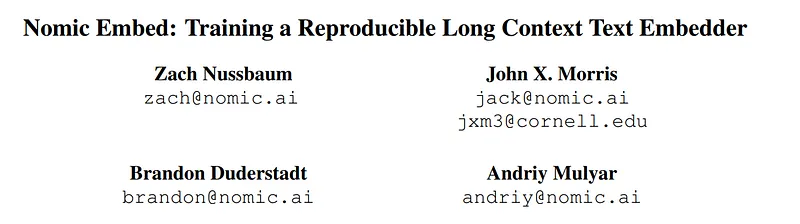 | Title block of *Nomic Embed: Training a Reproducible Long Context Text Embedder*. |
| 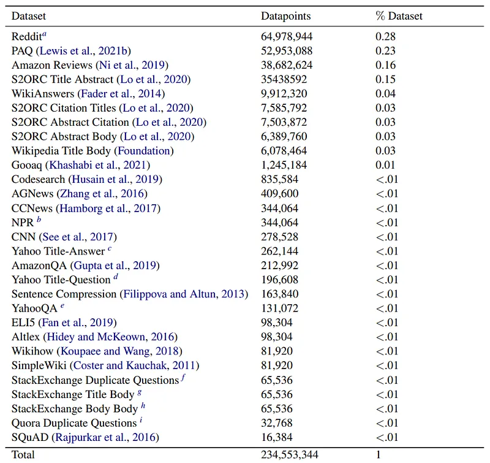 | Pretraining dataset distribution table across weakly supervised text-pair sources. |
| 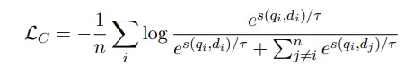 | InfoNCE contrastive loss used for unsupervised embedding pretraining. |
| 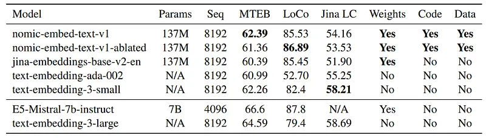 | Long-context benchmark comparison versus OpenAI and Jina embedding models. |
| 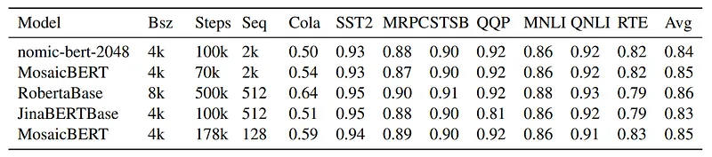 | GLUE dev-set results for nomic-bert-2048 against BERT-family baselines. |
| 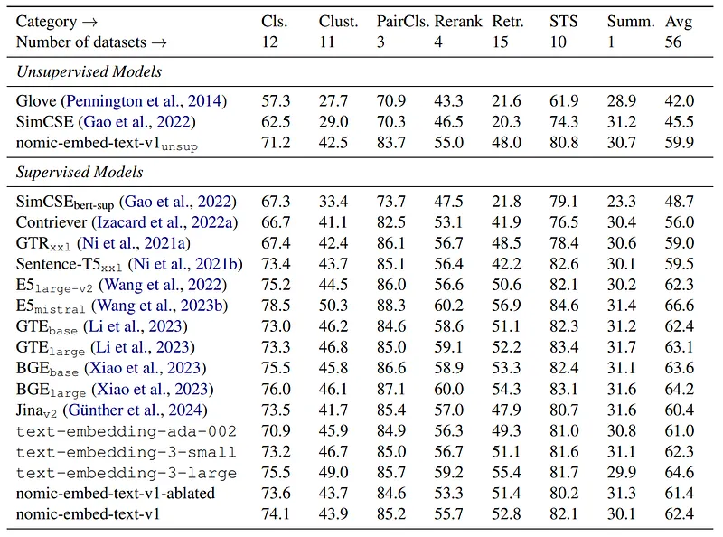 | MTEB category-level results comparing unsupervised and supervised embedding models. |
| 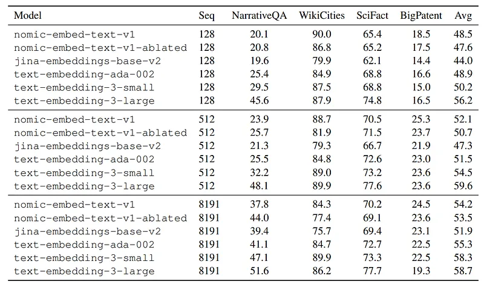 | LoCo benchmark results across sequence lengths and long-context retrieval tasks. |
| 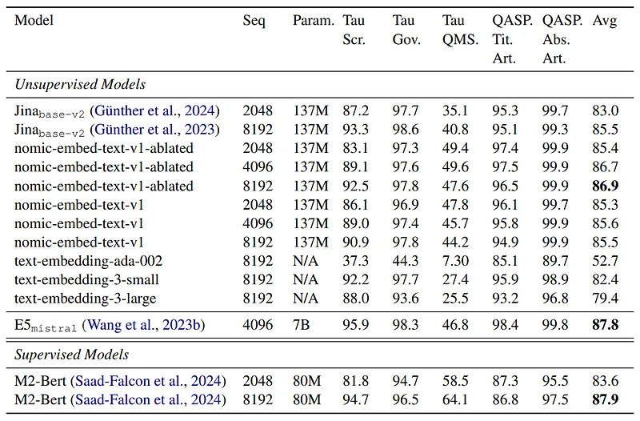 | Jina Long Context benchmark table across quality dimensions and sequence lengths. |
| 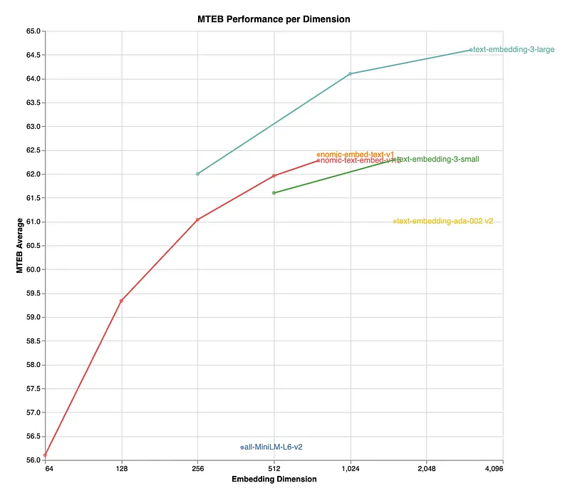 | MTEB performance vs embedding dimension, including nomic-embed v1 and competing models. |
| 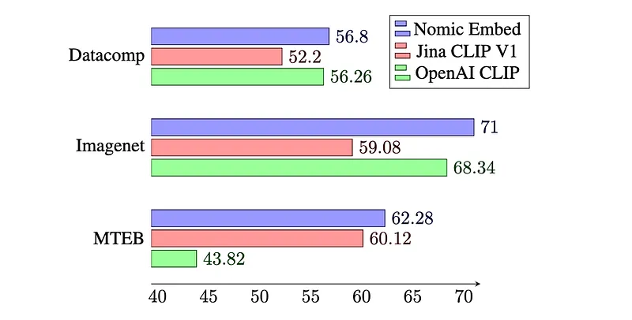 | Multimodal comparison on Datacomp, ImageNet zero-shot, and MTEB between Nomic Embed and CLIP baselines. |
| 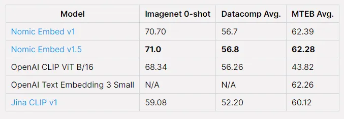 | Summary table for Nomic Embed v1/v1.5, OpenAI CLIP, and OpenAI text embeddings. |
## Related

- [[Papers Explained Corpus]]
- [[Embedding and Retrieval]]
- [[Large Language Models]]
- [[Long Context]]
- [[Synthetic Data]]
- [[Document AI]]
- [[Papers Explained 109 - Aya 101]]
- [[Papers Explained 111 - H2O Danube 1.8B]]

#summary #topic
