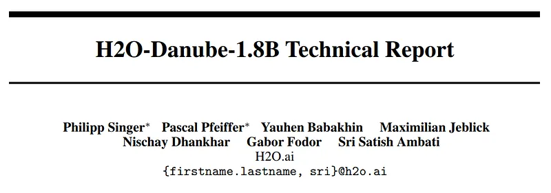
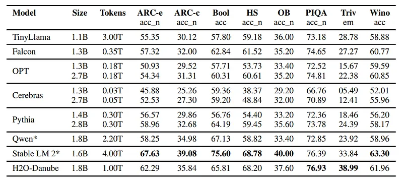
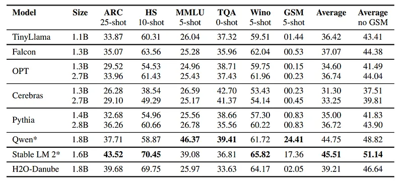
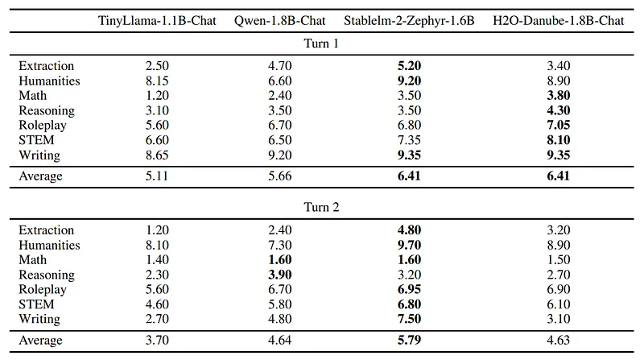
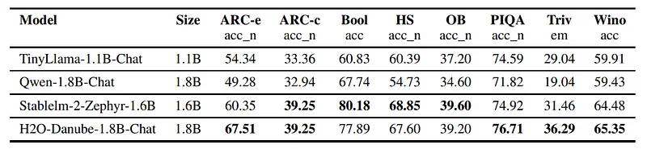
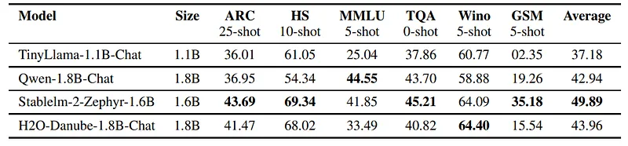
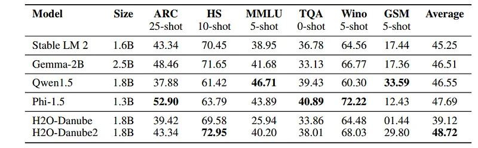
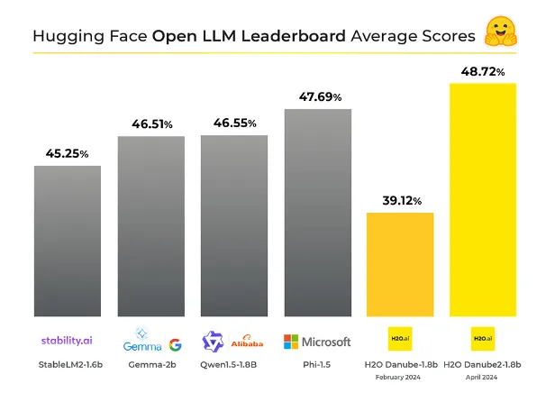
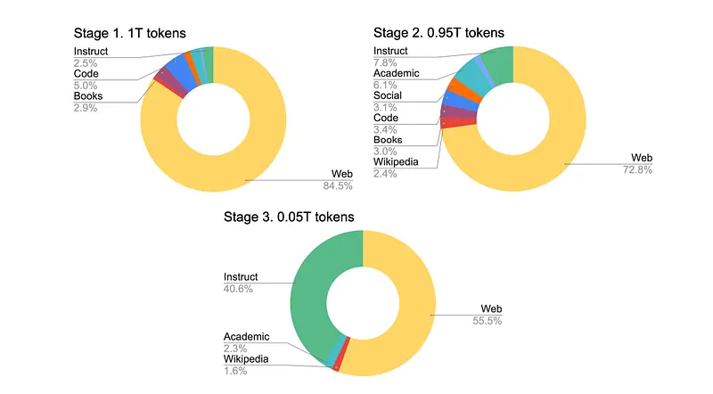

# Papers Explained 111 - H2O Danube 1.8B

H2O-Danube-1.8B is a new open-source pre-trained foundation model with 1.8 billion parameters, developed by H2O.ai.

This page ingests the source article into the wiki and connects it to [[Papers Explained Corpus]], [[Large Language Models]], [[Evaluation and Benchmarks]], [[Embedding and Retrieval]].

## Source Metadata

- Source file: `raw/2024-03-11_Papers-Explained-111--H2O-Danube-1-8B-b790c073d257.md`
- Source title: Papers Explained 111: H2O Danube 1.8B
- Published: 2024-03-11
- Canonical: [https://medium.com/@ritvik19/papers-explained-111-h2o-danube-1-8b-b790c073d257](https://medium.com/@ritvik19/papers-explained-111-h2o-danube-1-8b-b790c073d257)

## Key Ideas

- The model are available at huggingface: [Base model](https://huggingface.co/h2oai/h2o-danube-1.8b-base) , [Chat model](https://huggingface.co/h2oai/h2o-danube-1.8b-chat).
- Danube is built upon the Llama 2 adjusting it for a total of around 1.8b parameters with a hidden size of 2, 560, an intermediate size of 6, 912, and a total of 24 hidden layers.
- Sliding Window approach is used for local attention.
- For training a fixed sliding window of 4,096 is used.
- Rotary Positional Embedding (RoPE) is used.

## Notes

H2O-Danube-1.8B is a new open-source pre-trained foundation model with 1.8 billion parameters, developed by H2O.ai. It was trained on 1 trillion tokens from diverse sources, following the core principles of LLama 2 and Mistral, and exhibits highly competitive metrics across a multitude of benchmarks despite being trained on significantly fewer total tokens compared to reference models of similar size.

The model are available at huggingface: [Base model](https://huggingface.co/h2oai/h2o-danube-1.8b-base) , [Chat model](https://huggingface.co/h2oai/h2o-danube-1.8b-chat).

## Model architecture

Danube is built upon the Llama 2 adjusting it for a total of around 1.8b parameters with a hidden size of 2, 560, an intermediate size of 6, 912, and a total of 24 hidden layers.

- Sliding Window approach is used for local attention.

- For training a fixed sliding window of 4,096 is used.

- Rotary Positional Embedding (RoPE) is used.

- Grouped Query Attention is used for reducing the memory bandwidth overhead.

- Thus the architecture uses 32 attention heads and 8 key-value heads.

- Root mean square layer normalization (RMSNorm) is used separately for pre- and post-normalization to stabilize training.

- Bias is not used within linear layers.

- Word Embeddings are not tied.

## Training

Out of the 1T tokens in total, subsequent training is done:

- 700B tokens with a sequence length of 2,048.

- 100B tokens with a sequence length of 4,096.

- 100B tokens with a sequence length of 8,192.

- 100B tokens with a sequence length of 16,384.

## Chat Fine-Tuning

### Supervised fine-tuning

As the first step, the base model is tuned using supervised fine-tuning on input/output conversational pairs. The following datasets are combined: OpenOrca, MetaMathQA, UltraChat200k, and Oasst2, totalling 157k samples.

All the layers are trained for a single epoch using a learning rate of 1e − 5, a batch size of 8. Full pre-trained context length of 16, 384 is used. The prompt loss is masked. And a custom prompt format is used.

### DPO

Supervised fine-tuning is followed by direct preference optimization (DPO), using a combination of UltraFeedback Binarized, Orca DPO Pairs and Distilabel Math Preference DPO, totalling around 17k samples.

The DPO model is trained using LoRA with r = 4, alpha =16 for one epoch using a batch size of 2 with a learning rate of 1e − 5.

Afterwards, a final DPO fine-tune is done using Oasst2 dataset building preference pairs from ranks where the chosen answer is the lowest rank, and the rejected answer is the highest one, limited to only English conversations totalling around 5k samples.

The training run uses similar hyperparameters as the previous one, just a lower learning rate of 3e − 6.

## Evaluation

The objective is to evaluate the performance of H2O-Danube-1.8B, a language model, across various benchmarks and compare it with other existing open-source language models of similar size.

*Figure: Commonsense reasoning, world knowledge and reading comprehension benchmarks.*

- H2O-Danube-1.8B demonstrated good performance across all tested benchmarks, outperforming most models of similar size.

- It was closely followed by Qwen and Stable LM 2 models in terms of performance.

- H2O-Danube-1.8B outperformed Qwen in all benchmarks except for BoolQ, despite Qwen being trained on 2.2 times more tokens.

- Stable LM 2 showed slightly better performance than H2O-Danube-1.8B on the majority of benchmarks, even though it was trained on four times more tokens.

*Figure: Open LLM Leaderboard.*

On the Open LLM Leaderboard, H2O-Danube-1.8B, along with Qwen and Stable LM 2, showed strong performance, particularly lagging in MMLU and GSM8k benchmarks, possibly due to the specialized training data used by Qwen and Stable LM 2

### Chat Model

The main objective is to evaluate chat and instruct fine-tuned Large Language Models (LLMs) through large-scale human assessment, focusing on the initial evaluation of the chat model H2O-Danube-1.8B using MT-Bench, a collection of multi-turn questions across different categories.

*Figure: Mt-bench chat benchmark.*

H2O-Danube-1.8B-Chat shows strong results across categories, especially in natural language tasks, being the best model for five out of seven categories for single-turn conversations and comparable to Qwen 2 for turn 2, with Stablelm 2 outperforming other models in some aspects.

*Figure: Commonsense reasoning, world knowledge and reading comprehension benchmarks for chat models.*

*Figure: Open LLM Leaderboard for chat models.*

In evaluations on commonsense reasoning, world knowledge, reading comprehension, and aggregated Open LLM Leaderboard benchmarks, H2O-Danube-1.8B-Chat and Stablelm-2-Zephyr perform better than Qwen-Chat and TinyLlama-Chat on the majority of benchmarks, with performance on par between H2O-Danube-1.8B-Chat and Stablelm-2-Zephyr except for MMLU and GSM8k benchmarks. This suggests that the specific training data tailored for Qwen and Stable LM 2 base models might explain the performance differences.

## Danube 2

H2O Danube2 represents an incremental enhancement, having been initialized from H2O-Danube-base and trained on an additional 2 trillion tokens to refine and expand its learning. As a result, increasing performance on the Hugging Face Open LLM Average Leaderboard by 9% percentage points making it the top performing model under 2B parameters.

The models are available at [HuggingFace](https://huggingface.co/collections/h2oai/h2o-danube2-66102df91ce3cf64516f90f7).

*Figure: Danube2 Open LLM Leaderboard.*

- H2O-Danube2–1.8B achieves state-of-the-art results on this Leaderboard on the average of all benchmarks.

The improvements include:

- Improvements in long-context behavior: The retrieval capabilities in long contexts are effectively improved by removing the sliding window approach to attention. A total of 8K tokens can be handled by H2O Danube2 models for both input and output sizes combined, without any specific agent performing the action.

- Leverage Mistral Tokenizer: The choice of tokenizer is a crucial aspect of large language models, transforming and compressing the input text to token representations consumed by the language model. Switching to the Mistral tokenizer improved downstream performance, while keeping the same vocabulary size of 32000.

- Improved Filtering: Better filtering and deduplication of training data by using advanced heuristics, as well as machine learning models (GBM and BERT) for predicting the quality of text and using predictions for filtering.

- Data Curation Improvements: Significant improvements in underlying data curation leading to a three stage training of H2O-Danube2. At each stage, the percentage of noisy web data is decreased in favor of higher quality data.

- The first data stage consist of 84.5% of web data which is gradually decreasing to 72.8% at the second stage, and to 55.5% at the third stage. Simultaneously, the share of instruct data, Wikipedia, academic texts and other higher quality textual data is increasing. The first two stages include the majority of the tokens: 1T and 0.95T tokens respectively, while third stage comprises of 0.05T tokens.

*Figure: Data stages for Danube2*

## Paper

H2O-Danube-1.8B Technical Report [2401.16818](https://arxiv.org/abs/2401.16818)

[Announcing H2O Danube 2: The next generation of Small Language Models from H2O.ai](https://h2o.ai/blog/2024/announcing-h2o-danube2/)

Recommended Reading [Decoder-Only Language Transformers](https://ritvik19.medium.com/list/decoderonly-language-transformers-5448110c6046)

## Figures

Figures from the Medium HTML export (`raw/2024-03-11_Papers-Explained-111--H2O-Danube-1-8B-b790c073d257.md`); local copies under `wiki/assets/papers-explained-111-h2o-danube-1-8b/` when download succeeded.

| Figure | Caption |
|--------|---------|
|  | Title page of the H2O-Danube-1.8B technical report. |
|  | Base-model commonsense, world-knowledge, and reading-comprehension benchmark comparison. |
|  | Open LLM Leaderboard-style benchmark table for base models (with and without GSM8K averaging). |
|  | MT-Bench chat results by category and turn for TinyLlama, Qwen, StableLM, and H2O-Danube chat variants. |
|  | Chat-model commonsense and reading-comprehension benchmark comparison. |
|  | Open LLM Leaderboard benchmark table for chat models. |
|  | Danube2 comparison against similarly sized models on major leaderboard tasks. |
|  | Hugging Face Open LLM leaderboard average-score chart highlighting Danube2 gains over Danube1. |
|  | Danube2 three-stage data-mixture composition showing reduced web share and higher-quality data increase. |
## Related

- [[Papers Explained Corpus]]
- [[Large Language Models]]
- [[Evaluation and Benchmarks]]
- [[Embedding and Retrieval]]
- [[Papers Explained 110 - Nomic Embed]]
- [[Papers Explained 112 - Self Instruct]]

#summary #topic
